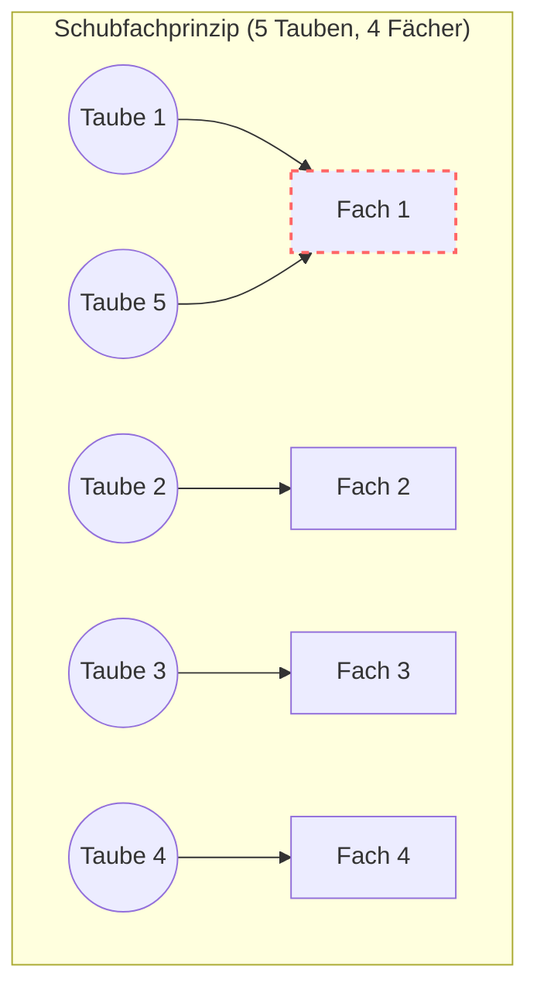
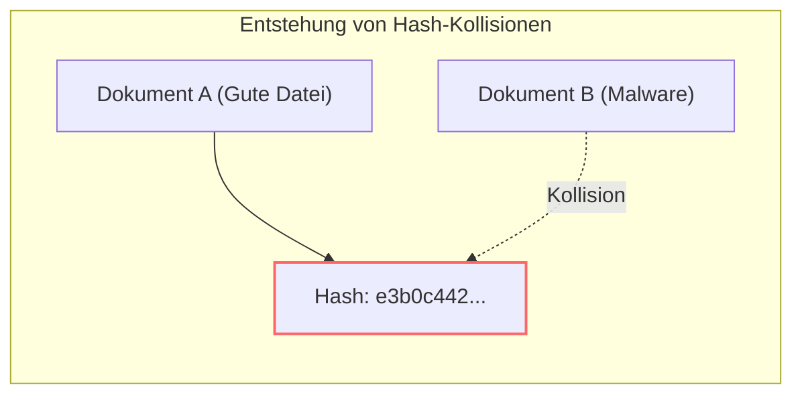

Hash-Funktionen wie SHA-256 werden als fundamentale Technologie in allen Bereichen der IT eingesetzt, von Passwörtern über die [Blockchain](https://kenji.blog/de/p/blockchain-technology-smart-contract-distributed-ledger/) bis hin zu elektronischen Signaturen.

Eine Hash-Funktion hat die Eigenschaft, „egal, wie groß die Eingabedaten sind, sie gibt immer einen Wert (Hash-Wert) mit einer festen Länge aus“. Was passiert jedoch, wenn die Eingabedaten unendlich viele Möglichkeiten haben, der Ausgabe-Hash-Wert jedoch eine begrenzte Anzahl an Kombinationen aufweist?

Hier tritt zwingend das Phänomen der **Hash-Kollision (Hash Collision)** auf, bei dem „völlig verschiedene Eingabedaten völlig zufällig denselben Hash-Wert erzeugen“.

In diesem Artikel werden wir anhand des in der Mathematik berühmten **Schubfachprinzips (Pigeonhole Principle)** erklären, warum Hash-Kollisionen unweigerlich auftreten und warum sie dennoch in der Praxis keine Probleme verursachen.

## Was ist das Schubfachprinzip?

Das Schubfachprinzip (auch als Taubenschlagprinzip oder Dirichlet'sches Schubfachprinzip bekannt) ist ein sehr einfacher und intuitiver mathematischer Lehrsatz.

> **„Wenn man $n$ Tauben in $m$ Taubenschläge (Schubfächer) verteilt und $n > m$ ist, dann gibt es mindestens einen Taubenschlag, der zwei oder mehr Tauben enthält.“**

Stellen wir uns das konkret vor.
Angenommen, es gibt 4 Taubenschläge und 5 Tauben. Egal, wie geschickt Sie versuchen, die Tauben aufzuteilen, damit sie nicht im selben Fach landen, wenn Sie 4 Fächer mit jeweils 1 Taube füllen, bleibt 1 Taube übrig. Diese 5. Taube muss zwangsläufig in eines der bereits belegten Fächer gesteckt werden.

Wie oben gezeigt, gibt es am Ende unweigerlich „ein Fach mit 2 oder mehr Tauben“. Das ist das Schubfachprinzip. Es ist so offensichtlich, dass es trivial erscheint, ist aber ein extrem starkes logisches Werkzeug in der Mathematik und Informatik.

## Warum Hash-Kollisionen unvermeidlich sind

Nun übertragen wir dieses Schubfachprinzip auf Hash-Funktionen.

- **Eingabedaten (Tauben)**: Beliebige Dateien, Passwörter, Dokumenten-Texte usw. Die Muster sind theoretisch **unendlich**.
- **Ausgabe-Hash-Werte (Taubenschläge)**: Werte fester Länge, die von der Hash-Funktion generiert werden. Beispielsweise hat SHA-256 $2^{256}$ Muster, was zwar gigantisch, aber **endlich** ist.

Nach dem Schubfachprinzip, da die Anzahl der Tauben (unendlich) größer ist als die Anzahl der Fächer (endlich), **wird es immer Fächer (Hash-Werte) geben, die von mehreren verschiedenen Tauben (Eingabedaten) geteilt werden.**

Das heißt, es ist logisch unmöglich, eine Hash-Funktion zu erstellen, bei der „Kollisionen absolut nie auftreten“. Irgendwo im Universum der Daten gibt es definitiv unzählige Kombinationen von „völlig unterschiedlichen Dateien, die aus irgendeinem Grund genau denselben Hash-Wert ergeben“.

## Wenn Kollisionen sicher auftreten, warum ist es dann sicher?

Wenn Hash-Kollisionen definitiv existieren, könnte es dann nicht gefährlich sein? Könnte nicht jemand eine böswillige Datei erstellen, die zufällig denselben Hash-Wert hat, um Signaturen zu fälschen?

Die Antwort lautet **„Theoretisch ist es möglich, aber in der Praxis ist es absolut unmöglich (Kollisionsresistenz)“**. Der Grund dafür ist die schiere „Größe der Fächer (Hash-Werte)“.

Betrachten wir als Beispiel SHA-256 (256-Bit-Länge), das in [Bitcoin](https://kenji.blog/de/p/cryptocurrency-and-bitcoin/) und anderen Systemen verwendet wird.
Die Anzahl der Taubenschläge (die Gesamtzahl der möglichen Kombinationen von Hash-Werten) für SHA-256 beträgt $2^{256}$.

$$
2^{256} \approx 1.1579 \times 10^{77}
$$

Dies ist eine Zahl mit 78 Stellen (ungefähr $10^{77}$). Um zu verdeutlichen, wie gewaltig diese Zahl ist: Die Anzahl der Atome im gesamten beobachtbaren Universum wird auf etwa $10^{80}$ geschätzt. Die Anzahl der Fächer bei SHA-256 entspricht fast der Anzahl der Atome im Universum.

Um mutwillig eine Kollision zu erzeugen, müsste man unzählige Dateien generieren, durch die Hash-Funktion jagen und nach Übereinstimmungen suchen (Brute-Force-Angriff).

Selbst wenn man alle Supercomputer der Erde mobilisieren und mehrere zehn Milliarden Jahre (das Alter des Universums beträgt etwa 13,8 Milliarden Jahre) lang ununterbrochen berechnen würde, wäre die Wahrscheinlichkeit, einen bestimmten Hash-Wert zufällig zu treffen, nicht einmal annähernd groß genug.

Das heißt: **„Die Kollisionen existieren sicher, aber das Universum wird eher enden, als dass die Menschheit sie finden kann.“** Auf dieser Grundlage ist die moderne Kryptografie konstruiert.

*(Hinweis: Bei alten Hash-Funktionen wie MD5 oder SHA-1 war die „Anzahl der Fächer“ zu klein (128 Bit bzw. 160 Bit) oder es gab Schwächen in den Berechnungsalgorithmen, sodass effiziente Methoden zur absichtlichen Erzeugung von Kollisionen gefunden wurden. Sie gelten heute als unsicher und werden nicht mehr verwendet.)*

## Das Geburtstagsparadoxon: Kollisionen sind leichter zu finden, als man denkt?

Bisher haben wir darüber gesprochen, wie schwierig es ist, „einen Hash-Wert zu finden, der mit einer bestimmten Zieldatei kollidiert“ (Preimage-Resistenz).

Wenn man jedoch nur „**irgendein Paar von Dateien** finden möchte, das den gleichen Hash-Wert hat (Kollisionsresistenz)“, sinkt die Schwierigkeit dramatisch. Dieses Phänomen ist als das **[Geburtstagsparadoxon](/de/p/birthday-paradox/) (Birthday Paradox)** bekannt.

Das [Geburtstagsparadoxon](/de/p/birthday-paradox/) stellt die Frage: „Wie viele Personen müssen in einem Raum versammelt sein, damit die Wahrscheinlichkeit, dass mindestens zwei am selben Tag Geburtstag haben, über 50 % liegt?“ Intuitiv würde man an $365 \div 2 \approx 183$ Personen denken, aber die korrekte mathematische Antwort lautet **nur 23 Personen**. Da es bei einer Gruppe von 23 Personen $\frac{23 \times 22}{2} = 253$ mögliche Paare gibt, steigt die Wahrscheinlichkeit, dass sich Geburtstage überschneiden, rapide an.

Wendet man dies auf Hash-Funktionen an, so beträgt die Wahrscheinlichkeit, dass unter $N$ Taubenschlägen eine Kollision auftritt, bei etwa $\sqrt{N}$ Versuchen über 50 %.

Für SHA-256 (Anzahl der Fächer $N = 2^{256}$) bedeutet dies, dass man etwa $2^{128}$ Dateien hashen müsste, um „irgendein Kollisionspaar“ zu finden.
$2^{128}$ ist immer noch eine unvorstellbar große Zahl (etwa $3.4 \times 10^{38}$), und selbst dies ist mit aktuellen Computern unmöglich zu berechnen. Daher bleibt SHA-256 vorerst sicher.

Aus diesem Grund wählt man in der Kryptografie einen Ausgabe-Bit-Bereich, der doppelt so groß ist wie die eigentlich angestrebte Sicherheitsstärke (z. B. 256 Bit, um 128 Bit Sicherheit zu gewährleisten), um dem [Geburtstagsparadoxon](/de/p/birthday-paradox/) entgegenzuwirken.

## Fazit

- Nach dem **Schubfachprinzip** ist es bei Hash-Funktionen unvermeidlich, dass unendlich viele Eingabedaten auf endlich viele Ausgabewerte abgebildet werden, weshalb **Hash-Kollisionen definitiv existieren**.
- Das Finden dieser Kollisionen erfordert jedoch aufgrund der schieren Anzahl an „Fächern“ (z. B. $2^{256}$) eine Zeit, die das Alter des Universums übersteigt.
- Aus diesem Grund können wir Hash-Funktionen in Systemen einsetzen und dabei davon ausgehen, dass „Kollisionen in der Realität niemals auftreten“.

Die moderne Informatik ist oft eine Welt praktischer Ingenieurskunst, in der man Kompromisse mit mathematischen Gesetzmäßigkeiten eingeht, indem man das Problem auf eine Wahrscheinlichkeit reduziert, die „so verschwindend gering ist, dass man sie in der Realität getrost ignorieren kann“. Das Schubfachprinzip und die Hash-Funktionen sind ein hervorragendes Beispiel für dieses faszinierende Gleichgewicht.
