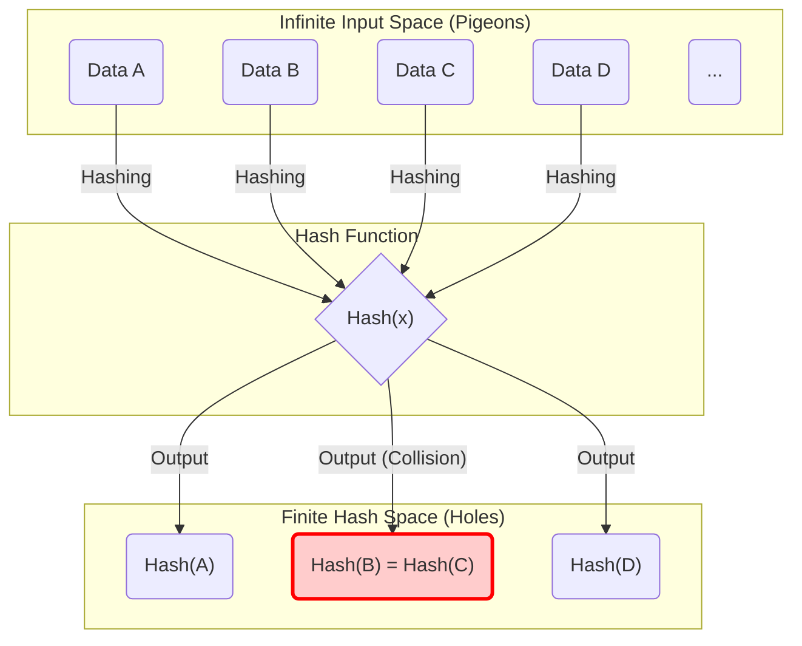
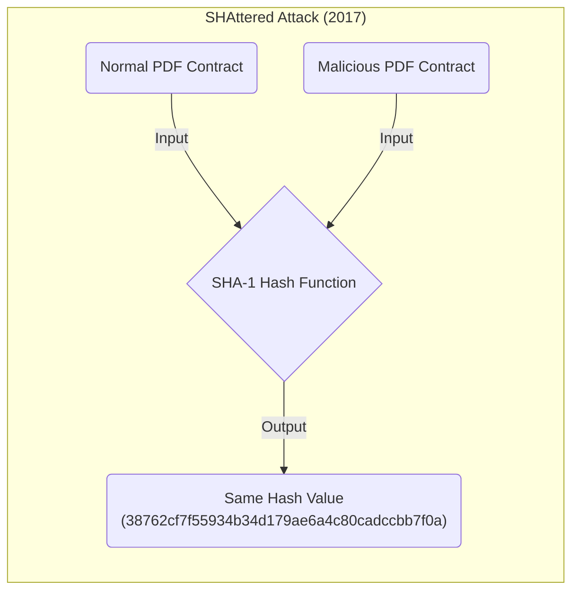
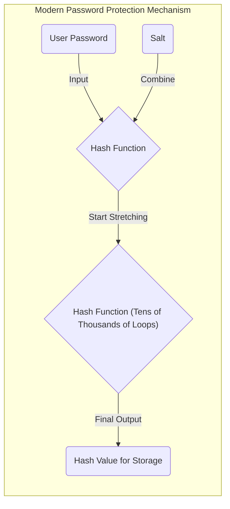

When studying computer science, information security, and cryptography, concepts that cannot be avoided are the **"Pigeonhole Principle"** and **"Hash Collisions."**
The Pigeonhole Principle itself is extremely simple, stating something so obvious that even an elementary school student can intuitively understand it. However, the impact this seemingly simple mathematical principle has on the security design of hash functions and cryptographic systems that underpin modern internet society is immeasurable.

In this article, starting from the basic concept of the Pigeonhole Principle, we will explain in detail, using formulas and diagrams, the mechanism of hash collisions, the impact on computational complexity by the birthday paradox, actual collision cases in past cryptographic algorithms (like SHA-1), and its application to security evaluation for future cryptographic technologies.

## 1. Basics of the Pigeonhole Principle

The **"Pigeonhole Principle"** (also called Dirichlet's box principle or the drawer principle) is a concept clarified by the 19th-century mathematician Peter Gustav Lejeune Dirichlet, and is defined as follows:

> When $n$ pigeons are put into $m$ pigeonholes, if $n > m$, then at least one pigeonhole must contain more than one pigeon.

For example, suppose 10 pigeons enter 9 holes. No matter how hard you try to allocate the pigeons evenly, there will always be at least one hole where 2 or more pigeons live together. It seems so intuitive and obvious that it hardly needs to be proven, but formulating this mathematically makes it an extremely powerful tool for existence proofs.

### Concrete Examples in Daily Life

Beyond pigeons and holes, this principle can be applied to various everyday phenomena.

* **Number of Hairs**: It is said that humans have at most about 200,000 hairs. The population of Tokyo is about 14 million. Therefore, there must exist **"two people with the exact same number of hairs"** in Tokyo (Pigeons = population of Tokyo, Holes = pattern of hair numbers).
* **Birth Months**: If 13 people gather, at least 2 people will have the same birth month (Pigeons = 13 people, Holes = 12 months).

### Strict Expression with Formulas (KaTeX)

Let's express this principle mathematically using the language of set theory and mappings.
Let the number of elements in a finite set $A$ be $|A|$ and the number of elements in a finite set $B$ be $|B|$, and suppose there exists a function (mapping) $f: A \rightarrow B$ from set $A$ to set $B$.
At this time, if $|A| > |B|$, the function $f$ cannot be "Injective." Injectivity is the property where different inputs always lead to different outputs.
In other words, there always exist distinct elements $x, y \in A$ that satisfy the following:

$$
\exists x, y \in A \quad (x \neq y \land f(x) = f(y))
$$

This property is the exact mathematical formula that explains the fundamental cause of **"Hash Collisions"** in information science, which will be discussed later.

## 2. Hash Functions and the Mechanism of Hash Collisions

### What is a Cryptographic Hash Function?

A **Hash Function** is a function that takes input data of arbitrary length (messages, files, passwords, etc.) and converts it into output data of a fixed length (hash value, digest). Representative cryptographic hash functions include SHA-256 and SHA-3, which are widely used today.

Hash functions used in cryptography primarily require the following three strict security requirements:

1. **Pre-image resistance**: It must be extremely difficult to reverse-engineer (restore) the original input data from the output hash value.
2. **Second pre-image resistance**: Given specific input data, it must be extremely difficult to find "different input data" that has the same hash value as it.
3. **Collision resistance**: It must be extremely difficult to arbitrarily find a pair of two different input data that output the same hash value.

### The "Inevitability of Collisions" seen from the Pigeonhole Principle

Now, let's apply the Pigeonhole Principle to hash functions and consider it.

* **Pigeons**: The set of input data. Since combinations of file contents and character strings exist infinitely, the number of elements $|A|$ is virtually "infinite."
* **Holes**: The set of hash values. Since hash values have a fixed length, the number of elements $|B|$ is "finite."

For example, the output of SHA-256, which is also used in blockchain technologies like Bitcoin, is 256 bits. Therefore, the types of possible hash values are $2^{256}$ (about $1.15 \times 10^{77}$). This is an enormous number approaching the total number of atoms in the observable universe, but it is ultimately a **finite number**.

On the other hand, the variations of text and image files that can be considered as input data exist **infinitely**.
Therefore, because the inequality "total number of input data" $>$ "total number of hash values" holds, according to the Pigeonhole Principle, **there will always exist two different input data that result in the same hash value**. This phenomenon is called a **"Hash Collision."**

The following Mermaid diagram shows how infinite data is mapped to a finite hash space.

In the diagram above, the input "Data B" and "Data C" are mapped to the exact same hash value through the function, and the area indicated by the red border shows exactly where a Collision is occurring.

## 3. Birthday Attack and the Threat of Collision Probability

While it has become clear from the Pigeonhole Principle that hash collisions are theoretically unavoidable, a practical question arises: "Then, how difficult is it to actually find that collision?" This is where the **"Birthday Paradox"** and the **"Birthday Attack"** that exploits its mathematical properties come into play.

### What is the Birthday Paradox?

There is a famous problem in probability theory: "How many people need to gather for the probability of two people sharing the same birthday to exceed 50%?"
Since a year has 365 days, following the Pigeonhole Principle, you can say with certainty (100% probability) that there are people with the same birthday when 366 people gather. However, surprisingly, the probability exceeds 50% when only **23 people** gather. The reason it is called a paradox is that a "collision" can occur with a much smaller number of people than human intuition would suggest.

### Application to Hash Collisions and Mathematical Proof

Let the size of the hash value space be $N$ (for example, for SHA-256, $N = 2^{256}$). When $k$ input data are randomly generated and their hash values calculated, let's find the probability $P$ that at least one collision occurs.

The probability that all inputs have different hash values (i.e., the probability that no collisions occur at all) is calculated as follows:

$$
1 \times \left(1 - \frac{1}{N}\right) \times \left(1 - \frac{2}{N}\right) \times \cdots \times \left(1 - \frac{k-1}{N}\right)
$$

Using the approximation formula using Taylor expansion $1 - x \approx e^{-x}$, the probability $P$ that a collision occurs can be approximated as follows:

$$
P \approx 1 - e^{-\frac{k(k-1)}{2N}} \approx 1 - e^{-\frac{k^2}{2N}}
$$

To find the number of trials $k$ such that the collision probability is 50% ($P = 0.5$), we solve the equation:

$$
0.5 = e^{-\frac{k^2}{2N}} \implies \ln(0.5) = -\frac{k^2}{2N} \implies k \approx \sqrt{2 \ln 2 \cdot N} \approx 1.177 \sqrt{N}
$$

This result is extremely important. If the output space of the hash value is $N$, it means that by performing roughly $\sqrt{N}$ calculations (i.e., $N^{0.5}$ calculations), the probability of finding a hash collision will exceed 50%.

In the case of SHA-256, the output space is $2^{256}$, but if the birthday attack is used, a calculation can find a hash collision in $\sqrt{2^{256}} = 2^{128}$ calculations. The number of calculations $2^{128}$ is an astronomical figure that would take longer than the lifespan of the universe even if all modern supercomputers were mobilized, so SHA-256 is currently considered safe (satisfying collision resistance).

## 4. History of Hash Collisions in the Real World: SHAttered

There are historical cases where hash collisions were proven in the real world, not just in theory.

There is a hash function called **"SHA-1"** (160 bits) that was once widely used for SSL certificates of websites and checking file integrity. Because the output length is 160 bits, a theoretical collision search required $2^{80}$ calculations.

However, in 2017, a research team from Google and the CWI Institute in Amsterdam announced an attack method called **"SHAttered."** By applying advances in cryptanalysis technology, they succeeded in finding a collision in SHA-1 with a computational complexity of $2^{63.1}$.

They published **two PDF files whose SHA-1 hash values match perfectly** for the first time in the world, even though their contents are completely different (one is a normal document, the other is a malicious document). With this incident, SHA-1 reached the end of its lifespan as a "safe hash function," and the entire industry was determined to transition to SHA-2 (SHA-256, etc.).

In this way, cryptographic algorithms are destined to gradually weaken due to mathematical breakthroughs and the evolution of computers.

## 5. The Pigeonhole Principle in Data Structures: Hash Tables

Outside of cryptography, the Pigeonhole Principle and hash collisions are important themes. **"Hash tables (associative arrays and dictionaries),"** frequently used in programming, are a representative example.

In a hash table, a hash value is calculated from a key and used as an array index to store a value. If you try to store more data (pigeons) than the size of the array (holes), or if there is a bias in the hash function, "collisions" where different keys point to the same index inevitably occur.

To resolve this collision, algorithms like the following are incorporated:

* **Chaining**: Connect colliding elements with a linked list and store them in the same bucket.
* **Open Addressing**: When a collision occurs, find "another empty bucket" according to specific rules and store it.

Behind the scenes of programming languages (like `dict` in Python or `HashMap` in Java), sophisticated contrivances are devised to handle the collisions caused by the Pigeonhole Principle as quickly and efficiently as possible.

## 6. Ensuring Security in Cryptography and the Future

Since it is impossible to create a "hash function that absolutely never collides" due to the Pigeonhole Principle, the world of information security takes the approach of **"designing it so that a collision can never be found within a realistic amount of time and computational resources."**

### Securing a Security Margin

The greatest defense is to make the bit length of the hash value sufficiently long.
When the bit length is lengthened, the computational complexity required for an attack increases exponentially.

| Algorithm | Output Length $n$ | Computational Complexity for Collision Search $2^{n/2}$ | Current Status |
|---|---|---|---|
| MD5 | 128 bit | $2^{64}$ | Completely broken (deprecated) |
| SHA-1 | 160 bit | $2^{80}$ | Broken (deprecated) |
| SHA-256 | 256 bit | $2^{128}$ | Practically secure |
| SHA-512 | 512 bit | $2^{256}$ | Very secure |
| SHA-3 (Keccak) | 256/512 bit | $2^{128} / 2^{256}$ | Very secure (different structure) |

In selecting cryptography, it is essential to predict improvements in attacker computer performance (Moore's Law, etc.) and the future rise of quantum computers, and choose algorithms with a sufficient **"security margin."**

### Password Protection with Salt and Stretching

Also, although slightly different in nature from hash collisions, there are important measures for preventing password leaks. Simply hashing passwords leaves them defenseless against attacks using massive databases of pre-calculated hash values (rainbow tables).

To prevent this, a random string called a **"Salt"** is added for each password before hashing, or a process called **"Stretching"** is performed where hash calculations are intentionally repeated from several thousand to tens of thousands of times (key derivation functions like PBKDF2, bcrypt, and Argon2).

This intentionally drives up the cost that an attacker must calculate, making brute-force attacks unrealistic.

## 7. Conclusion

This time, we explained how the simple and intuitive mathematical theorem known as the **"Pigeonhole Principle"** inevitably causes the phenomenon of **"Hash Collisions,"** and how that impacts the security design of cryptography.

* **Inevitability of the Pigeonhole Principle**: Hash functions with infinite inputs and finite outputs mathematically always have collisions.
* **Threat of the Birthday Attack**: Due to the birthday paradox, for a hash value space $N$, a collision can be found with just about $\sqrt{N}$ calculations.
* **Design Philosophy of Modern Cryptography**: Since it is impossible to reduce collisions to zero, the output length is made sufficiently large to make collision discovery computationally impossible.

Deeply understanding these principles connects directly to understanding the foundations of modern security systems like blockchain, digital signatures, and password management.
It is an extremely profound and interesting aspect of information science that cryptographic technologies, which at first glance seem difficult and complex, conceal familiar principles and probability theory like "pigeons and holes" and "birthdays" at their core.
