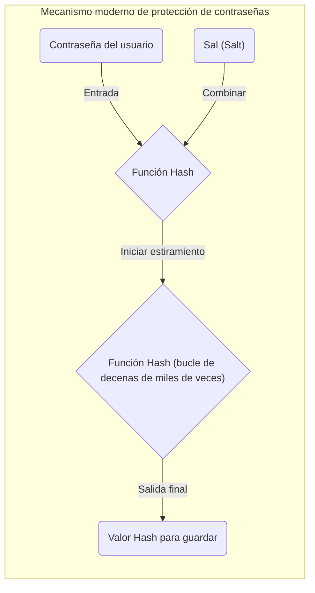

Al estudiar ciencias de la computación, seguridad de la información y criptografía, son ineludibles los conceptos del **"Principio del palomar" (Pigeonhole Principle)** y la **"Colisión de hash" (Hash Collision)**.
El principio del palomar en sí mismo es extremadamente simple, declarando algo tan obvio que hasta un niño de primaria podría entenderlo intuitivamente. Sin embargo, el impacto de este principio matemático, aparentemente sencillo, sobre el diseño de la seguridad de las funciones hash y los sistemas criptográficos que sustentan nuestra sociedad de Internet moderna es incalculable.

En este artículo, explicaremos en detalle, utilizando fórmulas y diagramas, desde la idea básica del principio del palomar hasta el mecanismo de colisión de hash, el impacto del algoritmo del cumpleaños en la complejidad computacional, ejemplos históricos de colisiones en algoritmos criptográficos (como SHA-1) y su aplicación en la evaluación de la seguridad de las tecnologías de cifrado del futuro.

## 1. Fundamentos del Principio del Palomar (Pigeonhole Principle)

El **"Principio del palomar"** (también llamado principio de Dirichlet o principio de las cajas) es un concepto aclarado por el matemático del siglo XIX Peter Gustav Lejeune Dirichlet, y se define de la siguiente manera:

> Si $n$ palomas se meten en $m$ nidos, y si $n > m$, entonces al menos uno de los nidos contendrá dos o más palomas.

Por ejemplo, digamos que 10 palomas entran en 9 nidos. No importa cuánto te esfuerces por distribuir las palomas equitativamente, invariablemente algún nido terminará alojando al menos a 2 palomas juntas. Parece algo obvio y tan intuitivo que no vale la pena demostrarlo, pero al formalizarlo matemáticamente, se convierte en una herramienta poderosísima para las pruebas de existencia.

### Ejemplos en la vida cotidiana

No se limita solo a palomas y nidos; este principio se puede aplicar a varios eventos de la vida diaria:

* **El número de cabellos**: Se dice que el número máximo de cabellos humanos es de unos 200,000. La población de Tokio es de unos 14 millones. Por consiguiente, en Tokio definitivamente existen **"dos personas que tienen exactamente el mismo número de cabellos"** (Palomas = población de Tokio, Nidos = número posible de cabellos).
* **El mes de nacimiento**: Si se reúnen 13 personas, al menos 2 nacieron en el mismo mes (Palomas = 13 personas, Nidos = 12 meses).

### Representación estricta en fórmulas (KaTeX)

Expresemos este principio matemáticamente utilizando el lenguaje de la teoría de conjuntos y mapas.
Sea $|A|$ el número de elementos de un conjunto finito $A$, $|B|$ el número de elementos de un conjunto finito $B$, y supongamos que existe una función (aplicación) $f: A \rightarrow B$ del conjunto $A$ al conjunto $B$.
En este caso, si $|A| > |B|$, la función $f$ no puede ser "inyectiva" (Inyectiva). Ser inyectiva significa que entradas diferentes invariablemente se asocian con salidas diferentes.
Esto es, siempre existen elementos distintos $x, y \in A$ que satisfacen lo siguiente:

$$
\exists x, y \in A \quad (x \neq y \land f(x) = f(y))
$$

Esta propiedad es precisamente la fórmula que explica la causa fundamental de la **"colisión hash"** en la informática, que abordaremos más adelante.

## 2. Las funciones Hash y el mecanismo de las Colisiones Hash

### ¿Qué es una función hash criptográfica?

Una **función hash** es aquella que toma cualquier cantidad de datos de entrada (mensajes, archivos, contraseñas, etc.) y los convierte a datos de salida de tamaño fijo (valor hash, resumen). Ejemplos representativos de funciones hash criptográficas ampliamente utilizadas en la actualidad incluyen SHA-256 y SHA-3.

En la criptografía, las funciones hash deben cumplir rigurosamente con los siguientes tres requisitos de seguridad:

1. **Resistencia a la preimagen (Pre-image resistance)**: A partir del valor hash de salida, debe ser extremadamente difícil calcular a la inversa (restaurar) los datos originales de entrada.
2. **Resistencia a la segunda preimagen (Second pre-image resistance)**: Dado un conjunto particular de datos de entrada, debe ser extremadamente difícil encontrar "otros datos de entrada" que tengan el mismo valor de hash.
3. **Resistencia a colisiones (Collision resistance)**: Debe ser extremadamente difícil encontrar cualquier par de dos diferentes datos de entrada que arrojen el mismo valor hash.

### La "inevitabilidad de la colisión" desde la perspectiva del principio del palomar

Consideremos el principio del palomar que vimos antes aplicándolo a las funciones hash:

* **Palomas**: El conjunto de los datos de entrada. Dado que las combinaciones de contenidos de archivos o cadenas de texto son infinitas, el número de elementos $|A|$ es, en efecto, "infinito".
* **Nidos**: El conjunto de valores hash. Al tener una longitud fija, su número de elementos $|B|$ es "finito".

Por ejemplo, la salida de SHA-256, usada en tecnologías como la [blockchain](/es/p/blockchain-technology-smart-contract-distributed-ledger/) de [Bitcoin](https://kenji.blog/es/p/cryptocurrency-and-bitcoin/), es de 256 bits. Por lo tanto, el número de posibles valores hash es de $2^{256}$ variantes (aprox. $1.15 \times 10^{77}$). Esta cifra es monumentalmente enorme, rozando el número total de átomos en el universo observable, pero sigue siendo un **número finito**.

Por el contrario, el número de variantes posibles de textos o archivos de imagen como datos de entrada es **infinito**.
Dado que se cumple la desigualdad "número total de datos de entrada" $>$ "número total de valores hash", por el principio del palomar, **necesariamente van a existir dos conjuntos diferentes de datos de entrada que resulten en exactamente el mismo valor de hash**. A este fenómeno se le conoce como **"Colisión Hash" (Hash Collision)**.

El siguiente esquema en Mermaid muestra cómo datos infinitos se mapean a un espacio finito de hash.

```mermaid
graph TD
    subgraph "Espacio de entrada infinito (palomas)"
        A("Dato A")
        B("Dato B")
        C("Dato C")
        D("Dato D")
        E("...")
    end

    subgraph "Función Hash"
        H{"Hash(x)"}
    end

    subgraph "Espacio Hash finito (nidos)"
        V1("Hash("A")")
        V2("Hash("B") = Hash("C")")
        V3("Hash("D")")
    end

    A -->|"Aplicar hash"| H
    B -->|"Aplicar hash"| H
    C -->|"Aplicar hash"| H
    D -->|"Aplicar hash"| H

    H -->|"Salida"| V1
    H -->|"Salida (colisión)"| V2
    H -->|"Salida"| V3

    style V2 fill:#ffcccc,stroke:#ff0000,stroke-width:3px;
```

En el diagrama anterior, los "datos B" y los "datos C" de entrada se asignan, mediante la función, al mismísimo valor de hash; esa sección rodeada de rojo ilustra precisamente dónde está sucediendo la colisión (Collision).

## 3. El Ataque de Cumpleaños (Birthday Attack) y la amenaza a las probabilidades de colisión

Queda patente por el principio del palomar que la colisión de un hash es en teoría inevitable; sin embargo, emerge una duda más práctica: "Bueno, entonces ¿qué tan difícil es encontrar en verdad dicha colisión?". Aquí hace su aparición la **"[Paradoja del Cumpleaños](/es/p/birthday-paradox/)" (Birthday Paradox)** y el **"Ataque del Cumpleaños" (Birthday Attack)**, que abusa de sus fundamentos matemáticos.

### ¿Qué es la paradoja del cumpleaños?

Hay una famosa cuestión estadística: "¿Cuántas personas deben congregarse para que la probabilidad de que haya 2 individuos con el mismo día de cumpleaños supere el 50%?".
Un año abarca 365 días, por lo que ateniéndonos al principio del palomar, únicamente podemos asegurar al 100% que hallaremos a alguien con nuestro cumpleaños al aglutinar a 366 personas. Sin embargo, de forma sorprendente, dicha probabilidad rebasa la barrera del 50% cuando tan solo se juntan **23 personas**. Esto es considerado una paradoja puesto que este suceso de colisión irrumpe con una aglomeración de personas muy por debajo de la intuición humana.

### Su aplicación a colisiones Hash y su verificación matemática

Representemos el tamaño del espacio de valores hash con $N$ (por ejemplo, para SHA-256 $N = 2^{256}$). Al crear y computar los hashes de $k$ datos de entrada al azar, hallaremos la probabilidad $P$ de que irrumpa un choque al menos entre una dupla.

La probabilidad de que todos resulten en hashes dispares (es decir, el supuesto de 0 colisiones) se calcula como prosigue:

$$
1 \times \left(1 - \frac{1}{N}\right) \times \left(1 - \frac{2}{N}\right) \times \cdots \times \left(1 - \frac{k-1}{N}\right)
$$

Echando mano del modelo de la Serie de Taylor para obtener una aproximación $1 - x \approx e^{-x}$, la posibilidad del choque, $P$, se deducirá así:

$$
P \approx 1 - e^{-\frac{k(k-1)}{2N}} \approx 1 - e^{-\frac{k^2}{2N}}
$$

Si queremos saber qué cantidad de sondeos, o $k$, nos reporta un 50% de probabilidad ( $P = 0.5$ ) de éxito, solventamos la ecuación:

$$
0.5 = e^{-\frac{k^2}{2N}} \implies \ln(0.5) = -\frac{k^2}{2N} \implies k \approx \sqrt{2 \ln 2 \cdot N} \approx 1.177 \sqrt{N}
$$

Este veredicto atesora una relevancia tremenda. Da a entender que ante un campo de salidas hash de un ancho de $N$, computando unas $\sqrt{N}$ (es decir $N^{0.5}$) veces, nos aupamos a una tasa de hallazgo de colisiones del 50%.

Para el SHA-256 el espectro de la salida alcanza los $2^{256}$, no obstante si pergeñamos un ataque de cumpleaños bastará un cómputo de $\sqrt{2^{256}} = 2^{128}$ intentos para forzar la colisión de hash. Acumular $2^{128}$ cálculos requiere de un marco de tiempo superior a la cronología del universo entero aun juntando todas las supercomputadoras vigentes; de tal modo, se estipula que a fecha de hoy el SHA-256 permanece exento de peligro (salvaguardando su resistencia frente al descubrimiento de colisiones).

## 4. Historia fáctica de una colisión de hash: SHAttered

Mas allá del ámbito de la teoría matemática pura, contamos con antecedentes donde el choque se evidenció palpable en el plano empírico.

Antes imperaba en el validado de certificados SSL de páginas web y la autenticidad de archivos el empleo masivo de **"SHA-1"** (con sus 160 bits) como método hash. Habida cuenta de la extensión de 160 bits, estipulaban los manuales la necesidad de acometer $2^{80}$ operaciones en pro del encuentro de choques teóricos.

Con todo, durante el año 2017, la congregación de especialistas de Google e inspectores del Instituto Nacional de Investigación en Matemáticas y Ciencias de la Computación (CWI) de Ámsterdam proclamaron la técnica ofensiva tipificada como **"SHAttered"**. Amparados en el progreso de la labor de descifrado, arribaron a una colisión en el marco de los baremos del SHA-1 efectuando nada más $2^{63.1}$ cómputos de ensayo.

Así las cosas, se desvelaron al orbe, como gran hito, **una pareja de archivos PDF provistos de una idéntica enumeración hash SHA-1** a pesar de portar contenidos completamente heterogéneos (uno correspondía a un texto inofensivo mientras el segundo era pernicioso). Este suceso decretó la defunción del SHA-1 como instrumento inexpugnable e impulsó la migración a gran escala de todo el mercado al estándar SHA-2 (v.gr., SHA-256).

```mermaid
graph LR
    subgraph "Ataque SHAttered (2017)"
        F1("Contrato PDF normal")
        F2("Contrato PDF malicioso")
        H{"Función Hash SHA-1"}
        V("Mismo valor hash\n("38762cf7f55934b34d179ae6a4c80cadccbb7f0a")")
    end

    F1 -->|"Entrada"| H
    F2 -->|"Entrada"| H
    H -->|"Salida"| V
```

De lo cual inferimos el crudo hado por el que los algoritmos criptográficos pierden gradualmente entereza frente al devenir del descubrimiento matemático o por obra de la hipertrofia informática en sí misma.

## 5. La incursión del Principio del Palomar en las Estructuras de Datos: Tablas Hash

Más allá de la esfera estricta de la codificación, es una constante tratar tanto los dominios del principio del palomar como de los choques. Lo vemos repetidamente cuando acudimos a las **"Tablas Hash"** (diccionarios y colecciones asociativas) en el transcurso de la programación.

En el marco de la tabla Hash determinamos el índice en una matriz obteniendo la identidad hash basándonos en la clave y procedemos a guardar allí el valor. En cuanto la aspiración por emplazar datos (palomas) desborda la dimensión total del repositorio (nidos), o bien aflora cierta asimetría respecto al desempeño del método, sobreviene una contingencia letal donde unas tantas claves pretenden encasillarse en una y misma franja: la tan denostada "colisión".

Al arbitrio de estas situaciones, la comunidad desarrolló maniobras resolutorias, a reseñar:

* **Técnica del encadenamiento (Chaining)**: Ensartar los ítems colisionantes anudándolos (listas enlazadas) y enclavándolos unidos en la idéntica celda.
* **Metodología de direccionamiento abierto (Open Addressing)**: Acontecida la injerencia, escudriñar por un casillero alternativo colindante valiéndose de reglas explícitas hasta colocar el registro.

Por detrás de la pátina visible del software en uso común (sea el atributo `dict` de Python o el acrónimo `HashMap` de la sintaxis en [Java](https://kenji.blog/es/p/programming-languages-history-paradigm-evolution/)) laboran de consuno estrategias avanzadísimas en orden a domesticar el efecto insoslayable e instantáneo del choque derivado, sí o sí, de acatar el principio del palomar.

## 6. Provisión de firmeza y porvenir en materia Criptográfica

Tratándose de una quimera confeccionar por mandato del principio del palomar una "función que no depare jamás colisiones", dentro de la escena de la seguridad de la información el derrotero apunta preferiblemente hacia una aspiración más sosegada: **"diseñarlo a semejanza de que resulta materialmente inconcebible vislumbrar la colisión echando mano del tesoro y los periodos informáticos comunes"**.

### Avalancha sobre el Margen de Seguridad

La trinchera por antomasia exige distender las cadenas de bits portadoras de resultados hash.
Por cada acopio a favor en el largor de los bits, se propulsa de un modo exponencial el sacrificio de cálculo que la ofensiva requeriría.

| Algoritmo | Dimensión Saliente $n$ | Trabajo para hallazgo $2^{n/2}$ | Estado a tiempo real |
|---|---|---|---|
| MD5 | 128 bit | $2^{64}$ | Completamente doblegado (Rechazado) |
| SHA-1 | 160 bit | $2^{80}$ | Doblegado (Rechazado) |
| SHA-256 | 256 bit | $2^{128}$ | Operativamente invulnerable |
| SHA-512 | 512 bit | $2^{256}$ | Absolutamente invulnerable |
| SHA-3 (Keccak) | 256/512 bit | $2^{128} / 2^{256}$ | Absolutamente invulnerable (Configuración alternativa) |

En el fragor de acoger instrumentos, se postula prioritario sondear el auge de la pujanza informática a beneficio de los intrusos (v.gr., Ley de Moore), e igual sopesar el estallido futuro por parte de computadores cuánticos en ciernes, abocándose ineludiblemente a métodos resguardados por un profuso y holgado **"margen de resguardo"**.

### Blindaje mediante los aditivos "Salt" y Estiramientos ("Stretching")

Si bien la mecánica difiere una pizca respecto al encontronazo en el recuento hash, concurre asimismo un celo notable salvaguardando las contraseñas. Un simple trámite por la trituradora hash es estéril de frente a una avalancha que recurra a formidables diccionarios de valores precognocidos (la manida Rainbow Table).

A modo preventivo y contrarrestando la tesitura descrita, se adosa para cada contraseña un encaje de caracteres bautizado como **"Sal" (Salt)** precedente al triturado, así como forzar el cálculo para iterarlo por una tanda desmedida (se habla de centenas de millares), una estratagema que ostenta el título de **"Estiramiento" (Stretching)**; como así lo patentizan las normativas de PBKDF2, bcrypt o Argon2 en materia de obtención de llaves.



Esto precipita que a sabiendas se encarezcan exponencialmente los trabajos precisados a costillas del saboteador, relegando al estatus de puro surrealismo toda tentativa por la fuerza bruta.

## 7. Sumario

A lo largo de este compendio, hemos desgranado cómo la **"Regla del Palomar"**, aquel dictado axiomático de porte pueril, propicia irremediablemente las circunstancias conducentes a esa fricción denominada **"Colisión Hash"**, repercutiendo con ello en el baluarte de las estrategias relativas a criptoanálisis.

* **Fuerza Ineluctable del principio**: Como las funciones hash constriñen flujos incontables en fronteras tangibles, están matemáticas inermes frente a contraer colisiones eventuales.
* **Intimidación del lance de cumpleaños**: El espectro paródico de la conmemoración natalicia destapa que en un entorno perimétrico $N$, ya por el orden de los $\sqrt{N}$ intentos despunta una chance latente a colisionar.
* **Directrices del cripto-desarrollo imperante**: Estando condenados a no mitigar los roces a un cero rotundo, el contraataque se cifra en extender las fronteras finales en cuantías extremas, frustrando su descubrimiento de cara a la fuerza física del cómputo.

El asentar lúcidamente la mecánica latente de estos axiomas confluye directamente con desentrañar los engranajes nucleares del tejido protector, ora [Blockchain](https://kenji.blog/es/p/blockchain-technology-smart-contract-distributed-ledger/), ora las rúbricas certificadas, o el mismo acopio de identidades secretas.
Es pasmoso concebir cómo lo que parece a un vistazo veloz una ciencia oscura se apuntala ni más ni menos que en reflexiones que concilian nidos aviares o felicitaciones de almanaque, conformando un retrato vivaz del rico folclore de la rama informática.
