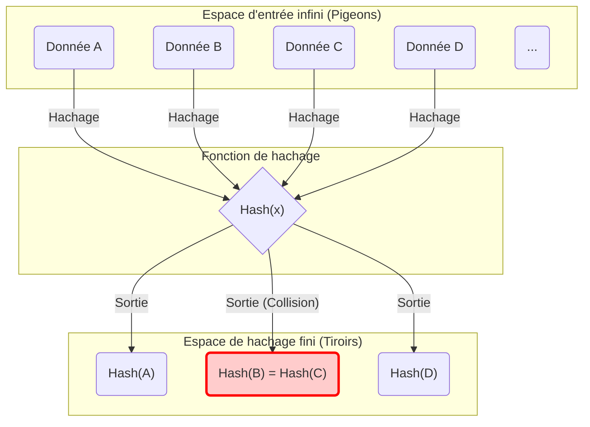
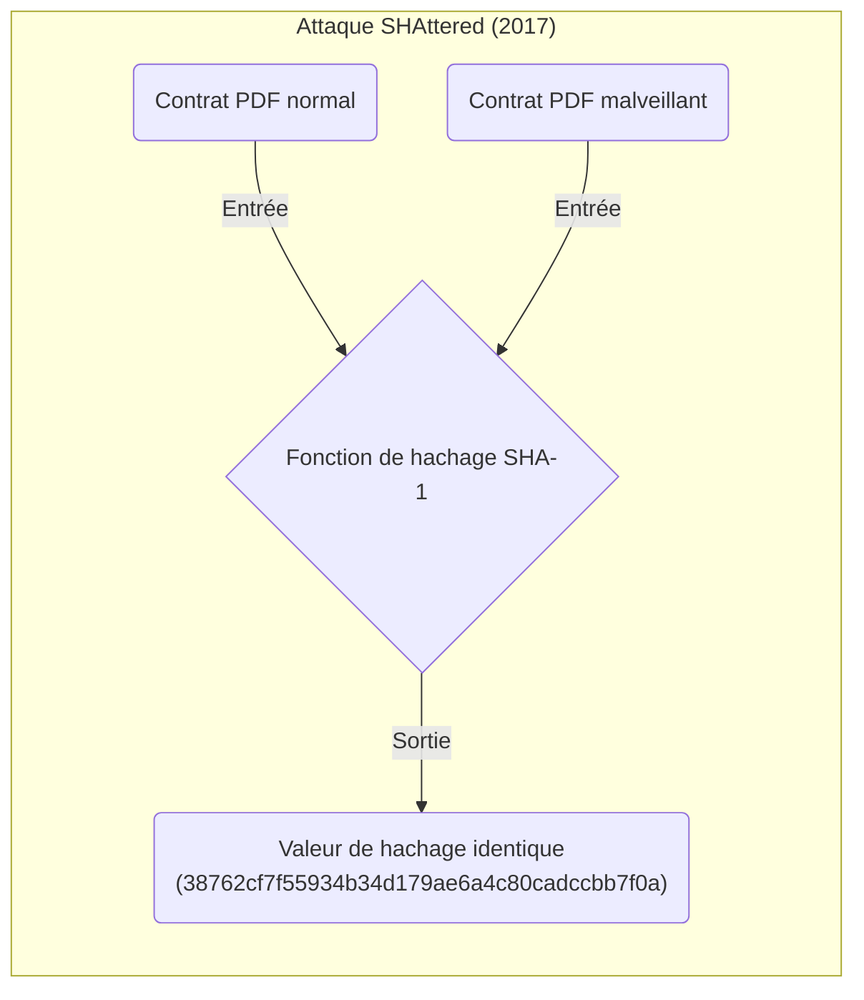
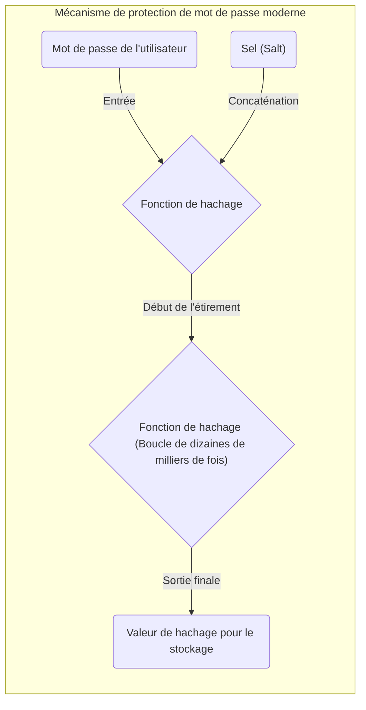

Lorsque l'on étudie l'informatique, la sécurité de l'information et la cryptographie, il est impossible de contourner les concepts du « **Principe des tiroirs (ou des nids de pigeons)** » et des « **Collisions de hachage (Hash Collision)** ».
Le principe des tiroirs en lui-même est extrêmement simple, au point qu'un enfant d'école primaire peut le comprendre intuitivement : il ne dit rien de plus que des évidences. Cependant, ce principe mathématique d'apparence simpliste a un impact incommensurable sur la conception de la sécurité des fonctions de hachage et des systèmes cryptographiques qui soutiennent la société Internet d'aujourd'hui.

Dans cet article, nous partirons de la base du principe des tiroirs pour expliquer en détail, avec des formules mathématiques et des schémas, les mécanismes des collisions de hachage, l'impact sur la complexité informatique via le paradoxe des anniversaires, les cas réels de collisions dans les algorithmes cryptographiques anciens (comme SHA-1), et son application à l'évaluation de la sécurité des technologies cryptographiques de demain.

## 1. Les bases du principe des tiroirs (Pigeonhole Principle)

Le « **Principe des tiroirs** » (également appelé principe des nids de pigeons ou principe de Dirichlet) est un concept clarifié par le mathématicien du 19ème siècle Peter Gustav Lejeune Dirichlet. Il est défini comme suit :

> Si $n$ pigeons sont placés dans $m$ nids, et que $n > m$, alors au moins un nid doit contenir au moins deux pigeons.

Par exemple, imaginez que 10 pigeons doivent entrer dans 9 nids. Quelle que soit votre volonté de répartir les pigeons équitablement, un des nids finira inévitablement par héberger deux pigeons ou plus. Cela semble si intuitif et évident que cela ne semble même pas valoir la peine de le prouver, mais une fois formalisé mathématiquement, cela devient un outil extrêmement puissant pour prouver l'existence.

### Exemples concrets dans la vie quotidienne

Ce principe ne s'applique pas uniquement aux pigeons et à leurs nids, mais à de nombreuses situations du quotidien.

* **Le nombre de cheveux** : On dit que le nombre maximum de cheveux sur une tête humaine est d'environ 200 000. La population de Tokyo est d'environ 14 millions d'habitants. Par conséquent, il existe nécessairement à Tokyo « **deux personnes ayant exactement le même nombre de cheveux** » (Pigeons = population de Tokyo, Nids = nombres possibles de cheveux).
* **Le mois de naissance** : Si 13 personnes se réunissent, au moins 2 d'entre elles sont nées le même mois (Pigeons = 13 personnes, Nids = 12 mois).

### Expression mathématique stricte (KaTeX)

Exprimons mathématiquement ce principe à l'aide de la théorie des ensembles et des applications.
Soit $A$ un ensemble fini dont le nombre d'éléments est $|A|$, et $B$ un ensemble fini dont le nombre d'éléments est $|B|$. Supposons qu'il existe une fonction (application) $f: A \rightarrow B$ de l'ensemble $A$ vers l'ensemble $B$.
À ce moment-là, si $|A| > |B|$, la fonction $f$ ne peut pas être « injective (Injective) ». Être injectif signifie que des entrées distinctes sont toujours liées à des sorties distinctes.
En d'autres termes, il existe nécessairement deux éléments distincts $x, y \in A$ satisfaisant à la condition suivante :

$$
\exists x, y \in A \quad (x \neq y \land f(x) = f(y))
$$

Cette propriété est l'équation qui explique la cause fondamentale des « **collisions de hachage** » en informatique, que nous aborderons plus bas.

## 2. Les fonctions de hachage et les mécanismes de collisions de hachage

### Qu'est-ce qu'une fonction de hachage cryptographique ?

Une **fonction de hachage** est une fonction qui prend en entrée des données de n'importe quelle longueur (un message, un fichier, un mot de passe, etc.) et les convertit en des données de sortie de taille fixe (valeur de hachage, empreinte numérique, digest). Les fonctions de hachage cryptographiques les plus couramment utilisées aujourd'hui comprennent SHA-256 et SHA-3.

Les fonctions de hachage utilisées en cryptographie doivent généralement répondre aux trois exigences de sécurité strictes suivantes :

1. **Résistance à la préimage (Pre-image resistance)** : Il doit être extrêmement difficile de deviner (restaurer) les données d'entrée originales à partir de la valeur de hachage produite.
2. **Résistance à la seconde préimage (Second pre-image resistance)** : Étant donné une donnée d'entrée spécifique, il doit être extrêmement difficile de trouver une « autre donnée d'entrée » ayant la même valeur de hachage.
3. **Résistance aux collisions (Collision resistance)** : Il doit être extrêmement difficile de trouver arbitrairement une paire de deux données d'entrée distinctes produisant la même valeur de hachage.

### La « fatalité des collisions » sous l'angle du principe des tiroirs

Appliquons maintenant le principe des tiroirs mentionné précédemment aux fonctions de hachage.

* **Les pigeons** : L'ensemble des données d'entrée. Puisque les combinaisons de contenus de fichiers ou de chaînes de caractères sont infinies, le nombre d'éléments $|A|$ est virtuellement « infini ».
* **Les nids** : L'ensemble des valeurs de hachage. Puisque la valeur de hachage est de taille fixe, le nombre d'éléments $|B|$ est « fini ».

Par exemple, la sortie de SHA-256, également utilisée dans des technologies de blockchain comme le [Bitcoin](https://kenji.blog/fr/p/cryptocurrency-and-bitcoin/), est de 256 bits. Par conséquent, le nombre de valeurs de hachage possibles est de $2^{256}$ (soit environ $1.15 \times 10^{77}$). Bien que ce nombre soit gigantesque et s'approche du nombre total d'atomes dans l'univers observable, il reste un **nombre fini**.

En revanche, le nombre de variations de textes ou d'images pouvant servir de données d'entrée est **infini**.
Par conséquent, puisque l'inégalité « nombre total de données d'entrée » $>$ « nombre total de valeurs de hachage » se vérifie, d'après le principe des tiroirs, il existera **inévitablement deux données d'entrée différentes ayant la même valeur de hachage**. C'est le phénomène que l'on nomme « **collision de hachage (Hash Collision)** ».

Le schéma Mermaid suivant illustre la façon dont des données infinies sont mappées dans un espace de hachage fini.

Dans la figure ci-dessus, la « Donnée B » et la « Donnée C » en entrée sont affectées exactement à la même valeur de hachage par l'intermédiaire de la fonction, et la zone encadrée en rouge montre précisément l'endroit où se produit une collision.

## 3. L'attaque des anniversaires (Birthday Attack) et la menace des probabilités de collision

S'il est évident, selon le principe des tiroirs, qu'une collision de hachage est théoriquement inévitable, une question pratique se pose : « à quel point est-il difficile de trouver cette collision dans les faits ? ». C'est ici qu'intervient le « **Paradoxe des anniversaires (Birthday Paradox)** » et la méthode l'exploitant mathématiquement, l'« **Attaque des anniversaires (Birthday Attack)** ».

### Qu'est-ce que le paradoxe des anniversaires ?

C'est un célèbre problème de probabilités : « Combien de personnes doivent se réunir pour que la probabilité que deux d'entre elles partagent la même date d'anniversaire dépasse 50% ? »
Une année compte 365 jours. Selon le principe des tiroirs, il faut que 366 personnes se rassemblent pour affirmer avec certitude (à 100%) que deux d'entre elles ont la même date d'anniversaire. Cependant, ce qui est surprenant, c'est que la probabilité dépasse les 50% avec seulement **23 personnes** réunies. Le fait qu'une « collision » puisse se produire avec un nombre de personnes bien inférieur à notre intuition est la raison pour laquelle on parle de paradoxe.

### Application aux collisions de hachage et preuve mathématique

Supposons que la taille de l'espace des valeurs de hachage soit $N$ (par exemple, $N = 2^{256}$ pour SHA-256). Cherchons la probabilité $P$ de générer au moins une collision en calculant les valeurs de hachage de $k$ données d'entrée générées aléatoirement.

La probabilité que toutes les entrées aient des valeurs de hachage différentes (c'est-à-dire la probabilité d'aucune collision) est calculée comme suit :

$$
1 \times \left(1 - \frac{1}{N}\right) \times \left(1 - \frac{2}{N}\right) \times \cdots \times \left(1 - \frac{k-1}{N}\right)
$$

À l'aide de la formule d'approximation $1 - x \approx e^{-x}$ (issue du développement de Taylor), la probabilité $P$ qu'une collision se produise peut être approximée de la manière suivante :

$$
P \approx 1 - e^{-\frac{k(k-1)}{2N}} \approx 1 - e^{-\frac{k^2}{2N}}
$$

Pour trouver le nombre d'essais $k$ tel que la probabilité de collision soit de 50% ($P = 0.5$), nous résolvons l'équation :

$$
0.5 = e^{-\frac{k^2}{2N}} \implies \ln(0.5) = -\frac{k^2}{2N} \implies k \approx \sqrt{2 \ln 2 \cdot N} \approx 1.177 \sqrt{N}
$$

Ce résultat est extrêmement important. Si l'espace de sortie de la valeur de hachage est $N$, cela signifie qu'en effectuant approximativement $\sqrt{N}$ (c'est-à-dire $N^{0.5}$) calculs, la probabilité de trouver une collision de hachage dépassera 50%.

Dans le cas de SHA-256, l'espace de sortie est de $2^{256}$, mais en utilisant l'attaque des anniversaires, on peut trouver une collision en $\sqrt{2^{256}} = 2^{128}$ calculs environ. Le nombre $2^{128}$ est si astronomique qu'il prendrait plus de temps que l'âge de l'univers même en mobilisant tous les supercalculateurs modernes. C'est pourquoi SHA-256 est actuellement considéré comme sûr (il satisfait à l'exigence de résistance aux collisions).

## 4. L'histoire des collisions de hachage dans le monde réel : SHAttered

Au-delà de la théorie pure, il existe dans le monde réel des précédents historiques de démonstration de collisions de hachage.

Il y avait autrefois une fonction de hachage appelée « **SHA-1** » (160 bits) qui était très largement utilisée pour les certificats SSL de sites web ou la vérification de l'intégrité des fichiers. Sa longueur de sortie étant de 160 bits, la recherche de collision nécessitait théoriquement $2^{80}$ calculs.

Cependant, en 2017, une équipe de recherche de Google et du Centre d'Amathématiques et d'Informatique des Pays-Bas (CWI) a publié une méthode d'attaque appelée « **SHAttered** ». Appliquant les avancées en analyse cryptographique, ils ont réussi à découvrir une collision SHA-1 en seulement $2^{63.1}$ calculs.

Ils ont ainsi publié, pour la première fois au monde, **deux fichiers PDF dont les valeurs de hachage SHA-1 correspondaient exactement**, bien que leurs contenus fussent complètement différents (l'un étant un document normal, l'autre un document malveillant). À la suite de cet incident, la vie de SHA-1 en tant que « fonction de hachage sûre » s'est achevée, forçant l'industrie entière à migrer vers SHA-2 (comme SHA-256).

De cette façon, par le progrès mathématique et l'évolution des capacités de calcul, les algorithmes de cryptographie sont destinés à s'affaiblir progressivement.

## 5. Le principe des tiroirs dans les structures de données : Les tables de hachage

Le principe des tiroirs et les collisions de hachage sont également des thèmes majeurs en dehors du domaine de la cryptographie. Les « **tables de hachage (tableaux associatifs ou types dictionnaires)** », fréquemment utilisées en programmation, en sont un excellent exemple.

Dans une table de hachage, une valeur de hachage est calculée à partir de la clé, puis utilisée comme index dans un tableau pour stocker la valeur. Si l'on tente de stocker plus de données (les pigeons) que la taille du tableau (les nids), ou si la fonction de hachage est biaisée, une « collision », où deux clés différentes pointent vers le même index, se produit inévitablement.

Pour résoudre ces collisions, les algorithmes suivants sont intégrés :

* **Méthode de chaînage (Chaining)** : Relier les éléments entrés en collision au moyen d'une liste chaînée (linked list) et les stocker dans le même compartiment (bucket).
* **Adressage ouvert (Open Addressing)** : Lorsqu'une collision se produit, chercher selon des règles définies « un autre compartiment vide » pour y stocker la donnée.

En coulisses des langages de programmation (`dict` en Python, `HashMap` en [Java](https://kenji.blog/fr/p/programming-languages-history-paradigm-evolution/), etc.), des mécanismes d'une grande ingéniosité ont été conçus pour gérer de manière rapide et efficace les collisions causées par le principe des tiroirs.

## 6. La sécurité et l'avenir de la technologie de la cryptographie

Puisqu'il est, en vertu du principe des tiroirs, impossible de créer une « fonction de hachage totalement sans collisions », le monde de la sécurité de l'information adopte l'approche suivante : **concevoir de sorte que, avec les temps et les ressources de calcul réalistes, on ne puisse jamais trouver une collision**.

### La marge de sécurité (Security margin)

La meilleure défense est d'allonger suffisamment la longueur en bits de la valeur de hachage.
L'allongement de cette taille augmente de façon exponentielle la quantité de calculs requis par un attaquant.

| Algorithme | Longueur de sortie $n$ | Coût de la recherche de collision $2^{n/2}$ | Statut actuel |
|---|---|---|---|
| MD5 | 128 bit | $2^{64}$ | Totalement compromis (déconseillé) |
| SHA-1 | 160 bit | $2^{80}$ | Compromis (déconseillé) |
| SHA-256 | 256 bit | $2^{128}$ | Sûr dans la pratique |
| SHA-512 | 512 bit | $2^{256}$ | Extrêmement sûr |
| SHA-3 (Keccak) | 256/512 bit | $2^{128} / 2^{256}$ | Extrêmement sûr (structure différente) |

Dans le choix d'une technologie cryptographique, il est indispensable de prévoir les progrès des capacités de calcul des attaquants (Loi de Moore, etc.) et l'arrivée éventuelle d'ordinateurs quantiques, en sélectionnant des algorithmes dotés d'une **« marge de sécurité »** suffisante.

### Le sel (Salt) et l'étirement (Stretching) pour la protection des mots de passe

Bien que le mécanisme soit légèrement différent des collisions de hachage, des stratégies cruciales existent également pour contrer les fuites de mots de passe. Hacher simplement un mot de passe ne sert à rien contre des attaques employant d'immenses bases de données de valeurs de hachage précalculées (les "rainbow tables" ou tables arc-en-ciel).

Pour s'en prémunir, on hache le mot de passe en lui ajoutant un **« sel (Salt) »** (une chaîne de caractères aléatoire unique pour chaque mot de passe), et on effectue un traitement appelé **« étirement (Stretching) »** qui répète intentionnellement le calcul de hachage des milliers voire des dizaines de milliers de fois (via des fonctions de dérivation de clé telles que PBKDF2, bcrypt, Argon2, etc.).

Ainsi, en augmentant drastiquement et intentionnellement le coût de calcul imposé à l'attaquant, on rend les attaques par force brute irréalistes.

## 7. Résumé

Nous avons expliqué comment un théorème mathématique simple et intuitif, le « **Principe des tiroirs** », provoque inévitablement ce phénomène que sont les « **collisions de hachage** », et comment cela influence la conception de la sécurité des techniques cryptographiques.

* **Le caractère inéluctable du principe des tiroirs** : Pour une fonction de hachage recevant des données infinies pour produire une sortie finie, les mathématiques dictent qu'une collision finira obligatoirement par exister.
* **La menace de l'attaque des anniversaires** : En vertu du paradoxe des anniversaires, pour un espace de hachage $N$, la possibilité de trouver une collision ne requiert qu'approximativement $\sqrt{N}$ opérations.
* **La philosophie de conception de la cryptographie moderne** : Étant donné l'impossibilité de réduire les collisions à zéro, on s'assure qu'en augmentant suffisamment la taille de sortie, la découverte de ces collisions devienne mathématiquement et temporellement impossible.

Acquérir une compréhension approfondie de ces principes, c'est comprendre les fondations mêmes de nos systèmes de sécurité modernes tels que la blockchain, les signatures numériques ou encore la gestion des mots de passe.
Même les techniques cryptographiques qui semblent d'abord absconses et complexes reposent fondamentalement sur des concepts simples et familiers de probabilité comme les « pigeons et nids » ou les « anniversaires ». C'est là toute la profondeur et la fascination de l'informatique !
