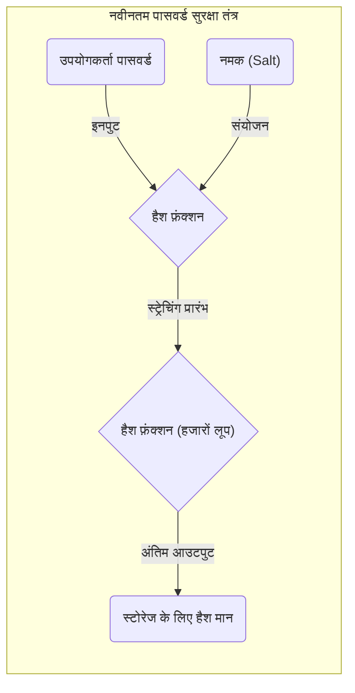

कंप्यूटर विज्ञान, सूचना सुरक्षा और क्रिप्टोग्राफी का अध्ययन करते समय, आप **"कबूतर का घोंसला सिद्धांत (Pigeonhole Principle)"** और **"हैश टकराव (Hash Collision)"** की अवधारणाओं से नहीं बच सकते।
कबूतर का घोंसला सिद्धांत अपने आप में बहुत ही सरल है, यह इतनी स्पष्ट बात कहता है कि कोई प्राथमिक स्कूल का बच्चा भी इसे सहज रूप से समझ सकता है। हालाँकि, यह प्रतीत होने वाला सरल गणितीय सिद्धांत हैश फ़ंक्शंस (hash functions) और क्रिप्टोग्राफ़िक प्रणालियों (cryptographic systems) के सुरक्षा डिज़ाइन पर अथाह प्रभाव डालता है जो आधुनिक इंटरनेट समाज को आधार प्रदान करते हैं।

इस लेख में, हम कबूतर के घोंसले के सिद्धांत के मूल विचार से शुरू करेंगे, और हैश टकराव के तंत्र, जन्मदिन के विरोधाभास (Birthday Paradox) के कारण कम्प्यूटेशनल जटिलता पर प्रभाव, पिछले क्रिप्टोग्राफ़िक एल्गोरिदम (जैसे SHA-1) में वास्तविक टकराव के मामलों, और भविष्य की एन्क्रिप्शन तकनीक के लिए सुरक्षा मूल्यांकन के अनुप्रयोगों के बारे में विस्तार से बताएंगे, गणितीय सूत्रों और आरेखों के साथ।

## 1. कबूतर का घोंसला सिद्धांत (Pigeonhole Principle) की मूल बातें

**"कबूतर का घोंसला सिद्धांत"** (जिसे डिरिचलेट का बॉक्स सिद्धांत / Dirichlet's box principle या दराज सिद्धांत / drawer principle भी कहा जाता है) 19वीं सदी के गणितज्ञ पीटर गुस्ताव लेजेन डिरिचलेट द्वारा स्पष्ट की गई एक अवधारणा है और इसे निम्नानुसार परिभाषित किया गया है:

> जब $n$ कबूतर $m$ घोंसलों (छेद) में प्रवेश करते हैं, और यदि $n > m$ है, तो कम से कम एक घोंसले में दो या अधिक कबूतर होने चाहिए।

उदाहरण के लिए, मान लें कि 10 कबूतर 9 घोंसलों में प्रवेश करते हैं। चाहे आप कबूतरों को समान रूप से आवंटित करने की कितनी भी कोशिश करें, कम से कम एक घोंसला ऐसा होना चाहिए जिसमें 2 या अधिक कबूतर एक साथ रहते हों। यह बहुत ही सहज लगता है और इतना स्पष्ट है कि इसे साबित करने की आवश्यकता नहीं है, लेकिन जब इसे गणितीय रूप से तैयार किया जाता है, तो यह अस्तित्व के प्रमाण के लिए एक बहुत शक्तिशाली उपकरण बन जाता है।

### रोजमर्रा की जिंदगी में विशिष्ट उदाहरण

केवल कबूतरों और घोंसलों ही नहीं, इस सिद्धांत को रोज़मर्रा की विभिन्न घटनाओं पर लागू किया जा सकता है।

*  **बालों की संख्या**: कहा जाता है कि इंसान के सिर पर अधिकतम 200,000 बाल होते हैं। टोक्यो की आबादी लगभग 14 मिलियन है। इसलिए, टोक्यो में **"बिल्कुल समान संख्या में बालों वाले दो लोग"** अवश्य मौजूद होने चाहिए (कबूतर = टोक्यो की जनसंख्या, घोंसला = बालों की संख्या का पैटर्न)।
*  **जन्म का महीना**: यदि 13 लोग एक साथ आते हैं, तो कम से कम 2 लोगों का जन्म एक ही महीने में हुआ होगा (कबूतर = 13 लोग, घोंसला = 12 महीने)।

### गणितीय सूत्रों (KaTeX) के साथ सख्त अभिव्यक्ति

आइए सेट सिद्धांत (set theory) और मैपिंग (mapping) की भाषा का उपयोग करके इस सिद्धांत को गणितीय रूप से व्यक्त करें।
मान लें कि परिमित सेट (finite set) $A$ में तत्वों की संख्या $|A|$ है, और परिमित सेट $B$ में तत्वों की संख्या $|B|$ है, और सेट $A$ से सेट $B$ तक एक फ़ंक्शन (मैपिंग) $f: A \rightarrow B$ मौजूद है।
इस समय, यदि $|A| > |B|$ है, तो फ़ंक्शन $f$ "इंजेक्शव (Injective / एक-से-एक)" नहीं हो सकता। इंजेक्टिविटी वह गुण है जहां भिन्न इनपुट हमेशा भिन्न आउटपुट से बंधे होते हैं।
दूसरे शब्दों में, सेट $A$ में हमेशा भिन्न तत्व $x, y$ मौजूद होते हैं जो निम्नलिखित को संतुष्ट करते हैं:

$$
\exists x, y \in A \quad (x \neq y \land f(x) = f(y))
$$

यह गुण वह गणितीय सूत्र है जो सूचना विज्ञान में **"हैश टकराव (Hash Collision)"** का मूल कारण बताता है, जिसके बारे में हम बाद में चर्चा करेंगे।

## 2. हैश कार्य ([Hash Function](https://kenji.blog/hi/p/modern-cryptography-public-key-hash-signature/)s) और हैश टकराव का तंत्र

### क्रिप्टोग्राफ़िक हैश फ़ंक्शन क्या है?

एक **हैश फ़ंक्शन** एक फ़ंक्शन है जो मनमानी लंबाई (जैसे संदेश, फ़ाइलें, या पासवर्ड) का इनपुट डेटा लेता है और इसे एक निश्चित लंबाई के आउटपुट डेटा (हैश मान, डाइजेस्ट) में परिवर्तित करता है। विशिष्ट क्रिप्टोग्राफ़िक हैश फ़ंक्शंस में SHA-256 और SHA-3 शामिल हैं, जो वर्तमान में व्यापक रूप से उपयोग किए जाते हैं।

क्रिप्टोग्राफ़िक हैश फ़ंक्शंस के लिए मुख्य रूप से निम्नलिखित तीन सख्त सुरक्षा आवश्यकताओं की आवश्यकता होती है:

1.  **प्री-इमेज प्रतिरोध (Pre-image resistance)**: आउटपुट हैश मान से मूल इनपुट डेटा को उलटना (पुनर्प्राप्त करना) अत्यंत कठिन होना चाहिए।
2.  **दूसरा प्री-इमेज प्रतिरोध (Second pre-image resistance)**: कोई विशिष्ट इनपुट डेटा दिए जाने पर, "एक अन्य इनपुट डेटा" ढूंढना अत्यंत कठिन होना चाहिए जिसका हैश मान समान हो।
3.  **टकराव प्रतिरोध (Collision resistance)**: दो भिन्न इनपुट डेटा जोड़े मनमाने ढंग से खोजना अत्यंत कठिन होना चाहिए जो समान हैश मान आउटपुट करते हैं।

### कबूतर के घोंसले सिद्धांत के नजरिए से "टकराव की अनिवार्यता"

अब, आइए हैश फ़ंक्शंस पर पहले बताए गए कबूतर के घोंसले सिद्धांत को लागू करें।

*  **कबूतर**: इनपुट डेटा का सेट। फ़ाइल सामग्री और स्ट्रिंग संयोजनों की अनंत संख्या होने के कारण, तत्वों की संख्या $|A|$ वस्तुतः "अनंत (infinite)" है।
*  **घोंसला**: हैश मानों का सेट। क्योंकि हैश मान निश्चित लंबाई (fixed length) का है, तत्वों की संख्या $|B|$ "परिमित (finite)" है।

उदाहरण के लिए, SHA-256 (बिटकॉइन जैसी ब्लॉकचेन तकनीक में प्रयुक्त) का आउटपुट 256 बिट्स है। इसलिए, संभावित हैश मानों की संख्या $2^{256}$ (लगभग $1.15 \times 10^{77}$) है। यह इतनी बड़ी संख्या है कि यह अवलोकन योग्य ब्रह्मांड में मौजूद परमाणुओं की कुल संख्या के करीब पहुंच जाती है, लेकिन यह केवल एक **परिमित संख्या** है।

दूसरी ओर, इनपुट डेटा के रूप में टेक्स्ट या छवि फ़ाइलों की **अनंत** भिन्नताएं हैं।
इसलिए, चूंकि असमानता "इनपुट डेटा की कुल संख्या" $>$ "हैश मानों की कुल संख्या" सही है, कबूतर के घोंसले सिद्धांत के अनुसार, **हमेशा दो भिन्न इनपुट डेटा होंगे जिनका हैश मान समान होगा**। इस घटना को **"हैश टकराव (Hash Collision)"** कहा जाता है।

नीचे दिया गया मर्मेड (Mermaid) आरेख दिखाता है कि कैसे अनंत डेटा को एक परिमित हैश स्थान पर मैप किया जाता है।

```mermaid
graph TD
    subgraph "अनंत इनपुट स्थान (कबूतर)"
        A("डेटा A")
        B("डेटा B")
        C("डेटा C")
        D("डेटा D")
        E("...")
    end

    subgraph "हैश फंक्शन"
        H{"Hash(x)"}
    end

    subgraph "परिमित हैश स्थान (घोंसला)"
        V1("Hash("A")")
        V2("Hash("B") = Hash("C")")
        V3("Hash("D")")
    end

    A -->|"हैश करना"| H
    B -->|"हैश करना"| H
    C -->|"हैश करना"| H
    D -->|"हैश करना"| H

    H -->|"आउटपुट"| V1
    H -->|"आउटपुट (टकराव)"| V2
    H -->|"आउटपुट"| V3

    style V2 fill:#ffcccc,stroke:#ff0000,stroke-width:3px;
```

ऊपर दिए गए आरेख में, इनपुट "डेटा B" और "डेटा C" फ़ंक्शन के माध्यम से बिल्कुल उसी हैश मान को असाइन किए गए हैं, और लाल बॉर्डर वाला भाग ठीक उसी स्थान को इंगित करता है जहाँ टकराव (Collision) होता है।

## 3. जन्मदिन का हमला (Birthday Attack) और टकराव की संभावना का खतरा

कबूतर के घोंसले के सिद्धांत से यह स्पष्ट हो गया है कि हैश टकराव सैद्धांतिक रूप से अपरिहार्य हैं, लेकिन एक व्यावहारिक प्रश्न उठता है: "वास्तव में उस टकराव को खोजना कितना मुश्किल है?" यहां **"जन्मदिन का विरोधाभास (Birthday Paradox)"** और **"जन्मदिन का हमला (Birthday Attack)"** (जो इसके गणितीय गुणों का फायदा उठाता है) काम आते हैं।

### जन्मदिन का विरोधाभास क्या है?

प्रायिकता सिद्धांत में एक प्रसिद्ध समस्या है: "50% से अधिक संभावना होने के लिए कितने लोगों को एक साथ आना चाहिए कि उनमें से 2 का जन्मदिन एक ही हो?"
एक वर्ष में 365 दिन होते हैं, इसलिए कबूतर के घोंसले के सिद्धांत के अनुसार, आप निश्चित रूप से (100% संभावना के साथ) कह सकते हैं कि जब 366 लोग एक साथ होंगे तो समान जन्मदिन वाले लोग होंगे। हालाँकि, आश्चर्यजनक रूप से, संभावना 50% से अधिक हो जाती है जब केवल **23 लोग** एक साथ आते हैं। कारण इसे विरोधाभास क्यों कहा जाता है, वह यह है कि मानवीय अंतर्ज्ञान (human intuition) की अपेक्षा बहुत कम लोगों के साथ "टकराव" हो सकता है।

### हैश टकराव के लिए अनुप्रयोग और गणितीय प्रमाण

मान लीजिए कि हैश मान स्थान का आकार $N$ है (उदाहरण के लिए, SHA-256 के लिए $N = 2^{256}$)। आइए संभावना $P$ की गणना करें कि जब हम यादृच्छिक रूप से $k$ इनपुट डेटा उत्पन्न करते हैं और उनके हैश मानों की गणना करते हैं तो कम से कम एक टकराव होगा।

संभावना है कि सभी इनपुट में अलग-अलग हैश मान होंगे (यानी संभावना है कि कोई टकराव नहीं होगा) इस प्रकार गणना की जाती है:

$$
1 \times \left(1 - \frac{1}{N}\right) \times \left(1 - \frac{2}{N}\right) \times \cdots \times \left(1 - \frac{k-1}{N}\right)
$$

टेलर विस्तार (Taylor expansion) $1 - x \approx e^{-x}$ का उपयोग करके अनुमानित सूत्र का उपयोग करते हुए, टकराव होने की संभावना $P$ का अनुमान इस प्रकार लगाया जा सकता है:

$$
P \approx 1 - e^{-\frac{k(k-1)}{2N}} \approx 1 - e^{-\frac{k^2}{2N}}
$$

परीक्षणों की संख्या $k$ का पता लगाने के लिए जिसके लिए टकराव की संभावना 50% ($P = 0.5$) है, हम समीकरण को हल करते हैं।

$$
0.5 = e^{-\frac{k^2}{2N}} \implies \ln(0.5) = -\frac{k^2}{2N} \implies k \approx \sqrt{2 \ln 2 \cdot N} \approx 1.177 \sqrt{N}
$$

यह परिणाम बहुत महत्वपूर्ण है। यदि हैश मान आउटपुट स्थान $N$ है, तो इसका मतलब है कि यदि आप लगभग $\sqrt{N}$ बार (यानी $N^{0.5}$ बार) गणना करते हैं, तो हैश टकराव खोजने की संभावना 50% से अधिक हो जाएगी।

SHA-256 के मामले में, आउटपुट स्थान $2^{256}$ है, लेकिन जन्मदिन के हमले का उपयोग करके, यह गणना की जाती है कि हैश टकराव को $\sqrt{2^{256}} = 2^{128}$ गणनाओं के साथ पाया जा सकता है। $2^{128}$ गणनाओं की संख्या एक खगोलीय संख्या है जिसमें ब्रह्मांड के जीवनकाल से अधिक समय लगेगा, भले ही सभी आधुनिक सुपर कंप्यूटर जुटा लिए जाएं, इसलिए SHA-256 को वर्तमान में सुरक्षित माना जाता है (टकराव प्रतिरोध को संतुष्ट करता है)।

## 4. वास्तविक दुनिया में हैश टकराव का इतिहास: SHAttered

सिर्फ सिद्धांत ही नहीं, बल्कि ऐतिहासिक मामले भी हैं जहां वास्तविक दुनिया में हैश टकराव का प्रदर्शन किया गया है।

एक हैश फ़ंक्शन **"SHA-1"** (160 बिट्स) है जो कभी वेबसाइटों के लिए एसएसएल प्रमाणपत्र और फ़ाइलों की अखंडता की पुष्टि के लिए व्यापक रूप से उपयोग किया जाता था। चूंकि आउटपुट की लंबाई 160 बिट्स है, इसलिए सैद्धांतिक टकराव की खोज के लिए $2^{80}$ गणनाओं की आवश्यकता थी।

हालाँकि, 2017 में, Google और नीदरलैंड (CWI) में राष्ट्रीय गणित और कंप्यूटर विज्ञान अनुसंधान संस्थान की एक शोध टीम ने **"SHAttered"** नामक हमले के तरीके की घोषणा की। उन्होंने क्रिप्टैनालिसिस (cryptanalysis) तकनीक में प्रगति लागू की और $2^{63.1}$ गणनाओं के साथ SHA-1 टकराव खोजने में सफल रहे।

उन्होंने दुनिया में पहली बार **दो पीडीएफ फाइलें प्रकाशित कीं जिनके SHA-1 हैश मान पूरी तरह से मेल खाते थे**, भले ही उनकी सामग्री पूरी तरह से अलग थी (एक एक सामान्य दस्तावेज़ था और दूसरा एक दुर्भावनापूर्ण दस्तावेज़ था)। इस घटना ने "सुरक्षित हैश फ़ंक्शन" के रूप में SHA-1 के जीवनकाल को समाप्त कर दिया और पूरे उद्योग में SHA-2 (जैसे SHA-256) में संक्रमण को प्रेरित किया।

```mermaid
graph LR
    subgraph "SHAttered हमला (2017)"
        F1("सामान्य पीडीएफ अनुबंध")
        F2("दुर्भावनापूर्ण पीडीएफ अनुबंध")
        H{"SHA-1 हैश फ़ंक्शन"}
        V("समान हैश मान\n("38762cf7f55934b34d179ae6a4c80cadccbb7f0a")")
    end

    F1 -->|"इनपुट"| H
    F2 -->|"इनपुट"| H
    H -->|"आउटपुट"| V
```

इस तरह, गणितीय सफलताओं (mathematical breakthroughs) और कंप्यूटर विकास के कारण क्रिप्टोग्राफ़िक एल्गोरिदम धीरे-धीरे कमजोर होते जा रहे हैं।

## 5. डेटा संरचनाओं में कबूतर का घोंसला सिद्धांत: हैश टेबल्स

क्रिप्टोग्राफी के अलावा अन्य क्षेत्रों में भी, कबूतर का घोंसला सिद्धांत और हैश टकराव महत्वपूर्ण विषय हैं। इसका एक विशिष्ट उदाहरण **"हैश टेबल (Hash tables / associative arrays and dictionaries)"** है, जिसका उपयोग अक्सर प्रोग्रामिंग में किया जाता है।

हैश टेबल में, कुंजी (key) से हैश मान की गणना की जाती है और मान को संग्रहीत करने के लिए सरणी इंडेक्स (array index) के रूप में उपयोग किया जाता है। यदि आप सरणी आकार (घोंसले) से अधिक डेटा (कबूतर) को संग्रहीत करने का प्रयास करते हैं, या यदि हैश फ़ंक्शन पक्षपाती (biased) है, तो एक "टकराव" जहां विभिन्न कुंजियां समान सूचकांक को इंगित करती हैं, अनिवार्य रूप से होगा।

इस टकराव को हल करने के लिए, निम्नलिखित जैसे एल्गोरिदम शामिल किए गए हैं।

*  **चेनिंग (Chaining)**: टकराने वाले तत्वों को एक लिंक की गई सूची (linked list) के साथ जोड़ा जाता है और उसी बकेट में संग्रहीत किया जाता है।
*  **ओपन एड्रेसिंग (Open Addressing)**: यदि टकराव होता है, तो सिस्टम विशिष्ट नियमों के अनुसार "एक और खाली बकेट" खोजता है और इसे वहां संग्रहीत करता है।

प्रोग्रामिंग भाषाओं के पीछे (जैसे पायथन का `dict` या जावा का `HashMap`), कबूतर के घोंसले सिद्धांत के कारण होने वाले टकरावों को जल्दी और कुशलता से कैसे संभालना है, इस पर उच्च स्तर की सरलता लागू की जाती है।

## 6. एन्क्रिप्शन तकनीक में सुरक्षा सुनिश्चित करना और भविष्य

चूंकि कबूतर के घोंसले सिद्धांत के कारण "एक हैश फ़ंक्शन बनाना जो कभी नहीं टकराता" बनाना असंभव है, सूचना सुरक्षा की दुनिया एक दृष्टिकोण अपनाती है जो **"इसे डिज़ाइन करती है ताकि व्यावहारिक समय और कम्प्यूटेशनल संसाधनों के साथ टकराव कभी न हो सके।"**

### सुरक्षा मार्जिन सुनिश्चित करना

सबसे अच्छा बचाव हैश मान की बिट लंबाई को पर्याप्त लंबा बनाना है।
बिट लंबाई बढ़ने से हमले के लिए आवश्यक गणनाओं की संख्या में तेजी से (exponentially) वृद्धि होती है।

| एल्गोरिदम | आउटपुट लंबाई $n$ | टकराव खोज जटिलता $2^{n/2}$ | वर्तमान स्थिति |
|---|---|---|---|
| MD5 | 128 bit | $2^{64}$ | पूरी तरह से टूटा हुआ (पदावनत) |
| SHA-1 | 160 bit | $2^{80}$ | टूटा हुआ (पदावनत) |
| SHA-256 | 256 bit | $2^{128}$ | व्यावहारिक रूप से सुरक्षित |
| SHA-512 | 512 bit | $2^{256}$ | बहुत सुरक्षित |
| SHA-3 (Keccak) | 256/512 bit | $2^{128} / 2^{256}$ | अत्यंत सुरक्षित (भिन्न संरचना) |

क्रिप्टोग्राफ़िक तकनीकों का चयन करते समय, हमलावर के कंप्यूटर के प्रदर्शन (मूर का नियम, आदि) में सुधार और भविष्य के क्वांटम कंप्यूटरों के उदय की भविष्यवाणी करना आवश्यक है, और पर्याप्त **"सुरक्षा मार्जिन (Security Margin)"** के साथ एक एल्गोरिथ्म का चयन करना आवश्यक है।

### नमक (Salt) और स्ट्रेचिंग (Stretching) के साथ पासवर्ड सुरक्षा

इसके अलावा, हालांकि इसके गुण हैश टकराव से थोड़े अलग हैं, पासवर्ड लीक को रोकने के लिए महत्वपूर्ण उपाय भी हैं। पासवर्ड को केवल हैश करना पूर्व-गणना किए गए हैश मानों के एक विशाल डेटाबेस (इंद्रधनुष तालिका / rainbow tables) का उपयोग करने वाले हमलों के खिलाफ शक्तिहीन है।

इसे रोकने के लिए, हम एक **"नमक (Salt)"** जोड़ते हैं, जो प्रत्येक पासवर्ड के लिए एक यादृच्छिक स्ट्रिंग (random string) है, और इसे हैश करते हैं, या **"स्ट्रेचिंग (Stretching)"** नामक एक प्रक्रिया करते हैं जिसमें हैश गणना को जानबूझकर हजारों या दसियों हजार बार दोहराया जाता है (कुंजी व्युत्पत्ति कार्य / key derivation functions जैसे PBKDF2, bcrypt, Argon2)।



यह जानबूझकर उस लागत को बढ़ा देता है जिसकी गणना किसी हमलावर को करनी चाहिए, जिससे ब्रूट-फोर्स हमले (brute-force attacks) अवास्तविक हो जाते हैं।

## 7. निष्कर्ष

इस लेख में, हमने बताया है कि कैसे **"कबूतर का घोंसला सिद्धांत"** का सरल और सहज गणितीय प्रमेय अनिवार्य रूप से **"हैश टकराव"** की घटना का कारण बनता है, और यह क्रिप्टोग्राफ़िक तकनीक की सुरक्षा डिज़ाइन को कैसे प्रभावित करता है।

*  **कबूतर के घोंसले सिद्धांत की अपरिहार्यता**: हैश फ़ंक्शंस, जिनमें अनंत इनपुट और परिमित आउटपुट होते हैं, गणितीय रूप से टकराव होना चाहिए।
*  **जन्मदिन के हमले का खतरा**: जन्मदिन के विरोधाभास के कारण, हैश मान स्थान $N$ के लिए, केवल $\sqrt{N}$ गणनाओं के साथ टकराव का पता लगाया जा सकता है।
*  **आधुनिक क्रिप्टोग्राफी का डिज़ाइन दर्शन**: चूंकि टकराव को शून्य तक कम करना असंभव है, आउटपुट की लंबाई पर्याप्त रूप से बड़ी बनाकर, टकराव की खोज को कम्प्यूटेशनल रूप से असंभव बना दिया गया है।

इन सिद्धांतों की गहरी समझ ब्लॉकचेन, डिजिटल हस्ताक्षर (digital signatures) और पासवर्ड प्रबंधन जैसे आधुनिक सुरक्षा प्रणालियों के आधार को समझने से सीधे जुड़ती है।
एन्क्रिप्शन तकनीक पहली नज़र में रहस्यमय और जटिल लग सकती है, लेकिन तथ्य यह है कि "कबूतर और घोंसले" और "जन्मदिन" जैसे हमारे परिचित सिद्धांत और संभाव्यता सिद्धांत इसके मूल में छिपे हुए हैं, जो कंप्यूटर विज्ञान का एक बहुत गहरा और दिलचस्प पहलू है।
