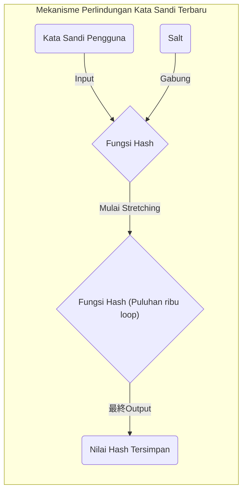

Konsep yang tidak dapat dihindari saat mempelajari ilmu komputer, keamanan informasi, dan kriptografi adalah **"Prinsip Sarang Merpati (Pigeonhole Principle)"** dan **"Kolisi Hash (Hash Collision)"**.
Prinsip Sarang Merpati itu sendiri sangat sederhana, ia hanya menyatakan hal yang sangat jelas dan dapat dipahami secara intuitif bahkan oleh anak sekolah dasar. Namun, meskipun tampaknya seperti prinsip matematika yang sederhana, dampaknya pada desain keamanan fungsi hash dan sistem kriptografi yang mendasari masyarakat internet modern sangatlah besar.

Dalam artikel ini, kita akan mulai dari konsep dasar Prinsip Sarang Merpati, mekanisme kolisi hash, dampaknya pada kompleksitas komputasi melalui paradoks ulang tahun, studi kasus kolisi nyata pada algoritma kriptografi masa lalu (seperti SHA-1), hingga penerapannya untuk evaluasi keamanan teknologi kriptografi di masa depan. Semuanya akan dibahas secara detail dengan menyertakan rumus matematika dan diagram.

## 1. Dasar-dasar Prinsip Sarang Merpati (Pigeonhole Principle)

**"Prinsip Sarang Merpati"** (juga dikenal sebagai Prinsip Kotak Dirichlet, atau Argumen Laci) adalah konsep yang dikemukakan dengan jelas oleh matematikawan abad ke-19, Peter Gustav Lejeune Dirichlet, dan didefinisikan sebagai berikut:

> Jika $n$ ekor merpati dimasukkan ke dalam $m$ buah sarang, dan $n > m$, maka setidaknya ada satu sarang yang berisi dua ekor merpati atau lebih.

Sebagai contoh, anggaplah ada 10 ekor merpati yang dimasukkan ke dalam 9 buah sarang. Seberapapun kerasnya kita berusaha untuk membagi merpati-merpati tersebut secara merata, pasti akan ada setidaknya satu sarang yang ditempati oleh dua ekor merpati atau lebih. Hal ini sangat intuitif dan rasanya terlalu jelas untuk dibuktikan, namun ketika diformulasikan secara matematis, ia menjadi alat yang sangat kuat untuk pembuktian eksistensial.

### Contoh Konkret dalam Kehidupan Sehari-hari

Selain merpati dan sarang, prinsip ini juga dapat diterapkan pada berbagai kejadian sehari-hari.

* **Jumlah Rambut**: Dikatakan bahwa jumlah helai rambut manusia paling banyak adalah sekitar 200 ribu helai. Populasi Tokyo adalah sekitar 14 juta jiwa. Oleh karena itu, di Tokyo pasti ada **"dua orang dengan jumlah helai rambut yang sama persis"** (Merpati = populasi Tokyo, Sarang = variasi jumlah helai rambut).
* **Bulan Lahir**: Jika ada 13 orang yang berkumpul, pasti ada setidaknya 2 orang yang memiliki bulan lahir yang sama (Merpati = 13 orang, Sarang = 12 bulan).

### Representasi Ketat dalam Rumus (KaTeX)

Mari kita representasikan prinsip ini secara matematis menggunakan teori himpunan dan pemetaan.
Misalkan jumlah elemen himpunan berhingga $A$ adalah $|A|$, dan jumlah elemen himpunan berhingga $B$ adalah $|B|$. Asumsikan ada sebuah fungsi (pemetaan) $f: A \rightarrow B$ dari himpunan $A$ ke himpunan $B$.
Jika $|A| > |B|$, maka fungsi $f$ tidak mungkin bersifat "Injektif (Injective)". Injektif adalah sifat di mana input yang berbeda selalu menghasilkan output yang berbeda.
Artinya, pasti ada elemen berbeda $x, y \in A$ yang memenuhi kondisi berikut:

$$
\exists x, y \in A \quad (x \neq y \land f(x) = f(y))
$$

Sifat inilah yang menjadi rumus yang menjelaskan penyebab mendasar dari **"Kolisi Hash"** dalam ilmu informasi yang akan dibahas kemudian.

## 2. Fungsi Hash dan Mekanisme Kolisi Hash

### Apa itu Fungsi Hash Kriptografis?

**Fungsi Hash** adalah fungsi yang menerima data input dengan panjang berapapun (pesan, file, kata sandi, dll.) dan mengubahnya menjadi data output dengan panjang tetap (nilai hash, digest). Contoh fungsi hash kriptografis yang representatif dan banyak digunakan saat ini adalah SHA-256 dan SHA-3.

Fungsi hash yang digunakan dalam teknologi kriptografi umumnya dituntut untuk memenuhi tiga persyaratan keamanan yang ketat berikut:

1. **Ketahanan Pratindasan (Pre-image resistance)**: Sangat sulit untuk menghitung (merekonstruksi) data input asli dari nilai hash yang dihasilkan.
2. **Ketahanan Pratindasan Kedua (Second pre-image resistance)**: Ketika sebuah data input tertentu diberikan, sangat sulit untuk menemukan "data input lain" yang memiliki nilai hash yang sama persis.
3. **Ketahanan Kolisi (Collision resistance)**: Sangat sulit untuk menemukan dua pasang data input berbeda secara sembarang yang menghasilkan nilai hash yang sama.

### "Keniscayaan Kolisi" Dilihat dari Prinsip Sarang Merpati

Sekarang, mari kita terapkan Prinsip Sarang Merpati tadi pada fungsi hash.

* **Merpati**: Himpunan data input. Karena kombinasi isi file atau teks bisa tak terbatas, maka jumlah elemen $|A|$ secara praktis adalah "tak terhingga".
* **Sarang**: Himpunan nilai hash. Karena nilai hash memiliki panjang tetap, maka jumlah elemen $|B|$ adalah "terbatas".

Sebagai contoh, output dari SHA-256, yang digunakan dalam teknologi blockchain seperti [Bitcoin](https://kenji.blog/id/p/cryptocurrency-and-bitcoin/), adalah 256 bit. Dengan demikian, jenis nilai hash yang mungkin dihasilkan ada sebanyak $2^{256}$ (sekitar $1.15 \times 10^{77}$). Meskipun ini adalah angka yang sangat besar dan mendekati total jumlah atom di alam semesta yang dapat diamati, pada akhirnya angka ini adalah **terbatas**.

Di sisi lain, variasi dokumen atau file gambar yang dapat dianggap sebagai data input jumlahnya **tak terbatas**.
Oleh karena itu, karena pertidaksamaan "Total data input" > "Total nilai hash" selalu benar, berdasarkan Prinsip Sarang Merpati, **pasti akan ada dua data input berbeda yang menghasilkan nilai hash yang sama**. Fenomena inilah yang disebut dengan **"Kolisi Hash (Hash Collision)"**.

Diagram Mermaid di bawah ini menunjukkan bagaimana data tak terbatas dipetakan ke dalam ruang hash yang terbatas.

```mermaid
graph TD
    subgraph "Ruang Input Tak Terbatas (Merpati)"
        A("Data A")
        B("Data B")
        C("Data C")
        D("Data D")
        E("...")
    end

    subgraph "Fungsi Hash"
        H{"Hash(x)"}
    end

    subgraph "Ruang Hash Terbatas (Sarang)"
        V1("Hash("A")")
        V2("Hash("B") = Hash("C")")
        V3("Hash("D")")
    end

    A -->|"Hashing"| H
    B -->|"Hashing"| H
    C -->|"Hashing"| H
    D -->|"Hashing"| H

    H -->|"Output"| V1
    H -->|"Output（衝突）"| V2
    H -->|"Output"| V3

    style V2 fill:#ffcccc,stroke:#ff0000,stroke-width:3px;
```

Pada diagram di atas, "Data B" dan "Data C" yang dimasukkan dialokasikan ke nilai hash yang sama persis melalui fungsi, dan area yang ditandai dengan kotak merah menunjukkan tepat terjadinya kolisi (Collision).

## 3. Serangan Ulang Tahun (Birthday Attack) dan Ancaman Peluang Kolisi

Dari Prinsip Sarang Merpati, jelas bahwa kolisi hash secara teoretis tidak dapat dihindari, namun muncul pertanyaan praktis: "Lalu, seberapa sulitkah untuk benar-benar menemukan kolisi tersebut?" Di sinilah muncul **"Paradoks Ulang Tahun (Birthday Paradox)"** dan **"Serangan Ulang Tahun (Birthday Attack)"** yang memanfaatkan sifat matematisnya.

### Apa itu Paradoks Ulang Tahun?

Ada masalah probabilitas yang terkenal: "Berapa banyak orang yang harus dikumpulkan agar peluang ada 2 orang dengan hari ulang tahun yang sama melebihi 50%?"
Satu tahun memiliki 365 hari, sehingga menurut Prinsip Sarang Merpati, kita dapat mengatakan dengan pasti (peluang 100%) bahwa akan ada orang yang memiliki hari ulang tahun yang sama jika ada 366 orang yang berkumpul. Namun, yang mengejutkan, peluang tersebut melebihi 50% ketika hanya **23 orang** yang berkumpul. Alasan mengapa hal ini disebut paradoks adalah karena "kolisi" dapat terjadi dengan jumlah orang yang jauh lebih sedikit daripada intuisi manusia.

### Penerapan pada Kolisi Hash dan Pembuktian Matematis

Misalkan ukuran ruang nilai hash adalah $N$ (misalnya, $N = 2^{256}$ untuk SHA-256). Mari kita hitung peluang $P$ bahwa setidaknya akan terjadi satu kolisi ketika kita secara acak menghasilkan $k$ data input dan menghitung nilai hashnya.

Peluang bahwa semua input memiliki nilai hash yang berbeda (dengan kata lain, peluang bahwa tidak ada kolisi sama sekali) dihitung sebagai berikut:

$$
1 \times \left(1 - \frac{1}{N}\right) \times \left(1 - \frac{2}{N}\right) \times \cdots \times \left(1 - \frac{k-1}{N}\right)
$$

Dengan menggunakan rumus hampiran Ekspansi Taylor $1 - x \approx e^{-x}$, peluang terjadinya kolisi $P$ dapat dihampiri sebagai berikut:

$$
P \approx 1 - e^{-\frac{k(k-1)}{2N}} \approx 1 - e^{-\frac{k^2}{2N}}
$$

Untuk menemukan jumlah percobaan $k$ agar peluang kolisi menjadi 50% ($P = 0.5$), kita menyelesaikan persamaan berikut:

$$
0.5 = e^{-\frac{k^2}{2N}} \implies \ln(0.5) = -\frac{k^2}{2N} \implies k \approx \sqrt{2 \ln 2 \cdot N} \approx 1.177 \sqrt{N}
$$

Hasil ini sangat penting. Jika ruang output nilai hash adalah $N$, ini berarti dengan melakukan komputasi sekitar $\sqrt{N}$ kali (yaitu $N^{0.5}$ kali), peluang menemukan kolisi hash akan melebihi 50%.

Untuk SHA-256, ruang outputnya adalah $2^{256}$, tetapi dengan menggunakan serangan ulang tahun, jumlah perhitungan untuk menemukan kolisi hash dapat direduksi menjadi $\sqrt{2^{256}} = 2^{128}$ kali. Angka $2^{128}$ adalah jumlah komputasi yang astronomis sehingga akan memakan waktu lebih lama dari umur alam semesta bahkan jika semua superkomputer modern dikerahkan. Oleh karena itu, SHA-256 saat ini masih dianggap aman (memenuhi syarat ketahanan kolisi).

## 4. Sejarah Kolisi Hash di Dunia Nyata: SHAttered

Selain secara teori, terdapat juga contoh historis di mana kolisi hash berhasil dibuktikan di dunia nyata.

Dulu, ada fungsi hash bernama **"SHA-1"** (160 bit) yang banyak digunakan untuk memverifikasi sertifikat SSL situs web dan integritas file. Karena panjang outputnya adalah 160 bit, maka diperlukan $2^{80}$ kali komputasi untuk pencarian kolisi secara teoretis.

Namun, pada tahun 2017, tim peneliti gabungan dari Google dan Institut Nasional Matematika dan Ilmu Komputer di Amsterdam (CWI) mengumumkan teknik serangan yang disebut **"SHAttered"**. Dengan mengaplikasikan kemajuan dalam teknik kriptanalisis, mereka berhasil menemukan kolisi pada SHA-1 dengan kompleksitas komputasi sebesar $2^{63.1}$ kali.

Mereka memublikasikan, untuk pertama kalinya di dunia, **dua file PDF yang memiliki nilai hash SHA-1 yang sama persis**, meskipun isinya benar-benar berbeda (satu adalah dokumen normal, dan yang lainnya adalah dokumen berbahaya). Akibat insiden ini, masa pakai SHA-1 sebagai "fungsi hash yang aman" berakhir, dan migrasi industri secara keseluruhan ke SHA-2 (seperti SHA-256) diputuskan.

```mermaid
graph LR
    subgraph "Serangan SHAttered (2017)"
        F1("Kontrak PDF Normal")
        F2("Kontrak PDF Berbahaya")
        H{"SHA-1 Fungsi Hash"}
        V("Nilai Hash Sama\n("38762cf7f55934b34d179ae6a4c80cadccbb7f0a")")
    end

    F1 -->|"Input"| H
    F2 -->|"Input"| H
    H -->|"Output"| V
```

Dengan demikian, seiring dengan terobosan matematika dan evolusi komputer, algoritma kriptografi ditakdirkan untuk semakin melemah.

## 5. Prinsip Sarang Merpati pada Struktur Data: Tabel Hash

Di luar teknologi kriptografi, Prinsip Sarang Merpati dan kolisi hash juga menjadi tema penting. Salah satu contoh utamanya adalah **"Tabel Hash ([Hash Table](https://kenji.blog/id/p/search-algorithms-linear-binary-hash-table-principles/) / Dictionary)"** yang sering digunakan dalam pemrograman.

Dalam tabel hash, nilai hash dihitung dari sebuah key (kunci), dan nilai hash tersebut digunakan sebagai indeks array untuk menyimpan suatu nilai (value). "Kolisi" tak terhindarkan terjadi di mana kunci yang berbeda akan mengarah ke indeks yang sama, baik ketika kita mencoba menyimpan lebih banyak data (merpati) daripada ukuran array (sarang), ataupun karena ada kecenderungan tertentu dalam fungsi hash itu sendiri.

Untuk menyelesaikan kolisi ini, algoritma seperti berikut digunakan:

* **Chaining**: Elemen yang bertabrakan disimpan dalam bucket yang sama dengan menghubungkannya menggunakan linked list (senarai berantai).
* **Open Addressing**: Ketika terjadi kolisi, algoritma mencari "bucket kosong lain" sesuai dengan aturan tertentu dan menyimpan elemen di sana.

Di balik layar bahasa pemrograman (seperti `dict` di Python atau `HashMap` di [Java](https://kenji.blog/id/p/programming-languages-history-paradigm-evolution/)), digunakan teknik-teknik tingkat tinggi untuk menangani kolisi yang disebabkan oleh Prinsip Sarang Merpati ini dengan sangat cepat dan efisien.

## 6. Menjamin Keamanan Kriptografi dan Masa Depan

Karena secara teoretis tidak mungkin untuk membuat "fungsi hash yang tidak akan pernah bertabrakan" berdasarkan Prinsip Sarang Merpati, maka dunia keamanan informasi mengambil pendekatan: **"Merancangnya sedemikian rupa sehingga kolisi tidak akan pernah dapat ditemukan dalam batasan waktu dan sumber daya komputasi yang realistis"**.

### Menjaga Margin Keamanan

Langkah perlindungan terbesar adalah membuat panjang bit dari nilai hash cukup panjang.
Dengan memperpanjang jumlah bit, jumlah komputasi yang dibutuhkan untuk menyerang akan meningkat secara eksponensial.

| Algoritma | Panjang Output $n$ | Kompleksitas Pencarian Kolisi $2^{n/2}$ | Status Saat Ini |
|---|---|---|---|
| MD5 | 128 bit | $2^{64}$ | Sepenuhnya hancur (Tidak disarankan) |
| SHA-1 | 160 bit | $2^{80}$ | Hancur (Tidak disarankan) |
| SHA-256 | 256 bit | $2^{128}$ | Praktis aman |
| SHA-512 | 512 bit | $2^{256}$ | Sangat aman |
| SHA-3 (Keccak) | 256/512 bit | $2^{128} / 2^{256}$ | Sangat aman (Strukturnya berbeda) |

Dalam memilih teknologi kriptografi, penting untuk mengantisipasi peningkatan performa komputer penyerang (seperti Hukum Moore) dan munculnya komputer kuantum di masa depan, sehingga algoritma dengan **"Margin Keamanan"** yang cukup memadai mutlak dipilih.

### Perlindungan Kata Sandi Melalui Salt dan Stretching

Selain itu, meski sifatnya sedikit berbeda dari kolisi hash, ada juga langkah pencegahan penting terhadap kebocoran kata sandi. Sekadar melakukan hashing pada kata sandi tidaklah berdaya menghadapi serangan yang menggunakan basis data besar berisi nilai hash yang sudah dihitung sebelumnya (Rainbow Table).

Untuk mencegah hal ini, diterapkan string acak berupa **"Salt"** untuk setiap kata sandi sebelum dilakukan hashing, atau menggunakan teknik yang disebut **"Stretching"** di mana kalkulasi hash sengaja diulang ribuan hingga puluhan ribu kali (menggunakan fungsi turunan kunci seperti PBKDF2, bcrypt, dan Argon2).



Dengan cara ini, biaya yang harus dikeluarkan penyerang untuk melakukan komputasi ditingkatkan secara sengaja, sehingga membuat serangan *brute force* menjadi tidak realistis.

## 7. Kesimpulan

Pada artikel kali ini, kami telah menjelaskan bagaimana teorema matematika yang sederhana dan intuitif yakni **"Prinsip Sarang Merpati"** menyebabkan fenomena **"Kolisi Hash"** yang tak terhindarkan, serta dampaknya terhadap perancangan keamanan pada teknologi kriptografi.

* **Keniscayaan Prinsip Sarang Merpati**: Fungsi hash dengan input tak terbatas dan output terbatas pasti secara matematis memiliki kolisi.
* **Ancaman Serangan Ulang Tahun**: Karena paradoks ulang tahun, kolisi untuk ruang nilai hash $N$ dapat ditemukan hanya dalam jumlah komputasi sekitar $\sqrt{N}$ kali.
* **Filosofi Desain Kriptografi Modern**: Karena mengurangi peluang kolisi menjadi nol adalah hal yang mustahil, kita membuat penemuan kolisi tidak memungkinkan secara komputasi dengan membuat panjang output cukup besar.

Pemahaman yang mendalam tentang prinsip-prinsip ini berkaitan langsung dengan pemahaman tentang fondasi sistem keamanan modern seperti blockchain, tanda tangan digital, dan manajemen kata sandi.
Teknologi kriptografi yang pada pandangan pertama mungkin terlihat rumit dan sulit dimengerti ternyata menyembunyikan probabilitas dan prinsip yang sangat dekat dengan kita, seperti "Merpati dan Sarangnya" atau "Ulang Tahun". Itulah hal yang paling dalam dan menarik dari ilmu komputer.
