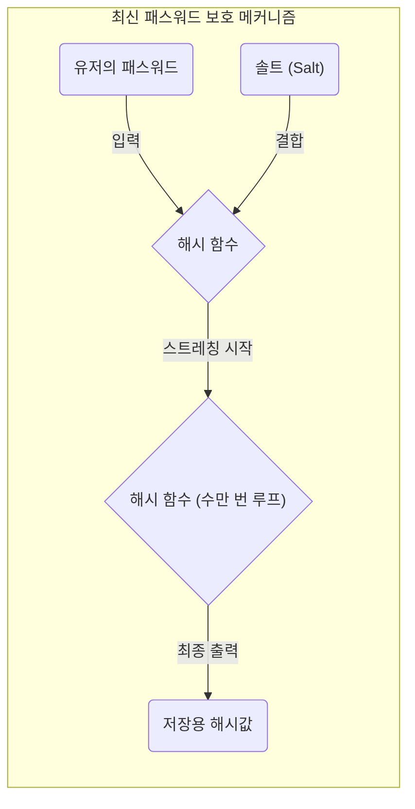

컴퓨터 사이언스나 정보 보안, 암호 기술을 배울 때 피해갈 수 없는 것이 ' ** 비둘기집 원리(Pigeonhole Principle) ** '와 ' ** 해시 충돌(Hash Collision) ** '이라는 개념입니다.
비둘기집 원리 자체는 매우 심플해서 초등학생도 직관적으로 이해할 수 있을 만큼 당연한 것을 말하고 있을 뿐입니다. 그러나 이 언뜻 보기에 단순한 수학 원리가 현대의 인터넷 사회를 근저에서 받쳐주는 해시 함수나 암호 시스템의 안전성 설계에 미치는 영향은 헤아릴 수 없습니다.

본 기사에서는 비둘기집 원리의 기초적인 사고방식에서 시작하여 해시 충돌의 메커니즘, 생일 역설에 의한 계산량에 대한 영향, 과거의 암호 알고리즘(SHA-1 등)에서의 실제 충돌 사례, 그리고 미래의 암호 기술을 향한 안전성 평가에 대한 응용까지 수식과 도해를 섞어 자세히 해설해 나가겠습니다.

## 1. 비둘기집 원리(Pigeonhole Principle)의 기초

' ** 비둘기집 원리 ** '(디리클레의 상자 원리 혹은 서랍 논법이라고도 불립니다)는 19세기 수학자 페터 구스타프 디리클레에 의해 명확화된 개념이며 다음과 같이 정의됩니다.

> $n$ 마리의 비둘기가 $m$ 개의 집에 들어갈 때 $n > m$ 이라면 최소한 1개의 집에는 2마리 이상의 비둘기가 들어 있다.

예를 들어 10마리의 비둘기가 9개의 집에 들어간다고 합시다. 비둘기를 아무리 균등하게 배정하려고 노력해도 반드시 어딘가 1개의 집에는 2마리 이상의 비둘기가 동거하게 됩니다. 매우 직관적이어서 굳이 증명할 필요도 없는 당연한 것처럼 보이지만, 이것을 수학적으로 정식화하면 존재 증명을 위한 매우 강력한 도구가 됩니다.

### 일상생활에서의 구체적 예시

비둘기와 집뿐만 아니라 이 원리는 다양한 일상의 사건에 적용될 수 있습니다.

*  ** 머리카락 수 ** : 인간의 머리카락 개수는 많아도 약 20만 개라고 합니다. 도쿄의 인구는 약 1400만 명입니다. 따라서 도쿄에는 ' ** 완전히 같은 머리카락 개수를 가진 2명의 인간 ** '이 반드시 존재합니다(비둘기=도쿄의 인구, 집=머리카락 개수의 패턴).
*  ** 태어난 달 ** : 13명의 사람이 모이면 최소 2명은 같은 달에 태어났습니다(비둘기=13명, 집=12개월).

### 수식(KaTeX)으로의 엄밀한 표현

이 원리를 집합론과 사상의 언어를 사용하여 수학적으로 표현해 봅시다.
유한 집합 $A$ 의 요소 수를 $|A|$ , 유한 집합 $B$ 의 요소 수를 $|B|$ 라고 하고, 집합 $A$ 에서 집합 $B$ 로의 함수(사상) $f: A \rightarrow B$ 가 존재한다고 합시다.
이때 $|A| > |B|$ 라면 함수 $f$ 는 '단사(Injective)'가 될 수 없습니다. 단사란 다른 입력이 반드시 다른 출력으로 연결되는 성질을 말합니다.
즉, 다음을 만족하는 서로 다른 요소 $x, y \in A$ 가 반드시 존재합니다.

$$
\exists x, y \in A \quad (x \neq y \land f(x) = f(y))
$$

이 성질이야말로 뒤에 설명할 정보과학에서의 ' ** 해시 충돌 ** '의 근본적인 원인을 설명하는 수식이 됩니다.

## 2. 해시 함수와 해시 충돌의 메커니즘

### 암호학적 해시 함수란?

** 해시 함수 ** 는 임의의 길이의 입력 데이터(메시지, 파일, 패스워드 등)를 받아 그것을 고정 길이의 출력 데이터(해시값, 다이제스트)로 변환하는 함수입니다. 대표적인 암호학적 해시 함수에는 현재 널리 사용되고 있는 SHA-256이나 SHA-3 등이 존재합니다.

암호 기술에서 사용되는 해시 함수에는 주로 다음 3가지의 엄밀한 보안 요건이 요구됩니다.

1.  ** 제1 역상 저항성(Pre-image resistance) ** : 출력된 해시값으로부터 원래의 입력 데이터를 역산(복원)하는 것이 극히 어려울 것.
2.  ** 제2 역상 저항성(Second pre-image resistance) ** : 어떤 특정한 입력 데이터가 주어졌을 때 그것과 같은 해시값을 가지는 '다른 입력 데이터'를 찾는 것이 극히 어려울 것.
3.  ** 충돌 저항성(Collision resistance) ** : 같은 해시값을 출력하는 2개의 서로 다른 입력 데이터 쌍을 임의로 찾는 것이 극히 어려울 것.

### 비둘기집 원리로 보는 '충돌의 필연성'

여기서 앞서 살펴본 비둘기집 원리를 해시 함수에 대입해 고찰해 봅시다.

*  ** 비둘기 ** : 입력 데이터의 집합. 파일 내용이나 문자열 조합은 무한하게 존재하므로 요소 수 $|A|$ 는 사실상 '무한대'입니다.
*  ** 집 ** : 해시값의 집합. 해시값은 고정 길이이므로 요소 수 $|B|$ 는 '유한'합니다.

예를 들어 [비트코인](https://kenji.blog/ko/p/cryptocurrency-and-bitcoin/) 등 블록체인 기술에서도 사용되는 SHA-256의 출력은 256비트입니다. 따라서 취할 수 있는 해시값의 종류는 $2^{256}$ 가지(약 $1.15 \times 10^{77}$ )가 됩니다. 이는 관측 가능한 우주에 존재하는 원자의 총수에 육박할 만큼 방대한 수이지만 어디까지나 ** 유한한 수 ** 입니다.

반면에 입력 데이터로서 생각할 수 있는 문장이나 이미지 파일의 바리에이션은 ** 무한 ** 히 존재합니다.
따라서 "입력 데이터의 총수" $>$ "해시값의 총수"라는 부등식이 성립하므로 비둘기집 원리에 의해 ** 반드시 같은 해시값이 되는 다른 2개의 입력 데이터가 존재 ** 하게 됩니다. 이것이 ' ** 해시 충돌(Hash Collision) ** '이라고 불리는 현상입니다.

아래의 Mermaid 다이어그램은 무한한 데이터가 유한한 해시 공간에 매핑되는 모습을 보여줍니다.

```mermaid
graph TD
    subgraph "무한한 입력 공간(비둘기)"
        A("데이터 A")
        B("데이터 B")
        C("데이터 C")
        D("데이터 D")
        E("...")
    end

    subgraph "해시 함수"
        H{"Hash(x)"}
    end

    subgraph "유한한 해시 공간(집)"
        V1("Hash("A")")
        V2("Hash("B") = Hash("C")")
        V3("Hash("D")")
    end

    A -->|"해시화"| H
    B -->|"해시화"| H
    C -->|"해시화"| H
    D -->|"해시화"| H

    H -->|"출력"| V1
    H -->|"출력(충돌)"| V2
    H -->|"출력"| V3

    style V2 fill:#ffcccc,stroke:#ff0000,stroke-width:3px;
```

위 그림에서는 입력된 '데이터 B'와 '데이터 C'가 함수를 통해 완전히 같은 해시값으로 할당되어 있으며, 빨간색 테두리로 표시된 부분이 바로 충돌(Collision)이 발생하고 있는 지점을 나타냅니다.

## 3. 생일 공격(Birthday Attack)과 충돌 확률의 위협

해시 충돌이 이론상 불가피하다는 것은 비둘기집 원리에서 명백해졌지만 '그렇다면 실제로 그 충돌을 찾는 것은 얼마나 어려운가?'라는 실천적인 의문이 생깁니다. 여기서 등장하는 것이 ' ** 생일 역설(Birthday Paradox) ** '과 그 수학적 성질을 악용한 ' ** 생일 공격(Birthday Attack) ** '입니다.

### 생일 역설이란

'몇 명이 모여야 그중에 생일이 같은 2명이 있을 확률이 50%를 넘을까?'라는 유명한 확률론 문제가 있습니다.
1년은 365일이므로 비둘기집 원리를 따르면 확실히(확률 100%로) 같은 생일인 사람이 있다고 말할 수 있는 것은 366명이 모였을 때입니다. 그러나 놀랍게도 확률이 50%를 넘는 것은 고작 ** 23명 ** 이 모였을 때입니다. 인간의 직관보다 훨씬 적은 인원으로 '충돌'이 일어날 수 있다는 것이 역설이라고 불리는 까닭입니다.

### 해시 충돌로의 응용과 수학적 증명

해시값 공간의 크기를 $N$ 이라고 합니다(예를 들어 SHA-256이라면 $N = 2^{256}$ ). 무작위로 $k$ 개의 입력 데이터를 생성하여 해시값을 계산했을 때 최소 1쌍의 충돌이 발생할 확률 $P$ 를 구해 보겠습니다.

모든 입력이 다른 해시값이 될 확률(즉 충돌이 전혀 일어나지 않을 확률)은 다음과 같이 계산됩니다.

$$
1 \times \left(1 - \frac{1}{N}\right) \times \left(1 - \frac{2}{N}\right) \times \cdots \times \left(1 - \frac{k-1}{N}\right)
$$

테일러 전개를 이용한 근사 공식 $1 - x \approx e^{-x}$ 를 이용하면 충돌이 일어날 확률 $P$ 는 다음과 같이 근사할 수 있습니다.

$$
P \approx 1 - e^{-\frac{k(k-1)}{2N}} \approx 1 - e^{-\frac{k^2}{2N}}
$$

충돌 확률이 50%( $P = 0.5$ )가 되는 시행 횟수 $k$ 를 구하기 위해 방정식을 풉니다.

$$
0.5 = e^{-\frac{k^2}{2N}} \implies \ln(0.5) = -\frac{k^2}{2N} \implies k \approx \sqrt{2 \ln 2 \cdot N} \approx 1.177 \sqrt{N}
$$

이 결과는 매우 중요합니다. 해시값의 출력 공간이 $N$ 인 경우, 대략 $\sqrt{N}$ 번(즉 $N^{0.5}$ 번) 정도의 계산을 수행하면 해시 충돌을 찾을 수 있는 확률이 50%를 넘는다는 것을 의미하고 있습니다.

SHA-256의 경우 출력 공간은 $2^{256}$ 이지만 생일 공격을 이용하면 $\sqrt{2^{256}} = 2^{128}$ 번의 계산으로 해시 충돌을 찾을 수 있다는 계산이 됩니다. $2^{128}$ 이라는 계산 횟수는 현대의 슈퍼컴퓨터를 총동원해도 우주의 수명 이상의 시간이 걸릴 만큼 천문학적인 숫자이기 때문에 SHA-256은 현재로서는 안전하다(충돌 저항성을 만족한다)고 간주되고 있습니다.

## 4. 현실 세계에서의 해시 충돌의 역사: SHAttered

이론상의 이야기뿐만 아니라 현실 세계에서도 해시 충돌이 실증된 역사적인 사례가 존재합니다.

과거 웹사이트의 SSL 인증서나 파일 무결성 확인에 널리 쓰이던 ' ** SHA-1 ** '(160비트)이라는 해시 함수가 있습니다. 출력 길이가 160비트이므로 이론상의 충돌 탐색에는 $2^{80}$ 번의 계산이 필요하다고 여겨졌습니다.

그러나 2017년에 구글과 암스테르담 국립 수학 정보학 연구소(CWI)의 연구팀이 ' ** SHAttered ** '라고 불리는 공격 수법을 발표했습니다. 그들은 암호 해독 기술의 진보를 응용하여 $2^{63.1}$ 번의 계산량으로 SHA-1의 충돌을 발견하는 데 성공한 것입니다.

그들은 내용은 전혀 다름(하나는 정상적인 문서, 다른 하나는 악의적인 문서)에도 불구하고 ** SHA-1 해시값이 완전히 일치하는 2개의 PDF 파일 ** 을 세계 최초로 공개했습니다. 이 사건으로 인해 SHA-1은 '안전한 해시 함수'로서의 수명을 다했고, 업계 전체에서 SHA-2(SHA-256 등)로의 이행이 결정되었습니다.

```mermaid
graph LR
    subgraph "SHAttered 공격(2017년)"
        F1("정상적인 PDF 계약서")
        F2("악의적인 PDF 계약서")
        H{"SHA-1 해시 함수"}
        V("동일한 해시값\n("38762cf7f55934b34d179ae6a4c80cadccbb7f0a")")
    end

    F1 -->|"입력"| H
    F2 -->|"입력"| H
    H -->|"출력"| V
```

이처럼 암호 알고리즘은 수학적인 돌파구나 컴퓨터의 진화에 의해 서서히 약화되어 가는 운명에 있습니다.

## 5. 데이터 구조에서의 비둘기집 원리: 해시 테이블

암호 기술 이외의 분야에서도 [비둘기집 원리와 해시 충돌](https://kenji.blog/ko/p/pigeonhole-principle-hash-collision/)은 중요한 테마입니다. 프로그래밍에서 빈번하게 사용되는 ' ** 해시 테이블(연관 배열이나 딕셔너리형) ** '이 그 대표적인 예입니다.

해시 테이블에서는 키로부터 해시값을 계산하고 그것을 배열의 인덱스로서 값을 저장합니다. 배열의 크기(집)보다 많은 데이터(비둘기)를 저장하려고 하거나 해시 함수에 편향이 있으면 다른 키가 같은 인덱스를 가리키게 되는 '충돌'이 필연적으로 발생합니다.

이 충돌을 해결하기 위해 다음과 같은 알고리즘이 내장되어 있습니다.

*  ** 체이닝 기법(Chaining) ** : 충돌한 요소를 연결 리스트(Linked List)로 이어 같은 버킷에 저장한다.
*  ** 개방 주소 지정법(Open Addressing) ** : 충돌이 발생한 경우 특정 규칙에 따라 '비어 있는 다른 버킷'을 찾아 저장한다.

프로그래밍 언어(Python의 `dict` 나 [Java](https://kenji.blog/ko/p/programming-languages-history-paradigm-evolution/)의 `HashMap` 등)의 이면에서는 비둘기집 원리에 의해 야기되는 충돌을 어떻게 고속으로 효율적으로 처리할 것인가 하는 고도화된 고안이 응집되어 있습니다.

## 6. 암호 기술에서의 안전성 확보와 미래

비둘기집 원리에 의해 '절대로 충돌하지 않는 해시 함수'를 만드는 것이 불가능한 이상, 정보 보안 세계에서는 ' ** 현실적인 시간과 계산 자원으로는 결코 충돌을 찾을 수 없게 설계한다 ** '는 접근법을 취하고 있습니다.

### 보안 마진 확보

최대의 방어책은 해시값의 비트 길이를 충분히 길게 하는 것입니다.
비트 길이를 길게 하면 공격에 필요한 계산량은 지수 함수적으로 증대합니다.

| 알고리즘 | 출력 길이 $n$ | 충돌 탐색 계산량 $2^{n/2}$ | 현재 스테이터스 |
|---|---|---|---|
| MD5 | 128 bit | $2^{64}$ | 완전히 파탄(비권장) |
| SHA-1 | 160 bit | $2^{80}$ | 파탄(비권장) |
| SHA-256 | 256 bit | $2^{128}$ | 실용상 안전 |
| SHA-512 | 512 bit | $2^{256}$ | 매우 안전 |
| SHA-3 (Keccak) | 256/512 bit | $2^{128} / 2^{256}$ | 매우 안전(구조가 다름) |

암호 기술의 선정에 있어서는 공격자의 컴퓨터 성능 향상(무어의 법칙 등)이나 미래의 양자 컴퓨터의 대두를 예측하여 충분한 ' ** 보안 마진 ** '을 가진 알고리즘을 선택하는 것이 필수 불가결합니다.

### 솔트(Salt)와 스트레칭에 의한 패스워드 보호

또한 해시 충돌과는 조금 성질이 다르지만 패스워드 유출 대책에 있어서도 중요한 궁리가 있습니다. 패스워드를 단순히 해시화하는 것만으로는 미리 계산된 해시값의 거대한 데이터베이스(레인보우 테이블)를 이용한 공격에 대해 무력합니다.

이를 막기 위해 패스워드마다 랜덤한 문자열인 ' ** 솔트(Salt) ** '를 부여하여 해시화하거나 해시 계산을 수천 번에서 수만 번 의도적으로 반복하는 ' ** 스트레칭(Stretching) ** '이라고 불리는 처리를 수행하기도 합니다(PBKDF2, bcrypt, Argon2 등의 키 유도 함수).



이를 통해 공격자가 계산해야 하는 비용을 의도적으로 끌어올려 무차별 대입 공격을 비현실적인 것으로 만들고 있습니다.

## 7. 정리

이번에는 ' ** 비둘기집 원리 ** '라는 심플하고 직관적인 수학적 정리가 어떻게 ' ** 해시 충돌 ** '이라는 현상을 필연적으로 야기하고 그것이 암호 기술의 안전성 설계에 어떤 영향을 주고 있는지 해설했습니다.

*  ** 비둘기집 원리의 필연성 ** : 입력이 무한이고 출력이 유한한 해시 함수에는 수학적으로 반드시 충돌이 존재한다.
*  ** 생일 공격의 위협 ** : 생일 역설로 인해 해시값의 공간 $N$ 에 대해 겨우 $\sqrt{N}$ 번 정도의 계산으로 충돌이 발견될 가능성이 있다.
*  ** 현대 암호의 설계 사상 ** : 충돌을 제로로 만드는 것은 불가능하므로 출력 길이를 충분히 크게 함으로써 계산량적으로 충돌 발견을 불가능하게 한다.

이러한 원리를 깊이 이해하는 것은 블록체인, 디지털 서명, 패스워드 관리와 같은 현대 보안 시스템의 근저를 이해하는 것에 직결됩니다.
언뜻 보기에 난해하고 복잡해 보이는 암호 기술도 그 근본에는 '비둘기와 집'이나 '생일'과 같은 우리에게 친숙한 원리나 확률론이 숨어 있다는 것은 정보과학의 매우 깊고 재미있는 부분입니다.
