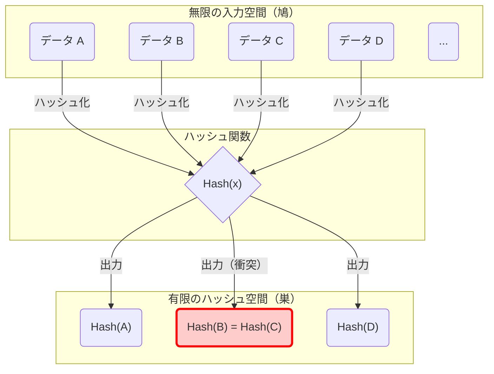
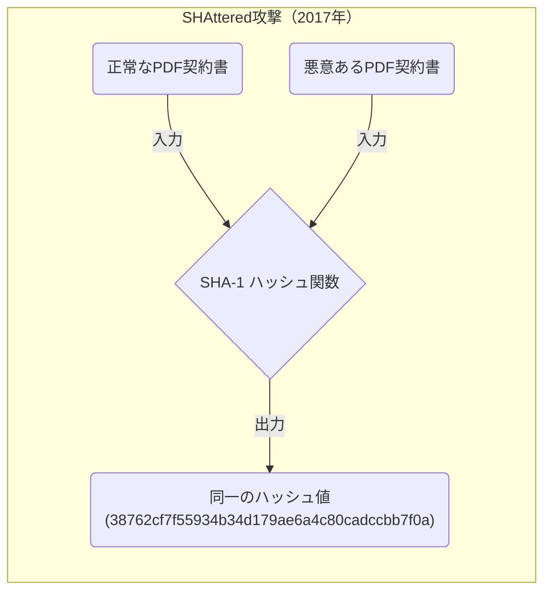
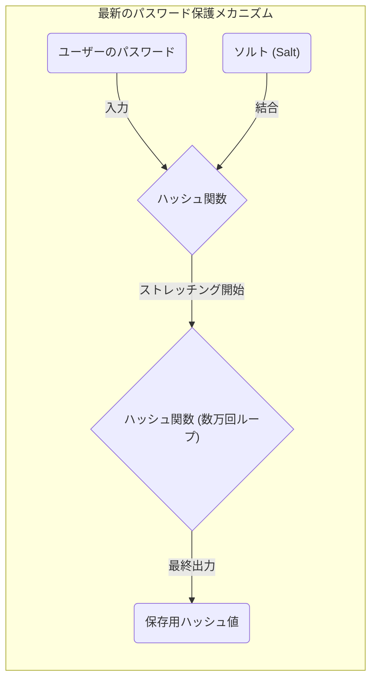

コンピュータサイエンスや情報セキュリティ、暗号技術を学ぶ上で避けて通れないのが 「 **鳩の巣原理（Pigeonhole Principle）** 」 と 「 **ハッシュ衝突（Hash Collision）** 」 という概念です。
鳩の巣原理自体は非常にシンプルで、小学生でも直感的に理解できるほど当たり前のことを言っているに過ぎません。しかし、この一見単純な数学の原理が、現代のインターネット社会を根底から支えるハッシュ関数や暗号システムの安全性設計に及ぼす影響は計り知れません。

本記事では、鳩の巣原理の基礎的な考え方から始まり、ハッシュ衝突のメカニズム、誕生日のパラドックスによる計算量への影響、過去の暗号アルゴリズム（SHA-1など）における実際の衝突事例、そして未来の暗号技術に向けた安全性評価への応用まで、数式や図解を交えながら詳細に解説していきます。

## 1. 鳩の巣原理（Pigeonhole Principle）の基礎

「 **鳩の巣原理** 」 （ディリクレの箱入れ原理、あるいは引き出し論法とも呼ばれます）は、19世紀の数学者ペーター・グスタフ・ディリクレによって明確化された概念であり、次のように定義されます。

> $n$ 羽の鳩が $m$ 個の巣に入るとき、$n > m$ であれば、少なくとも1つの巣には2羽以上の鳩が入っている。

例えば、10羽の鳩が9個の巣に入るとします。鳩をどれほど均等に割り当てようと努力したとしても、必ずどこか1つの巣には2羽以上の鳩が同居することになります。非常に直感的で、わざわざ証明するまでもない当たり前のことのように思えますが、これを数学的に定式化すると、存在証明のための非常に強力なツールとなります。

### 日常生活における具体例

鳩と巣だけでなく、この原理は様々な日常の事象に当てはめることができます。

*  **髪の毛の数** ：人間の髪の毛の本数は多くても約20万本と言われています。東京の人口は約1400万人です。したがって、東京には 「 **全く同じ髪の毛の本数を持つ2人の人間** 」 が必ず存在します（鳩＝東京の人口、巣＝髪の毛の本数のパターン）。
*  **誕生月** ：13人の人が集まれば、少なくとも2人は同じ誕生月です（鳩＝13人、巣＝12ヶ月）。

### 数式（KaTeX）での厳密な表現

この原理を集合論と写像の言葉を用いて数学的に表現してみましょう。
有限集合 $A$ の要素数を $|A|$ 、有限集合 $B$ の要素数を $|B|$ とし、集合 $A$ から集合 $B$ への関数（写像） $f: A \rightarrow B$ が存在するとします。
このとき、 $|A| > |B|$ であれば、関数 $f$ は「単射（Injective）」になり得ません。単射とは、異なる入力が必ず異なる出力に結びつく性質のことです。
つまり、次を満たすような相異なる要素 $x, y \in A$ が必ず存在します。

$$
\exists x, y \in A \quad (x \neq y \land f(x) = f(y))
$$

この性質こそが、後述する情報科学における 「 **ハッシュ衝突** 」 の根本的な原因を説明する数式となります。

## 2. ハッシュ関数とハッシュ衝突のメカニズム

### 暗号学的ハッシュ関数とは？

 **ハッシュ関数** は、任意の長さの入力データ（メッセージ、ファイル、パスワードなど）を受け取り、それを固定長の出力データ（ハッシュ値、ダイジェスト）に変換する関数です。代表的な暗号学的ハッシュ関数には、現在広く用いられている SHA-256 や SHA-3 などが存在します。

暗号技術において用いられるハッシュ関数には、主に以下の3つの厳密なセキュリティ要件が求められます。

1.  **第一原像計算困難性（Pre-image resistance）** ：出力されたハッシュ値から、元の入力データを逆算（復元）することが極めて困難であること。
2.  **第二原像計算困難性（Second pre-image resistance）** ：ある特定の入力データが与えられたとき、それと同じハッシュ値を持つ「別の入力データ」を見つけることが極めて困難であること。
3.  **衝突発見困難性（Collision resistance）** ：同じハッシュ値を出力するような、2つの異なる入力データのペアを任意に見つけることが極めて困難であること。

### 鳩の巣原理から見る「衝突の必然性」

ここで、先ほどの鳩の巣原理をハッシュ関数に当てはめて考察してみましょう。

*  **鳩** ：入力データの集合。ファイルの内容や文字列の組み合わせは無限に存在するため、要素数 $|A|$ は事実上「無限大」です。
*  **巣** ：ハッシュ値の集合。ハッシュ値は固定長であるため、要素数 $|B|$ は「有限」です。

例えば、[ビットコイン](https://kenji.blog/p/cryptocurrency-and-bitcoin/)などの[ブロックチェーン](https://kenji.blog/p/blockchain-technology-smart-contract-distributed-ledger/)技術でも使われている SHA-256 の出力は256ビットです。したがって、取り得るハッシュ値の種類は $2^{256}$ 通り（約 $1.15 \times 10^{77}$ ）となります。これは観測可能な宇宙に存在する原子の総数に迫るほど膨大な数ですが、あくまで **有限の数** です。

一方で、入力データとして考えられる文章や画像ファイルのバリエーションは **無限** に存在します。
したがって、「入力データの総数」 $>$ 「ハッシュ値の総数」という不等式が成立するため、鳩の巣原理により、 **必ず同じハッシュ値になる異なる2つの入力データが存在する** ことになります。これが 「 **ハッシュ衝突（Hash Collision）** 」 と呼ばれる現象です。

以下の Mermaid 図は、無限のデータが有限のハッシュ空間にマッピングされる様子を示しています。

上記の図では、入力された「データB」と「データC」が関数を通じて全く同じハッシュ値に割り当てられており、赤い枠で示された部分がまさに衝突（Collision）が発生している箇所を示しています。

## 3. 誕生日攻撃（Birthday Attack）と衝突確率の脅威

ハッシュ衝突が理論上避けられないことは鳩の巣原理から明らかになりましたが、「では、実際にその衝突を見つけるのはどれくらい難しいのか？」という実践的な疑問が生じます。ここで登場するのが 「 **誕生日のパラドックス（Birthday Paradox）** 」 と、その数学的性質を悪用した 「 **誕生日攻撃（Birthday Attack）** 」 です。

### 誕生日のパラドックスとは

「何人集まれば、その中に誕生日が同じ2人がいる確率が50%を超えるか？」という有名な確率論の問題があります。
1年は365日なので、鳩の巣原理に従えば、確実に（確率100%で）同じ誕生日の人がいると言えるのは366人集まったときです。しかし、驚くべきことに、確率が50%を超えるのは、わずか **23人** 集まったときなのです。人間の直感よりもはるかに少ない人数で「衝突」が起こり得ることが、パラドックスと呼ばれる所以です。

### ハッシュ衝突への応用と数学的証明

ハッシュ値の空間の大きさを $N$ とします（例えば SHA-256 なら $N = 2^{256}$ ）。ランダムに $k$ 個の入力データを生成してハッシュ値を計算したとき、少なくとも1組の衝突が発生する確率 $P$ を求めてみましょう。

すべての入力が異なるハッシュ値になる確率（つまり衝突が全く起きない確率）は、次のように計算されます。

$$
1 \times \left(1 - \frac{1}{N}\right) \times \left(1 - \frac{2}{N}\right) \times \cdots \times \left(1 - \frac{k-1}{N}\right)
$$

テイラー展開を用いた近似公式 $1 - x \approx e^{-x}$ を利用すると、衝突が起こる確率 $P$ は以下のように近似できます。

$$
P \approx 1 - e^{-\frac{k(k-1)}{2N}} \approx 1 - e^{-\frac{k^2}{2N}}
$$

衝突確率が50%（ $P = 0.5$ ）になるような試行回数 $k$ を求めるために、方程式を解きます。

$$
0.5 = e^{-\frac{k^2}{2N}} \implies \ln(0.5) = -\frac{k^2}{2N} \implies k \approx \sqrt{2 \ln 2 \cdot N} \approx 1.177 \sqrt{N}
$$

この結果は非常に重要です。ハッシュ値の出力空間が $N$ である場合、だいたい $\sqrt{N}$ 回（つまり $N^{0.5}$ 回）程度の計算を行えば、ハッシュ衝突を見つけられる確率が50%を超えることを意味しています。

SHA-256の場合、出力空間は $2^{256}$ ですが、誕生日攻撃を用いれば $\sqrt{2^{256}} = 2^{128}$ 回の計算でハッシュ衝突を見つけることができる計算になります。 $2^{128}$ という計算回数は、現代のスーパーコンピューターを総動員しても宇宙の寿命以上の時間がかかるほど天文学的な数字であるため、SHA-256 は現在のところ安全（衝突発見困難性を満たしている）とみなされています。

## 4. 現実世界におけるハッシュ衝突の歴史：SHAttered

理論上の話だけでなく、現実世界でもハッシュ衝突が実証された歴史的な事例が存在します。

かつてウェブサイトのSSL証明書やファイルの完全性確認に広く使われていた 「 **SHA-1** 」 （160ビット）というハッシュ関数があります。出力長が160ビットであるため、理論上の衝突探索には $2^{80}$ 回の計算が必要とされていました。

しかし、2017年にGoogleとアムステルダム国立数学情報学研究所（CWI）の研究チームが、「 **SHAttered** 」 と呼ばれる攻撃手法を発表しました。彼らは暗号解析技術の進歩を応用し、 $2^{63.1}$ 回の計算量でSHA-1の衝突を発見することに成功したのです。

彼らは、内容は全く異なる（片方は正常な文書、もう片方は悪意のある文書）にもかかわらず、 **SHA-1ハッシュ値が完全に一致する2つのPDFファイル** を世界で初めて公開しました。この事件により、SHA-1は「安全なハッシュ関数」としての寿命を終え、業界全体でSHA-2（SHA-256など）への移行が決定づけられました。

このように、暗号アル প্রক্রアルゴリズムは数学的なブレイクスルーや計算機の進化によって徐々に弱体化していく運命にあります。

## 5. データ構造における鳩の巣原理：ハッシュテーブル

暗号技術以外の分野でも、[鳩の巣原理とハッシュ衝突](https://kenji.blog/p/pigeonhole-principle-hash-collision/)は重要なテーマです。プログラミングで頻繁に使用される 「 **ハッシュテーブル（連想配列や辞書型）** 」 がその代表例です。

ハッシュテーブルでは、キーからハッシュ値を計算し、それを配列のインデックスとして値を格納します。配列のサイズ（巣）よりも多くのデータ（鳩）を格納しようとしたり、ハッシュ関数に偏りがあったりすると、異なるキーが同じインデックスを指してしまう「衝突」が必然的に発生します。

この衝突を解決するために、以下のようなアルゴリズムが組み込まれています。

*  **チェイン法（Chaining）** ：衝突した要素をリンクリスト（連結リスト）で繋いで同じバケットに格納する。
*  **オープンアドレス法（Open Addressing）** ：衝突が発生した場合、特定の規則に従って「空いている別のバケット」を探して格納する。

プログラミング言語（Pythonの `dict` や Javaの `HashMap` など）の裏側では、鳩の巣原理によって引き起こされる衝突をいかに高速かつ効率的に捌くかという、高度な工夫が凝らされています。

## 6. 暗号技術における安全性の確保と未来

鳩の巣原理によって「絶対に衝突しないハッシュ関数」を作ることが不可能である以上、情報セキュリティの世界では 「 **現実的な時間と計算資源では、決して衝突を見つけられないように設計する** 」 というアプローチをとっています。

### セキュリティマージンの確保

最大の防御策は、ハッシュ値のビット長を十分に長くすることです。
ビット長を長くすると、攻撃に必要な計算量は指数関数的に増大します。

| アルゴリズム | 出力長 $n$ | 衝突探索の計算量 $2^{n/2}$ | 現在のステータス |
|---|---|---|---|
| MD5 | 128 bit | $2^{64}$ | 完全に破綻（非推奨） |
| SHA-1 | 160 bit | $2^{80}$ | 破綻（非推奨） |
| SHA-256 | 256 bit | $2^{128}$ | 実用上安全 |
| SHA-512 | 512 bit | $2^{256}$ | 非常に安全 |
| SHA-3 (Keccak) | 256/512 bit | $2^{128} / 2^{256}$ | 非常に安全（構造が異なる） |

暗号技術の選定においては、攻撃者のコンピューター性能の向上（ムーアの法則など）や、将来の[量子コンピュータ](https://kenji.blog/p/quantum-computing-shors-algorithm/)ーの台頭を予測し、十分な 「 **セキュリティマージン** 」 を持ったアルゴリズムを選択することが不可欠です。

### ソルト（Salt）とストレッチングによるパスワード保護

また、ハッシュ衝突とは少し性質が異なりますが、パスワードの漏洩対策においても重要な工夫があります。パスワードを単にハッシュ化するだけでは、あらかじめ計算されたハッシュ値の巨大なデータベース（レインボーテーブル）を用いた攻撃に対して無力です。

これを防ぐため、パスワードごとにランダムな文字列である 「 **ソルト（Salt）** 」 を付与してハッシュ化したり、ハッシュ計算を数千回から数万回意図的に繰り返す 「 **ストレッチング（Stretching）** 」 と呼ばれる処理を行ったりします（PBKDF2、bcrypt、Argon2などの鍵導出関数）。

これにより、攻撃者が計算しなければならないコストを意図的に跳ね上げ、総当たり攻撃を非現実的なものにしています。

## 7. まとめ

今回は 「 **鳩の巣原理** 」 というシンプルかつ直感的な数学的定理が、どのように 「 **ハッシュ衝突** 」 という現象を必然的に引き起こし、それが暗号技術の安全性設計にどのような影響を与えているかを解説しました。

*  **鳩の巣原理の必然性** ：入力が無限で出力が有限であるハッシュ関数には、数学的に必ず衝突が存在する。
*  **誕生日攻撃の脅威** ：誕生日のパラドックスにより、ハッシュ値の空間 $N$ に対して、わずか $\sqrt{N}$ 回程度の計算で衝突が見つかる可能性がある。
*  **現代暗号の設計思想** ：衝突をゼロにすることは不可能であるため、出力長を十分に大きくすることで、計算量的に衝突発見を不可能にする。

これらの原理を深く理解することは、[ブロックチェーン](https://kenji.blog/p/blockchain-technology-smart-contract-distributed-ledger/)、デジタル署名、パスワード管理といった現代のセキュリティシステムの根底を理解することに直結します。
一見すると難解で複雑に見える暗号技術も、その根本には「鳩と巣」や「誕生日」のような、私たちの身近な原理や確率論が隠れているというのは、情報科学の非常に奥深く面白いところです。

