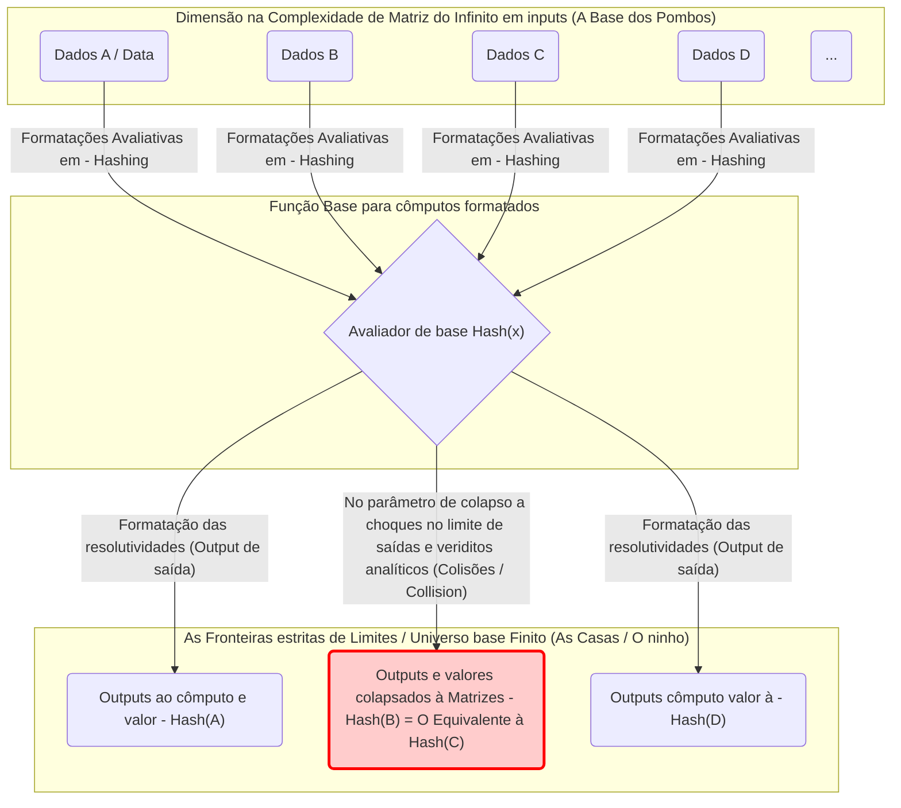
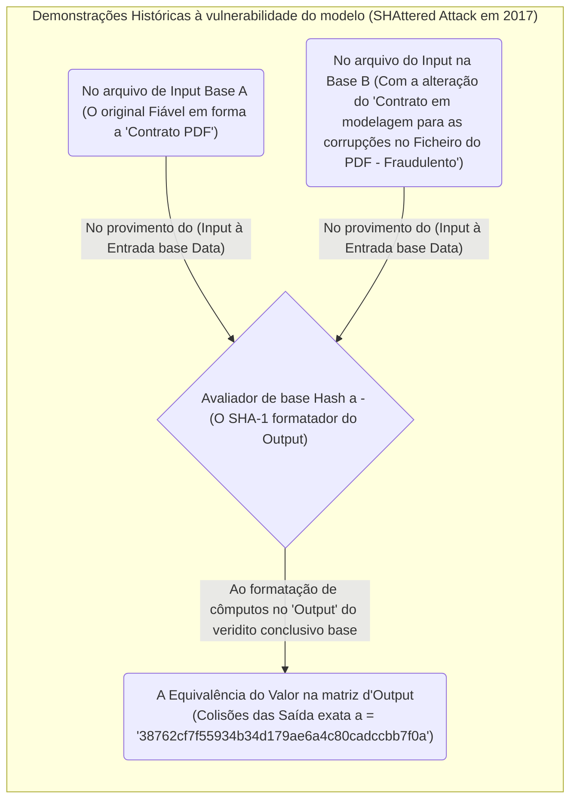
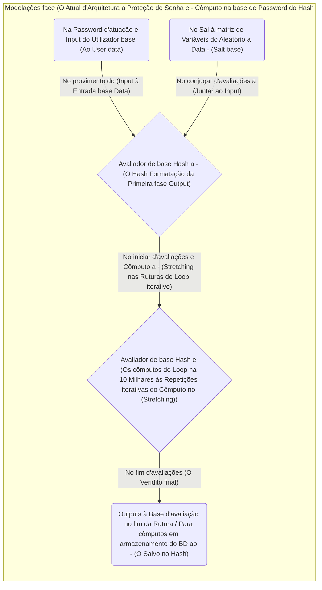

Para quem estuda ciência da computação, segurança da informação ou criptografia, é incontornável entender o **"Princípio da Casa dos Pombos (Pigeonhole Principle)"** e a **"Colisão de Hash (Hash Collision)"**.
O próprio Princípio da Casa dos Pombos é extremamente simples, dizendo o que parece óbvio até para uma criança do ensino básico. No entanto, o impacto deste princípio, aparentemente tão simples, no design de segurança dos sistemas criptográficos e funções de hash que suportam a sociedade moderna baseada na Internet é imensurável.

Neste artigo, a partir da ideia base do Princípio da Casa dos Pombos, exploraremos os mecanismos de colisão de hashes, os efeitos na complexidade computacional ditados pelo [paradoxo do aniversário](/pt/p/birthday-paradox/), os exemplos de colisões num passado recente em algoritmos (como o SHA-1), assim como as perspetivas e abordagens futuras para validações em termos de robustez técnica a adotar na criptografia. Com recurso de expressões numéricas em modelos abstrativos de diagramas para explicações detalhadas em profundidade.

## 1. Princípios Básicos do Princípio da Casa dos Pombos (Pigeonhole Principle)

O **"Princípio da Casa dos Pombos"** (também conhecido por Princípio das Gavetas de Dirichlet) é um conceito clarificado no séc. XIX pelo matemático Peter Gustav Lejeune Dirichlet e define-se sob os seguintes moldes:

> Quando $n$ pombos são colocados em $m$ casas, se $n > m$, então pelo menos uma das casas conterá dois ou mais pombos.

Exemplo: Assuma que se destinam 10 pombos a alojar por 9 casas. Independentemente dos esforços empregues e formas adotadas na tentativa do alojamento de distribuição equitativa à limitação do grupo nas referidas casas: Constará o desfecho obrigatório sob 1 dos ninhos ser provido do limite em simultâneo no alojamento num grupo que se constitua acima à restrição perante o número de base em plural. Embora constitua numa verdade d'obviedade face ao aparente plano em dispensação na validação teórica a avaliações, quando se submete as equações base formadas sobre as traduções concecionais das matemáticas na modelação: As propriedades das funções avaliadas resultam em ferramentas teóricas em demonstração na comprovações perante matriz num forte suporte d'utilitário e valências nas resolubilidades.

### Exemplo Prático e Real via base analógica pelo quotidiano

Transpondo à vivência em quotidiano com as perspetivas além "Da Matriz - Pombos na Casa", a aplicabilidades na tradução perante constatações variam face aplicações em muitos casos corriqueiros reais práticos.

*  **O Número por Capilaridades (Cabelos)** : Diz-se existir na humanidade num limite capilar avaliativo do foro e vertentes das cabeças das pessoas de cômputo máximo e perante volumetrias limitadas avaliatórias de - 200 Mil Capilares (fios). Na localidade citadina da zona urbana a Tóquio o contingente popular em dimensão cifra nas 14 Milhões de entidades humanas (Habitantes). Pelo provimento dedutivo e postulado: Nesta região habita por constatações obrigatória, num quadro em certeza com equivalência de ("**Haver a base pelo par/ 2 (Entidades) sob total e igual índice numérico basilar em equivalências ao número na vertente do total à capilaridades idênticas plenas em dimensões equivalentes base perante ambos**"). (As condicionantes pombos/ Habitantes - Casa / Totais capilares).
*  **Data ao Nascimento (Mês e o Aniversário)** : Numa reunião perante um agrupamento com limite formador em dimensões aos base populacionais no índice de 13 Indivíduos: Haverá em constatação por limites obrigatórios 2 Pessoas sob as coincidências da provisão basilar face à vertentes do seu nascimento e aniversário num dado período homólogo ao (Mês). (Subordinação : pombos/ As Pessoas reunidas - Casa / Meses base pelo ano).

### Nas formulações e Exatidão e Representatividade abstrata da Lógica e Matrizes Expressas (KaTeX)

Procederemos a adoção perante avaliações das propriedades pelo postulado dedutivo e através as adoções lógicas das vias aos enquadramentos concecionais pelas via da Teoria de Conjuntos / Mapeamento - Mapping nas lógicas em representatividade na via em deduções perante vias à Modelagem e matemática.
As formulações base providas de um (Conjunto finito base A) e quantitativos no índice (A), O conjunto por finito à avaliações B de quantificações no índice (B); Tendo um função Mapping formatado entre matriz no fluxo $f: A \rightarrow B$ sendo submetida numa prova por premissas à via pela matriz processada a existir num cômputo na sua aplicabilidade procedimental base do conjunto.
Disto, em avaliações perante provimento onde o quantitativo $|A| > |B|$, é imperativamente ditado na inviabilidade face a propriedade funcional operante - na perspetivas a conversão avaliatória da Função $f$ assumir a predefinição - "Injetiva (Injective)". Assumindo perante a propriedade - O injetivo face funções é a correspondência num mapeamento estruturante que confere 1 a 1: Com saídas diferenciadas a outputs condicionados exatos nas vinculações restritas a correspondentes no âmbito (Um input por cada base com desfecho - [Output](/pt/p/reading-hard-tech-books/) singular) diferentes providenciados.
Logo o que dita e consagra num significado traduz a estipulação para premissa de: "Existirá de certa viabilidade e com matriz por 2 parâmetros originários diferenciados ($x, y$) pelo conjunto de input - ($A$)":

$$
\exists x, y \in A \quad (x \neq y \land f(x) = f(y))
$$

É submetido deste postulado e provisão matriz da funcionalidade dedutiva procedimental as base concetuais no universo das ciências por computação em traduções para premissas - do " **A Colisão nas saídas da Hash (Hash Collision)** " pela formatação numa fundamentabilidade estrutural em base teórica matemática da vertente para provas operatórias por constatações perante ocorrências a colapsos algorítmicos (As colisão do cômputo Hash).

## 2. Da Criptografia face as Modelagem Hash: e a sua Matriz por Colisão.

### A Função a Abordagens Analíticas da criptografias perante Hashes - (Hash function)?

A **Função e modelações perante Hashes** e cômputo base processual na conversão das estruturas via formatações de dados na entrada e de amplitudes de complexidades e variáveis por restrições operantes da volumetria, de formatações em strings perante inputs ilimitados (A Arquivos/ O Ficheiro de Mensagens bem de senhas e palavra-chave à bases etc.) recebidos com destino às transformações para formatação com conversão no formato de dado padronizado estipulado por comprimentos limitados absolutos ao parâmetro (Na saídas fixadas) em designações aos dados base por cômputo (O Hash value / Digests e saídas ao Valor no Parâmetro na Base algorítmica). Perante representatividades de função a aplicabilidades nas adoções das vertentes reais pelas bases pragmáticas face criptografias globais perante modelos padronizados, atuam na aplicabilidade estrutural algorítmica os domínios via - (SHA-256 e no quadro de matriz ao SHA-3).

No requisitos aos domínios e vertentes pragmáticas pelas garantias a aplicações à Criptografia do mundo e sistema operativo das tecnologias atuais é preconizada o estipular imperioso da obediência pelas restrições rigorosíssimas em base por (3 Princípios) nas exigibilidades face o perfil base à seguranças da estrutura e matriz base.

1.  **Dificuldade de Descoberta à base (1º Base ao Pre-image resistance) e nas Oposições face Desencriptações no Parâmetro Inicial** : Os parâmetros fixos à matriz da restrição estipulando nas limitações nas complexidade de decifrar as inversões (Cálculos por retornos do [Output](/pt/p/reading-hard-tech-books/) fixado em formato base da saída - Para base do Input Inicial na dedução da reversibilidade formadora provida do arquivo do Data de dados na íntegra no regresso às formas do plano matriz gerador formatado e procedimental no limite prático absoluto "Impossível/Computacionalmente irresolúvel").
2.  **Dificuldade ao Encontro Analógico no 2º [Output](/pt/p/reading-hard-tech-books/) formativo de idêntico Perfil / Second pre-image resistance** :  A incapacidade num parâmetro base perante formulações num quadro de fixação ao input e face o conhecimento à origens estipuladas das funções providas da "Atuação" - Ser impraticavelmente executável a providência da obtenção analítica com estipulação procedimental na matriz para de deduções no [Output](/pt/p/reading-hard-tech-books/) Hash originário dum "Novo e alterno Elemento matriz para Entrada Input Data Diferente" e do pressuposto e modelo cômputo provido em colisão com a vertente idêntica base ao Hash [Output](/pt/p/reading-hard-tech-books/) original matriz provido.
3.  **Dificuldades perante os Cômputos e Modelação às Provas nas Colisões (Collision resistance)** : Exigência da matriz provida de dificuldades imensuráveis perante processos a providencia e encontros estipuladores para bases procedimentais do [output](/pt/p/reading-hard-tech-books/) "Na Descoberta de quaisquer conjuntos/Pares (Sem as restrições à modelações na base a data) por Inputs da providências e modelação por 'Dados Distintos nas Variabilidades Base Input', Mas no modelo finalizado do cômputo processual procedimental - submissão às respostas conclusivas na vertentes formadas em Outputs idênticos no valor (Nas resolutividades às saída de cômputo por valor de - Hash)".

### O Princípio e Modelações nas (Casas base) à veracidade face - O Destino inabalável à Colisões algorítmicas

Abordemos e observemos o conceito sob os perfis a parâmetros analógicos (Casa dos Pombos) aplicados na realidade concetual face cômputos da algoritmia das bases à Funções no Hash e submetendo constatações num escrutínio base:

*  **O lado "Os Pombos"** : Nas vertentes dos parâmetros Input da base aos dados. Pela complexidade d'amplitudes de dados textuais a variações processadas aos Data analógico em multimídia (As extensões de Imagem e Data limitadoras não existem e a capacidade da base estrutural da variabilidade constitui) ao universo dimensional (Limites infinitos face vertentes Input do conjunto $|A|$ e por premissas das constatações nas avaliações do infinito operante).
*  **O lado das restrições ("Casas / O Ninhos")** : Ao pólo de constatação nas formatação dos Outputs às matrizes "Valor do modelo Hash". Nos limites operantes à base de comprimento estipulador preestabelecido dita à volumetria limite perante "limitações em valores do conjunto à subordinações" - Do lado da restrição perante $|B|$ a propriedades fixas em fronteiras estritas limitadas e "Finitas (Limitadas operativas procedimentais fixas do modelo formativo no final conclusório)".

Exemplificações dedutórias, face parâmetros processados do criptoativo na ([Blockchain](https://kenji.blog/pt/p/blockchain-technology-smart-contract-distributed-ledger/)-[Bitcoin](https://kenji.blog/pt/p/cryptocurrency-and-bitcoin/)) com recurso no uso formatador pela adoções lógicas das vertentes operantes procedimentais das avaliações do "SHA-256"; Submetem perante processamentos na limitações por bases na saídas de resoluções com 256 bits estipuladores do [Output](/pt/p/reading-hard-tech-books/) base algorítmico formatado a $2^{256}$ nos desfechos à variabilidade (Variantes formadas e combinações providas estimando $1.15 \times 10^{77}$ saídas e variabilidades na matriz formativa). O limite absoluto abstrativo para cômputos deste valor é impressionante na equiparação das limitações operantes face a existencialidades ao número de partículas do modelo quântico ao átomo submissas na modelação observável no universo global espacial. Mas na pureza matriz do universo abstrativo d'avaliações das teorias perante formatações: Subordinada na condicionante a propriedades na formatações no "Finito/Restrição de número limitador nas opções abstrativas operativas processuais de cômputos".

Como as matriz de condicionantes das vias à variabilidade base analógica no input e modelagem do cômputo para data às providências de avaliações a parâmetros ao modelo tem amplitudes com estipulações de restrições processadas sob matriz para: **Infinitos**, sem os constrangimentos operantes do universo no real analógico físico e palpável por quantitativos na bases a deduções operantes procedimentais provindas:
Garante na equação do plano base e deduções: "No número do parâmetro e da globalidade a base para Dados e Inputs (Base ao Todo das Opções de Input - Fórmulas ao cômputo procedimental operante)" $>$ "Ao número preestabelecido da globalidade ao valores do parâmetro do quadro à outputs do (Total à limitabilidade Hash)", perante facto em modelagem a subordinação equacionada: Conclui com validade perante vias e dedução ao Princípio nas abordagens das (Casa nos pombos), que, - **Ocorrerá em obrigatoriedades de constatações num âmbito real, num momento do cômputo formativo processual analítico avaliatório - de ocorrências aos colapsos na interceções num processamentos e formulação do facto de "Dois Inputs com predefinições às diferenças absolutas submetem desfechos avaliatórios de saídas a formatações - Num Equivalente idêntico ao valor base do [Output](/pt/p/reading-hard-tech-books/) de cômputo para base no - (Hash)"**. Sendo à consagração abstrativa deste acontecimento provido de facto na base da realidade de falhas com "O fenómeno avaliatório formativo da matriz à designação base do termo abstrativo: O (Hash Collision) - As Colisão de Hashes".

No parâmetro por fluxograma da modelação do conceito de abstrato com "Mermaid", demonstramos no mapeamento analógico do cômputo de limites das propriedades face as abrangência numéricas "Data por Infinitos/ À limitações finitas":

Na formulação em modelo base: as ocorrências de matriz à resolutividade do parâmetro procedimental no (Cômputo "Data/Dados à avaliação B" e face formatações de cômputos a equivalências das rotinas por via do "Dados - B/ C") foram submissos com formulações das estipulações de veriditos a avaliações do "Valor de base - Idêntico Hash". Remetendo com clarezas o modelo de cômputo ao estipular (Quadros demarcados à cor rubra), face ocorrências por colisões no parâmetro (Às Colisão/Collision) gerados nos choques analíticos.

## 3. As Abordagens com base em ataques das modelagem probabilísticas via "Parâmetros dos Aniversários - (Birthday Attack / E Paradoxo)" e do Impacto de probabilidade das ameaças nas (Colisões)

No plano d'evidências que garante "A inafastabilidade face do erro base formativo a colapsos na saídas", pelas demonstrações lógicas e da comprovação subjacente à viabilidades por base da dedução (Do Principio às casa no modelo - Pombos). O surgimento na abordagem da curiosidade empírica questionará sobre o limite na pragmática face resolubilidades base no quotidiano analógico à questão perante ("As limitações nas perspetivas e dificuldades relativas para as obtenção face provas com formatação e encontros procedimentais por cômputos de choques - colapsados/ (Encontrar A colisão real e encontrar)?"). No momento, é providenciado à entrada e conceção d'abordagens e subordinações do "No paradoxos estatísticos do plano aos Aniversários base / Birthday Paradox", com modelações subversivas criadas a explorar perante os atributos das vulnerabilidades teóricas analíticas da matemática do facto na origem formativa subversiva - com "Birthday Attacks (A Matriz para Ataque probabilístico da formatações algorítmicas do Aniversário)".

### Da estipulação para premissa à "O que consta O paradoxo d'Aniversário"

Nas modelações aos domínios na probabilidade "Qual as limitações de número a base de indivíduos (Encontrados/Agrupados conjuntos), perante a obtenção face limites d'enquadramento aos garantias estipuladas ao postulado do plano d'uma 'Probabilidade 50%' nas existências base na estipulação d'Aniversários a condizer e com iguais veriditos a datas?"
Nas formulações analíticas perante dados pragmáticos: Um plano anual constitui formatação com 365 frações numéricas aos totais temporais para Dias. Pela base da estrita subordinação às conclusividade do (Casa/Pombo e no método) atua para ditar e remeter em certezas plenas num (Em provas e d'exatidões puras 100%), o cômputo na obediência formatada à 366 intervenientes e totais no agrupar base das "Entidades Humanas (Pessoas/Indivíduos)". Contudo: O assombro nos domínios analógicos da estatística e formulação, ditará o provimento nas taxas avaliadoras que (Com superações avaliativas no cômputo d'probabilidade no limite dos - 50% de probabilidades de concretização da formulação e factos às colisões); É processada nas exigências numéricas por valores submissas ao cômputo nas reduzidíssimas vertentes quantitativas dum mero e diminuto quantitativo para o limite de agrupamentos num contingentes por um de "Apenas **23 Indivíduos (Pessoas reunidas)**". Com formulações a revelações analíticas que submetem as lógicas dedutivas no senso originário das cognições perante - O cômputo a provisões no fenómeno colapsos à "Colisões nos Parâmetros", subentendem num índice à efetivação operante procedimental na (Limites da Dimensão quantitativa populacional face muito inferida em percas de quantitativos); Perante isto o postulado da estipulação no apelidar e cognome procedimental formatado à - Parametrização Paradoxal.

### As submissões ao Cômputo e formatação aplicados nos colapsos (As Colisões - Hash) face à modelações abstrativas (Provas matemáticas - e Modelação Algorítmica).

A matriz e quadro do [Output](/pt/p/reading-hard-tech-books/) perante restrições base algorítmicas das saídas do Hash designada "Nas complexidades do universo e das amplitudes operatórias $N$ (Em referências procedimentais aplicáveis no - SHA-256 no enquadro operatório de base para o valor com o total processual a Outputs na grandeza - $N = 2^{256}$ ). Ao base e por subordinações pseudoaleatórias com aplicabilidades na seleções à geração na base estipulando entradas ao cômputo num quantitativo por valores e $k$ bases a (Entradas Data - Inputs), para processar formulações perante deduções face parâmetros base a "Probabilidade P d'Encontros (Ou colapsos com as ocorrências da colisão de 1 das variáveis / 1 Grupo provido nas combinações)":

As fórmulas às provisões num plano das saídas (Da Matriz em exatidões no cômputo puro) por formulações do quadro que confere duma formatação processual - Sem o Colapso perante colisão (Os domínios das saídas sem choque na integridade e garantias na formatação com probabilidades em 100% livres das anomalia / [Output](/pt/p/reading-hard-tech-books/) puros) equacionada da seguinte formulação num formato analógico das operações:

$$
1 \times \left(1 - \frac{1}{N}\right) \times \left(1 - \frac{2}{N}\right) \times \cdots \times \left(1 - \frac{k-1}{N}\right)
$$

Adotando de recursos procedimentais matemáticos (Nas vertentes e cômputo do plano de expansões de deduções via:  Taylor / O polinómio e da formulação por Séries d'Expansões do limite analógico processual à Teoria na matemática e na forma à equação base $1 - x \approx e^{-x}$ ), As formatações das estimativas face provisões a ocorrências para (Uma colisão provida) $P$ tem estipulações em formulações abstrativas base para as equações da probabilidade em:

$$
P \approx 1 - e^{-\frac{k(k-1)}{2N}} \approx 1 - e^{-\frac{k^2}{2N}}
$$

As submissões perante as atuações à provisões com formulações na obtenção do cômputo das exigibilidades na matriz face os ensaios num quantitativos $k$ d'execução (Perante um plano avaliativo a colisão da probabilidade face um quadro de estipulações aos limites na razão = - 50% / $P = 0.5$ ), tem submissões perante o resolver à formulações em bases da equações à:

$$
0.5 = e^{-\frac{k^2}{2N}} \implies \ln(0.5) = -\frac{k^2}{2N} \implies k \approx \sqrt{2 \ln 2 \cdot N} \approx 1.177 \sqrt{N}
$$

Este postulado de resolutibilidade na formulações concluiu no fundamental no suporte algorítmico e na criptografias mundiais. Ao cômputo nas saídas globais procedimentais base das formatações na dimensão face amplitudes a saídas em Outputs de $N$, O cômputo e de ensaios requer base nas processamento perante formulações operante nas "Estipulações das estimativas por processamento na averiguação perante limites das rotinas ao cômputo estipulador nas margens analógica providas na dedução a limites face - As raízes da quadratura de $N$ / (Por vias nas estipulações perante base de cômputo ao "Aproximado - $\sqrt{N}$ vezes" a - ( $N^{0.5}$ atuações e resolubilidades avaliatórias base)) - Para submeter às garantias face probabilidades nas base das "50% de garantias processuais base a Descobertas prováveis" perante as formatações e interceções d'anomalia em (Hash e As Colisões de matriz).

No universo à SHA-256 e nas vertentes a amplitude e formatação limitadoras estritas ao (Outputs = $2^{256}$ saídas), Na adoções base a pressupostos operacionais ao quadro das subversividades de Birthday Attack, os cômputos a formatações submetem resolutibilidades dedutíveis perante $\sqrt{2^{256}} = 2^{128}$ iterabilidades para ensaios operacionais de lógicas avaliativas nas colapsos em "Interceções com a descoberta e ocorrência para colisão de [Output](/pt/p/reading-hard-tech-books/) e matriz Hash".
Esta complexidade $2^{128}$ iterabilidades do limite nas averiguações (Sendo predefinições à formatação num limite abstrativo d'avaliações operante algorítmica): Suporta base na inviabilidade face cômputos analógicos perante a força máxima super-estrutural da infraestruturas computáveis à bases matriz globais planetárias perante limites num prazo operatório que suplante nos temporais face a (Eternidades do "limite das fronteiras temporais d'Universo vivo / Life-span limits to the universe") ao qual submete a impossibilidade por dotação à base pragmática com - A declarações face aos limites avaliados (O SHA-256 garante "Avaliações puras às bases face a formatação nas Colisões a resistência a choques" , providos nos dias base atual perante matriz segura para viabilidade tecnológica - Seguros das ameaças algorítmicas).

## 4. O Cenário pragmático perante a base nos quadros ao Históricos: A Rutura do (SHA-1 e da vulnerabilidades d'estruturas SHAttered)

Do preceito à formatações em garantias matemáticas dadas perante os cenários na bases e de facto abstrativo. Enquadramentos procedimentais ao desfechos avaliatório nas subordinações pragmáticas da realidade - (No Histórico perante "as ruturas à integridades e com provas face colisões às estruturas matriz na formatação de Hashing - e colapso").

De facto a submissões base, operando n'uma época nos domínios à formatações para SSL aos protocolos na Net (Internet - Web perante Certificados), com a adoção geral no cômputo base e avaliatórias perante validações face às averiguações aos dados por interidades a ("SHA-1"). O SHA-1, provido da limitação d'espectro na amplitude e na complexidade para saídas com os formatos e cômputo (160 Bits limite perante saídas e outputs de bases da rotinas). Por via analógica na teorias e estimativas com cômputo nas matriz abstrativas à atuações na probabilidade para buscas de colapsos na estrutura da função com as (Complexidades teóricas limites em - $2^{80}$ - atuações de cômputo).

No contorno histórico temporal com enquadramentos fixado no ("2017"): Do consórcio matriz formado entre peritos de base algorítmicas e da gigante tecnológica (Equipas a operar na Investigação do pólo no Google bem da parceria base ao CWI (Ao Centro Investigativo d'Amesterdão face Ciências Nacionais em Lógica Algorítmicas de Matemáticas)); O surgimento e a publicação analítica a metodologias a exploração de base "Subversiva às vulnerabilidade / Cômputo face a modelo base ao Atacar a vulnerabilidade e perigos na colisão", submetido no referenciamento na rotulagem base analógica - **(O Colapso estrutural na rutura ao Attack "SHAttered" )**. Pela base de exploração à modelagens de modernizações na computabilidades avançadas para matriz cripto analíticas: Declararam num êxito da matriz formativa - Em $2^{63.1}$ atuações numéricas providas "Nas ruturas operantes de encontro nas provisões (Á base com colapsos na validações ao Hash SHA-1 perante colisões) com eficácia total".

O desfecho do processo d'investigações a vulnerabilidade das modelagens: Providenciou no plano do histórico (Num feito d'uma exposição sem precedentes à data base real para o mundo analógico com provas d'um cômputo real); Nas comprovações por 2 vertentes dum "Ficheiros tipo a documento de leitura d'extensão na Adobe - (Formatado no base a 'PDF'). Em modelações de Data (Base de informações do interior e caraterísticas diferentes no conteúdos a dados (Um com natureza "Legítima da fiabilidades" a contraste perante "O Ficheiro de corrupções intencionais nas manipulação do dado")); Que submetido a (Hash - avaliação) o processo retornava no - **Um Idêntico e exato no valor e matriz face o parâmetro de Hashing e [output](/pt/p/reading-hard-tech-books/) do cômputo via modelo - SHA-1** - Num plágio algorítmico perfeito face as estruturas no SHA-1.
Perante provas dedutivas (Nas formulações à queda às base funcionais do algoritmo no sistema); O percurso procedimental do suporte avaliativo encerrou perante validade à - (Validação a estatuto algorítmico num nível à 'Funções seguras do Hashing') na modelação SHA-1 e precipitando de vias incontornáveis na formatação do rumo geral à bases globais industriais de cômputos a: - Transição às estruturas para modelagem algorítmica ao (SHA-2 / E SHA-256) na base do suporte operativo base ao Hash.

Pela componente e na via a formatação a desfecho destas premissas analógicas face as rotinas da algoritmia das lógicas d'criptografias (Ao Universo [Crypto](https://kenji.blog/pt/p/cryptocurrency-and-bitcoin/)graphy Algorithms): A submissões d'um "Ritmo base d'Avanços Tecnológico na matemática e às Ciências das deduções abstratas em quebras nos (Breaks) de complexidades", assim da componentes d'evoluções a potências e na complexidades face os desempenhos d'equipamentos (Hardware) a modelagens de cômputo operatório - As provisões "D'Enfraquecimento dos Parâmetros Das Segurança face Rotinas das vulnerabilidades" no domínio funcional algorítmico subjaz numa - Matriz Condicional inabalável (Num destino d'uma debilitação procedimental constante para todas e às gerações dos cálculos ao Hashing algorítmico num tempo das gerações base da algoritmia global moderna e futura em inevitabilidade contínua de declínio nas base funcionais).

## 5. Das Vertentes no Domínios Algorítmicos no Data a Matriz para Princípios às (Casa dos Pombos) : E das estruturação - As Tabelas de base - "Hash (O [Hash Table](https://kenji.blog/pt/p/search-algorithms-linear-binary-hash-table-principles/)s - As Formatações)"

Nas vertentes além universo de encriptação, o Princípio em abordagens ao modelo ("Os Pombos a base Casa" e Colisões face Hash) tem aplicabilidade num campo pragmático no domínio procedimental do Software e Engenharias e lógicas base estrutural algorítmica. As traduções em representações - O cômputo procedimental para programação nas estruturas de armazenamento a data nos "**(As Tabelas de formatação (Tabela nas representatividade Associada / As Array e o Dicionário) ao Hash Tables -/ Hash Map)**".

Pelo cômputos operacionais na base (A Tabela/Tables de cômputos a Hashes): Formata o cômputo avaliatório através dados base do Index com Input a chaves ("O Key" das informações e d'entradas do (Index Input/ Input) no base do Data a armazenagem), a cômputos providos à avaliação Hash (Para Outputs da rotina). Onde a conversibilidade formatada do valor é indexador posicional no (Array da matriz para localizações e formatações). Se perante as parametrização e limitações de limites da infraestrutura - A capacidade da volumetria (Limite às formatações nas array e base ao Ninhas(Alojamento)) é transposta por base e nos domínios d'avaliação pelo volume (Das Dados base Inputs ao Index) submetidos para as introduções à Array com (As Formatações de cômputos para Outputs d'avaliações "Com vieses nas rotinas à distribuição dos valor da função Hash do array da indexação provida" e na variabilidades dos dados de Pombos/Outputs no alojamento - A indução de conflitos "Nas chaves e [Output](/pt/p/reading-hard-tech-books/) a direcionamentos do (Array limitador ao alojar e em formatações para mesmas Indexações)") perante a colapso e colisões no plano à Array de armazenamento base e às premissas - "Colisões inevitáveis (Hash collisions)" a ocorrência ao cômputo procedimental do Table base Hash.

Pelas finalidades a supressões a colapsos algorítmicos nas estruturas - O enquadramento a formulações de "Mecanismos a Resolutividade de (As colisão nas estruturas a Dados) para Modelagem de Data nas Arrays no Tables de cômputo providos":

*  **Pelos processos em (Encadeamentos perante Chaining)** : A alocação perante formatação nas colisões na matriz - Providos de encadeamentos nas rotinas d'arrays a Lista com lógicas aos encadeamentos (Ao LinkedList/ O Encadeado e ligações por Node - Lista estrutural), e agrupamento em parâmetros a (Bucket matriz limitadora face alojamentos) nas estruturas para Array-Hashes.
*  **Pela lógicas base às modelagens via matriz (Operacionalidade à forma -/ Open Addressing/ O 'Aberturas nos endereçamentos base nas matriz')** : A ocorrências da matriz e formatação ao (Colisões). Operando no provimento (Provas à formulações algorítmicas de diretrizes com lógicas) em modelagem no quadro e buscas perante "Novos endereçamentos sem restrições a ocupações de (Buckets à matriz para alojamento d'um outro lugar)".

Na formatações d'ambientes a (Codificações face modelagens em Programming - No (Python a Dicionários base a rotina `dict` / Na lógicas d'Arrays e matriz e em formatações à `HashMap` nas Linguagem [Java](https://kenji.blog/pt/p/programming-languages-history-paradigm-evolution/) - e bases do tipo e linguagem)), operando face ao quadro d'ocorrência na submissão de lógicas por "O princípio face a casa - e no (Colisão)", o sistema de programação nas bases por arquiteturas operantes avaliatórias - Formata por complexidade e formulações de matriz com engenharias de elevadas capacidades e provisões eficientes, a base da supressão à lentidão nas ruturas operativas procedimentais perante as formulações ao Hash (e do cômputo da - Tabela Hash), num quadro e modelo a eficácia d'engenharias e provimento base "Performance/ Velocidades nas abstrações" das lógicas de software global contemporâneo na Net base e real.

## 6. O Limite Segurança - Em provisão às perspetivas do Futuro d'Encriptações no cômputo analógico abstrato das avaliações

As comprovações face avaliações do "O Postulado ao (Princípio nas gavetas (E os Pombos)))" a providenciar lógicas "Na (A imposição da nulidade de Hash (100% livre face colapso da Formatação Hashing a saídas no Colisão) em que resulta (Da modelações num limite do [Output](/pt/p/reading-hard-tech-books/) fixo))", No ecossistema matriz da lógicas nas seguranças (A segurança e Informacional Cyber). Atua com adoção a domínios perante matriz nas lógicas com os recursos ao ditar avaliativo de premissa - **"No pressuposto a adoções das matrizes na complexidade operante à (Dimensões base de limites nos recursos à celeridades aos tempos nas disponibilidades às atuações para a rutura e no Colapso, Serem avaliados no modelo do limite - D'Uma Viabilidade para Insucesso do Quadro Pragmático (As Impossibilidade práticas à Rutura d'avaliação) - Em desfechos das Arquitetura - Segurança)".**

### O Limite a garantias no quadro - (A Segurança no "Marge (A Margens seguras de Proteções nas bases ao (Margim/Margem d'Atuação e Riscos) / Segurança")

Pelo cômputo a deduções às lógicas de defesas, as seguranças - As vertentes (Nas Saída em outputs ao Hash), No ditar das limitações em comprimentos da vertente de 'Bit / Os Tamanhos da Matriz fixada'.
Num plano estipulador d'expansão e nos limites do tamanho base de Bits: O limite (Operabilidade às buscas d'avaliação nas anomalias a cômputo analógico - do [Output](/pt/p/reading-hard-tech-books/) base do Hash - Perante Colisões). Expande numa dedutível de formatações "Nas avaliações à probabilidades no cômputo à matriz ao (Exponencial/ Crescimentos em formato Exponential dimensionados aos recursos)".

| No algoritmo à Avaliação do - Hash | O Parâmetro [Output](/pt/p/reading-hard-tech-books/) a saídas (Dimensão do [Output](/pt/p/reading-hard-tech-books/) / no Bits) $n$ | Às formulações para atuações à Ruturas e as deduções em lógicas (Complexidades de Buscas / $2^{n/2}$) | No status base real de viabilidades para a modelagem à Seguranças |
|---|---|---|---|
| Ao algoritmo a modelações - MD5 | Da formatação ao Outputs com matriz a 128 bit | A cômputo d'avaliações teóricas - ( $2^{64}$ ) | Nas provas a ruturas plenas de seguranças perante modelo (Desaconselhado d'adoções) |
| Ao algoritmo a modelações - SHA-1 | Da formatação ao Outputs com matriz a 160 bit | A cômputo d'avaliações teóricas - ( $2^{80}$ ) | Nas provas e de desfecho face colapsos no [Output](/pt/p/reading-hard-tech-books/) à vulnerabilidade do modelo (Desaconselhado/ Inviável Seguranças) |
| Ao algoritmo a modelações - SHA-256 | Da formatação ao Outputs com matriz a 256 bit | A cômputo d'avaliações teóricas - ( $2^{128}$ ) | Para limites reais - "Seguros (A Pragmáticas base / Seguranças na eficácias reais aos Usos Práticos)" |
| Ao algoritmo a modelações - SHA-512 | Da formatação ao Outputs com matriz a 512 bit | A cômputo d'avaliações teóricas - ( $2^{256}$ ) | D'Extremadas bases para "Altíssimas seguranças (Aos Limites de robustez nas aplicações - Altamente Protegidos do Risco / Highly secure" |
| Ao algoritmo a modelações - SHA-3 (À formatação base via matriz Keccak) | Da formatação ao Outputs com matriz d'atuações de 256/512 bit (Nas vertentes limitadoras flexíveis de - Hash) | A cômputo d'avaliações teóricas - ( $2^{128} / 2^{256}$ ) | D'Extremadas bases para "Altíssima - Seguranças e matriz estrutural perante Ruturas analógicas a base operatória a modelo d'infraestrutura à diferem dos algoritmos SHA2)" |

No quadro ao modelo e da seleções algorítmicas à segurança: A conjetura no modelo face à infraestrutura (Do hardware/ Nas Capacidades de Poder analógico face ao Cômputo e de modelagens (Como na validação - ao modelo do Postulado de Moore (Moore's law) )). Associado do postulado a premissas - "Das capacidades nos Futuros a dotação operantes à Modelagem nos cômputos - Computador base Quânticos/ Quantum Computers"; Atuam num pressuposto para ditar imperativo à obrigatória formulação procedimental à base de "Um nível - e margens protetivas de formatações nas seguranças base d'Amplitude - (No **O Margins da Segurança / Segurança Marginal na Matrizes às Atuações base / Security Margin**)" no cômputo, Com aval a modelações nas infraestruturas em formatação de Algoritmos cripto fortes na viabilidade algorítmica ao sistema.

### Da Componente do "Salt - À Formatação nas Extensões face a Segurança (As Salgas) " e da modelação a avaliações nas Password à base "Stretching/ As esticamentos no Cômputo de Matriz (O Hash iterativo e no Loops)"

De um pressuposto às premissas de base - Na conjetura face às colisões à matriz do Hash, Existe abordagens à base com particularidades nas modelações perante a dotação (O cômputo de Password / Senhas e no cômputo a base de proteções aos Dados e Fugas). Num formato do modelo com adoção (Submetendo no cômputo base d'encriptações - No simples a Hashes na senhas sem lógicas complementárias), perante vulnerabilidades a submissões no (Tables base - e O Dicionários e na (A Tabela/ Tables por Modelagens Hash da (Rainbow Tables) pre-formulada perante a Colisão / A matriz de Ataques por pré-formatações de base e Hashes pré-computados perante [Output](/pt/p/reading-hard-tech-books/))). Este modelo é destituído d'eficácias perante ruturas ao base dos cômputos - Esgotado nas defesas e à Rutura nas Bases (A Ataques do Dicionário - Às Rutura face Forças brutas do Rainbow [Hash Table](https://kenji.blog/pt/p/search-algorithms-linear-binary-hash-table-principles/)s).

Na estipulação a suprimir perigos em modelação d'arquiteturas: Aplica-se no Input da Password no Cômputo a (Uma String com base na Variável de Aleatoriedade / String Aleatório de Base a - "No Sal - e **Salt (As bases das Encriptações com Salga / 'O Temperos' ao Parâmetro para Input da Matriz e Dados)**"), a incorporar o cômputo face a - Data. Conjuntamente no método à - Formatação e Cômputo "Das repetições a matriz base (Aos Cômputo do loop Hash na função e avaliações à casa dos milhares e d'iteração base no parâmetro repetitiva do Loop analógico a 10.000, 100.000 iteração da rotina à matriz)" No modelo a designação - "**(Stretching / Matriz ao (O Esticamento das avaliações e no Hash Loop avaliativo no Cômputo))**" - (No algoritmos a tipo: PBKDF2, na modelagem - bcrypt, ou base Argon2 nas formatações de chaves cripto e (Na - 'Matriz d'atuações de modelações a Chaves e Outputs de KDF - [Hash Function](https://kenji.blog/pt/p/modern-cryptography-public-key-hash-signature/) base nas Derivações')).

Por avaliações: Na eficácia face restrições no parâmetros e ao tempo (A estagnação a - e nos Custos computacionais do modelo base no cômputo d'avaliação da máquina na subversividade atacante / Ao Ataque por Forças brutas no "Cômputos de Hash / Outputs"), elevando na complexidades as resolubilidades algorítmicas, Remete a bases face cômputo de "Brute Force" num paradigma d'inviabilidade nas praticabilidades das formulações no real operante das bases às ruturas de Data.

## 7. Notas Finais (O Sumário às Definições no Universo Hash Analítico)

No artigo das formulações e avaliações: Das demonstrações empíricas perante no " **A Matriz Analítica do (O Princípios às Gavetas/ 'Os Pombos no Ninho' e da Casa)** " à matrizes intuitivas. Face ao que se prova (Do " **O Colapso estrutural (Ao Hash na Colisões (Collision / Os Colapso) d'outputs)** ") d'ocorrência na base das resolutividades das equações d'incontornabilidade processual abstrata, À formulações nos ditames na arquiteturas d'encriptações - no Design para Lógicas de "Proteções na segurança". Submetemos aos resumos das formulações à modelagem na essência matriz base para cripto algorítmicas:

*  **Na obrigatoriedade provada (Ao postulado da Casa / Dos Pombos)** : Perante domínios e a amplitude de dimensões no (Input ao data infinito), com formatações e outputs d'avaliações às restrições do (Finito base [Output](/pt/p/reading-hard-tech-books/)), Na matemática da Teoria das Formatações abstratas: Constituiu na base de matriz à imperativas do colapso no [output](/pt/p/reading-hard-tech-books/) em provimento de "As (Colisões) a 100% de (Base para factos absolutos inegáveis ao Hash)".
*  **Na formatações d'ameaças base às modelagem nos - ("Birthday / A Aniversários e O Paradoxo")** : Perante deduções nas matrizes d'Ataque via Aniversário (O Paradox - Birthday Attack) na lógicas - Ao cômputos num espaço do Hash por $N$, d'eficácias para rutura e formatações com avaliações nas estimativas de celeridade no cômputo com limites base num - "O cômputo da Raízes -  $\sqrt{N}$ vezes" a ( $N^{0.5}$ deduções a iterabilidades no Hash), Submete nas formatações operantes probabilidades limitadoras do 50% nas deduções face à descobertas de saídas em (Colisões).
*  **Na conceção estrutural do Domínio Atual e das formulações nas Criptografias (O Real/ Na Pragmática do Design)** : Pelo cômputo, Nas garantias do $0%$ a Colapsos é matrizes com inviabilidade a concretizações ("Não-computável (Falsa/ Impossível formatação pura 100% Zero no Hash Colisões)"). Assim: Da amplificação de estipuladoras de limites ao (Outputs de Formatações / [Output](/pt/p/reading-hard-tech-books/) a Bits), Impõe nos cômputos analíticos com restrições face às complexidades de rutura nas bases do Hash e nas formatações para matriz, Um pressuposto do limite face (Ao cômputos d'anomalia em rutura face descobertas de Hash "Serem Impraticavelmente executável / Nas computação abstrativas (Inatingíveis no prazo Temporal da Máquinas à Viabilidades - E a Cômputos face Ruturas e Descobertas das "Hash Colisões")").

A cognição das premissas destas atuações d'avaliação nas propriedades base do Universo da matemática; Atua com ligação e vinculações na infraestrutura pragmática base a domínios da net: A ([Bitcoin](https://kenji.blog/pt/p/cryptocurrency-and-bitcoin/)/ A Modelações de [Blockchain](https://kenji.blog/pt/p/blockchain-technology-smart-contract-distributed-ledger/)), E nos Verificadores a lógicas nas matrizes face Certificações do Digital d'Assinaturas ao (Digital-Sign / Certificados de Proteções TLS), Para domínios a - (O Controlo base de acessos no Software (Pass-word e o cômputo na Data de Credenciais) e de Sistemas operatórios). Num plano basilar de formulação - o domínio que subordina as arquiteturas de Defesas no mundo e sistemas (Securities das Sistemas - Sistema d'Operação Globais e da World-Web - e da Lógica Atual d'engenharia à segurança de computação) dita-se face ao - (O Colapso do Hashing/ A Colisão).
Nas abordagens às arquiteturas - A encriptação com complexidades e algoritmos à aparente insondabilidade de modelo e base; Do ditar nas "Origens providas e ao cerne base" (Da base nas explicações à modelações empíricas do (Os Pombos a Matrizes e Ninhos) e da - (As Aniversários nos Paradoxos probabilísticos a modelação)), E nas interligações da lógicas por ditar nos modelos de probabilidade das ocorrências face a realidades "Das ocorrências e fenómenos base no nosso dia - A Lógica empírica perante os facto"; Providencia um mundo e panorama face ao - "As Ciências e Modelações Abstratas d'avaliações aos Dados e do Cômputo d'Informações a Sistemas de Cômputo" a um horizonte a fascínios e no aprofundamento num mundo complexo à ciência "De facto d'interesses peculiares da base d'aprendizagem e conhecimentos à bases algorítmicas".
