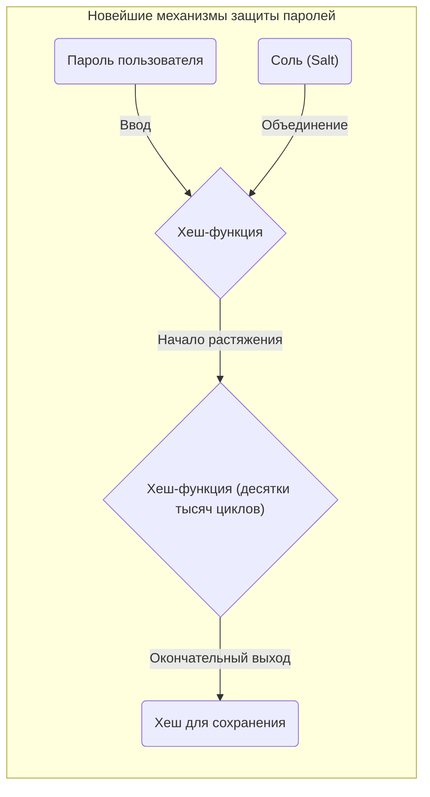

Изучая информатику, информационную безопасность и криптографию, невозможно обойти стороной такие концепции, как **«Принцип Дирихле (Pigeonhole Principle)»** (также известный как принцип голубей и ящиков) и **«Коллизия хеш-функций (Hash Collision)»**.
Сам принцип Дирихле очень прост; он утверждает настолько очевидные вещи, что его интуитивно поймет даже младшеклассник. Однако влияние этого на первый взгляд простого математического принципа на безопасность хеш-функций и криптографических систем, которые лежат в основе современного интернет-общества, неизмеримо.

В этой статье мы подробно объясним, начиная с базовой концепции принципа Дирихле, механизмы коллизий хеш-функций, влияние парадокса дней рождения на вычислительную сложность, реальные случаи коллизий в прошлых криптографических алгоритмах (таких как SHA-1), а также применение этого принципа для оценки безопасности будущих криптографических технологий, используя математические формулы и диаграммы.

## 1. Основы принципа Дирихле (Pigeonhole Principle)

**«Принцип Дирихле»** (также называемый принципом ящиков или принципом ящиков Дирихле) был сформулирован в XIX веке математиком Петером Густавом Лежен-Дирихле и определяется следующим образом:

> Если $n$ голубей помещаются в $m$ ящиков, и $n > m$, то по крайней мере в одном ящике окажется более одного голубя.

Например, если 10 голубей поместить в 9 ящиков, как бы вы ни старались распределить их равномерно, как минимум в одном ящике окажутся 2 или более голубя. Это очень интуитивно понятно и кажется настолько очевидным, что не требует доказательств, но при строгой математической формулировке это становится чрезвычайно мощным инструментом для доказательства существования.

### Конкретные примеры из повседневной жизни

Этот принцип можно применить не только к голубям и ящикам, но и к различным повседневным явлениям.

* **Количество волос на голове**: Говорят, что у человека на голове максимум около 200 000 волос. Население Токио составляет около 14 миллионов человек. Следовательно, в Токио обязательно найдутся **два человека с абсолютно одинаковым количеством волос на голове** (голуби = население Токио, ящики = варианты количества волос).
* **Месяц рождения**: Если соберутся 13 человек, как минимум у двоих совпадет месяц рождения (голуби = 13 человек, ящики = 12 месяцев).

### Строгое выражение с помощью математических формул (KaTeX)

Давайте выразим этот принцип математически, используя язык теории множеств и отображений.
Пусть $|A|$ — количество элементов конечного множества $A$, а $|B|$ — количество элементов конечного множества $B$, и существует функция (отображение) $f: A \rightarrow B$ из множества $A$ во множество $B$.
В этом случае, если $|A| > |B|$, функция $f$ не может быть «инъективной (Injective)». Инъективность — это свойство, при котором разные входные данные обязательно приводят к разным выходным данным.
То есть обязательно существуют два различных элемента $x, y \in A$, удовлетворяющих следующему условию:

$$
\exists x, y \in A \quad (x \neq y \land f(x) = f(y))
$$

Именно это свойство является математической формулой, объясняющей фундаментальную причину **«коллизий хеш-функций»** в информатике, о которых пойдет речь ниже.

## 2. Механизм хеш-функций и коллизий

### Что такое криптографическая хеш-функция?

**Хеш-функция** — это функция, которая принимает входные данные произвольной длины (сообщения, файлы, пароли и т. д.) и преобразует их в выходные данные фиксированной длины (хеш-значение, дайджест). Типичными криптографическими хеш-функциями являются широко используемые в настоящее время SHA-256 и SHA-3.

К хеш-функциям, используемым в криптографии, предъявляются три строгих требования безопасности:

1. **Стойкость к нахождению первого прообраза (Pre-image resistance)**: Крайне сложно восстановить исходные входные данные по полученному хеш-значению.
2. **Стойкость к нахождению второго прообраза (Second pre-image resistance)**: Имея определенные входные данные, крайне сложно найти «другие входные данные», которые имеют такое же хеш-значение.
3. **Стойкость к коллизиям (Collision resistance)**: Крайне сложно найти любую пару различных входных данных, которые дают одинаковое хеш-значение.

### «Неизбежность коллизий» с точки зрения принципа Дирихле

Давайте теперь применим принцип Дирихле к хеш-функциям.

* **Голуби**: Множество входных данных. Поскольку комбинации содержимого файлов или строк символов бесконечны, количество элементов $|A|$ фактически «бесконечно».
* **Ящики**: Множество хеш-значений. Поскольку хеш-значения имеют фиксированную длину, количество элементов $|B|$ «конечно».

Например, выход SHA-256, который также используется в технологии блокчейна, такой как [Биткойн](https://kenji.blog/ru/p/cryptocurrency-and-bitcoin/), составляет 256 бит. Следовательно, количество возможных вариантов хеш-значений равно $2^{256}$ (около $1,15 \times 10^{77}$). Это огромное число, приближающееся к общему количеству атомов в наблюдаемой Вселенной, но это все же **конечное число**.

С другой стороны, вариации текста или файлов изображений, которые могут быть входными данными, существуют в **бесконечном** количестве.
Следовательно, так как выполняется неравенство «Общее число входных данных» > «Общее число хеш-значений», согласно принципу Дирихле, **обязательно существуют два различных входных набора данных, которые имеют одинаковое хеш-значение**. Это явление и называется **«Коллизия хеша (Hash Collision)»**.

Следующая диаграмма Mermaid показывает, как бесконечные данные отображаются в конечное хеш-пространство.

```mermaid
graph TD
    subgraph "Бесконечное пространство входов (голуби)"
        A("Данные A")
        B("Данные B")
        C("Данные C")
        D("Данные D")
        E("...")
    end

    subgraph "Хеш-функция"
        H{"Hash(x)"}
    end

    subgraph "Конечное хеш-пространство (ящики)"
        V1("Hash("A")")
        V2("Hash("B") = Hash("C")")
        V3("Hash("D")")
    end

    A -->|"Хеширование"| H
    B -->|"Хеширование"| H
    C -->|"Хеширование"| H
    D -->|"Хеширование"| H

    H -->|"Выход"| V1
    H -->|"Выход (Коллизия)"| V2
    H -->|"Выход"| V3

    style V2 fill:#ffcccc,stroke:#ff0000,stroke-width:3px;
```

На этой диаграмме введенные «Данные B» и «Данные C» через функцию приводят к совершенно одинаковому хеш-значению, и красная рамка точно указывает место, где происходит коллизия (Collision).

## 3. Атака «Дни рождения» (Birthday Attack) и угроза вероятности коллизии

То, что коллизии хеш-функций теоретически неизбежны, ясно из принципа Дирихле, но возникает практический вопрос: «Насколько сложно на самом деле найти такую коллизию?». Здесь на сцену выходят **«Парадокс дней рождения (Birthday Paradox)»** и **«Атака ”Дни рождения” (Birthday Attack)»**, которая использует его математические свойства.

### Что такое парадокс дней рождения?

Существует известная проблема теории вероятностей: «Сколько людей должно собраться, чтобы вероятность того, что у двоих из них день рождения совпадет, превысила 50%?».
В году 365 дней, поэтому, согласно принципу Дирихле, можно с уверенностью (со 100% вероятностью) утверждать, что найдутся люди с одинаковым днем рождения, когда соберется 366 человек. Однако, как это ни удивительно, вероятность превышает 50%, когда собирается всего **23 человека**. То, что «коллизия» может произойти при гораздо меньшем количестве людей, чем подсказывает интуиция, и есть причина, по которой это называется парадоксом.

### Применение к коллизиям хешей и математическое доказательство

Пусть размер пространства хеш-значений равен $N$ (например, для SHA-256 $N = 2^{256}$). Давайте найдем вероятность $P$ того, что при случайной генерации $k$ входных данных и вычислении их хешей произойдет хотя бы одна коллизия.

Вероятность того, что все входные данные дадут разные хеши (т.е. коллизий не будет вообще), рассчитывается следующим образом:

$$
1 \times \left(1 - \frac{1}{N}\right) \times \left(1 - \frac{2}{N}\right) \times \cdots \times \left(1 - \frac{k-1}{N}\right)
$$

Используя приближенную формулу разложения Тейлора $1 - x \approx e^{-x}$, вероятность коллизии $P$ можно аппроксимировать следующим образом:

$$
P \approx 1 - e^{-\frac{k(k-1)}{2N}} \approx 1 - e^{-\frac{k^2}{2N}}
$$

Чтобы найти количество попыток $k$, при котором вероятность коллизии составит 50% ($P = 0,5$), решим уравнение:

$$
0.5 = e^{-\frac{k^2}{2N}} \implies \ln(0.5) = -\frac{k^2}{2N} \implies k \approx \sqrt{2 \ln 2 \cdot N} \approx 1.177 \sqrt{N}
$$

Этот результат чрезвычайно важен. Он означает, что если выходное пространство хеш-значений равно $N$, то выполнив примерно $\sqrt{N}$ (т.е. $N^{0.5}$) вычислений, вероятность найти коллизию превысит 50%.

В случае SHA-256 выходное пространство составляет $2^{256}$, но при использовании атаки «дни рождения» коллизию можно найти за $\sqrt{2^{256}} = 2^{128}$ вычислений. Число вычислений $2^{128}$ настолько астрономически огромно, что даже если задействовать все современные суперкомпьютеры, это займет больше времени, чем продолжительность жизни Вселенной, поэтому SHA-256 в настоящее время считается безопасным (удовлетворяет стойкости к коллизиям).

## 4. История хеш-коллизий в реальном мире: SHAttered

Помимо теоретических обсуждений, существуют исторические примеры, когда коллизии хеш-функций были доказаны в реальном мире.

Существует хеш-функция **«SHA-1»** (160 бит), которая ранее широко использовалась для SSL-сертификатов веб-сайтов и проверки целостности файлов. Поскольку длина выхода составляет 160 бит, теоретический поиск коллизий требовал $2^{80}$ вычислений.

Однако в 2017 году исследовательская группа из Google и Национального исследовательского института математики и информатики (CWI) в Нидерландах объявила о методе атаки под названием **«SHAttered»**. Применив достижения в области криптоанализа, они преуспели в поиске коллизии SHA-1 с вычислительной сложностью $2^{63.1}$.

Они впервые в мире опубликовали **два PDF-файла с абсолютно одинаковым хешем SHA-1**, несмотря на то, что их содержимое было совершенно разным (один был нормальным документом, а другой — вредоносным). Из-за этого инцидента срок службы SHA-1 как «безопасной хеш-функции» закончился, и всей отрасли пришлось перейти на SHA-2 (например, SHA-256).

```mermaid
graph LR
    subgraph "Атака SHAttered (2017 год)"
        F1("Нормальный договор PDF")
        F2("Вредоносный договор PDF")
        H{"Хеш-функция SHA-1"}
        V("Идентичное хеш-значение\n("38762cf7f55934b34d179ae6a4c80cadccbb7f0a")")
    end

    F1 -->|"Ввод"| H
    F2 -->|"Ввод"| H
    H -->|"Выход"| V
```

Таким образом, криптографические алгоритмы обречены на постепенное ослабление из-за математических прорывов и эволюции компьютеров.

## 5. Принцип Дирихле в структурах данных: Хеш-таблицы

Принцип Дирихле и хеш-коллизии являются важной темой и за пределами криптографии. Типичным примером являются часто используемые в программировании **«Хеш-таблицы (ассоциативные массивы или словари)»**.

В хеш-таблицах хеш-значение вычисляется из ключа и используется как индекс массива для хранения значения. Если вы попытаетесь сохранить больше данных (голубей), чем размер массива (ящиков), или если хеш-функция имеет смещение, неизбежно возникнет «коллизия», при которой разные ключи будут указывать на один и тот же индекс.

Для разрешения этих коллизий встроены такие алгоритмы:

* **Метод цепочек (Chaining)**: Связывание конфликтующих элементов в связанный список и их сохранение в одной корзине (bucket).
* **Открытая адресация (Open Addressing)**: При возникновении коллизии выполняется поиск «другой свободной корзины» по определенным правилам.

За кулисами языков программирования (таких как `dict` в Python или `HashMap` в [Java](https://kenji.blog/ru/p/programming-languages-history-paradigm-evolution/)) скрыты сложные методы, позволяющие быстро и эффективно обрабатывать коллизии, вызванные принципом Дирихле.

## 6. Обеспечение безопасности в криптографии и будущее

Поскольку создание «хеш-функции, которая никогда не сталкивается» невозможно в соответствии с принципом Дирихле, в мире информационной безопасности используется подход: **«спроектировать ее так, чтобы коллизию было невозможно найти с реалистичными затратами времени и вычислительных ресурсов»**.

### Обеспечение запаса прочности (Security Margin)

Главная защита — сделать длину хеша в битах достаточно большой.
При увеличении длины в битах вычислительная сложность, необходимая для атаки, возрастает экспоненциально.

| Алгоритм | Длина выхода $n$ | Сложность поиска коллизий $2^{n/2}$ | Текущий статус |
|---|---|---|---|
| MD5 | 128 бит | $2^{64}$ | Полностью взломан (не рекомендуется) |
| SHA-1 | 160 бит | $2^{80}$ | Взломан (не рекомендуется) |
| SHA-256 | 256 бит | $2^{128}$ | Практически безопасен |
| SHA-512 | 512 бит | $2^{256}$ | Очень безопасен |
| SHA-3 (Keccak) | 256/512 бит | $2^{128} / 2^{256}$ | Очень безопасен (другая структура) |

При выборе криптографической технологии важно прогнозировать рост производительности компьютеров злоумышленников (закон Мура и т.д.) и появление квантовых компьютеров в будущем, и выбирать алгоритмы с достаточным **«запасом прочности»**.

### Соль (Salt) и растяжение (Stretching) для защиты паролей

Кроме того, хотя это немного отличается от коллизий хешей, есть важные методы для предотвращения утечек паролей. Простого хеширования пароля недостаточно, оно бессильно против атак с использованием огромных баз данных предварительно вычисленных хешей (радужных таблиц).

Чтобы предотвратить это, пароль хешируется с добавлением случайной строки символов для каждого пароля, называемой **«Соль (Salt)»**, или используется процесс, называемый **«Растяжение (Stretching)»**, при котором хеширование намеренно повторяется от нескольких тысяч до десятков тысяч раз (функции формирования ключа, такие как PBKDF2, bcrypt, Argon2).



Это намеренно увеличивает затраты злоумышленника, делая атаку полным перебором нереалистичной.

## 7. Заключение

В этот раз мы объяснили, как простая и интуитивно понятная математическая теорема **«Принцип Дирихле»** неизбежно вызывает явление **«Коллизии хеш-функций»**, и как это влияет на обеспечение безопасности криптографических технологий.

* **Неизбежность принципа Дирихле**: В хеш-функции, где вход бесконечен, а выход конечен, математически обязательно существуют коллизии.
* **Угроза атаки дни рождения**: Из-за парадокса дней рождения коллизию можно найти всего за $\sqrt{N}$ вычислений для пространства хеш-значений $N$.
* **Философия разработки современной криптографии**: Поскольку исключить коллизии невозможно, делая длину выхода достаточно большой, мы делаем обнаружение коллизий вычислительно невозможным.

Глубокое понимание этих принципов напрямую связано с пониманием основ современных систем безопасности, таких как блокчейн, цифровые подписи и управление паролями.
Тот факт, что даже кажущиеся сложными криптографические технологии в своей основе таят знакомые принципы, такие как «голуби и ящики» или «дни рождения», — это очень глубокий и интересный аспект информатики.
