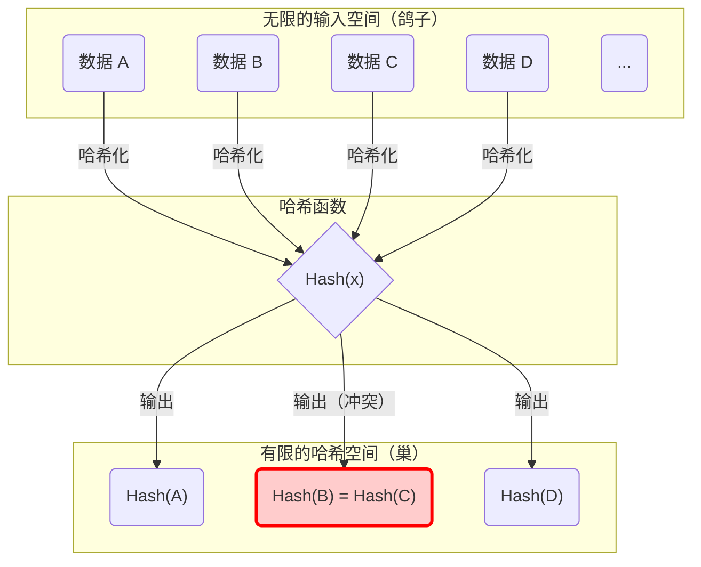
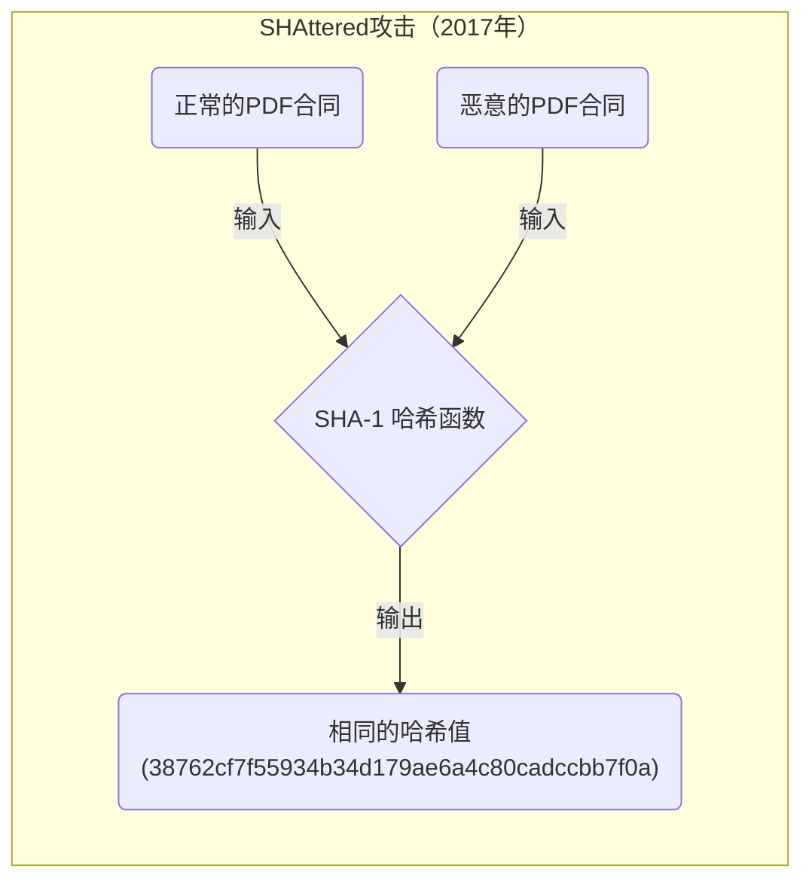
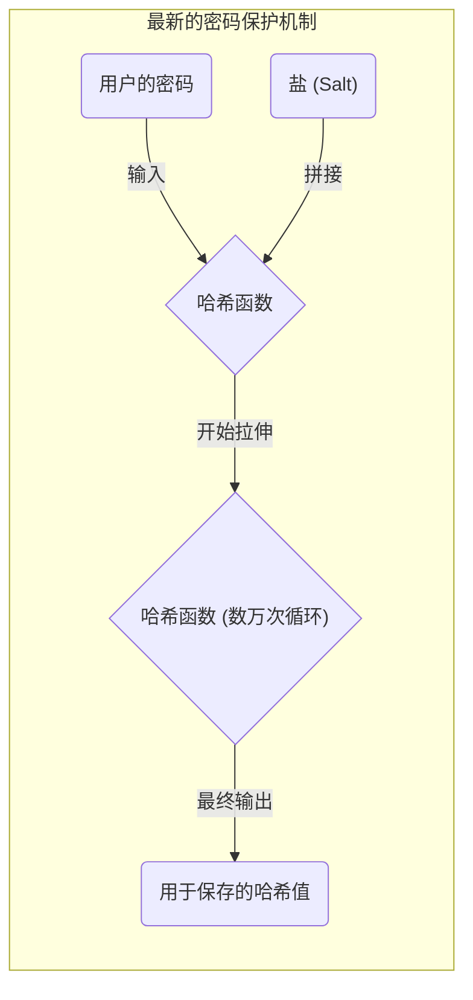

在学习计算机科学、信息安全和密码技术的过程中，无法避开的概念就是 **“鸽巢原理（Pigeonhole Principle）”** 和 **“哈希冲突（Hash Collision）”** 。
鸽巢原理本身非常简单，只是陈述了一个连小学生都能直观理解的理所当然的事实。然而，这个看似简单的数学原理，却对支撑现代互联网社会的哈希函数和密码系统的安全性设计产生了不可估量的影响。

本文将从鸽巢原理的基础概念讲起，结合数式和图解，详细解说哈希冲突的机制、生日悖论对计算复杂度的影响、过去密码算法（如 SHA-1 ）中实际发生冲突的案例，以及为了未来密码技术进行的安全性评估应用。

## 1. 鸽巢原理（Pigeonhole Principle）的基础

**“鸽巢原理”** （也被称为狄利克雷抽屉原理或抽屉原则）是由19世纪数学家彼得·古斯塔夫·狄利克雷明确提出的概念，定义如下：

> 当 $n$ 只鸽子飞进 $m$ 个鸽巢时，如果 $n > m$ ，那么至少有1个鸽巢里有2只或2只以上的鸽子。

例如，假设有10只鸽子飞进9个鸽巢。无论你多么努力地将鸽子均匀分配，也必定会有某个鸽巢里住着2只或以上的鸽子。这看起来非常直观，似乎是理所当然、不言自明甚至不需要证明的事情，但将其进行数学上的形式化，它就成为了存在性证明中非常强大的工具。

### 日常生活中的具体例子

不仅是鸽子和鸽巢，这个原理可以应用到各种日常事物中。

*  **头发的数量** ：据说人类头发的数量最多约为20万根。而东京的人口约为1400万。因此，在东京必定存在 **“头发数量完全相同的两个人”** （鸽子 = 东京人口，巢 = 头发数量的种类）。
*  **出生的月份** ：只要聚集了13个人，其中至少有2人是同一个月出生的（鸽子 = 13人，巢 = 12个月）。

### 用数学公式（KaTeX）进行严格表达

让我们用集合论和映射的语言，从数学上表达这个原理。
设有限集合 $A$ 的元素个数为 $|A|$ ，有限集合 $B$ 的元素个数为 $|B|$ ，假设存在一个从集合 $A$ 到集合 $B$ 的函数（映射） $f: A \rightarrow B$ 。
此时，如果 $|A| > |B|$ ，那么函数 $f$ 不可能成为“单射（Injective）”。单射是指不同的输入必定对应不同的输出的性质。
也就是说，必定存在满足以下条件的不同元素 $x, y \in A$ 。

$$
\exists x, y \in A \quad (x \neq y \land f(x) = f(y))
$$

这个性质，正是解释后文所述的信息科学中 **“哈希冲突”** 根本原因的数学公式。

## 2. 哈希函数与哈希冲突的机制

### 什么是密码学哈希函数？

**哈希函数** 是一种接收任意长度的输入数据（消息、文件、密码等），并将其转换为固定长度的输出数据（哈希值、摘要）的函数。代表性的密码学哈希函数包括目前广泛使用的 SHA-256 和 SHA-3 等。

在密码技术中使用的哈希函数，主要被要求具备以下3个严格的安全要求。

1.  **抗第一原像性（Pre-image resistance）** ：从输出的哈希值，极难逆推（还原）出原始的输入数据。
2.  **抗第二原像性（Second pre-image resistance）** ：给定某个特定的输入数据时，极难找到与该数据具有相同哈希值的“另一个输入数据”。
3.  **抗冲突性（Collision resistance）** ：极难任意找到两个不同的输入数据，使得它们输出相同的哈希值。

### 从鸽巢原理看“冲突的必然性”

现在，让我们把前面提到的鸽巢原理应用到哈希函数上来思考一下。

*  **鸽子** ：输入数据的集合。由于文件内容和字符串组合是无限存在的，因此元素数量 $|A|$ 实际上是“无穷大”。
*  **巢** ：哈希值的集合。由于哈希值是固定长度的，因此元素数量 $|B|$ 是“有限”的。

例如，在[比特币](https://kenji.blog/zh-cn/p/cryptocurrency-and-bitcoin/)等区块链技术中使用的 SHA-256 ，其输出是256位。因此，可能产生的哈希值种类有 $2^{256}$ 种（约 $1.15 \times 10^{77}$ ）。这个数字虽然庞大到逼近可观测宇宙中原子总数的程度，但它终究是一个 **有限的数字** 。

另一方面，作为输入数据可能存在的文章或图片文件的变体则是 **无限** 存在的。
因此，由于“输入数据的总数” $>$ “哈希值的总数”这个不等式成立，根据鸽巢原理， **必定存在两个不同的输入数据，它们会产生相同的哈希值** 。这就是被称为 **“哈希冲突（Hash Collision）”** 的现象。

下面的 Mermaid 图展示了无限的数据被映射到有限的哈希空间的过程。

在上面的图中，输入的“数据B”和“数据C”通过函数被分配到了完全相同的哈希值上，红框标出的部分正表示发生了冲突（Collision）的地方。

## 3. 生日攻击（Birthday Attack）与冲突概率的威胁

从鸽巢原理可以清楚地看出哈希冲突在理论上是不可避免的，但随之产生了一个实际疑问：“那么，实际上找到那个冲突到底有多难呢？”这里要登场的就是 **“生日悖论（Birthday Paradox）”** ，以及利用其数学性质的 **“生日攻击（Birthday Attack）”** 。

### 什么是生日悖论

有一个著名的概率论问题：“需要聚集多少人，其中有两个人同一天过生日的概率才会超过50%？”
一年有365天，根据鸽巢原理，必定（以100%的概率）有同一天过生日的人，是在聚集了366人的时候。然而令人惊讶的是，概率超过50%却只需要仅仅 **23人** 聚集的时候。与人类直觉相比，在少得多的人数下就可能发生“冲突”，这就是它被称为悖论的原因。

### 在哈希冲突中的应用与数学证明

设哈希值空间的大小为 $N$ （例如 SHA-256 的话 $N = 2^{256}$ ）。让我们求出随机生成 $k$ 个输入数据并计算哈希值时，至少发生一组冲突的概率 $P$ 。

所有输入都变为不同哈希值的概率（即完全不发生冲突的概率）计算如下。

$$
1 \times \left(1 - \frac{1}{N}\right) \times \left(1 - \frac{2}{N}\right) \times \cdots \times \left(1 - \frac{k-1}{N}\right)
$$

利用泰勒展开的近似公式 $1 - x \approx e^{-x}$ ，发生冲突的概率 $P$ 可以近似如下。

$$
P \approx 1 - e^{-\frac{k(k-1)}{2N}} \approx 1 - e^{-\frac{k^2}{2N}}
$$

为了求出使冲突概率达到50%（ $P = 0.5$ ）的试验次数 $k$ ，解方程：

$$
0.5 = e^{-\frac{k^2}{2N}} \implies \ln(0.5) = -\frac{k^2}{2N} \implies k \approx \sqrt{2 \ln 2 \cdot N} \approx 1.177 \sqrt{N}
$$

这个结果非常重要。它意味着，当哈希值的输出空间为 $N$ 时，大约进行 $\sqrt{N}$ 次（即 $N^{0.5}$ 次）左右的计算，找到哈希冲突的概率就会超过50%。

在 SHA-256 的情况下，输出空间为 $2^{256}$ ，但如果使用生日攻击，计算出 $\sqrt{2^{256}} = 2^{128}$ 次，就有可能找到哈希冲突。 $2^{128}$ 的计算次数，是一个即使动用现代所有的超级计算机，也需要花费超过宇宙寿命的时间的极度天文数字，因此 SHA-256 目前被认为是安全的（满足抗冲突性）。

## 4. 现实世界中的哈希冲突历史：SHAttered

不仅是理论层面的讨论，现实世界中也存在哈希冲突被证实的历史案例。

曾经在网站的 SSL 证书和文件完整性校验中广泛使用的一种哈希函数叫做 **“SHA-1”** （160位）。由于输出长度为160位，理论上搜索冲突需要 $2^{80}$ 次计算。

然而，在2017年，Google和阿姆斯特丹国立数学与计算机科学研究中心（CWI）的研究团队，发表了一种名为 **“SHAttered”** 的攻击手法。他们应用了密码分析技术的进步，成功以 $2^{63.1}$ 次的计算量发现了 SHA-1 的冲突。

他们公开了世界上首例 **SHA-1 哈希值完全一致的两个 PDF 文件** ，尽管这两个文件的内容完全不同（一个是正常的文档，另一个是包含恶意的文档）。这一事件宣告了 SHA-1 作为“安全的哈希函数”的寿命终结，并促使整个业界决定向 SHA-2 （如 SHA-256 等）过渡。

像这样，随着数学上的突破和计算机的发展，密码算法注定会逐渐被削弱。

## 5. 数据结构中的鸽巢原理：哈希表

在密码技术以外的领域，鸽巢原理和哈希冲突也是重要的主题。在编程中频繁使用的 **“哈希表（关联数组或字典类型）”** 就是其代表例。

在哈希表中，根据键（Key）计算哈希值，并将其作为数组的索引来存储值。如果试图存储比数组大小（巢）更多的数据（鸽子），或者哈希函数存在偏差，那么不同的键指向相同索引的“冲突”就必然会发生。

为了解决这种冲突，内置了以下之类的算法。

*  **链地址法（Chaining）** ：将发生冲突的元素用链表（Linked List）连接起来，存放在同一个桶（Bucket）中。
*  **开放寻址法（Open Addressing）** ：当发生冲突时，按照特定规则寻找“空闲的其他桶”来存放。

在编程语言（如 Python 的 `dict` 或 Java 的 `HashMap` 等）的底层，为了高速且高效地处理由鸽巢原理引起的冲突，凝聚了高度的巧思。

## 6. 密码技术中安全性的保障与未来

既然根据鸽巢原理，不可能制造出“绝对不发生冲突的哈希函数”，那么在信息安全世界中采取的方法就是 **“将其设计成在现实的时间和计算资源下，绝对无法找到冲突”** 。

### 保障安全裕度

最大的防御策略是让哈希值的位长度足够长。
当位长度变长时，攻击所需的计算量将呈指数级增长。

| 算法 | 输出长度 $n$ | 搜索冲突的计算量 $2^{n/2}$ | 当前状态 |
|---|---|---|---|
| MD5 | 128 bit | $2^{64}$ | 完全被攻破（不推荐） |
| SHA-1 | 160 bit | $2^{80}$ | 被攻破（不推荐） |
| SHA-256 | 256 bit | $2^{128}$ | 实际上安全 |
| SHA-512 | 512 bit | $2^{256}$ | 非常安全 |
| SHA-3 (Keccak) | 256/512 bit | $2^{128} / 2^{256}$ | 非常安全（结构不同） |

在选择密码技术时，预测攻击者的计算机性能提升（如摩尔定律等）和未来量子计算机的崛起，选择具备充足 **“安全裕度（Security Margin）”** 的算法是不可或缺的。

### 盐（Salt）与拉伸（Stretching）用于密码保护

此外，在密码泄露防护方面，也有一些虽然性质上与哈希冲突稍有不同，但非常重要的措施。如果仅仅是将密码哈希化，在面对使用预先计算好的庞大哈希值数据库（彩虹表）进行攻击时将毫无还手之力。

为了防止这种情况，为每个密码添加一串随机字符串，即 **“盐（Salt）”** 然后再进行哈希化，或者有意地将哈希计算重复数千到数万次，进行被称为 **“拉伸（Stretching）”** 的处理（如 PBKDF2、bcrypt、Argon2 等密钥派生函数）。

通过这种做法，故意大幅提高攻击者必须付出的计算成本，使得暴力破解攻击变得不切实际。

## 7. 总结

本次我们解说了 **“鸽巢原理”** 这样一个简单且直观的数学定理，是如何必然地引起 **“哈希冲突”** 这种现象，以及它对密码技术的安全性设计产生了怎样的影响。

*  **鸽巢原理的必然性** ：输入无限而输出有限的哈希函数，在数学上必定存在冲突。
*  **生日攻击的威胁** ：根据生日悖论，对于大小为 $N$ 的哈希值空间，仅需要约 $\sqrt{N}$ 次的计算就有可能找到冲突。
*  **现代密码的设计思想** ：由于将冲突降为零是不可能的，因此通过足够大的输出长度，在计算复杂度层面上使寻找冲突成为不可能。

深入理解这些原理，直接关系到理解支撑区块链、数字签名、密码管理等现代安全系统底层的基础。
乍看深奥复杂的密码技术，其根源竟隐藏着如“鸽子与巢”、“生日”等我们身边熟悉的原理和概率论，这正是信息科学非常深奥且有趣的地方。
