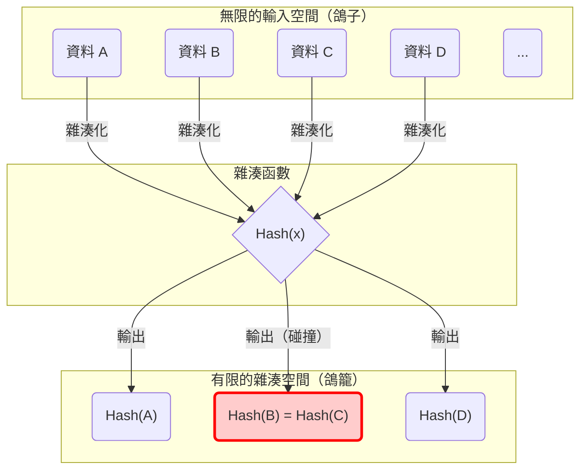
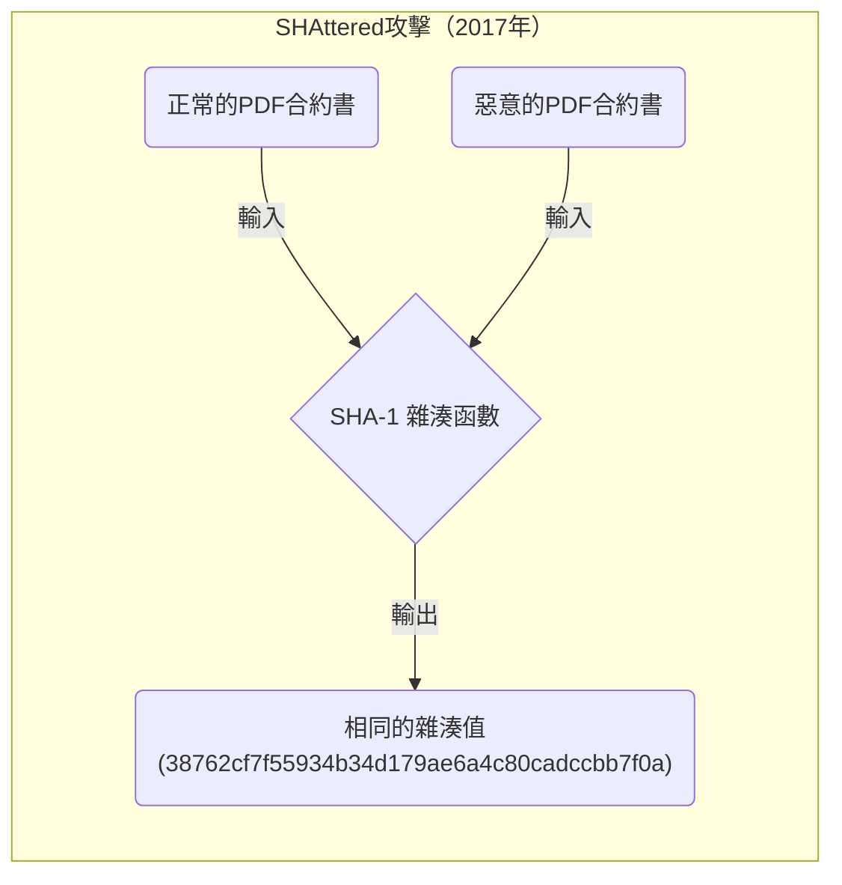
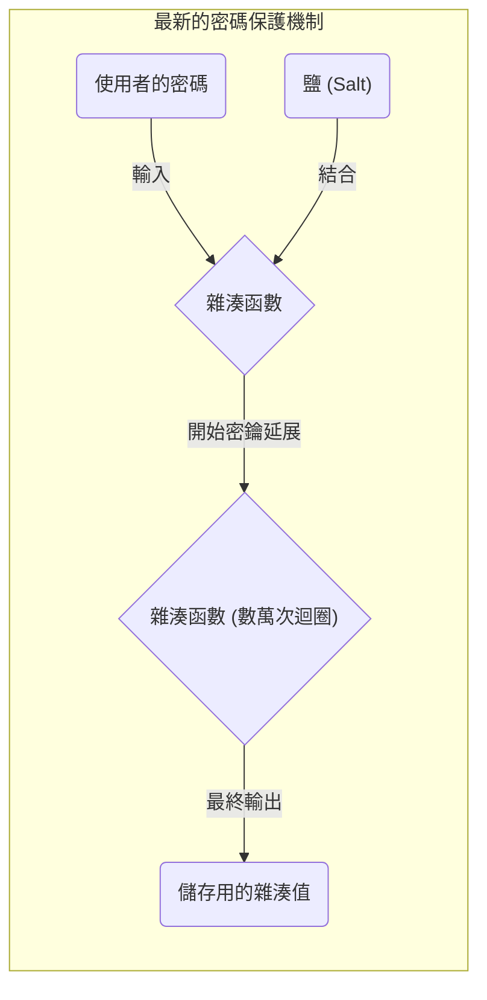

在學習計算機科學、資訊安全以及密碼學技術時，絕對無法避開 「 **鴿籠原理（Pigeonhole Principle）** 」 與 「 **雜湊碰撞（Hash Collision）** 」 這兩個概念。
鴿籠原理本身非常簡單，甚至連小學生都能憑直覺理解，只不過是闡述了一個理所當然的事實。然而，這個看似簡單的數學原理，對支撐現代網際網路社會基礎的雜湊函數與密碼系統安全性設計，卻有著無法估量的影響。

本文將從鴿籠原理的基礎概念開始，詳細解說雜湊碰撞的機制、生日悖論對運算複雜度的影響、過去密碼學演算法（如 SHA-1 等）中實際發生的碰撞案例，以及應用於未來密碼學技術的安全性評估，並搭配數學公式與圖解進行深入探討。

## 1. 鴿籠原理（Pigeonhole Principle）的基礎

「 **鴿籠原理** 」 （又稱為狄利克雷抽屜原理，或抽屜原則），是由 19 世紀數學家彼得·古斯塔夫·約翰·狄利克雷所明確定義的概念，其定義如下：

> 當 $n$ 隻鴿子進入 $m$ 個鴿籠，若 $n > m$ ，則至少有一個鴿籠裡有兩隻（或以上）的鴿子。

例如，假設有 10 隻鴿子進入 9 個鴿籠。無論你多麼努力地平均分配鴿子，必然會有一個鴿籠同時住著兩隻（或以上）的鴿子。這看似是非常直觀、理所當然到甚至不需要特別證明的常識，但若將其數學化、公式化，就會成為證明存在性問題的強大工具。

### 日常生活中的具體範例

除了鴿子與鴿籠，這個原理也可以應用在各種日常事物上。

*  **頭髮的數量** ：一般認為人類的頭髮數量最多約為 20 萬根。而東京的人口約為 1400 萬人。因此，在東京必然存在 「 **頭髮數量完全相同的兩個人** 」 （鴿子＝東京人口，鴿籠＝頭髮數量的模式）。
*  **出生的月份** ：只要聚集 13 個人，其中至少會有兩個人在同一個月份出生（鴿子＝ 13 人，鴿籠＝ 12 個月）。

### 數學公式（KaTeX）的嚴格表示

讓我們用集合論與映射的語言，將這個原理以數學方式呈現。
設有限集合 $A$ 的元素數量為 $|A|$ ，有限集合 $B$ 的元素數量為 $|B|$ ，並假設存在一個從集合 $A$ 映射到集合 $B$ 的函數 $f: A \rightarrow B$ 。
此時，若 $|A| > |B|$ ，則函數 $f$ 不可能為「單射（Injective）」。所謂單射，是指不同的輸入必定對應到不同輸出的性質。
也就是說，必然存在相異的元素 $x, y \in A$ 滿足以下條件：

$$
\exists x, y \in A \quad (x \neq y \land f(x) = f(y))
$$

正是這個性質，成為了解釋後文所述資訊科學中 「 **雜湊碰撞** 」 根本原因的數學公式。

## 2. 雜湊函數與雜湊碰撞的機制

### 什麼是密碼學雜湊函數？

 **雜湊函數** 是一種將任意長度的輸入資料（如訊息、檔案、密碼等），轉換為固定長度的輸出資料（雜湊值、摘要）的函數。代表性的密碼學雜湊函數中，有目前被廣泛使用的 SHA-256 與 SHA-3 等。

應用於密碼學技術的雜湊函數，主要被要求具備以下三項嚴格的安全性條件：

1.  **抗原像性（Pre-image resistance）** ：從輸出的雜湊值，極難逆向推算（還原）出原始的輸入資料。
2.  **抗次原像性（Second pre-image resistance）** ：給定某一特定輸入資料時，極難找到另一個具有相同雜湊值的「不同輸入資料」。
3.  **抗碰撞性（Collision resistance）** ：極難任意找到一對會產生相同雜湊值的「兩個不同輸入資料」。

### 從鴿籠原理看「碰撞的必然性」

現在，讓我們將前面的鴿籠原理套用到雜湊函數上來思考。

*  **鴿子** ：輸入資料的集合。由於檔案內容或字串的組合有無限多種可能，因此元素數量 $|A|$ 事實上是「無限大」。
*  **鴿籠** ：雜湊值的集合。由於雜湊值長度固定，因此元素數量 $|B|$ 是「有限的」。

舉例來說，在比特幣等區塊鏈技術中使用的 SHA-256 ，其輸出為 256 位元。因此，可能產生的雜湊值種類共有 $2^{256}$ 種（約 $1.15 \times 10^{77}$ ）。這是一個逼近可觀測宇宙中原子總數的龐大數字，但終究還是一個 **有限的數字** 。

另一方面，作為輸入資料的文字或圖片檔案，其變化卻是 **無限的** 。
因此，「輸入資料的總數」 $>$ 「雜湊值的總數」這個不等式必定成立。根據鴿籠原理， **必定存在兩個不同的輸入資料，產生相同的雜湊值** 。這個現象就被稱為 「 **雜湊碰撞（Hash Collision）** 」 。

以下的 Mermaid 圖表，展示了無限的資料被映射到有限雜湊空間的情況。

在上方圖表中，輸入的「資料 B」與「資料 C」透過函數被分配到完全相同的雜湊值，以紅框標示的部分，正是發生了碰撞（Collision）的位置。

## 3. 生日攻擊（Birthday Attack）與碰撞機率的威脅

從鴿籠原理可以清楚得知雜湊碰撞在理論上是無法避免的，但是「在實務上，找到該碰撞究竟有多困難？」這個實用性的問題便隨之產生。此時登場的便是 「 **生日悖論（Birthday Paradox）** 」 ，以及利用其數學性質的 「 **生日攻擊（Birthday Attack）** 」 。

### 什麼是生日悖論

有一個著名的機率論問題：「需要聚集多少人，其中有兩個人生日相同的機率才會超過 50%？」
一年有 365 天，如果依照鴿籠原理，要確信（ 100% 機率）有相同生日的人存在，必須聚集 366 人。然而，令人驚訝的是，機率要超過 50% ，竟然只需要聚集 **23 人** 。之所以被稱為悖論，正是因為發生「碰撞」所需的人數，遠比人類直覺想像的要少得多。

### 應用於雜湊碰撞與數學證明

假設雜湊值空間的大小為 $N$ （例如 SHA-256 則 $N = 2^{256}$ ）。當隨機產生 $k$ 個輸入資料並計算雜湊值時，讓我們來求算至少發生一組碰撞的機率 $P$ 。

所有輸入都產生不同雜湊值的機率（也就是完全沒有發生碰撞的機率），可由以下公式計算：

$$
1 \times \left(1 - \frac{1}{N}\right) \times \left(1 - \frac{2}{N}\right) \times \cdots \times \left(1 - \frac{k-1}{N}\right)
$$

利用泰勒展開式的近似公式 $1 - x \approx e^{-x}$ ，發生碰撞的機率 $P$ 可以近似為以下公式：

$$
P \approx 1 - e^{-\frac{k(k-1)}{2N}} \approx 1 - e^{-\frac{k^2}{2N}}
$$

為了求出碰撞機率達到 50% （ $P = 0.5$ ）所需的嘗試次數 $k$ ，我們來解這個方程式：

$$
0.5 = e^{-\frac{k^2}{2N}} \implies \ln(0.5) = -\frac{k^2}{2N} \implies k \approx \sqrt{2 \ln 2 \cdot N} \approx 1.177 \sqrt{N}
$$

這個結果非常重要。這意味著，當雜湊值的輸出空間為 $N$ 時，大約只需要進行 $\sqrt{N}$ 次（亦即 $N^{0.5}$ 次）左右的運算，能找到雜湊碰撞的機率就會超過 50% 。

以 SHA-256 為例，輸出空間為 $2^{256}$ ，但如果使用生日攻擊，大約只需要 $\sqrt{2^{256}} = 2^{128}$ 次的運算，就能找到雜湊碰撞。由於 $2^{128}$ 這個運算次數，即便是動員現代所有超級電腦，也需要花費超過宇宙壽命的時間，是一個天文數字，因此 SHA-256 目前仍被視為是安全的（符合抗碰撞性）。

## 4. 現實世界中雜湊碰撞的歷史：SHAttered

不僅僅是理論，現實世界中也存在著證明雜湊碰撞的歷史性案例。

過去曾被廣泛應用於網站 SSL 憑證與檔案完整性驗證的 「 **SHA-1** 」 （160 位元）雜湊函數，由於輸出長度為 160 位元，理論上尋找碰撞需要進行 $2^{80}$ 次運算。

然而，在 2017 年，Google 與阿姆斯特丹國家數學和計算機科學研究中心（CWI）的研究團隊，發表了一種被稱為 「 **SHAttered** 」 的攻擊手法。他們應用密碼分析技術的進展，以 $2^{63.1}$ 次的運算量成功找到了 SHA-1 的碰撞。

他們在世界上首次公開了 **兩個 SHA-1 雜湊值完全相同，但內容截然不同的 PDF 檔案** （一份是正常的合約文件，另一份則是惡意的合約文件）。因為這個事件，SHA-1 作為「安全雜湊函數」的壽命正式告終，整個業界也決定全面遷移至 SHA-2 （如 SHA-256 等）。

就這樣，密碼學演算法注定會隨著數學的突破與計算機效能的進化而逐漸衰弱。

## 5. 資料結構中的鴿籠原理：雜湊表

即使在密碼學以外的領域，鴿籠原理與雜湊碰撞同樣是個重要的課題。程式設計中頻繁使用的 「 **雜湊表（關聯陣列或字典型別）** 」 便是最具代表性的例子。

在雜湊表中，會從鍵值計算出雜湊值，並將其作為陣列的索引來儲存資料。如果試圖儲存比陣列大小（鴿籠）還要多的資料（鴿子），或者雜湊函數的分布不均勻，必然會發生不同鍵值指向同一個索引的「碰撞」。

為了解決這個碰撞問題，通常會內建以下幾種演算法：

*  **鏈結法（Chaining）** ：將發生碰撞的元素透過鏈結串列（Linked List）串連，並儲存在同一個儲存桶（Bucket）中。
*  **開放定址法（Open Addressing）** ：當發生碰撞時，按照特定規則尋找「另一個空的儲存桶」來存放。

在程式語言（如 Python 的 `dict` 或 Java 的 `HashMap` 等）的背後，正蘊含著如何高速且高效率處理因鴿籠原理而引發之碰撞的高階巧思。

## 6. 密碼學技術中安全性的確保與未來

既然受到鴿籠原理的限制，不可能創造出「絕對不會碰撞的雜湊函數」，資訊安全領域便採取了另一種策略： 「 **設計成在現實的時間與運算資源內，絕對無法找到碰撞** 」 。

### 確保安全餘裕

最大的防禦策略，就是將雜湊值的位元長度拉得足夠長。
只要增加位元長度，攻擊所需的運算量就會呈指數級別增長。

| 演算法 | 輸出長度 $n$ | 碰撞探索的運算量 $2^{n/2}$ | 目前狀態 |
|---|---|---|---|
| MD5 | 128 bit | $2^{64}$ | 完全被破解（不建議使用） |
| SHA-1 | 160 bit | $2^{80}$ | 被破解（不建議使用） |
| SHA-256 | 256 bit | $2^{128}$ | 實務上安全 |
| SHA-512 | 512 bit | $2^{256}$ | 非常安全 |
| SHA-3 (Keccak) | 256/512 bit | $2^{128} / 2^{256}$ | 非常安全（結構不同） |

在選擇密碼學技術時，必須考量攻擊者的計算機效能提升（如摩爾定律等），以及未來量子電腦崛起的可能，選擇具備充分 「 **安全餘裕（Security Margin）** 」 的演算法是絕對必要的。

### 透過加鹽（Salt）與密鑰延展保護密碼

另外，有一項與雜湊碰撞性質稍有不同的重要技術，用於防範密碼外洩。如果只是單純將密碼雜湊化，對於使用了預先計算好的龐大雜湊值資料庫（彩虹表）所發動的攻擊，是毫無招架之力的。

為了防範這類攻擊，在雜湊化之前會為每個密碼加上一串稱為 「 **鹽（Salt）** 」 的隨機字串，或是進行稱為 「 **密鑰延展（Stretching）** 」 的處理，刻意將雜湊運算重複數千到數萬次（如 PBKDF2、bcrypt、Argon2 等金鑰衍生函數）。

透過這些方式，可以刻意大幅提升攻擊者必須付出的運算成本，讓暴力破解攻擊變得不切實際。

## 7. 總結

本次我們解說了 「 **鴿籠原理** 」 這個簡單直觀的數學定理，是如何必然地引發 「 **雜湊碰撞** 」 的現象，以及這對密碼學技術的安全性設計造成了什麼樣的影響。

*  **鴿籠原理的必然性** ：輸入無限且輸出有限的雜湊函數，在數學上必然存在碰撞。
*  **生日攻擊的威脅** ：由於生日悖論，對於大小為 $N$ 的雜湊值空間，大約只需進行 $\sqrt{N}$ 次的運算，就有可能找到碰撞。
*  **現代密碼學的設計理念** ：既然不可能將碰撞降為零，那就將輸出長度設計得足夠大，使找到碰撞在計算上成為不可能。

深入理解這些原理，將直接幫助我們理解區塊鏈、數位簽章、密碼管理等現代安全系統的底層邏輯。
看似艱澀複雜的密碼學技術，其根本竟隱藏著如同「鴿子與鴿籠」或「生日」般與我們生活息息相關的原理和機率論，這正是資訊科學最深奧且有趣的地方。
