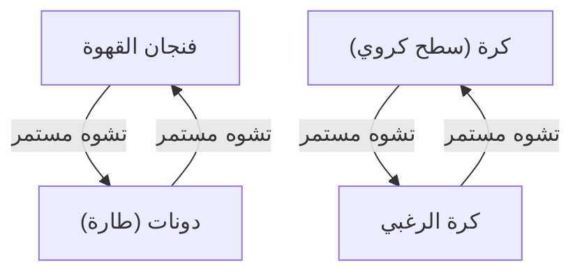
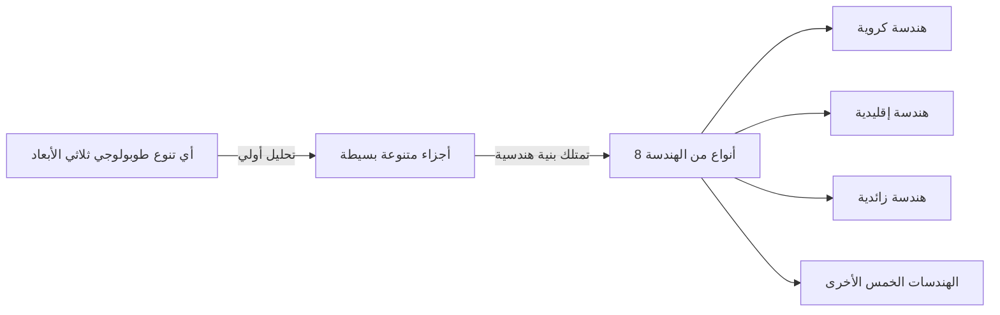

في عالم الرياضيات، هناك العديد من الألغاز العميقة والجميلة التي تتحدى الحدس البشري. ومن بين أشهرها والتي كان لها نهاية درامية هي ** حدسية بوانكاريه ** (Poincaré Conjecture).

هذه الحدسية التي اقترحها عالم الرياضيات الفرنسي العبقري هنري بوانكاريه عام 1904، كانت مشكلة أساسية في الطوبولوجيا ترتبط ارتباطًا مباشرًا بالموضوع العظيم المتمثل في شكل الكون. لما يقرب من 100 عام، حاول العديد من علماء الرياضيات البارزين حل هذه المعضلة الصعبة للغاية وفشلوا، حتى تم إثباتها فجأة بين عامي 2002 و 2003 على يد عالم الرياضيات الروسي المنعزل غريغوري بيرلمان، مما أذهل العالم بأسره.

في هذا المقال، سنتعمق في المعنى الكامن وراء حدسية بوانكاريه، والمفاهيم الأساسية للطوبولوجيا، وخلفية إثبات بيرلمان، مع تضمين المعادلات والرسوم التوضيحية.

## 1. ما هي الطوبولوجيا (الهندسة الطوبولوجية)؟

من أجل فهم حدسية بوانكاريه، يجب أن نتعرف أولاً على مجال من مجالات الرياضيات يسمى ** الطوبولوجيا **. تُعرف الطوبولوجيا أيضاً باسم "الهندسة المرنة".

في الهندسة العادية (الهندسة الإقليدية)، تعتبر الخصائص مثل الطول والزاوية والمساحة مهمة، ولكن في الطوبولوجيا يتم تجاهلها. بل تدرس فقط الخصائص (الخصائص الطوبولوجية) التي يتم الحفاظ عليها حتى عند إجراء تشوهات مستمرة مثل "التمدد" و"الثني" و"الانكماش" على الجسم. ومع ذلك، لا يُسمح بعمليات مثل "القطع" أو "اللصق" أو "إحداث ثقوب".

المثال الشهير هو "فنجان القهوة والدونات".

يحتوي فنجان القهوة على "ثقب" واحد يتمثل في المقبض. وتحتوي الدونات أيضًا على "ثقب" واحد في المنتصف. في عالم الطوبولوجيا، إذا كان عدد الثقوب هو نفسه، فيمكن تشويه أحدهما باستمرار إلى الآخر، وبالتالي يُعتبر أن لهما "نفس الشكل (متشابهان طوبولوجياً)".

من ناحية أخرى، الكرة (سطح الكرة) لا تحتوي على ثقوب. لذلك، بغض النظر عن كيفية تشويه الكرة باستمرار، لا يمكن تحويلها إلى شكل دونات. هذا "الوجود أو الغياب للثقوب" هو الاختلاف الحاسم في الطوبولوجيا.

## 2. الفضاء المتصل ببساطة ونص حدسية بوانكاريه

حاولت حدسية بوانكاريه تمييز "الكرة" من منظور الطوبولوجيا هذا.

يُطلق على "سطح الكرة" الذي نراه كل يوم في حياتنا اليومية اسم الكرة ثنائية الأبعاد ( $S^2$ ). اعتقد بوانكاريه أنه إذا كان هناك شكل يمثل فضاءً مغلقًا "بدون ثقوب"، فيجب أن يكون متشابهاً طوبولوجياً مع الكرة.

المفهوم المهم هنا هو ** متصل ببساطة ** (simply connected).

عندما يمكن تقليص أي حلقة (دائرة) في الفضاء إلى نقطة واحدة دون الخروج من الفضاء، يُقال إن هذا الفضاء "متصل ببساطة".

- ** الكرة ( $S^2$ ) **: يمكن تقليص أي حلقة مرسومة على السطح إلى نقطة واحدة عن طريق تحريكها على طول السطح. هذا يعني أنها متصلة ببساطة.
- ** الطارة (سطح الدونات) **: الحلقة المرسومة بحيث تمر عبر الثقب ستعلق بالثقب ولا يمكن تقليصها إلى نقطة واحدة. هذا يعني أنها ليست متصلة ببساطة.

تساءل بوانكاريه عما إذا كانت هذه الخاصية، التي تنطبق على الكرة ثنائية الأبعاد، تنطبق أيضًا على الكرة ثلاثية الأبعاد ( $S^3$ ).

> ** حدسية بوانكاريه **
> أي تنوع طوبولوجي مغلق ثلاثي الأبعاد ومتصل ببساطة هو مشابه طوبولوجياً للكرة ثلاثية الأبعاد $S^3$ .

بعبارات بديهية، هذا يطرح السؤال التالي: "لنفترض أنك خرجت إلى الفضاء الكوني حاملاً حبلاً طويلاً، وقمت بدورة كاملة ثم عدت. إذا قمت بسحب طرفي الحبل وتمكنت دائمًا من استعادة الحبل بالكامل، فهل يمكن القول إن شكل الكون مستدير (كرة ثلاثية الأبعاد)؟"

## 3. التوسع نحو أبعاد أعلى ومعاناة علماء الرياضيات

من المثير للاهتمام أن حدسية بوانكاريه تم حلها في أبعاد أعلى قبل حلها في البعد الثالث (وهو بعد الفضاء الذي نعيش فيه).

$$
\text{في حالة التنوع الطوبولوجي من البعد } n \ge 5
$$

في الستينيات، أثبت ستيفن سمال وآخرون حدسية بوانكاريه للأبعاد العليا حيث $n \ge 5$. في الأبعاد العليا، تكون "درجة الحرية" عند تشويه الأشكال كبيرة، لذلك هناك مساحة كافية لفك التشابك، مما جعل الإثبات أسهل نسبيًا.

$$
\text{في حالة التنوع الطوبولوجي من البعد } n = 4
$$

في عام 1982، استخدم مايكل فريدمان تقنيات معقدة للغاية لإثبات حدسية بوانكاريه ذات الأبعاد الأربعة وحصل على ميدالية فيلدز.

ومع ذلك، فإن الحالة الأصلية حيث $n = 3$ (ثلاثية الأبعاد) ظلت مستعصية على الحل. كان الفضاء ثلاثي الأبعاد هو البعد الأكثر صعوبة، حيث لم يكن هناك "مساحة" كافية لفك التشابك، ولم يكن بسيطًا مثل الأبعاد المنخفضة.

## 4. حدسية الترييض لثيرستون

في أواخر السبعينيات، اقترح ويليام ثيرستون رؤية كبرى حول بنية التنوعات الطوبولوجية ثلاثية الأبعاد، وهي ** حدسية الترييض ** (Geometrization conjecture).

جادل بأن أي تنوع طوبولوجي ثلاثي الأبعاد يمكن تفكيكه إلى مزيج من 8 أنواع أساسية من "الهندسة (اللبنات الأساسية)".

إذا كانت حدسية الترييض لثيرستون صحيحة، فسيتم استنتاج أن التنوعات الطوبولوجية المتصلة ببساطة تمتلك تلقائيًا عناصر "الهندسة الكروية" فقط، ونتيجة لذلك سيتم إثبات حدسية بوانكاريه أيضًا. بعبارة أخرى، تبين أن حدسية بوانكاريه ليست سوى قطعة واحدة في لغز حدسية الترييض الأكبر بكثير.

ومع ذلك، كانت حدسية الترييض بحد ذاتها مشكلة صعبة للغاية.

## 5. تدفق ريتشي وظهور بيرلمان

كان ريتشارد هاميلتون هو من اقترح سلاحًا لاختراق هذا الجدار الضخم. لقد أدخل معادلة تفاضلية تسمى ** تدفق ريتشي ** (Ricci flow).

تدفق ريتشي هو معادلة تعمل على تسوية "انحناء" التنوع الطوبولوجي بسلاسة بمرور الوقت. بشكل بديهي، يشبه الأمر إذابة سطح طيني وعر بالحرارة ليصبح كرة مستديرة تمامًا تدريجيًا.

$$
\frac{\partial g_{ij}}{\partial t} = -2 R_{ij}
$$

هنا $g_{ij}$ يمثل الموتر المتري، و $R_{ij}$ يمثل موتر انحناء ريتشي.

كانت فكرة هاميلتون تتمثل في إثبات حدسية الترييض لثيرستون من خلال تطبيق تدفق ريتشي على أي تنوع طوبولوجي ثلاثي الأبعاد ومراقبة الشكل النهائي الذي سيستقر عليه. ومع ذلك، واجه البحث طريقًا مسدودًا عندما اصطدم بمشكلة قاتلة تتمثل في حدوث "نقاط شاذة" (تفردات) حيث يتم شد جزء من التنوع الطوبولوجي بشكل غير محدود حتى يتمزق أثناء عملية التشوه.

كان ** غريغوري بيرلمان ** هو من حل مشكلة التفرد هذه وأكمل الإثبات.

قام بيرلمان بتصنيف جميع التفردات التي تحدث في تدفق ريتشي بالكامل، وقام ببناء طريقة مذهلة صارمة رياضياً (تدفق ريتشي مع الجراحة) حيث يتم "إجراء جراحة" للفضاء لقطعه وفصله قبل حدوث التفرد مباشرة، ثم إعادة تشغيل تدفق ريتشي.

## 6. الإثبات الأسطوري ونهايته

بين عامي 2002 و 2003، قام بيرلمان بنشر 3 أوراق بحثية فجأة على خادم المسودات (arXiv). وقد احتوت على إثبات كامل لحدسية الترييض لثيرستون، وحدسية بوانكاريه.

نظرًا لأن أوراقه كانت شديدة التعقيد وموجزة للغاية، فقد شكل كبار علماء الرياضيات من جميع أنحاء العالم فرقًا واستغرقوا عدة سنوات للتحقق من هذه الأوراق. ونتيجة لذلك، تم التأكيد على أن إثبات بيرلمان لم يكن به أي عيوب وكان مثاليًا.

ومع ذلك، من هنا تبدأ تصرفات بيرلمان الأسطورية.
لقد رفض استلام ميدالية فيلدز، بل ورفض أيضًا قبول جائزة المليون دولار (حوالي 100 مليون ين) التي قدمها معهد كلاي للرياضيات كجائزة لمسائل الألفية. اختفى تمامًا من عالم الرياضيات واختار أن يعيش حياة هادئة مع والدته في مسقط رأسه، سانت بطرسبرغ.

## 7. خاتمة: المستقبل الذي تفتحه الطوبولوجيا

إن حل حدسية بوانكاريه لا يمثل فقط نهاية معضلة دامت 100 عام. بفضل تقديم تقنية تحليلية قوية مثل تدفق ريتشي إلى الهندسة، فُتحت آفاق جديدة في عالم الرياضيات.

بالإضافة إلى ذلك، فإن المحاولات الرياضية لفهم شكل الكون لا تزال تؤثر بعمق على فهم الأبعاد في الفيزياء الحديثة، وخاصة في نظرية الأوتار وعلم الكونيات.

يمكن القول إن شعلة المعرفة التي انتقلت من بوانكاريه إلى ثيرستون وهاميلتون ثم إلى بيرلمان، هي أعظم نصب تذكاري يثبت مدى عمق العقل البشري في الاقتراب من حقائق الكون الجميلة والعميقة.
