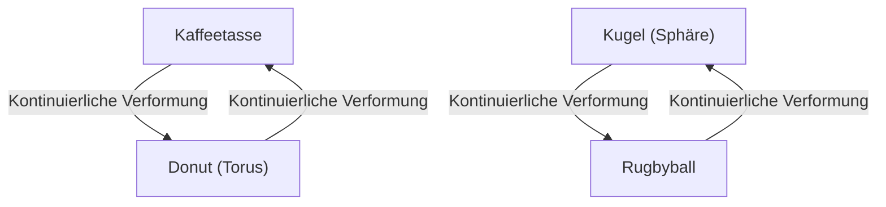
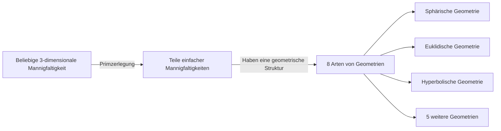

In der Welt der Mathematik gibt es viele tiefe und schöne Rätsel, die die menschliche Intuition auf die Probe stellen. Darunter ist das berühmteste mit dem dramatischsten Ende die **Poincaré-Vermutung** ([Poincaré Conjecture](https://kenji.blog/p/poincare-conjecture/)).

Diese Vermutung, die 1904 von dem brillanten französischen Mathematiker [Henri Poincaré](https://kenji.blog/p/poincare/) aufgestellt wurde, war ein grundlegendes Problem der Topologie (Analysis Situs), das direkt mit dem großen Thema der Form des Universums verbunden war. Etwa 100 Jahre lang versuchten viele berühmte Mathematiker, dieses extrem schwierige Problem zu lösen, und scheiterten. Von 2002 bis 2003 wurde es dann plötzlich von dem einsamen russischen Mathematiker Grigori Perelman bewiesen, was die ganze Welt überraschte.

In diesem Artikel werden wir tief eintauchen, beginnend mit der Bedeutung der Poincaré-Vermutung über die grundlegenden Konzepte der Topologie bis hin zum Hintergrund von Perelmans Beweis, und dabei mathematische Formeln und Diagramme verwenden.

## 1. Was ist Topologie?

Um die Poincaré-Vermutung zu verstehen, müssen wir zunächst das mathematische Gebiet der **Topologie** kennenlernen. Topologie wird auch als "weiche Geometrie" bezeichnet.

In der gewöhnlichen Geometrie (euklidischen Geometrie) sind Eigenschaften wie Länge, Winkel und Fläche wichtig, aber in der Topologie werden diese ignoriert. Es werden nur die Eigenschaften (topologische Eigenschaften) untersucht, die erhalten bleiben, auch wenn das Objekt kontinuierlichen Verformungen wie "Dehnen", "Biegen" oder "Schrumpfen" unterzogen wird. Operationen wie "Schneiden", "Kleben" oder "Löcher machen" sind jedoch nicht erlaubt.

Ein berühmtes Beispiel sind "Kaffeetasse und Donut".

Eine Kaffeetasse hat ein "Loch", nämlich den Henkel. Ein Donut hat ebenfalls ein "Loch" in der Mitte. In der Welt der Topologie werden zwei Objekte als "die gleiche Form (homöomorph)" betrachtet, wenn sie die gleiche Anzahl von Löchern haben, da eines kontinuierlich in das andere verformt werden kann.

Andererseits hat eine Kugel (die Oberfläche eines Balls) keine Löcher. Daher kann eine Kugel, egal wie man sie kontinuierlich verformt, nicht in die Form eines Donuts gebracht werden. Diese "Anwesenheit oder Abwesenheit von Löchern" ist der entscheidende Unterschied in der Topologie.

## 2. Einfach zusammenhängender Raum und die Aussage der Poincaré-Vermutung

[Die Poincaré-Vermutung](https://kenji.blog/p/poincare-conjecture/) ist ein Versuch, eine "Sphäre" aus dieser topologischen Perspektive zu charakterisieren.

Die "Kugeloberfläche", die wir im Alltag sehen, wird als 2-dimensionale Sphäre ( $S^2$ ) bezeichnet. Poincaré dachte, dass, wenn eine Form ein geschlossener Raum "ohne Löcher" ist, sie homöomorph (topologisch gleich) zu einer Sphäre sein könnte.

Das hierbei wichtige Konzept ist **einfach zusammenhängend** (simply connected).

Wenn eine beliebige geschlossene Kurve (Schleife) im Raum auf einen einzigen Punkt zusammengezogen werden kann, ohne den Raum zu verlassen, sagt man, der Raum sei "einfach zusammenhängend".

- **Sphäre ( $S^2$ )**: Jede auf der Oberfläche gezeichnete Schleife kann auf einen Punkt zusammengezogen werden, indem man sie über die Oberfläche gleiten lässt. Das heißt, sie ist einfach zusammenhängend.
- **Torus (Oberfläche eines Donuts)**: Eine Schleife, die so gezeichnet ist, dass sie durch das Loch verläuft, bleibt am Loch hängen und kann nicht auf einen Punkt zusammengezogen werden. Das heißt, er ist nicht einfach zusammenhängend.

Poincaré fragte, ob diese Eigenschaft, die für eine 2-dimensionale Sphäre gilt, auch für eine 3-dimensionale Sphäre ( $S^3$ ) zutrifft.

> **Poincaré-Vermutung**
> Jede einfach zusammenhängende geschlossene 3-dimensionale Mannigfaltigkeit ist homöomorph zur 3-dimensionalen Sphäre $S^3$.

Intuitiv gesprochen lautet die Frage: "Angenommen, du gehst mit einem langen Seil in den Weltraum, fliegst einmal irgendwie herum und kommst zurück. Wenn du beide Enden des Seils ziehst und das Seil immer vollständig einholen kannst, kann man dann sagen, dass das Universum rund (eine 3-dimensionale Sphäre) ist?"

## 3. Erweiterung auf höhere Dimensionen und die Kämpfe der Mathematiker

Interessanterweise wurde die Poincaré-Vermutung für höhere Dimensionen als die 3-dimensionale (die Dimension des Raumes, in dem wir leben) früher gelöst.

$$
\text{Für Mannigfaltigkeiten der Dimension } n \ge 5
$$

In den 1960er Jahren bewiesen Stephen Smale und andere die höherdimensionale Poincaré-Vermutung für $n \ge 5$. In höheren Dimensionen ist der "Freiheitsgrad" bei der Verformung von Formen groß, sodass es genügend Platz gibt, um Verwicklungen zu entwirren, was den Beweis relativ einfach machte.

$$
\text{Für Mannigfaltigkeiten der Dimension } n = 4
$$

1982 bewies Michael Freedman die 4-dimensionale Poincaré-Vermutung mit sehr komplexen Methoden und erhielt dafür die Fields-Medaille.

Aber nur der ursprüngliche Fall $n = 3$ (3 Dimensionen) konnte einfach nicht gelöst werden. Der 3-dimensionale Raum war die problematischste Dimension, ohne ausreichend "Spielraum", um Verwicklungen zu entwirren, und doch nicht so einfach wie die niedrigeren Dimensionen.

## 4. Thurstons Geometrisierungsvermutung

In den späten 1970er Jahren stellte William Thurston eine große Vision über die Struktur von 3-dimensionalen Mannigfaltigkeiten vor, die **Geometrisierungsvermutung**.

Er behauptete, dass jede mögliche 3-dimensionale Mannigfaltigkeit in eine Kombination von 8 grundlegenden "Geometrien (Bausteinen)" zerlegt werden kann.

Wenn Thurstons Geometrisierungsvermutung richtig wäre, würde daraus folgen, dass eine einfach zusammenhängende Mannigfaltigkeit automatisch nur Komponenten der "sphärischen Geometrie" haben kann, was folglich auch die Poincaré-Vermutung beweisen würde. Mit anderen Worten, es stellte sich heraus, dass die Poincaré-Vermutung nur ein Puzzleteil in der weitaus größeren Geometrisierungsvermutung war.

Die Geometrisierungsvermutung selbst war jedoch ein unfassbar schwieriges Problem.

## 5. Ricci-Fluss und das Erscheinen von Perelman

Die Waffe, die vorgeschlagen wurde, um diese riesige Mauer zu durchbrechen, stammte von Richard Hamilton. Er führte eine Differentialgleichung namens **Ricci-Fluss** (Ricci flow) ein.

Der Ricci-Fluss ist eine Gleichung, die die "Krümmung" einer Mannigfaltigkeit im Laufe der Zeit glatt ausgleicht. Intuitiv ist es vergleichbar mit der Vorstellung, die unebene Oberfläche von Ton mit Hitze zu schmelzen und sie allmählich in eine perfekt runde Kugel zu verwandeln.

$$
\frac{\partial g_{ij}}{\partial t} = -2 R_{ij}
$$

Hierbei steht $g_{ij}$ für den metrischen Tensor und $R_{ij}$ für den Ricci-Krümmungstensor.

Hamiltons Idee war es, die Geometrisierungsvermutung von Thurston zu beweisen, indem man den Ricci-Fluss auf eine beliebige 3-dimensionale Mannigfaltigkeit anwendet und beobachtet, in was für einer Form sie sich letztendlich einpendelt. Die Forschung geriet jedoch ins Stocken, als man auf ein fatales Problem stieß: die Entstehung von "Singularitäten" (singularities), bei denen ein Teil der Mannigfaltigkeit während des Verformungsprozesses unendlich lang und dünn gedehnt wird, bis er reißt.

Derjenige, der dieses Singularitätsproblem löste und den Beweis vollendete, war **Grigori Perelman**.

Perelman klassifizierte alle Singularitäten, die im Ricci-Fluss auftreten, vollständig und konstruierte mathematisch rigoros eine erstaunliche Methode (Ricci-Fluss mit Chirurgie), bei der der Raum kurz vor dem Auftreten einer Singularität "operiert" (chirurgisch getrennt) wird und der Ricci-Fluss dann wieder gestartet wird.

## 6. Der legendäre Beweis und sein Ende

Zwischen 2002 und 2003 veröffentlichte Perelman plötzlich drei Artikel auf einem Preprint-Server (arXiv). Sie enthielten einen vollständigen Beweis von Thurstons Geometrisierungsvermutung und damit auch der Poincaré-Vermutung.

Seine Artikel waren so schwierig und zu knapp, dass sich Top-Mathematiker aus der ganzen Welt in Teams zusammenschlossen und Jahre damit verbrachten, sie zu überprüfen. Infolgedessen wurde bestätigt, dass Perelmans Beweis keinerlei Fehler aufwies und perfekt war.

Doch hier beginnt Perelmans legendäres Verhalten.
Er lehnte die Fields-Medaille ab und weigerte sich zudem, das Preisgeld von 1 Million Dollar (ca. 1 Million Euro) anzunehmen, das vom Clay Mathematics Institute für eines der Millennium-Probleme ausgelobt worden war. Er verschwand vollständig aus der mathematischen Gemeinschaft und entschied sich für ein ruhiges Leben mit seiner Mutter in seiner Heimatstadt Sankt Petersburg.

## 7. Fazit: Die Zukunft, die die Topologie eröffnet

Die Lösung der Poincaré-Vermutung bedeutete nicht nur das Ende eines 100 Jahre alten schwierigen Problems. Die Einführung der leistungsstarken analytischen Methode des Ricci-Flusses in die Geometrie hat der Welt der Mathematik neue Horizonte eröffnet.

Darüber hinaus haben mathematische Versuche, die Form des Universums zu verstehen, weiterhin einen tiefgreifenden Einfluss auf die moderne Physik, insbesondere auf unser Verständnis von Dimensionen in der Stringtheorie und der Kosmologie.

Der von Poincaré begonnene und an Thurston, Hamilton und Perelman weitergegebene Staffelstab des Wissens ist vielleicht das größte Monument, das beweist, wie tief der menschliche Geist an die wunderschönen Wahrheiten des Universums herankommen kann.
