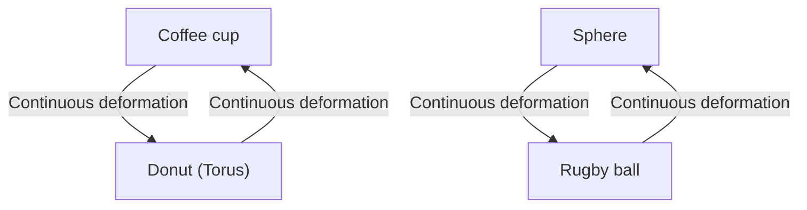
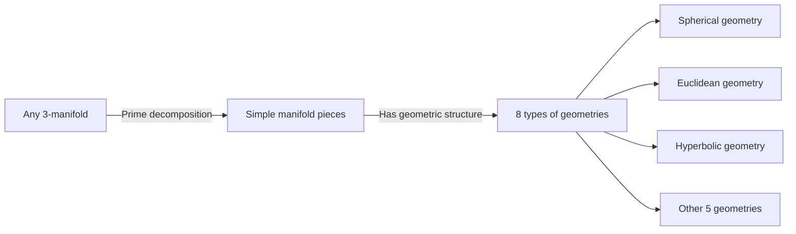

There are many deep and beautiful mysteries in the world of mathematics that test human intuition. Among them, the most famous and the one with the most dramatic conclusion is the **[Poincaré Conjecture](https://kenji.blog/p/poincare-conjecture/)**.

Proposed by the French genius mathematician [Henri Poincaré](https://kenji.blog/p/poincare/) in 1904, this conjecture was a fundamental problem in topology directly connected to the grand theme of the shape of the universe. For about 100 years, many prominent mathematicians challenged and failed at this super-difficult problem until it was suddenly proven between 2002 and 2003 by the solitary Russian mathematician Grigori Perelman, astonishing the world.

In this article, we will delve deeply into what the [Poincaré Conjecture](https://kenji.blog/p/poincare-conjecture/) means, the basic concepts of topology, and the background of Perelman's proof, using mathematical formulas and diagrams.

## 1. What is Topology?

To understand the [Poincaré Conjecture](https://kenji.blog/p/poincare-conjecture/), you first need to know about the field of mathematics called **topology**. Topology is also known as "rubber-sheet geometry".

In ordinary geometry ([[Euclid](https://kenji.blog/p/euclid/)e](https://kenji.blog/p/euclid/)an geometry), properties like length, angle, and area are important, but in topology, these are ignored. It only studies the properties (topological properties) that are preserved even when the object is continuously deformed, such as by "stretching", "bending", or "shrinking". However, operations like "cutting", "gluing", or "making a hole" are not allowed.

A famous example is "a coffee cup and a donut".

A coffee cup has one "hole", which is the handle. A donut also has one "hole" in the middle. In the world of topology, if the number of holes is the same, one can be continuously deformed into the other, so they are considered to be "the same shape (homeomorphic)".

On the other hand, a sphere (the surface of a ball) has no holes. Therefore, no matter how continuously you deform a sphere, it cannot be made into the shape of a donut. This "presence or absence of holes" is a decisive difference in topology.

## 2. Simply Connected Spaces and the Claim of the [Poincaré Conjecture](https://kenji.blog/p/poincare-conjecture/)

The [Poincaré Conjecture](https://kenji.blog/p/poincare-conjecture/) is an attempt to characterize a "sphere" from this topological perspective.

The "surface of a sphere" that we see on a daily basis is called a 2-dimensional sphere ( $S^2$ ). Poincaré thought that if a figure is a closed space with "no holes", it might be homeomorphic (topologically the same) to a sphere.

The concept that becomes important here is being **simply connected**.

When any loop drawn in a space can be shrunk to a single point without leaving the space, the space is said to be "simply connected".

- **Sphere ( $S^2$ )**: Any loop drawn on the surface can be shrunk to a point by sliding it along the surface. That is, it is simply connected.
- **Torus (surface of a donut)**: A loop drawn to pass through the hole will get caught on the hole and cannot be shrunk to a single point. That is, it is not simply connected.

Poincaré asked whether this property, which holds for a 2-dimensional sphere, also holds for a 3-dimensional sphere ( $S^3$ ).

> **[Poincaré Conjecture](https://kenji.blog/p/poincare-conjecture/)**
> Every simply connected, closed 3-manifold is homeomorphic to the 3-sphere $S^3$.

Intuitively, this is a question of, "Suppose you take a long rope out into space, go around randomly, and come back. If you pull both ends of the rope and can always retrieve the rope completely, can you say that the shape of the universe is round (a 3-dimensional sphere)?"

## 3. Extension to Higher Dimensions and the Struggles of Mathematicians

Interestingly, the [Poincaré Conjecture](https://kenji.blog/p/poincare-conjecture/) was solved for dimensions higher than 3 (the dimension of the space we live in) earlier than for 3 dimensions.

$$
\text{For manifold dimension } n \ge 5
$$

In the 1960s, Stephen Smale and others proved the higher-dimensional [Poincaré Conjecture](https://kenji.blog/p/poincare-conjecture/) for $n \ge 5$. In higher dimensions, because the "degrees of freedom" when deforming a figure are large, there is enough space to untangle any knots, making the proof relatively easy.

$$
\text{For manifold dimension } n = 4
$$

In 1982, Michael Freedman proved the 4-dimensional [Poincaré Conjecture](https://kenji.blog/p/poincare-conjecture/) using very complex methods, for which he received the Fields Medal.

However, only the original $n = 3$ (3-dimensional) case simply could not be solved. 3-dimensional space was the most troublesome dimension, lacking sufficient "room" to untangle knots, yet not being as simple as lower dimensions.

## 4. Thurston's Geometrization Conjecture

In the late 1970s, William Thurston proposed a grand vision regarding the structure of 3-manifolds, the **Geometrization Conjecture**.

He claimed that any 3-manifold can be decomposed into combinations of 8 basic "geometries (building blocks)".

If Thurston's Geometrization Conjecture is correct, it naturally follows that a simply connected manifold only has "spherical geometry" components, and as a result, the [Poincaré Conjecture](https://kenji.blog/p/poincare-conjecture/) is also proven. In other words, it became clear that the [Poincaré Conjecture](https://kenji.blog/p/poincare-conjecture/) was just one piece of the puzzle of the much larger Geometrization Conjecture.

However, the Geometrization Conjecture itself was an incredibly difficult problem.

## 5. Ricci Flow and the Emergence of Perelman

The one who proposed a weapon to break down this massive wall was Richard Hamilton. He introduced a differential equation called **Ricci flow**.

Ricci flow is an equation that smoothly equalizes the "curvature" of a manifold over time. Intuitively, it's like melting the surface of a bumpy clay shape with heat to gradually make it into a perfectly round sphere.

$$
\frac{\partial g_{ij}}{\partial t} = -2 R_{ij}
$$

Here, $g_{ij}$ is the metric tensor, and $R_{ij}$ represents the Ricci curvature tensor.

Hamilton's idea was to apply the Ricci flow to any 3-manifold and observe what shape it ultimately settles into, thereby proving Thurston's Geometrization Conjecture. However, they faced a fatal problem where "singularities" would occur, in which parts of the manifold would be stretched infinitely thin and tear during the deformation process, bringing the research to a standstill.

The one who solved this singularity problem and completed the proof was **Grigori Perelman**.

Perelman completely classified all the singularities that occur in the Ricci flow, and constructed a mathematically rigorous and astonishing method of "surgery" (Ricci flow with surgery), cutting the space just before a singularity occurs and running the Ricci flow again.

## 6. The Legendary Proof and Its Conclusion

Between 2002 and 2003, Perelman suddenly posted three papers on a preprint server (arXiv). They contained the complete proof of Thurston's Geometrization Conjecture, and thus the [Poincaré Conjecture](https://kenji.blog/p/poincare-conjecture/).

Because his papers were highly complex and too concise, top-class mathematicians from all over the world formed teams and spent several years verifying the papers. As a result, it was confirmed that Perelman's proof had no flaws and was perfect.

However, this is where Perelman's legendary behavior begins.
He declined the Fields Medal, and furthermore, refused to accept the $1 million (about 100 million yen) prize money prepared by the Clay Mathematics Institute for the Millennium Prize Problems. He completely disappeared from the mathematical world and chose a path of living quietly with his mother in his hometown of St. Petersburg.

## 7. Conclusion: The Future Opened by Topology

The resolution of the [Poincaré Conjecture](https://kenji.blog/p/poincare-conjecture/) is not just the end of a 100-year-old difficult problem. With the introduction of the powerful analytical method called Ricci flow into geometry, a new horizon has expanded in the world of mathematics.

Also, mathematical attempts to understand the shape of the universe continue to have a deep impact on the understanding of dimensions in modern physics, especially string theory and cosmology.

The baton of knowledge passed from Poincaré to Thurston, Hamilton, and finally Perelman is arguably the greatest monument proving how deeply the human mind can approach the beautiful truths of the universe.
