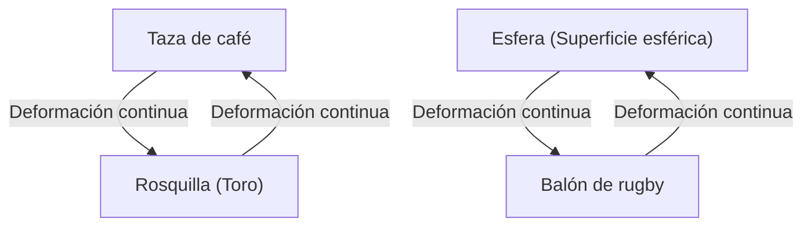
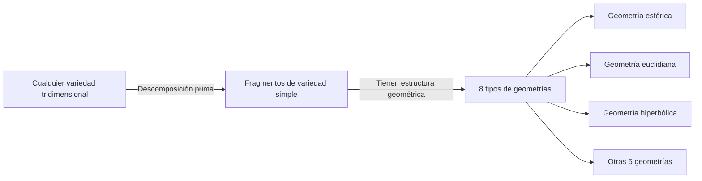

En el mundo de las matemáticas, existen muchos misterios profundos y hermosos que ponen a prueba la intuición humana. Entre ellos, el más famoso y el que tuvo el desenlace más dramático es la **[Conjetura de Poincaré](https://kenji.blog/es/p/poincare-conjecture/)** ([Poincaré Conjecture](https://kenji.blog/es/p/poincare-conjecture/)).

Propuesta en 1904 por el genio matemático francés [Henri Poincaré](https://kenji.blog/es/p/poincare/), esta conjetura era un problema fundamental de la topología que se conectaba directamente con el gran tema de la forma del universo. Durante unos 100 años, numerosos matemáticos famosos intentaron resolver este problema extremadamente difícil y fracasaron, hasta que entre 2002 y 2003, el solitario matemático ruso Grigori Perelman lo demostró repentinamente, sorprendiendo a todo el mundo.

En este artículo, profundizaremos en el significado de la [Conjetura de Poincaré](https://kenji.blog/es/p/poincare-conjecture/), los conceptos básicos de la topología y los antecedentes de la demostración de Perelman, utilizando fórmulas matemáticas e ilustraciones.

## 1. ¿Qué es la topología?

Para entender la [Conjetura de Poincaré](https://kenji.blog/es/p/poincare-conjecture/), primero necesitamos conocer el campo de las matemáticas llamado **topología** . A la topología también se le llama "geometría de goma".

En la geometría normal (geometría euclidiana), propiedades como la longitud, el ángulo y el área son importantes, pero en la topología, estas se ignoran. El objeto de estudio son únicamente aquellas propiedades (propiedades topológicas) que se conservan incluso si un objeto sufre deformaciones continuas como "estirar", "doblar" o "encoger". Sin embargo, no se permiten operaciones como "cortar", "pegar" o "perforar agujeros".

Un ejemplo famoso es "la taza de café y la rosquilla".

Una taza de café tiene un "agujero", que es el asa. Una rosquilla también tiene un "agujero" en el centro. En el mundo de la topología, si el número de agujeros es el mismo, se considera que tienen "la misma forma (homeomorfos)" porque uno puede deformarse continuamente en el otro.

Por otro lado, una esfera (la superficie de una pelota) no tiene agujeros. Por lo tanto, no importa cómo se deforme continuamente la esfera, nunca podrá tomar la forma de una rosquilla. Esta "presencia o ausencia de agujeros" es la diferencia decisiva en la topología.

## 2. Espacio simplemente conexo y la afirmación de la [Conjetura de Poincaré](https://kenji.blog/es/p/poincare-conjecture/)

La [Conjetura de Poincaré](https://kenji.blog/es/p/poincare-conjecture/) intentó caracterizar una "esfera" desde esta perspectiva topológica.

La "superficie de una esfera" que vemos todos los días se llama esfera bidimensional ( $S^2$ ). [Poincaré](https://kenji.blog/es/p/poincare/) pensó que si una figura es un espacio cerrado "sin agujeros", ¿no sería homeomorfo (topológicamente igual) a una esfera?

El concepto que se vuelve importante aquí es **simplemente conexo** (simply connected).

Cuando cualquier bucle (anillo) dentro de un espacio puede encogerse a un solo punto sin salir del espacio, se dice que el espacio es "simplemente conexo".

- **Esfera ( $S^2$ )**: Cualquier bucle dibujado en la superficie puede encogerse a un solo punto deslizándolo por la superficie. Es decir, es simplemente conexa.
- **Toro (Superficie de la rosquilla)**: Un bucle dibujado para pasar a través del agujero se quedará atrapado en el agujero y no se puede encoger a un solo punto. Es decir, no es simplemente conexo.

[Poincaré](https://kenji.blog/es/p/poincare/) se preguntó si esta propiedad que se cumple para la esfera bidimensional también se cumpliría para la esfera tridimensional ( $S^3$ ).

> **[Conjetura de Poincaré](https://kenji.blog/es/p/poincare-conjecture/)**
> Toda variedad tridimensional cerrada y simplemente conexa es homeomorfa a la esfera tridimensional $S^3$ .

Intuitivamente, la pregunta es: "Si sales al espacio exterior con una cuerda muy larga, das una vuelta al azar y regresas, y si al tirar de ambos extremos de la cuerda siempre puedes recuperarla por completo, ¿se puede decir que la forma del universo es redonda (una esfera tridimensional)?".

## 3. Extensión a dimensiones superiores y la lucha de los matemáticos

Curiosamente, la [Conjetura de Poincaré](https://kenji.blog/es/p/poincare-conjecture/) se resolvió primero en dimensiones superiores a las 3 dimensiones (la dimensión del espacio en el que vivimos).

$$
\text{Caso de dimensión de variedad } n \ge 5
$$

En la década de 1960, Stephen Smale y otros demostraron la [Conjetura de Poincaré](https://kenji.blog/es/p/poincare-conjecture/) para altas dimensiones, $n \ge 5$. En dimensiones superiores, hay un mayor "grado de libertad" al deformar las figuras, por lo que hay suficiente espacio para desenredar cualquier enredo, haciendo que la demostración sea relativamente más fácil.

$$
\text{Caso de dimensión de variedad } n = 4
$$

En 1982, Michael Freedman demostró la [Conjetura de Poincaré](https://kenji.blog/es/p/poincare-conjecture/) en 4 dimensiones utilizando métodos extremadamente complejos, por lo que recibió la Medalla Fields.

Sin embargo, solo el caso original de $n = 3$ (tres dimensiones) no se pudo resolver de ninguna manera. El espacio tridimensional resultó ser la dimensión más problemática: no tiene suficiente "espacio libre" para desenredar los enredos, pero tampoco es tan simple como las dimensiones inferiores.

## 4. Conjetura de geometrización de Thurston

A fines de la década de 1970, William Thurston propuso la **Conjetura de geometrización** , una gran visión sobre la estructura de las variedades tridimensionales.

Afirmó que todas y cada una de las variedades tridimensionales se pueden descomponer en una combinación de 8 "geometrías (componentes fundamentales)" básicas.

Si la conjetura de geometrización de Thurston fuera correcta, automáticamente se derivaría que las variedades simplemente conexas solo tienen elementos de "geometría esférica" y, como resultado, la [Conjetura de Poincaré](https://kenji.blog/es/p/poincare-conjecture/) también quedaría demostrada. Es decir, resultó que la [Conjetura de Poincaré](https://kenji.blog/es/p/poincare-conjecture/) era solo una pieza del rompecabezas de una conjetura de geometrización mucho más grande.

Sin embargo, la conjetura de geometrización en sí era un problema inmensamente difícil.

## 5. El flujo de Ricci y la aparición de Perelman

Fue Richard Hamilton quien propuso el arma para derribar este enorme muro. Introdujo una ecuación diferencial llamada **flujo de Ricci** (Ricci flow).

El flujo de Ricci es una ecuación que ecualiza suavemente el "grado de curvatura" de una variedad a lo largo del tiempo. Intuitivamente, es como derretir la superficie de una arcilla irregular con calor para convertirla gradualmente en una esfera perfectamente redonda.

$$
\frac{\partial g_{ij}}{\partial t} = -2 R_{ij}
$$

Aquí, $g_{ij}$ es el tensor métrico y $R_{ij}$ es el tensor de curvatura de Ricci.

La idea de Hamilton era aplicar el flujo de Ricci a cualquier variedad tridimensional y observar en qué forma se asentaba finalmente, demostrando así la conjetura de geometrización de Thurston. Sin embargo, se encontró con un problema fatal durante la deformación, donde ocurría una "singularidad", en la cual una parte de la variedad se estiraba infinitamente y se rompía, lo que estancó la investigación.

Quien resolvió este problema de singularidades y completó la demostración fue **Grigori Perelman** .

Perelman clasificó por completo todas las singularidades que ocurren en el flujo de Ricci, y construyó con rigor matemático una técnica asombrosa (flujo de Ricci con cirugía) en la que "operaba (surgery)" el espacio cortándolo justo antes de que ocurriera la singularidad y luego volvía a ejecutar el flujo de Ricci.

## 6. La demostración legendaria y su conclusión

Entre 2002 y 2003, Perelman publicó repentinamente tres artículos en el servidor de preimpresión (arXiv). En ellos, se describía la demostración completa de la conjetura de geometrización de Thurston y la [Conjetura de Poincaré](https://kenji.blog/es/p/poincare-conjecture/).

Sus artículos eran extremadamente difíciles y demasiado concisos, por lo que equipos de matemáticos de primer nivel de todo el mundo pasaron varios años verificándolos. Como resultado, se confirmó que la demostración de Perelman no tenía ningún defecto y era perfecta.

Sin embargo, es aquí donde comienzan las acciones legendarias de Perelman.
Declinó recibir la Medalla Fields, y también rechazó recibir el millón de dólares (aproximadamente 1 millón de dólares, o unos 100 millones de yenes) en premios que el Instituto de Matemáticas Clay había preparado como premio del Problema del Milenio. Eligió desaparecer por completo del mundo de las matemáticas y vivir en silencio con su madre en su ciudad natal de San Petersburgo.

## 7. Conclusión: El futuro que abre la topología

La resolución de la [Conjetura de Poincaré](https://kenji.blog/es/p/poincare-conjecture/) no es simplemente el fin de un problema difícil de 100 años. La introducción de una poderosa técnica analítica como el flujo de Ricci a la geometría ha abierto nuevos horizontes en el mundo de las matemáticas.

Además, el intento matemático de comprender la forma del universo continúa teniendo un profundo impacto en la comprensión de las dimensiones en la física moderna, especialmente en la teoría de cuerdas y la cosmología.

El bastón del conocimiento, que comenzó con [Poincaré](https://kenji.blog/es/p/poincare/) y fue transmitido a Thurston, Hamilton y finalmente a Perelman, es quizás el mejor monumento para demostrar cuán profundamente puede acercarse el espíritu humano a las hermosas verdades del universo.
