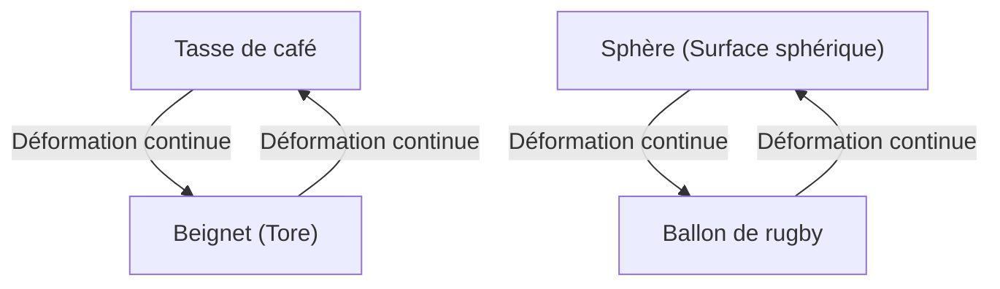
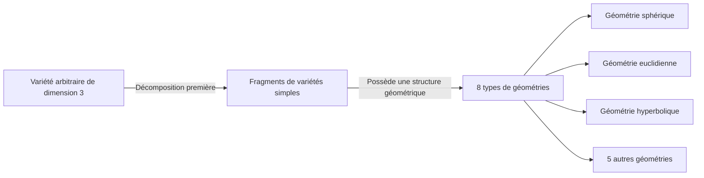

Dans le monde des mathématiques, il existe de nombreux mystères profonds et magnifiques qui mettent à l'épreuve l'intuition humaine. Parmi eux, le plus célèbre, et celui qui a connu le dénouement le plus dramatique, est la **conjecture de [Poincaré](https://kenji.blog/fr/p/poincare/)** ([Poincaré Conjecture](https://kenji.blog/fr/p/poincare-conjecture/)).

Proposée en 1904 par le mathématicien génial français [Henri Poincaré](https://kenji.blog/fr/p/poincare/), cette conjecture était un problème fondamental de la topologie directement lié au thème grandiose de la forme de l'Univers. Pendant près de 100 ans, de nombreux mathématiciens éminents s'y sont attaqués pour finalement échouer face à ce problème extrêmement difficile, jusqu'à ce qu'il soit soudainement prouvé entre 2002 et 2003 par le mathématicien russe solitaire Grigori Perelman, stupéfiant ainsi le monde entier.

Dans cet article, nous allons explorer en profondeur, à l'aide de formules et de schémas, ce que signifie la conjecture de [Poincaré](https://kenji.blog/fr/p/poincare/), les concepts fondamentaux de la topologie, ainsi que le contexte de la démonstration par Perelman.

## 1. Qu'est-ce que la topologie (géométrie de position) ?

Pour comprendre la conjecture de [Poincaré](https://kenji.blog/fr/p/poincare/), il faut d'abord connaître le domaine mathématique appelé **topologie** . La topologie est aussi appelée « géométrie souple ».

Dans la géométrie ordinaire (géométrie euclidienne), des propriétés telles que la longueur, les angles et la surface sont importantes, mais en topologie, elles sont ignorées. Seules les propriétés qui sont préservées lors de déformations continues telles que « étirer », « plier » et « rétrécir » (propriétés topologiques) font l'objet de l'étude. Cependant, des opérations telles que « couper », « coller » et « percer un trou » ne sont pas autorisées.

Un exemple célèbre est « la tasse de café et le beignet ».

Une tasse de café possède un « trou », son anse. Un beignet possède également un « trou » en son centre. Dans le monde de la topologie, si le nombre de trous est identique, l'un peut être transformé en l'autre de manière continue, et on considère donc qu'ils ont « la même forme (homéomorphe) ».

D'un autre côté, une sphère (la surface d'une balle) n'a pas de trou. Par conséquent, peu importe comment vous déformez continuellement une sphère, elle ne peut pas prendre la forme d'un beignet. Cette « présence ou absence de trou » est la différence cruciale en topologie.

## 2. Espace simplement connexe et l'énoncé de la conjecture de [Poincaré](https://kenji.blog/fr/p/poincare/)

[La conjecture de Poincaré](https://kenji.blog/fr/p/poincare-conjecture/) tente de caractériser une « sphère » de ce point de vue topologique.

La « surface d'une sphère » que nous voyons tous les jours est appelée sphère de dimension 2 ( $S^2$ ). [Poincaré](https://kenji.blog/fr/p/poincare/) a pensé que si une certaine figure géométrique est un espace fermé « sans trou », elle devrait être homéomorphe (topologiquement identique) à une sphère.

Le concept qui devient important ici est celui de **simplement connexe** (simply connected).

Lorsqu'une boucle quelconque (un anneau) dans un espace peut être rétrécie en un seul point sans quitter l'espace, on dit que cet espace est « simplement connexe ».

- **Sphère ( $S^2$ )**: Toute boucle dessinée sur la surface peut être rétrécie en un point en la faisant glisser le long de la surface. En d'autres termes, elle est simplement connexe.
- **Tore (Surface d'un beignet)**: Une boucle dessinée de manière à passer à travers le trou se bloquera dans le trou et ne pourra pas être rétrécie en un seul point. En d'autres termes, ce n'est pas simplement connexe.

[Poincaré](https://kenji.blog/fr/p/poincare/) a demandé si cette propriété, qui est vraie pour une sphère de dimension 2, est également vraie pour une sphère de dimension 3 ( $S^3$ ).

> **Conjecture de [Poincaré](https://kenji.blog/fr/p/poincare/)**
> Toute variété fermée de dimension 3 simplement connexe est homéomorphe à la sphère de dimension 3 $S^3$ .

Intuitivement, cela revient à se demander : « Si vous sortez dans l'espace avec une longue corde, que vous faites un tour complet au hasard et revenez, et que vous pouvez toujours récupérer toute la corde en tirant sur ses deux extrémités, peut-on dire que la forme de l'Univers est ronde (c'est-à-dire une sphère de dimension 3) ? »

## 3. Extension aux dimensions supérieures et luttes des mathématiciens

Fait intéressant, la conjecture de [Poincaré](https://kenji.blog/fr/p/poincare/) a été résolue pour les dimensions supérieures à la dimension 3 (la dimension de l'espace dans lequel nous vivons) bien plus tôt.

$$
\text{Cas où la dimension de la variété } n \ge 5
$$

Dans les années 1960, Stephen Smale et d'autres ont prouvé la conjecture de [Poincaré](https://kenji.blog/fr/p/poincare/) pour les dimensions supérieures où $n \ge 5$ . Dans les dimensions supérieures, le « degré de liberté » lors de la déformation d'une figure géométrique est grand, il y a donc suffisamment d'espace pour dénouer les enchevêtrements, ce qui rendait la preuve relativement facile.

$$
\text{Cas où la dimension de la variété } n = 4
$$

En 1982, Michael Freedman a prouvé la conjecture de [Poincaré](https://kenji.blog/fr/p/poincare/) en dimension 4 en utilisant des méthodes extrêmement complexes, ce qui lui a valu la médaille Fields.

Cependant, seul le cas original où $n = 3$ (dimension 3) refusait obstinément d'être résolu. L'espace tridimensionnel n'avait pas suffisamment de « marge » pour dénouer les enchevêtrements et n'était pas non plus aussi simple que les dimensions inférieures, ce qui en faisait la dimension la plus délicate.

## 4. La conjecture de géométrisation de Thurston

À la fin des années 1970, William Thurston a proposé une vision grandiose concernant la structure des variétés de dimension 3, la **conjecture de géométrisation** .

Il a affirmé que n'importe quelle variété de dimension 3 imaginable peut être décomposée en une combinaison de 8 « géométries (composants de base) » fondamentales.

Si la conjecture de géométrisation de Thurston est correcte, il en découle automatiquement qu'une variété simplement connexe ne possède que des éléments de « géométrie sphérique », ce qui entraînerait également la preuve de la conjecture de [Poincaré](https://kenji.blog/fr/p/poincare/). En d'autres termes, il est apparu que la conjecture de [Poincaré](https://kenji.blog/fr/p/poincare/) n'était qu'une pièce d'un puzzle plus grand appelé la conjecture de géométrisation.

Cependant, la conjecture de géométrisation elle-même était un problème extrêmement difficile.

## 5. Le flot de Ricci et l'apparition de Perelman

C'est Richard Hamilton qui a proposé l'arme pour abattre ce mur gigantesque. Il a introduit une équation différentielle appelée le **flot de Ricci** (Ricci flow).

Le flot de Ricci est une équation qui lisse et uniformise progressivement la « courbure » d'une variété au fil du temps. Intuitivement, c'est comme faire fondre par la chaleur la surface irrégulière d'un morceau d'argile pour la transformer peu à peu en une sphère parfaitement ronde.

$$
\frac{\partial g_{ij}}{\partial t} = -2 R_{ij}
$$

Ici, $g_{ij}$ représente le tenseur métrique, et $R_{ij}$ représente le tenseur de courbure de Ricci.

L'idée de Hamilton était d'appliquer le flot de Ricci à n'importe quelle variété de dimension 3 et d'observer la forme dans laquelle elle se stabilise finalement, afin de prouver la conjecture de géométrisation de Thurston. Cependant, il a été confronté au problème fatal des « singularités » (singularities) : au cours de la déformation, certaines parties de la variété pouvaient s'étirer infiniment et se déchirer, bloquant ainsi la recherche.

Celui qui a résolu ce problème de singularité et achevé la démonstration est **Grigori Perelman** .

Perelman a complètement classifié toutes les singularités se produisant dans le flot de Ricci et a rigoureusement construit mathématiquement une technique stupéfiante (Ricci flow with surgery) qui consistait à faire une « chirurgie » (surgery) pour couper l'espace juste avant qu'une singularité n'apparaisse, puis à relancer le flot de Ricci.

## 6. La preuve légendaire et sa conclusion

Entre 2002 et 2003, Perelman a soudainement soumis trois articles sur un serveur de prépublications (arXiv). Ces articles contenaient la preuve complète de la conjecture de géométrisation de Thurston, et donc de la conjecture de [Poincaré](https://kenji.blog/fr/p/poincare/).

Ses articles étaient si difficiles et si concis que des équipes composées des meilleurs mathématiciens du monde ont passé plusieurs années à les vérifier. Le résultat a été qu'il n'y avait aucune faille dans la preuve de Perelman et qu'elle était parfaitement exacte.

Cependant, c'est à partir de là que commencent les actes légendaires de Perelman.
Il a refusé la médaille Fields, et a également rejeté le prix d'un million de dollars (environ 1 million d'euros) offert par l'Institut de mathématiques Clay pour les problèmes du prix du millénaire. Il a choisi de disparaître complètement du monde mathématique et de vivre paisiblement avec sa mère dans sa ville natale de Saint-Pétersbourg.

## 7. Conclusion : L'avenir ouvert par la topologie

La résolution de la conjecture de [Poincaré](https://kenji.blog/fr/p/poincare/) ne signifie pas seulement la fin d'une énigme vieille d'un siècle. L'introduction d'une méthode analytique puissante, le flot de Ricci, dans la géométrie a ouvert de nouveaux horizons dans le monde des mathématiques.

De plus, les tentatives mathématiques pour comprendre la forme de l'Univers continuent d'avoir une influence profonde sur la compréhension des dimensions dans la physique moderne, en particulier dans la théorie des cordes et la cosmologie.

Le relais du savoir, transmis de [Poincaré](https://kenji.blog/fr/p/poincare/) à Thurston, Hamilton, puis Perelman, peut être considéré comme le plus grand monument prouvant jusqu'à quel point l'esprit humain peut approcher les vérités profondes et magnifiques de l'Univers.
