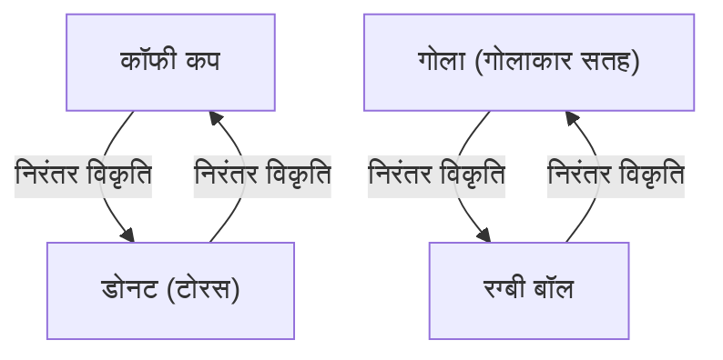
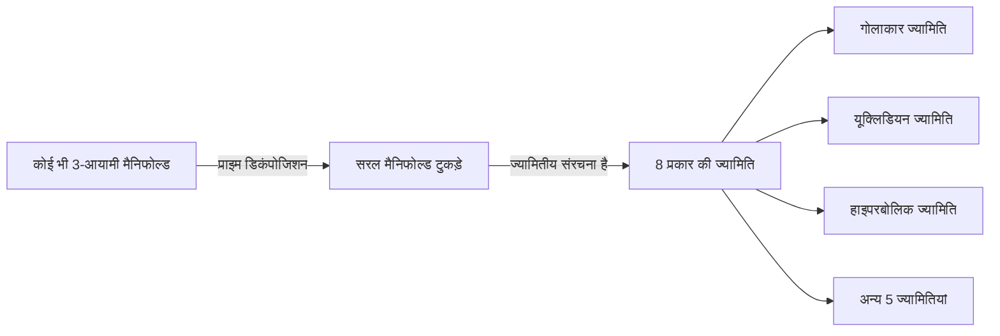

गणित की दुनिया में कई गहरे और सुंदर रहस्य मौजूद हैं जो मानवीय अंतर्ज्ञान की परीक्षा लेते हैं। इनमें से सबसे प्रसिद्ध, और सबसे नाटकीय निष्कर्ष पर पहुँचने वाला है **पॉइनकेयर अनुमान** (Poincaré Conjecture)।

1904 में फ्रांसीसी प्रतिभाशाली गणितज्ञ हेनरी पॉइनकेयर द्वारा प्रस्तावित यह अनुमान टोपोलॉजी (स्थिति विज्ञान) में एक मौलिक समस्या थी, जो सीधे ब्रह्मांड के आकार के भव्य विषय से जुड़ी थी। लगभग 100 वर्षों तक, कई प्रसिद्ध गणितज्ञों ने इसे सुलझाने का प्रयास किया और विफल रहे। इस अत्यंत कठिन पहेली को 2002 और 2003 के बीच रूस के एक एकांतप्रिय गणितज्ञ ग्रिगोरी पेरेलमान ने अचानक सिद्ध कर दिया, जिसने पूरी दुनिया को चौंका दिया।

इस लेख में, हम गणितीय सूत्रों और आरेखों की मदद से पॉइनकेयर अनुमान के अर्थ, टोपोलॉजी की बुनियादी अवधारणाओं और पेरेलमान के प्रमाण की पृष्ठभूमि में गहराई से उतरेंगे।

## 1. टोपोलॉजी (स्थिति विज्ञान) क्या है?

पॉइनकेयर अनुमान को समझने के लिए, हमें पहले **टोपोलॉजी** नामक गणित की शाखा को जानना होगा। टोपोलॉजी को "रबड़-शीट ज्योमेट्री" या "नरम ज्यामिति" भी कहा जाता है।

सामान्य ज्यामिति (यूक्लिडियन ज्यामिति) में, लंबाई, कोण और क्षेत्रफल जैसे गुण महत्वपूर्ण होते हैं, लेकिन टोपोलॉजी में इन्हें नजरअंदाज कर दिया जाता है। यह केवल उन गुणों (टोपोलॉजिकल गुणों) का अध्ययन करता है जो "खींचने", "मोड़ने" या "सिकुड़ने" जैसी निरंतर विकृतियों के बाद भी संरक्षित रहते हैं। हालाँकि, "काटने", "चिपकाने" या "छेद बनाने" जैसे कार्यों की अनुमति नहीं है।

एक प्रसिद्ध उदाहरण "कॉफी कप और डोनट" है।

एक कॉफी कप में इसके हैंडल के रूप में एक "छेद" होता है। डोनट के बीच में भी एक "छेद" होता है। टोपोलॉजी की दुनिया में, यदि छेदों की संख्या समान है, तो एक को दूसरे में लगातार विकृत किया जा सकता है, इसलिए उन्हें "समान आकार (होमियोमॉर्फिक)" माना जाता है।

दूसरी ओर, एक गोले (गेंद की सतह) में कोई छेद नहीं होता है। इसलिए, गोले को चाहे कितनी भी निरंतर विकृति दी जाए, इसे डोनट के आकार में नहीं बदला जा सकता है। यह "छेद की उपस्थिति या अनुपस्थिति" टोपोलॉजी में निर्णायक अंतर है।

## 2. सिंपली कनेक्टेड स्पेस और पॉइनकेयर अनुमान का दावा

पॉइनकेयर अनुमान टोपोलॉजी के इस दृष्टिकोण से "गोले" की विशेषता बताने का एक प्रयास है।

"गोले की सतह" जिसे हम रोज़मर्रा की जिंदगी में देखते हैं, उसे 2-आयामी गोला ( $S^2$ ) कहा जाता है। पॉइनकेयर ने सोचा कि यदि कोई आकृति "बिना छेद वाला" बंद स्थान है, तो क्या वह गोले के समान (टोपोलॉजिकली समान) नहीं हो सकता है?

यहां महत्वपूर्ण अवधारणा **सिंपली कनेक्टेड** (simply connected) है।

जब किसी अंतरिक्ष के भीतर किसी भी लूप (छल्ले) को अंतरिक्ष से बाहर जाए बिना एक ही बिंदु पर सिकोड़ा जा सकता है, तो उस स्थान को "सिंपली कनेक्टेड" कहा जाता है।

- **गोला ( $S^2$ )**: सतह पर खींचा गया कोई भी लूप सतह के साथ खिसकाकर एक बिंदु तक सिकोड़ा जा सकता है। इसका मतलब है कि यह सिंपली कनेक्टेड है।
- **टोरस (डोनट की सतह)**: छेद के माध्यम से खींचे गए लूप छेद में फंस जाएंगे और उन्हें एक बिंदु तक सिकोड़ा नहीं जा सकता। इसका मतलब है कि यह सिंपली कनेक्टेड नहीं है।

पॉइनकेयर ने पूछा कि क्या यह गुण, जो 2-आयामी गोले के लिए सत्य है, 3-आयामी गोले ( $S^3$ ) के लिए भी सत्य है।

> **पॉइनकेयर अनुमान**
> कोई भी सिंपली कनेक्टेड 3-आयामी बंद मैनिफोल्ड 3-आयामी गोले $S^3$ के लिए होमियोमॉर्फिक होता है।

सहज शब्दों में, यह पूछता है: "मान लीजिए कि आप बाहरी अंतरिक्ष में एक लंबी रस्सी लेते हैं, चारों ओर घूमते हैं, और वापस आते हैं। यदि आप रस्सी के दोनों सिरों को खींच सकते हैं और हमेशा पूरी रस्सी को वापस प्राप्त कर सकते हैं, तो क्या हम कह सकते हैं कि ब्रह्मांड का आकार गोल (3-आयामी गोला) है?"

## 3. उच्च आयामों में विस्तार और गणितज्ञों का संघर्ष

दिलचस्प बात यह है कि पॉइनकेयर अनुमान 3 आयामों (जिस स्थान में हम रहते हैं) की तुलना में उच्च आयामों के लिए पहले हल किया गया था।

$$
\text{जब मैनिफोल्ड का आयाम } n \ge 5 \text{ हो}
$$

1960 के दशक में, स्टीफन स्मेल और अन्य ने $n \ge 5$ के लिए उच्च-आयामी पॉइनकेयर अनुमान सिद्ध किया। उच्च आयामों में, आकृतियों को विकृत करते समय "स्वतंत्रता की डिग्री" बड़ी होती है, इसलिए उलझनों को सुलझाने के लिए पर्याप्त जगह होती है, जिससे प्रमाण अपेक्षाकृत आसान हो जाता है।

$$
\text{जब मैनिफोल्ड का आयाम } n = 4 \text{ हो}
$$

1982 में, माइकल फ्रीडमैन ने अत्यधिक जटिल तकनीकों का उपयोग करके 4-आयामी पॉइनकेयर अनुमान सिद्ध किया और फील्ड्स मेडल जीता।

हालांकि, केवल मूल $n = 3$ (3-आयामी) मामले को हल नहीं किया जा सका। 3-आयामी स्थान सबसे कठिन आयाम था क्योंकि इसमें उलझनों को सुलझाने के लिए पर्याप्त "जगह" का अभाव है, फिर भी यह कम आयामों जितना सरल नहीं है।

## 4. थर्स्टन का जियोमेट्राइजेशन अनुमान

1970 के दशक के उत्तरार्ध में, विलियम थर्स्टन ने 3-आयामी मैनिफोल्ड्स की संरचना के लिए एक भव्य दृष्टि प्रस्तावित की, जिसे **जियोमेट्राइजेशन अनुमान** (Geometrization conjecture) कहा जाता है।

उन्होंने तर्क दिया कि किसी भी और सभी 3-आयामी मैनिफोल्ड्स को 8 बुनियादी "ज्यामिति (घटकों)" के संयोजन में तोड़ा जा सकता है।

यदि थर्स्टन का जियोमेट्राइजेशन अनुमान सही है, तो यह स्वचालित रूप से इस निष्कर्ष पर ले जाएगा कि सिंपली कनेक्टेड मैनिफोल्ड्स में केवल "गोलाकार ज्यामिति" तत्व होते हैं, और परिणामस्वरूप, पॉइनकेयर अनुमान भी सिद्ध हो जाएगा। दूसरे शब्दों में, पॉइनकेयर अनुमान बहुत बड़े जियोमेट्राइजेशन अनुमान पहेली का केवल एक टुकड़ा बन गया।

हालांकि, जियोमेट्राइजेशन अनुमान अपने आप में एक अविश्वसनीय रूप से कठिन समस्या थी।

## 5. रिक्की फ्लो और पेरेलमान का आगमन

रिचर्ड हैमिल्टन ने इस विशाल दीवार को तोड़ने के लिए एक हथियार का प्रस्ताव रखा। उन्होंने **रिक्की फ्लो** (Ricci flow) नामक एक डिफरेंशियल समीकरण पेश किया।

रिक्की फ्लो एक ऐसा समीकरण है जो समय के साथ मैनिफोल्ड के "वक्रता" को सुचारू रूप से बराबर करता है। सहज रूप से, यह एक ऊबड़-खाबड़ मिट्टी की सतह को गर्मी से पिघलाकर धीरे-धीरे एक पूर्ण रूप से गोल गोले में बदलने जैसा है।

$$
\frac{\partial g_{ij}}{\partial t} = -2 R_{ij}
$$

यहाँ, $g_{ij}$ मीट्रिक टेंसर का प्रतिनिधित्व करता है, और $R_{ij}$ रिक्की कर्वेचर टेंसर का प्रतिनिधित्व करता है।

हैमिल्टन का विचार किसी भी 3-आयामी मैनिफोल्ड पर रिक्की फ्लो को लागू करना था और थर्स्टन के ज्यामितीय अनुमान को साबित करने के लिए यह देखना था कि अंत में यह कौन सा आकार लेता है। हालांकि, शोध में एक गतिरोध आ गया जब उन्हें एक घातक समस्या का सामना करना पड़ा: "सिंगुलैरिटीज़ (Singularities)" की घटना, जहां विरूपण के दौरान मैनिफोल्ड के कुछ हिस्से असीम रूप से लंबे और पतले हो जाते हैं और टूट जाते हैं।

वह व्यक्ति जिसने इस सिंगुलैरिटी समस्या को हल किया और प्रमाण को पूरा किया, वे थे **ग्रिगोरी पेरेलमान**।

पेरेलमान ने रिक्की फ्लो में होने वाली सभी सिंगुलैरिटीज़ को पूरी तरह से वर्गीकृत किया, और एक आश्चर्यजनक तकनीक (रिक्की फ्लो विद सर्जरी) का गणितीय रूप से कठोर निर्माण किया, जहां उन्होंने सिंगुलैरिटी होने से ठीक पहले अंतरिक्ष को काट कर "सर्जरी" की, और फिर रिक्की फ्लो को फिर से चलाया।

## 6. किंवदंती का प्रमाण और उसका अंत

2002 और 2003 के बीच, पेरेलमान ने अचानक प्रीप्रिंट सर्वर (arXiv) पर तीन पेपर सबमिट किए। उनमें थर्स्टन के जियोमेट्राइजेशन अनुमान और पॉइनकेयर अनुमान का पूर्ण प्रमाण था।

चूंकि उनके पेपर बहुत कठिन और बहुत संक्षिप्त थे, दुनिया भर के शीर्ष गणितज्ञों ने मिलकर काम किया और उन पेपर्स को सत्यापित करने में कई साल बिताए। नतीजतन, यह पुष्टि की गई कि पेरेलमान का प्रमाण निर्दोष और पूर्ण था।

हालांकि, यहां से पेरेलमान का पौराणिक व्यवहार शुरू होता है।
उन्होंने फील्ड्स मेडल को अस्वीकार कर दिया और क्ले मैथमेटिक्स इंस्टीट्यूट द्वारा मिलेनियम पुरस्कार समस्याओं के लिए पेश किए गए 1 मिलियन डॉलर (लगभग 100 मिलियन येन) के नकद पुरस्कार को स्वीकार करने से भी इनकार कर दिया। उन्होंने गणितीय दुनिया से पूरी तरह से गायब होना चुना और अपने गृहनगर सेंट पीटर्सबर्ग में अपनी मां के साथ शांति से रहने का रास्ता चुना।

## 7. निष्कर्ष: टोपोलॉजी द्वारा खोला गया भविष्य

पॉइनकेयर अनुमान का समाधान केवल 100 साल पुरानी पहेली का अंत नहीं है। ज्यामिति में रिक्की फ्लो नामक एक शक्तिशाली विश्लेषणात्मक तकनीक की शुरूआत के साथ, गणित की दुनिया में नए क्षितिज खुल गए हैं।

इसके अलावा, ब्रह्मांड के आकार को समझने के गणितीय प्रयास आधुनिक भौतिकी में, विशेष रूप से स्ट्रिंग थ्योरी और ब्रह्मांड विज्ञान में आयामों की हमारी समझ को गहराई से प्रभावित करते रहते हैं।

पॉइनकेयर से शुरू होकर, और थर्स्टन, हैमिल्टन और पेरेलमान को दी गई ज्ञान की यह मशाल, सबसे महान स्मारक है जो साबित करता है कि मानव मन ब्रह्मांड के गहरे और सुंदर सत्य के कितने करीब पहुंच सकता है।
