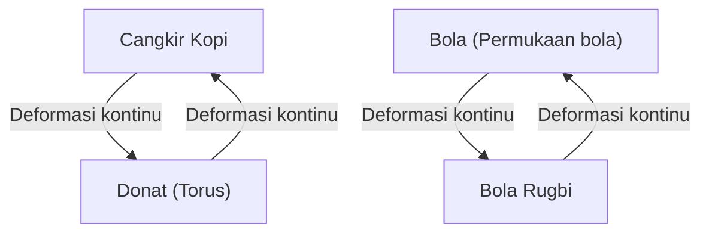
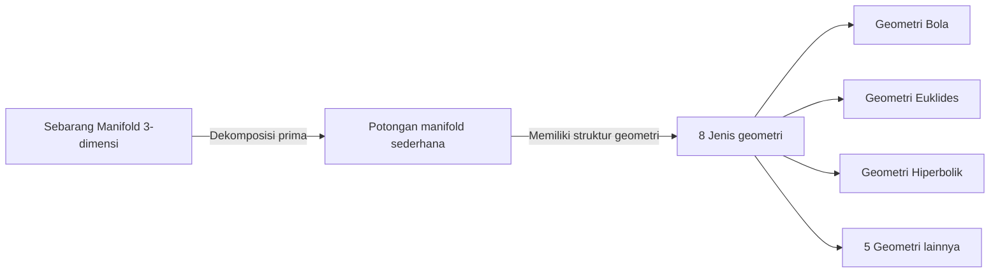

Di dunia matematika, terdapat banyak misteri mendalam dan indah yang menguji intuisi manusia. Di antara misteri-misteri tersebut, yang paling terkenal dan memiliki akhir yang paling dramatis adalah **Konjektur Poincaré** (Poincaré Conjecture).

Konjektur yang diajukan oleh matematikawan jenius asal Prancis, Henri Poincaré, pada tahun 1904 ini merupakan masalah mendasar dalam topologi yang berkaitan langsung dengan tema besar mengenai bentuk alam semesta. Masalah super sulit ini, yang telah membuat banyak matematikawan terkenal gagal selama sekitar 100 tahun, tiba-tiba dibuktikan pada tahun 2002 hingga 2003 oleh seorang matematikawan penyendiri asal Rusia, Grigori Perelman, yang mengejutkan seluruh dunia.

Dalam artikel ini, kita akan menggali lebih dalam mulai dari makna Konjektur Poincaré, konsep dasar topologi, hingga latar belakang pembuktian oleh Perelman, dengan menyertakan rumus matematika dan ilustrasi.

## 1. Apa itu Topologi (Geometri Topologi)?

Untuk memahami Konjektur Poincaré, pertama-tama kita perlu mengetahui tentang bidang matematika yang disebut **Topologi** . Topologi sering juga disebut sebagai "geometri karet".

Dalam geometri biasa (geometri Euklides), sifat-sifat seperti panjang, sudut, dan luas sangatlah penting, tetapi dalam topologi hal-hal ini diabaikan. Topologi hanya mempelajari sifat-sifat (sifat topologis) yang dipertahankan bahkan ketika suatu objek mengalami deformasi kontinu seperti "diregangkan", "dibengkokkan", atau "diciutkan". Namun, operasi seperti "memotong", "menempelkan", atau "melubangi" tidak diperbolehkan.

Contoh yang terkenal adalah "cangkir kopi dan donat".

Cangkir kopi memiliki satu "lubang", yaitu pegangannya. Donat juga memiliki satu "lubang" di tengahnya. Dalam dunia topologi, jika jumlah lubangnya sama, satu objek dapat dideformasi secara kontinu menjadi objek lainnya sehingga dianggap memiliki "bentuk yang sama (homeomorfik)".

Di sisi lain, bola (permukaan bola) tidak memiliki lubang. Oleh karena itu, bagaimanapun kita mendeformasi bola secara kontinu, kita tidak akan pernah bisa mengubahnya menjadi bentuk donat. "Ada atau tidaknya lubang" inilah yang menjadi perbedaan krusial dalam topologi.

## 2. Ruang Terhubung Sederhana dan Pernyataan Konjektur Poincaré

Konjektur Poincaré merupakan sebuah upaya untuk mengkarakterisasi "bola" dari sudut pandang topologi ini.

"Permukaan bola" yang biasa kita lihat sehari-hari disebut sebagai bola 2-dimensi ( $S^2$ ). Poincaré berpikir bahwa jika suatu bangun adalah ruang tertutup yang "tanpa lubang", bukankah bangun tersebut homeomorfik (secara topologi sama) dengan bola?

Konsep yang menjadi penting di sini adalah **terhubung sederhana** (simply connected).

Ketika sebarang loop (lingkaran) di dalam sebuah ruang dapat disusutkan menjadi satu titik tanpa keluar dari ruang tersebut, maka ruang itu dikatakan "terhubung sederhana".

- **Permukaan bola ( $S^2$ )**: Lingkaran apa pun yang digambar di permukaannya dapat disusutkan menjadi satu titik dengan menggesernya di sepanjang permukaan. Dengan kata lain, permukaannya terhubung sederhana.
- **Torus (Permukaan donat)**: Lingkaran yang digambar melewati lubangnya akan tersangkut pada lubang tersebut dan tidak dapat disusutkan menjadi satu titik. Dengan kata lain, ia tidak terhubung sederhana.

Poincaré mempertanyakan apakah sifat yang berlaku pada bola 2-dimensi ini juga berlaku pada bola 3-dimensi ( $S^3$ ).

> **Konjektur Poincaré**
> Manifold tertutup 3-dimensi yang terhubung sederhana adalah homeomorfik terhadap bola 3-dimensi $S^3$.

Secara intuitif, ini sama dengan bertanya: "Jika kita pergi ke luar angkasa dengan membawa tali yang panjang, berkeliling secara acak lalu kembali, dan jika kita menarik kedua ujung tali itu kita selalu bisa menarik kembali seluruh tali tersebut sepenuhnya, dapatkah kita mengatakan bahwa bentuk alam semesta itu bulat (merupakan bola 3-dimensi)?"

## 3. Perluasan ke Dimensi Tinggi dan Perjuangan Para Matematikawan

Menariknya, Konjektur Poincaré justru diselesaikan lebih dulu untuk dimensi yang lebih tinggi daripada 3-dimensi (dimensi ruang tempat kita hidup).

$$
\text{Kasus dimensi manifold } n \ge 5 
$$

Pada tahun 1960-an, Stephen Smale dan rekan-rekannya membuktikan Konjektur Poincaré untuk dimensi tinggi dengan $n \ge 5$. Pada dimensi yang lebih tinggi, "derajat kebebasan" saat mendeformasi suatu bangun lebih besar, sehingga terdapat cukup ruang untuk mengurai kekusutan, dan pembuktiannya pun menjadi relatif lebih mudah.

$$
\text{Kasus dimensi manifold } n = 4 
$$

Pada tahun 1982, Michael Freedman menggunakan metode yang sangat kompleks untuk membuktikan Konjektur Poincaré dalam 4-dimensi, yang membuatnya meraih Medali Fields.

Namun, hanya kasus original dengan $n = 3$ (3-dimensi) yang tidak dapat dipecahkan bagaimanapun juga. Ruang 3-dimensi tidak memiliki cukup "keleluasaan" untuk mengurai kekusutan, tetapi juga tidak sesederhana ruang berdimensi rendah, menjadikannya dimensi yang paling merepotkan.

## 4. Konjektur Geometrisasi Thurston

Pada akhir tahun 1970-an, William Thurston mengajukan sebuah visi yang megah mengenai struktur manifold 3-dimensi, yang disebut **Konjektur Geometrisasi** .

Ia mengklaim bahwa semua manifold 3-dimensi dapat diuraikan menjadi kombinasi dari 8 jenis "geometri (elemen penyusun)" dasar.

Jika Konjektur Geometrisasi Thurston benar, maka secara otomatis akan diturunkan bahwa manifold yang terhubung sederhana hanya memiliki elemen "geometri bola", dan sebagai hasilnya, Konjektur Poincaré juga akan terbukti. Dengan kata lain, Konjektur Poincaré ternyata hanyalah satu kepingan puzzle dari Konjektur Geometrisasi yang jauh lebih besar.

Akan tetapi, Konjektur Geometrisasi itu sendiri adalah masalah yang sangat sulit.

## 5. Aliran Ricci dan Kemunculan Perelman

Orang yang mengusulkan senjata untuk meruntuhkan tembok raksasa ini adalah Richard Hamilton. Ia memperkenalkan sebuah persamaan diferensial yang disebut **Aliran Ricci** (Ricci flow).

Aliran Ricci adalah sebuah persamaan yang meratakan "tingkat kelengkungan" manifold secara halus seiring berjalannya waktu. Secara intuitif, bayangkan seperti melelehkan permukaan tanah liat yang bergelombang menggunakan panas sehingga secara bertahap menjadi bola yang bulat sempurna.

$$
\frac{\partial g_{ij}}{\partial t} = -2 R_{ij}
$$

Di sini, $g_{ij}$ mewakili tensor metrik, dan $R_{ij}$ mewakili tensor kelengkungan Ricci.

Ide Hamilton adalah menerapkan Aliran Ricci pada sembarang manifold 3-dimensi, dan dengan mengamati bentuk akhir yang dicapai, ia akan membuktikan Konjektur Geometrisasi Thurston. Namun, ia menemui kebuntuan karena menghadapi masalah fatal yaitu munculnya "singularitas (singularity)", di mana selama proses deformasi, ada bagian dari manifold yang meregang tanpa batas hingga terputus.

Orang yang berhasil menyelesaikan masalah singularitas ini dan menyempurnakan pembuktiannya adalah **Grigori Perelman** .

Perelman mengklasifikasikan secara lengkap semua singularitas yang terjadi dalam Aliran Ricci, memotong ruang tersebut (melakukan "operasi/surgery") tepat sebelum singularitas terjadi, dan membiarkan Aliran Ricci berjalan kembali. Ia membangun metode yang luar biasa (Aliran Ricci dengan operasi) ini secara ketat dalam matematika.

## 6. Pembuktian Legendaris dan Akhir Kisahnya

Pada tahun 2002 hingga 2003, Perelman secara tiba-tiba mengirimkan 3 makalah ke sebuah server pracetak (arXiv). Di dalamnya tertulis pembuktian lengkap dari Konjektur Geometrisasi Thurston, dan tentunya, Konjektur Poincaré.

Karena makalah-makalahnya sangat sulit dipahami dan terlalu ringkas, matematikawan tingkat atas dari seluruh dunia membentuk tim dan menghabiskan beberapa tahun untuk memverifikasi makalah tersebut. Hasilnya, dipastikan bahwa tidak ada satupun cacat pada pembuktian Perelman, dan pembuktiannya benar-benar sempurna.

Namun, dari sinilah tindakan legendaris Perelman dimulai.
Ia menolak penganugerahan Medali Fields, dan juga menolak menerima hadiah uang sebesar 1 juta dolar AS (sekitar 100 juta yen) untuk Millenium Prize Problems yang disediakan oleh Clay Mathematics Institute. Ia memilih untuk menghilang sepenuhnya dari dunia matematika dan menjalani kehidupan yang tenang bersama ibunya di kampung halamannya, St. Petersburg.

## 7. Penutup: Masa Depan yang Dibuka oleh Topologi

Penyelesaian Konjektur Poincaré bukan sekadar berakhirnya masalah sulit yang telah berusia seratus tahun. Dengan dibawanya metode analitik yang kuat bernama Aliran Ricci ke dalam geometri, cakrawala baru telah terbuka di dunia matematika.

Selain itu, upaya matematis untuk memahami bentuk alam semesta terus memberikan pengaruh mendalam terhadap pemahaman kita mengenai dimensi dalam fisika modern, khususnya pada teori dawai dan kosmologi.

Tongkat estafet pengetahuan yang dimulai dari Poincaré, diteruskan kepada Thurston, Hamilton, dan akhirnya kepada Perelman, dapat dikatakan sebagai monumen terbaik yang membuktikan seberapa dalam dan indahnya pikiran manusia dapat mendekati kebenaran alam semesta.
