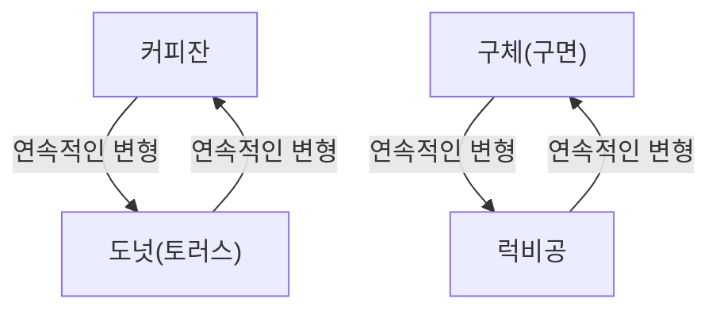
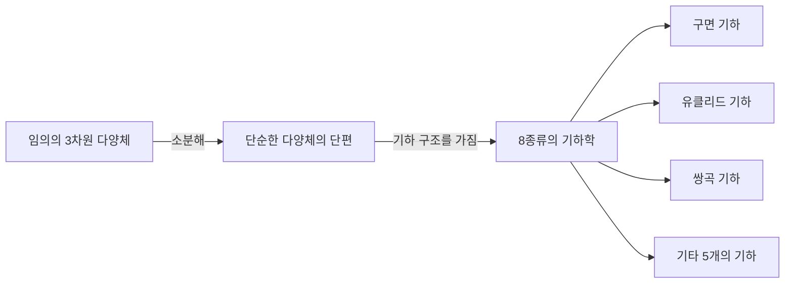

수학의 세계에는 인간의 직관을 시험하는 깊고 아름다운 수수께끼가 수없이 존재합니다. 그 중에서도 가장 유명하고, 가장 드라마틱한 결말을 맞이한 것이 **푸앵카레 추측** (Poincaré Conjecture)입니다.

프랑스의 천재 수학자 앙리 푸앵카레가 1904년에 제창한 이 추측은, 우주의 형태라는 장대한 테마에 직결되는 토폴로지(위상기하학)의 근본적인 문제였습니다. 약 100년 동안 수많은 저명한 수학자들이 도전했다가 패배한 이 초난제는, 2002년부터 2003년에 걸쳐 러시아의 고고한 수학자 그리고리 페렐만에 의해 갑자기 증명되어 전 세계를 놀라게 했습니다.

본 기사에서는 푸앵카레 추측이 의미하는 바부터 토폴로지의 기본적인 사고방식, 그리고 페렐만의 증명 배경까지 수식과 도해를 섞어가며 깊이 파고들어 보겠습니다.

## 1. 토폴로지(위상기하학)란 무엇인가?

푸앵카레 추측을 이해하기 위해서는 먼저 **토폴로지** 라는 수학 분야에 대해 알아야 합니다. 토폴로지는 "부드러운 기하학"이라고도 불립니다.

일반적인 기하학(유클리드 기하학)에서는 길이, 각도, 면적과 같은 성질이 중요하지만, 토폴로지에서는 이를 무시합니다. 물체를 "늘리기", "구부리기", "줄이기"와 같은 연속적인 변형을 가해도 유지되는 성질(위상적 성질)만을 연구 대상으로 삼습니다. 단, "자르기", "붙이기", "구멍 뚫기"와 같은 조작은 허용되지 않습니다.

유명한 예가 "커피잔과 도넛"입니다.

커피잔에는 손잡이라는 "구멍"이 1개 있습니다. 도넛에도 한가운데에 "구멍"이 1개 있습니다. 토폴로지의 세계에서는 구멍의 수가 같으면 한쪽을 다른 쪽으로 연속적으로 변형할 수 있기 때문에 "같은 형태(동형)"로 간주됩니다.

반면에 구체(공의 표면)에는 구멍이 없습니다. 따라서 구체를 아무리 연속적으로 변형시켜도 도넛 모양으로 만들 수는 없습니다. 이 "구멍의 유무"가 토폴로지에서 결정적인 차이가 됩니다.

## 2. 단일연결공간과 푸앵카레 추측의 주장

푸앵카레 추측은 이 토폴로지의 관점에서 "구"를 특징짓고자 시도한 것입니다.

우리가 일상적으로 보는 "구의 표면"은 2차원 구면( $S^2$ )이라고 불립니다. 푸앵카레는 어떤 도형이 "구멍이 없는" 닫힌 공간이라면, 그것은 구와 동형(토폴로지적으로 동일)이 아닐까 생각했습니다.

여기서 중요해지는 개념이 **단일연결** (simply connected)입니다.

공간 내의 임의의 루프(고리)를 공간 밖으로 나가지 않고 1점으로 축소할 수 있을 때, 그 공간은 "단일연결이다"라고 말합니다.

- **구면( $S^2$ )**: 표면에 그린 어떤 고리라도 표면을 따라 미끄러지게 하면 1점으로 수축시킬 수 있습니다. 즉 단일연결입니다.
- **토러스(도넛의 표면)**: 구멍을 통과하도록 그린 고리는 구멍에 걸려 1점으로 축소할 수 없습니다. 즉 단일연결이 아닙니다.

푸앵카레는 2차원 구면에 대해 성립하는 이 성질이 3차원 구면( $S^3$ )에서도 성립하는지 물었습니다.

> **푸앵카레 추측**
> 단일연결인 3차원 닫힌 다양체는 3차원 구면 $S^3$ 와 동형이다.

이것은 직관적으로 말하자면, "우주 공간에 긴 밧줄을 가지고 나가서 적당히 한 바퀴를 돌고 돌아왔다고 하자. 그 밧줄의 양 끝을 잡아당겨서 항상 밧줄을 끝까지 회수할 수 있다면, 우주의 형태는 둥글다(3차원 구면이다)고 할 수 있는가?"라는 질문입니다.

## 3. 고차원으로의 확장과 수학자들의 고투

흥미롭게도 푸앵카레 추측은 3차원(우리가 살아가는 공간의 차원)보다 더 높은 차원이 먼저 해결되었습니다.

$$
\text{다양체의 차원 } n \ge 5 \text{ 의 경우}
$$

1960년대에 스티븐 스메일 등이 $n \ge 5$ 의 고차원 푸앵카레 추측을 증명했습니다. 고차원에서는 도형을 변형시킬 때의 "자유도"가 커서 얽힘을 풀기 위한 공간이 충분했기 때문에 증명이 비교적 쉬웠던 것입니다.

$$
\text{다양체의 차원 } n = 4 \text{ 의 경우}
$$

1982년에는 마이클 프리드먼이 매우 복잡한 기법을 사용하여 4차원의 푸앵카레 추측을 증명하고 필즈상을 수상했습니다.

하지만 오리지널인 $n = 3$ (3차원)의 케이스만큼은 도저히 풀리지 않았습니다. 3차원 공간은 얽힘을 풀기 위한 충분한 "여유"가 없고, 그러면서도 저차원처럼 단순하지도 않은 가장 까다로운 차원이었던 것입니다.

## 4. 서스턴의 기하화 추측

1970년대 후반, 윌리엄 서스턴은 3차원 다양체의 구조에 관한 장대한 비전, **기하화 추측** 을 제창했습니다.

그는 존재하는 모든 3차원 다양체는 8종류의 기본적인 "기하학(구성 요소)"의 조합으로 분해될 수 있다고 주장했습니다.

서스턴의 기하화 추측이 맞다면, 단일연결인 다양체는 자동으로 "구면 기하"의 요소만을 갖는다는 것이 도출되어, 결과적으로 푸앵카레 추측도 증명되게 됩니다. 즉, 푸앵카레 추측은 기하화 추측이라는 거대한 퍼즐의 한 조각에 불과하다는 것이 판명된 것입니다.

하지만 기하화 추측 자체가 엄청나게 어려운 문제였습니다.

## 5. 리치 흐름과 페렐만의 등장

이 거대한 벽을 무너뜨리기 위한 무기를 제안한 사람이 리처드 해밀턴입니다. 그는 **리치 흐름** (Ricci flow)이라는 미분방정식을 도입했습니다.

리치 흐름은 다양체의 "구부러진 정도"를 시간의 경과와 함께 매끄럽게 균등화해 나가는 방정식입니다. 직관적으로는 울퉁불퉁한 점토의 표면을 열로 녹여서 점차 동그란 구체로 만들어 가는 듯한 이미지입니다.

$$
\frac{\partial g_{ij}}{\partial t} = -2 R_{ij}
$$

여기서 $g_{ij}$ 는 계량 텐서, $R_{ij}$ 는 리치 곡률 텐서를 나타냅니다.

해밀턴의 아이디어는 임의의 3차원 다양체에 리치 흐름을 적용하고, 그것이 최종적으로 어떤 형태에 안착하는지를 관찰함으로써 서스턴의 기하화 추측을 증명한다는 것이었습니다. 하지만 변형 도중에 다양체의 일부가 무한히 가늘고 길게 늘어나 끊어져 버리는 "특이점(싱귤래리티)"이 발생한다는 치명적인 문제에 직면하여 연구는 교착 상태에 빠졌습니다.

이 특이점 문제를 해결하고 증명을 완성시킨 사람이 **그리고리 페렐만** 입니다.

페렐만은 리치 흐름에서 발생하는 모든 특이점을 완전히 분류하고, 특이점이 발생하기 직전에 공간을 "수술(서저리)"하여 잘라내고 다시 리치 흐름을 작동시키는 경이로운 기법(수술을 동반한 리치 흐름)을 수학적으로 엄밀하게 구축했습니다.

## 6. 전설적인 증명과 그 결말

2002년부터 2003년에 걸쳐 페렐만은 프리프린트 서버(arXiv)에 3편의 논문을 갑자기 투고했습니다. 거기에는 서스턴의 기하화 추측, 그리고 푸앵카레 추측의 완전한 증명이 기록되어 있었습니다.

그의 논문은 매우 난해하고 지나치게 간결했기 때문에, 전 세계의 톱클래스 수학자들이 팀을 꾸려 몇 년에 걸쳐 그 논문을 검증했습니다. 그 결과, 페렐만의 증명에는 어떠한 결함도 없으며 완벽하다는 것이 확인되었습니다.

하지만 여기서부터 페렐만의 전설적인 행동이 시작됩니다.
그는 필즈상 수상을 사양했고, 나아가 클레이 수학연구소가 현상금으로 내건 밀레니엄 현상 문제의 상금 100만 달러(약 10억 원)조차도 받기를 거부했습니다. 그는 수학계에서 완전히 자취를 감추고 고향인 상트페테르부르크에서 어머니와 조용히 사는 길을 택한 것입니다.

## 7. 맺음말: 토폴로지가 개척하는 미래

푸앵카레 추측의 해결은 단순히 100년 묵은 난제가 끝났다는 것만을 의미하지 않습니다. 리치 흐름이라는 강력한 해석적 기법이 기하학에 도입됨으로써 수학의 세계에 새로운 지평이 열렸습니다.

또한 우주의 형태를 이해하려는 수학적인 시도는 현대 물리학, 특히 끈 이론이나 우주론에서의 차원에 대한 이해에도 깊은 영향을 계속 미치고 있습니다.

푸앵카레에서 시작되어 서스턴, 해밀턴, 그리고 페렐만으로 이어진 지식의 바통은, 인류의 정신이 얼마나 깊고 아름다운 우주의 진리에 다가설 수 있는지를 증명하는 최고의 기념비라 할 수 있을 것입니다.
