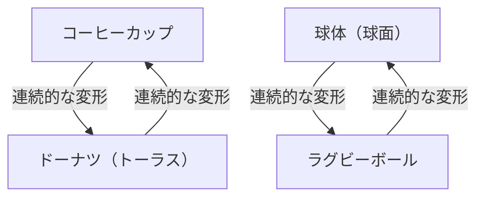
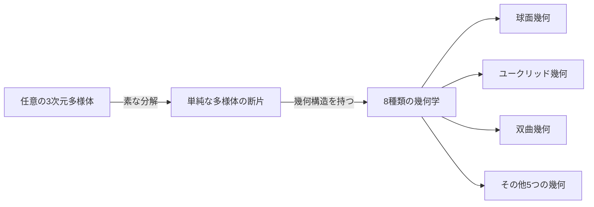

数学の世界には、人間の直感を試すような深く美しい謎が数多く存在します。その中でも最も有名で、最もドラマチックな結末を迎えたのが **[ポアンカレ予想](https://kenji.blog/p/poincare-conjecture/)** （Poincaré Conjecture）です。

フランスの天才数学者アンリ・ポアンカレが1904年に提唱したこの予想は、宇宙の形という壮大なテーマに直結するトポロジー（位相幾何学）の根本的な問題でした。約100年もの間、数々の著名な数学者が挑んでは敗れ去ったこの超難問は、2002年から2003年にかけて、ロシアの孤高の数学者グレゴリー・ペレルマンによって突如として証明され、世界中を驚かせました。

本記事では、[ポアンカレ予想](https://kenji.blog/p/poincare-conjecture/)の意味するところから、トポロジーの基本的な考え方、そしてペレルマンによる証明の背景までを、数式や図解を交えながら深く掘り下げていきます。

## 1. トポロジー（位相幾何学）とは何か？

[ポアンカレ予想](https://kenji.blog/p/poincare-conjecture/)を理解するためには、まず **トポロジー** という数学の分野について知る必要があります。トポロジーは「やわらかい幾何学」とも呼ばれます。

通常の幾何学（ユークリッド幾何学）では、長さや角度、面積といった性質が重要ですが、トポロジーではこれらを無視します。物体を「伸ばす」「曲げる」「縮める」といった連続的な変形を行っても保たれる性質（位相的性質）だけを研究対象とします。ただし、「切る」「くっつける」「穴を開ける」といった操作は許されません。

有名な例が「コーヒーカップとドーナツ」です。

コーヒーカップには取っ手という「穴」が1つあります。ドーナツにも真ん中に「穴」が1つあります。トポロジーの世界では、穴の数が同じであれば、一方は他方に連続的に変形できるため「同じ形（同相）」であるとみなされます。

一方で、球体（ボールの表面）には穴がありません。したがって、球体をどのように連続的に変形させても、ドーナツの形にすることはできません。この「穴の有無」が、トポロジーにおける決定的な違いとなります。

## 2. 単連結空間と[ポアンカレ予想](https://kenji.blog/p/poincare-conjecture/)の主張

[ポアンカレ予想](https://kenji.blog/p/poincare-conjecture/)は、このトポロジーの観点から「球」の特徴づけを試みたものです。

私たちが日常的に目にする「球の表面」は2次元球面（ $S^2$ ）と呼ばれます。ポアンカレは、ある図形が「穴のない」閉じた空間であれば、それは球と同相（トポロジー的に同じ）なのではないかと考えました。

ここで重要になる概念が **単連結** （simply connected）です。

空間内の任意のループ（輪っか）を、空間の外に出ることなく1点に縮めることができるとき、その空間は「単連結である」と言います。

- **球面（ $S^2$ ）**: 表面に描いたどんな輪っかも、表面に沿って滑らせていけば1点に収縮させることができます。つまり単連結です。
- **トーラス（ドーナツの表面）**: 穴を通るように描いた輪っかは、穴に引っかかってしまい1点に縮めることができません。つまり単連結ではありません。

ポアンカレは、2次元の球面について成り立つこの性質が、3次元球面（ $S^3$ ）でも成り立つかどうかを問いました。

> **[ポアンカレ予想](https://kenji.blog/p/poincare-conjecture/)**
> 単連結な3次元閉多様体は、3次元球面 $S^3$ に同相である。

これは直感的に言えば、「宇宙空間に長いロープを持って出かけ、適当にぐるっと一周して戻ってきたとする。そのロープの両端を引っ張って、常にロープを回収しきれるならば、宇宙の形は丸い（3次元球面である）と言えるか？」という問いです。

## 3. 高次元への拡張と数学者たちの苦闘

興味深いことに、[ポアンカレ予想](https://kenji.blog/p/poincare-conjecture/)は3次元（私たちが生きている空間の次元）よりも高い次元のほうが先に解決されました。

$$
\text{多様体の次元 } n \ge 5 \text{ の場合}
$$

1960年代にスティーヴン・スメイルらが、 $n \ge 5$ の高次元[ポアンカレ予想](https://kenji.blog/p/poincare-conjecture/)を証明しました。高次元では、図形を変形させる際の「自由度」が大きいため、絡まりをほどくためのスペースが十分にあり、証明が比較的容易だったのです。

$$
\text{多様体の次元 } n = 4 \text{ の場合}
$$

1982年にはマイケル・フリードマンが、非常に複雑な手法を用いて4次元の[ポアンカレ予想](https://kenji.blog/p/poincare-conjecture/)を証明し、フィールズ賞を受賞しました。

しかし、オリジナルの $n = 3$ （3次元）のケースだけが、どうしても解けませんでした。3次元空間は、絡まりをほどくための十分な「余裕」がなく、かつ低次元のように単純でもないという、最も厄介な次元だったのです。

## 4. サーストンの幾何化予想

1970年代後半、ウィリアム・サーストンは3次元多様体の構造に関する壮大なビジョン、 **幾何化予想** を提唱しました。

彼は、ありとあらゆる3次元多様体は、8種類の基本的な「幾何学（構成要素）」の組み合わせに分解できると主張しました。

サーストンの幾何化予想が正しければ、単連結な多様体は自動的に「球面幾何」の要素しか持たないことが導かれ、結果として[ポアンカレ予想](https://kenji.blog/p/poincare-conjecture/)も証明されることになります。つまり、[ポアンカレ予想](https://kenji.blog/p/poincare-conjecture/)はより巨大な幾何化予想というパズルの一つのピースに過ぎないことが判明したのです。

しかし、幾何化予想そのものが途方もなく困難な問題でした。

## 5. リッチフローとペレルマンの登場

この巨大な壁を打ち破るための武器を提案したのが、リチャード・ハミルトンです。彼は **リッチフロー** （Ricci flow）という微分方程式を導入しました。

リッチフローは、多様体の「曲がり具合」を時間の経過とともに滑らかに均等化していく方程式です。直感的には、デコボコした粘土の表面を熱で溶かして、だんだんと真ん丸な球体にしていくようなイメージです。

$$
\frac{\partial g_{ij}}{\partial t} = -2 R_{ij}
$$

ここで $g_{ij}$ は計量テンソル、 $R_{ij}$ はリッチ曲率テンソルを表します。

ハミルトンのアイデアは、任意の3次元多様体にリッチフローを適用し、それが最終的にどのような形に落ち着くかを観察することで、サーストンの幾何化予想を証明するというものでした。しかし、変形の途中で多様体の一部が無限に細長く引き伸ばされてちぎれてしまう「特異点（シンギュラリティ）」が発生するという致命的な問題に直面し、研究は行き詰まりました。

この特異点問題を解決し、証明を完成させたのが **グレゴリー・ペレルマン** です。

ペレルマンは、リッチフローにおいて発生するあらゆる特異点を完全に分類し、特異点が発生する直前で空間を「手術（サージェリー）」して切り離し、再びリッチフローを走らせるという驚異的な手法（リッチフロー・ウィズ・サージェリー）を数学的に厳密に構築しました。

## 6. 伝説の証明とその結末

2002年から2003年にかけて、ペレルマンはプレプリントサーバー（arXiv）に3本の論文を突如として投稿しました。そこには、サーストンの幾何化予想、そして[ポアンカレ予想](https://kenji.blog/p/poincare-conjecture/)の完全な証明が記されていました。

彼の論文は非常に難解で簡潔すぎたため、世界中のトップクラスの数学者たちがチームを組み、数年がかりでその論文を検証しました。その結果、ペレルマンの証明にはいかなる欠陥もなく、完璧であることが確認されました。

しかし、ここからペレルマンの伝説的な行動が始まります。
彼はフィールズ賞の受賞を辞退し、さらにクレイ数学研究所が懸賞金として用意していたミレニアム懸賞問題の賞金100万ドル（約1億円）をも受け取ることを拒否しました。彼は数学界から完全に姿を消し、故郷のサンクトペテルブルクで母親とひっそりと暮らす道を選んだのです。

## 7. おわりに：トポロジーが切り拓く未来

[ポアンカレ予想](https://kenji.blog/p/poincare-conjecture/)の解決は、単に100年来の難問が終わったというだけではありません。リッチフローという強力な解析的手法が幾何学にもたらされたことで、数学の世界に新たな地平が広がりました。

また、宇宙の形を理解しようとする数学的な試みは、現代の物理学、特に弦理論や宇宙論における次元の理解にも深い影響を与え続けています。

ポアンカレから始まり、サーストン、ハミルトン、そしてペレルマンへと受け継がれた知のバトンは、人類の精神がどれほど深く美しい宇宙の真理に迫れるかを証明する、最高のモニュメントと言えるでしょう。
