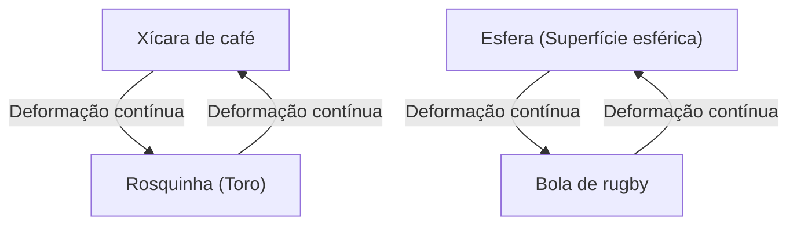
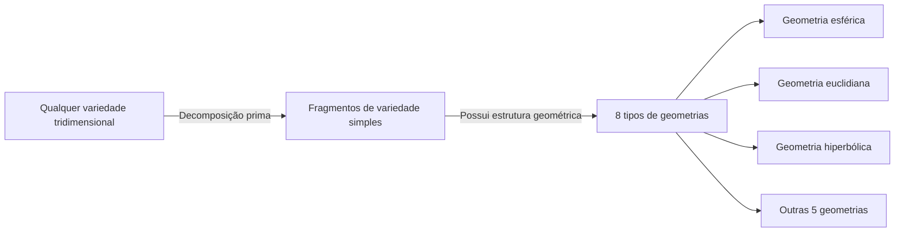

No mundo da matemática, existem muitos mistérios profundos e belos que testam a intuição humana. Entre eles, o mais famoso e com o desfecho mais dramático é a **Conjectura de Poincaré** (Poincaré Conjecture).

Proposta em 1904 pelo genial matemático francês Henri Poincaré, esta conjectura era um problema fundamental na topologia, diretamente ligado ao grandioso tema da forma do universo. Durante cerca de 100 anos, inúmeros matemáticos proeminentes tentaram e falharam neste problema superdifícil, até que, entre 2002 e 2003, foi subitamente provado pelo solitário matemático russo Grigori Perelman, surpreendendo o mundo inteiro.

Neste artigo, aprofundaremos desde o significado da Conjectura de Poincaré e os conceitos básicos da topologia, até o contexto da demonstração por Perelman, com a ajuda de equações e diagramas.

## 1. O que é Topologia?

Para entender a Conjectura de Poincaré, primeiro precisamos conhecer o campo da matemática chamado **Topologia**. A topologia também é conhecida como "geometria flexível".

Na geometria comum (geometria euclidiana), propriedades como comprimento, ângulo e área são importantes, mas na topologia essas propriedades são ignoradas. O objeto de estudo são apenas as propriedades (propriedades topológicas) que se mantêm mesmo quando o objeto sofre deformações contínuas, como "esticar", "dobrar" ou "encolher". No entanto, operações como "cortar", "colar" ou "fazer buracos" não são permitidas.

Um exemplo famoso é "a xícara de café e a rosquinha".

Uma xícara de café tem um "buraco" na alça. Uma rosquinha também tem um "buraco" no meio. No mundo da topologia, se o número de buracos for o mesmo, um pode ser deformado continuamente no outro, e portanto, eles são considerados como tendo a "mesma forma (homeomorfos)".

Por outro lado, uma esfera (superfície de uma bola) não tem buracos. Portanto, não importa como você deforme continuamente uma esfera, não é possível transformá-la na forma de uma rosquinha. Essa "presença ou ausência de buracos" é a diferença crucial na topologia.

## 2. Espaço Simplesmente Conexo e a Afirmação da Conjectura de Poincaré

A Conjectura de Poincaré foi uma tentativa de caracterizar uma "esfera" dessa perspectiva topológica.

A "superfície de uma esfera" que vemos no dia a dia é chamada de esfera bidimensional ( $S^2$ ). Poincaré pensou que se uma figura fosse um espaço fechado "sem buracos", ela poderia ser homeomorfa (topologicamente equivalente) a uma esfera.

Um conceito importante aqui é ser **simplesmente conexo** (simply connected).

Quando qualquer loop (laço) dentro de um espaço pode ser encolhido até um único ponto sem sair do espaço, diz-se que o espaço é "simplesmente conexo".

- **Esfera ( $S^2$ )**: Qualquer laço desenhado na superfície pode ser encolhido até um único ponto deslizando-o ao longo da superfície. Ou seja, é simplesmente conexo.
- **Toro (superfície de uma rosquinha)**: Um laço desenhado de forma a passar pelo buraco fica preso nele e não pode ser encolhido a um único ponto. Ou seja, não é simplesmente conexo.

Poincaré questionou se essa propriedade, que é válida para uma esfera bidimensional, também seria válida para uma esfera tridimensional ( $S^3$ ).

> **Conjectura de Poincaré**
> Toda variedade tridimensional fechada e simplesmente conexa é homeomorfa à esfera tridimensional $S^3$.

Intuitivamente, isso é o equivalente à pergunta: "Se você for para o espaço sideral com uma corda longa, der uma volta aleatória e retornar, e se ao puxar as duas extremidades da corda você puder sempre recuperá-la completamente, podemos dizer que a forma do universo é redonda (uma esfera tridimensional)?"

## 3. Expansão para Dimensões Superiores e as Lutas dos Matemáticos

Curiosamente, a Conjectura de Poincaré foi resolvida primeiro para dimensões superiores à 3ª dimensão (a dimensão do espaço em que vivemos).

$$
\text{Caso em que a dimensão da variedade } n \ge 5
$$

Na década de 1960, Stephen Smale e outros provaram a Conjectura de Poincaré em altas dimensões, para $n \ge 5$. Em dimensões superiores, o "grau de liberdade" ao deformar uma figura é grande, de modo que há espaço suficiente para desfazer emaranhados, tornando a prova relativamente fácil.

$$
\text{Caso em que a dimensão da variedade } n = 4
$$

Em 1982, Michael Freedman provou a Conjectura de Poincaré para 4 dimensões usando métodos extremamente complexos, ganhando a Medalha Fields.

No entanto, apenas o caso original $n = 3$ (3 dimensões) permanecia sem solução, por mais que tentassem. O espaço tridimensional revelou-se a dimensão mais incômoda: não possui "espaço" suficiente para desfazer emaranhados e também não é tão simples quanto as dimensões inferiores.

## 4. Conjectura de Geometrização de Thurston

No final da década de 1970, William Thurston propôs uma grande visão sobre a estrutura das variedades tridimensionais, a **Conjectura de Geometrização**.

Ele argumentou que todas as variedades tridimensionais possíveis poderiam ser decompostas em uma combinação de 8 "geometrias (blocos de construção)" fundamentais.

Se a Conjectura de Geometrização de Thurston estivesse correta, deduzir-se-ia que variedades simplesmente conexas teriam automaticamente apenas elementos de "geometria esférica", o que resultaria, por consequência, na prova da Conjectura de Poincaré. Em outras palavras, descobriu-se que a Conjectura de Poincaré era apenas uma peça de um quebra-cabeça muito maior: a Conjectura de Geometrização.

No entanto, a própria Conjectura de Geometrização era um problema incrivelmente difícil.

## 5. Fluxo de Ricci e a Chegada de Perelman

Quem propôs uma arma para derrubar essa enorme parede foi Richard Hamilton. Ele introduziu uma equação diferencial chamada **Fluxo de Ricci** (Ricci flow).

O Fluxo de Ricci é uma equação que suaviza a "curvatura" de uma variedade uniformemente ao longo do tempo. Intuitivamente, é como derreter a superfície irregular de argila com calor, gradualmente transformando-a em uma esfera perfeita.

$$
\frac{\partial g_{ij}}{\partial t} = -2 R_{ij}
$$

Aqui, $g_{ij}$ representa o tensor métrico e $R_{ij}$ representa o tensor de curvatura de Ricci.

A ideia de Hamilton era aplicar o Fluxo de Ricci a qualquer variedade tridimensional e observar em que forma ela finalmente se assentaria, para assim provar a Conjectura de Geometrização de Thurston. No entanto, o estudo chegou a um impasse, deparando-se com um problema fatal: o surgimento de "singularidades" onde parte da variedade seria esticada infinitamente e rasgada durante o processo de deformação.

Quem resolveu esse problema das singularidades e completou a demonstração foi **Grigori Perelman**.

Perelman classificou completamente todas as singularidades que ocorrem no Fluxo de Ricci e construiu matematicamente um método surpreendente (Fluxo de Ricci com cirurgia), no qual o espaço é "operado" (cortado e separado) imediatamente antes que a singularidade ocorra, retomando então a execução do Fluxo de Ricci.

## 6. A Prova Lendária e Seu Desfecho

Entre 2002 e 2003, Perelman submeteu subitamente três artigos a um servidor de preprints (arXiv). Neles estava contida a demonstração completa da Conjectura de Geometrização de Thurston e, consequentemente, da Conjectura de Poincaré.

Seus artigos eram tão difíceis e concisos que as equipes dos melhores matemáticos do mundo levaram vários anos para validá-los. Como resultado, confirmou-se que a prova de Perelman era impecável, sem qualquer falha.

No entanto, as ações lendárias de Perelman começaram aqui.
Ele recusou o recebimento da Medalha Fields e até mesmo o prêmio de 1 milhão de dólares oferecido pelo Instituto Clay de Matemática como um dos Problemas do Prêmio Millennium. Ele optou por desaparecer completamente do mundo acadêmico da matemática e viver uma vida reclusa com sua mãe em sua cidade natal, São Petersburgo.

## 7. Conclusão: O Futuro Desbravado pela Topologia

A resolução da Conjectura de Poincaré não significa apenas o fim de um problema difícil de cem anos. A introdução de uma ferramenta analítica poderosa como o Fluxo de Ricci na geometria abriu novos horizontes no mundo da matemática.

Além disso, a tentativa matemática de entender a forma do universo continua a ter um impacto profundo na física moderna, especialmente na compreensão das dimensões na teoria das cordas e na cosmologia.

O bastão do conhecimento, passado de Poincaré a Thurston, Hamilton e, finalmente, a Perelman, pode ser considerado o monumento máximo que comprova quão profunda e lindamente o espírito humano pode se aproximar das verdades do universo.
