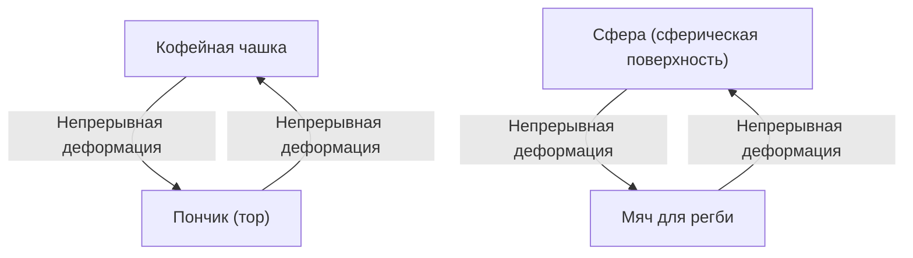
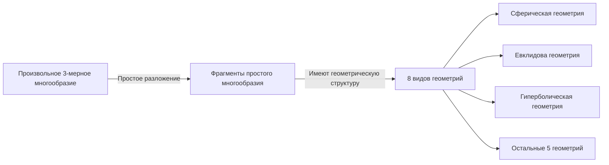

В мире математики существует множество глубоких и красивых загадок, которые испытывают человеческую интуицию на прочность. Среди них самой известной, получившей наиболее драматическую развязку, является **гипотеза Пуанкаре** ([Poincaré Conjecture](https://kenji.blog/ru/p/poincare-conjecture/)).

Эта гипотеза, выдвинутая в 1904 году гениальным французским математиком [Анри Пуанкаре](https://kenji.blog/ru/p/poincare/), представляла собой фундаментальную проблему топологии, напрямую связанную с грандиозной темой формы Вселенной. На протяжении почти 100 лет многие выдающиеся математики пытались решить эту сверхсложную задачу и терпели неудачу, пока в 2002–2003 годах она не была внезапно доказана одиноким российским математиком Григорием Перельманом, что потрясло весь мир.

В этой статье мы глубоко погрузимся в суть гипотезы Пуанкаре, базовые концепции топологии и предысторию доказательства Перельмана, используя математические формулы и иллюстрации.

## 1. Что такое топология?

Чтобы понять гипотезу Пуанкаре, сначала нужно познакомиться с разделом математики, называемым **топологией** . Топологию также называют «мягкой геометрией».

В обычной геометрии (евклидовой) важны такие свойства, как длина, угол и площадь, но в топологии они игнорируются. Объектом изучения являются только те свойства (топологические), которые сохраняются при непрерывных деформациях, таких как «растяжение», «изгиб» и «сжатие» объекта. Однако такие операции, как «разрезание», «склеивание» и «проделывание отверстий», не допускаются.

Известный пример — «кофейная чашка и пончик».

У кофейной чашки есть одно «отверстие» — ручка. У пончика также есть одно «отверстие» в центре. В мире топологии, если количество отверстий одинаково, то один объект может быть непрерывно деформирован в другой, поэтому они считаются «одной и той же формы (гомеоморфными)».

С другой стороны, у сферы (поверхности мяча) нет отверстий. Следовательно, как бы вы ни деформировали сферу непрерывным образом, вы никогда не сможете превратить ее в форму пончика. Это «наличие или отсутствие отверстий» является решающим отличием в топологии.

## 2. Односвязные пространства и суть гипотезы Пуанкаре

[Гипотеза Пуанкаре](https://kenji.blog/ru/p/poincare-conjecture/) — это попытка охарактеризовать «сферу» с точки зрения топологии.

«Поверхность сферы», которую мы видим каждый день, называется двумерной сферой ( $S^2$ ). Пуанкаре предположил, что если какая-то фигура представляет собой замкнутое пространство «без отверстий», то, возможно, она гомеоморфна (топологически эквивалентна) сфере.

Здесь важным становится понятие **односвязности** (simply connected).

Когда любую петлю (кольцо) в пространстве можно стянуть в одну точку, не выходя за пределы этого пространства, то говорят, что это пространство «односвязно».

- **Сфера ( $S^2$ )**: Любое кольцо, нарисованное на поверхности, можно стянуть в одну точку, скользя им по поверхности. То есть, она односвязна.
- **Тор (поверхность пончика)**: Кольцо, нарисованное так, чтобы проходить через отверстие, зацепится за него и не сможет быть стянуто в одну точку. То есть, он не односвязен.

Пуанкаре задался вопросом: будет ли это свойство, справедливое для двумерной сферы, также справедливо и для трехмерной сферы ( $S^3$ )?

> **[Гипотеза Пуанкаре](https://kenji.blog/ru/p/poincare-conjecture/)**
> Всякое односвязное замкнутое трехмерное многообразие гомеоморфно трехмерной сфере $S^3$ .

Интуитивно это можно описать как вопрос: «Если вы отправитесь в космос с длинной веревкой, облетите его и вернетесь обратно, а затем потянете за оба конца веревки, и сможете полностью вернуть ее к себе, можно ли утверждать, что Вселенная имеет круглую форму (является трехмерной сферой)?»

## 3. Расширение на многомерные пространства и борьба математиков

Интересно, что гипотеза Пуанкаре была решена для пространств с размерностью выше 3-х (размерность пространства, в котором мы живем) раньше, чем для трехмерного.

$$
\text{Случай размерности многообразия } n \ge 5 \text{ }
$$

В 1960-х годах Стивен Смейл и другие доказали многомерную гипотезу Пуанкаре для $n \ge 5$ . В многомерных пространствах «степеней свободы» при деформации фигур больше, поэтому остается достаточно места для распутывания узлов, и доказательство оказалось относительно легким.

$$
\text{Случай размерности многообразия } n = 4 \text{ }
$$

В 1982 году Майкл Фридман с помощью крайне сложных методов доказал гипотезу Пуанкаре для четырехмерного пространства и был удостоен Филдсовской премии.

Однако только оригинальный случай для $n = 3$ (трехмерное пространство) никак не поддавался решению. Трехмерное пространство оказалось самой трудной размерностью: в нем не было достаточного «простора» для распутывания, и при этом оно не было таким простым, как пространства меньшей размерности.

## 4. Гипотеза геометризации Тёрстона

В конце 1970-х годов Уильям Тёрстон выдвинул грандиозное видение относительно структуры трехмерных многообразий — **гипотезу геометризации** .

Он утверждал, что абсолютно любое трехмерное многообразие можно разбить на комбинацию из 8 базовых «геометрий (строительных блоков)».

Если гипотеза геометризации Тёрстона верна, то автоматически следует, что односвязные многообразия обладают только элементами «сферической геометрии», и как следствие, гипотеза Пуанкаре также будет доказана. Иначе говоря, оказалось, что гипотеза Пуанкаре — это всего лишь один из кусочков пазла более глобальной гипотезы геометризации.

Однако сама гипотеза геометризации была невероятно сложной задачей.

## 5. Поток Риччи и появление Перельмана

Оружие для преодоления этой колоссальной преграды предложил Ричард Гамильтон. Он ввел дифференциальное уравнение, называемое **потоком Риччи** (Ricci flow).

Поток Риччи — это уравнение, которое плавно и равномерно сглаживает «кривизну» многообразия с течением времени. Интуитивно это можно представить как процесс плавления неровной поверхности глины под воздействием тепла, постепенно превращающий ее в идеально круглую сферу.

$$
\frac{\partial g_{ij}}{\partial t} = -2 R_{ij}
$$

Здесь $g_{ij}$ обозначает метрический тензор, а $R_{ij}$ — тензор кривизны Риччи.

Идея Гамильтона заключалась в том, чтобы применить поток Риччи к любому трехмерному многообразию и наблюдать, какую форму оно примет в итоге, тем самым доказав гипотезу геометризации Тёрстона. Однако исследования зашли в тупик, столкнувшись с фатальной проблемой возникновения «сингулярностей», когда в процессе деформации часть многообразия бесконечно вытягивалась и разрывалась.

Именно **Григорий Перельман** решил эту проблему сингулярностей и завершил доказательство.

Перельман полностью классифицировал все сингулярности, возникающие в потоке Риччи, и математически строго обосновал поразительный метод («поток Риччи с хирургией»), при котором пространство разрезается («хирургия») непосредственно перед возникновением сингулярности, и поток Риччи запускается снова.

## 6. Легендарное доказательство и его финал

В 2002–2003 годах Перельман внезапно опубликовал три статьи на сервере препринтов (arXiv). В них содержалось полное доказательство гипотезы геометризации Тёрстона, а следовательно, и гипотезы Пуанкаре.

Его статьи были настолько сложными и краткими, что ведущие математики всего мира объединились в команды и потратили несколько лет на их проверку. В результате было подтверждено, что доказательство Перельмана не содержит никаких изъянов и является абсолютно безупречным.

Но именно здесь начинаются легендарные поступки Перельмана.
Он отказался от Филдсовской премии, а также отверг призовой фонд в 1 миллион долларов (около 100 миллионов иен), предложенный Математическим институтом Клэя за решение одной из «Задач тысячелетия». Он полностью исчез из математического мира и выбрал путь тихой жизни со своей матерью в родном Санкт-Петербурге.

## 7. Заключение: будущее, которое открывает топология

Решение гипотезы Пуанкаре означает не просто конец 100-летней сложной задачи. Благодаря внедрению в геометрию такого мощного аналитического инструмента, как поток Риччи, перед математическим миром открылись новые горизонты.

Кроме того, математические попытки понять форму Вселенной продолжают оказывать глубокое влияние на понимание размерности в современной физике, особенно в теории струн и космологии.

Эстафета знаний, переданная от Пуанкаре к Тёрстону, Гамильтону, а затем к Перельману, — это величайший монумент, доказывающий, насколько глубоко человеческий разум может приблизиться к прекрасным истинам Вселенной.
