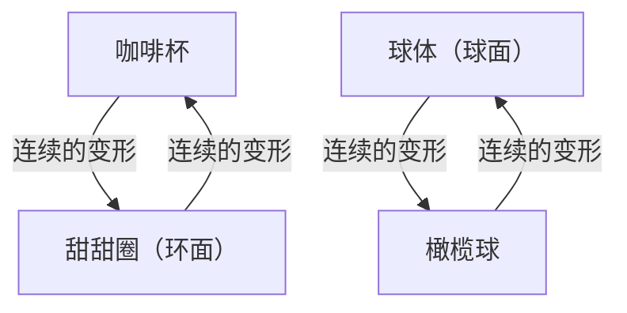
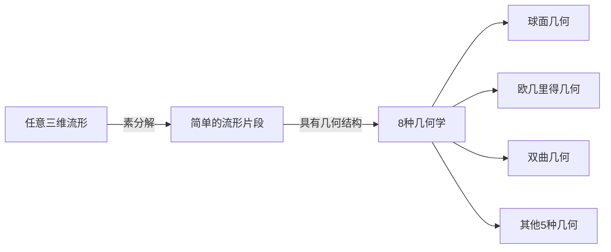

在数学的世界中，存在着许多考验人类直觉的深奥而美丽的谜题。其中最著名、结局最具戏剧性的便是 **[庞加莱猜想](https://kenji.blog/zh-cn/p/poincare-conjecture/)** （[Poincaré Conjecture](https://kenji.blog/zh-cn/p/poincare-conjecture/)）。

法国天才数学家[亨利·庞加莱](https://kenji.blog/zh-cn/p/poincare/)于1904年提出的这一猜想，是直接关系到宇宙形状这一宏大主题的拓扑学（位相几何学）的根本问题。大约100年来，众多著名数学家挑战它却以失败告终。然而在2002年至2003年间，这道超级难题被俄罗斯孤傲的数学家格里戈里·佩雷尔曼突然证明，震惊了全世界。

本文将从[庞加莱猜想](https://kenji.blog/zh-cn/p/poincare-conjecture/)的含义入手，结合公式和图解，深入探讨拓扑学的基本概念，以及佩雷尔曼证明的背景。

## 1. 拓扑学（位相几何学）是什么？

为了理解[庞加莱猜想](https://kenji.blog/zh-cn/p/poincare-conjecture/)，首先需要了解 **拓扑学** 这一数学领域。拓扑学也被称为“柔软的几何学”。

在通常的几何学（[欧几里得](https://kenji.blog/zh-cn/p/euclid/)几何学）中，长度、角度、面积等性质非常重要，但在拓扑学中这些都被忽略了。它只把即使物体进行“拉伸”、“弯曲”、“收缩”等连续变形也能保持的性质（拓扑性质）作为研究对象。但是，不允许进行“切断”、“粘合”、“打洞”等操作。

著名的例子是“咖啡杯与甜甜圈”。

咖啡杯有一个把手，也就是一个“洞”。甜甜圈中间也有一个“洞”。在拓扑学的世界里，只要洞的数量相同，一方就可以连续变形为另一方，因此被视为“相同的形状（同胚）”。

另一方面，球体（球的表面）没有洞。因此，无论怎样对球体进行连续变形，都无法变成甜甜圈的形状。这种“有无洞”的区别，是拓扑学中决定性的差异。

## 2. 单连通空间与[庞加莱猜想](https://kenji.blog/zh-cn/p/poincare-conjecture/)的主张

[庞加莱猜想](https://kenji.blog/zh-cn/p/poincare-conjecture/)正是从这种拓扑学的角度出发，尝试去表征“球”的特征。

我们日常见到的“球的表面”被称为二维球面（ $S^2$ ）。庞加莱认为，如果某个图形是“没有洞”的封闭空间，那么它是不是就与球同胚（在拓扑学上相同）呢？

这里关键的概念是 **单连通** （simply connected）。

如果在空间内画任意的闭环（圈），能够不超出该空间将其收缩为一点，那么这个空间就被称为“单连通的”。

- **球面（ $S^2$ ）** ：在表面上画的任何圈，只要沿着表面滑动，都可以收缩为一点。也就是说它是单连通的。
- **环面（甜甜圈的表面）** ：如果画一个穿过洞的圈，就会被洞卡住而无法收缩为一点。也就是说它不是单连通的。

庞加莱提出，关于二维球面成立的这一性质，在三维球面（ $S^3$ ）中是否也成立？

> **[庞加莱猜想](https://kenji.blog/zh-cn/p/poincare-conjecture/)**
> 单连通的三维闭流形，同胚于三维球面 $S^3$ 。

直观地说，这个问题就是在问：“假设你带着一根很长的绳子去宇宙空间，随便绕一圈回来。如果你拉扯绳子的两端，能够始终把绳子完全收回，那么能否说明宇宙的形状是圆的（是三维球面）？”

## 3. 向高维的扩展与数学家们的苦战

有趣的是，[庞加莱猜想](https://kenji.blog/zh-cn/p/poincare-conjecture/)在比三维（我们所生活的空间维度）更高的维度上反而先被解决了。

$$
\text{流形的维度 } n \ge 5 \text{ 的情况}
$$

20世纪60年代，斯蒂芬·斯梅尔等人证明了 $n \ge 5$ 的高维[庞加莱猜想](https://kenji.blog/zh-cn/p/poincare-conjecture/)。在高维空间中，使图形变形的“自由度”很大，有足够的空间解开缠结，因此证明相对容易。

$$
\text{流形的维度 } n = 4 \text{ 的情况}
$$

1982年，迈克尔·弗里德曼使用了非常复杂的方法证明了四维的[庞加莱猜想](https://kenji.blog/zh-cn/p/poincare-conjecture/)，并由此获得了菲尔兹奖。

然而，唯独最初的 $n = 3$ （三维）的情况，怎么也解不开。三维空间没有足够的“余地”解开缠结，又不像低维那样简单，它是最棘手的维度。

## 4. 瑟斯顿的几何化猜想

20世纪70年代后期，威廉·瑟斯顿提出了关于三维流形结构的宏大构想，即 **几何化猜想** 。

他主张，任何三维流形，都可以分解为8种基本“几何学（构成要素）”的组合。

如果瑟斯顿的几何化猜想是正确的，那么自然会得出单连通流形仅具有“球面几何”要素的结论，作为结果[庞加莱猜想](https://kenji.blog/zh-cn/p/poincare-conjecture/)也会被证明。也就是说，[庞加莱猜想](https://kenji.blog/zh-cn/p/poincare-conjecture/)被证明不过是更加庞大的几何化猜想这块拼图中的一小块而已。

然而，几何化猜想本身就是一个极其困难的问题。

## 5. 里奇流与佩雷尔曼的登场

理查德·汉密尔顿提出了打破这面巨大墙壁的武器。他引入了被称为 **里奇流** （Ricci flow）的微分方程。

里奇流是一个随着时间的推移，使流形的“弯曲程度”平滑地均匀化的方程。直观地说，这就像用热量熔化凹凸不平的粘土表面，使其渐渐变成圆润的球体一样。

$$
\frac{\partial g_{ij}}{\partial t} = -2 R_{ij}
$$

这里 $g_{ij}$ 表示度规张量， $R_{ij}$ 表示里奇曲率张量。

汉密尔顿的想法是，对任意三维流形应用里奇流，观察它最终会稳定成什么形状，从而证明瑟斯顿的几何化猜想。但是，在变形过程中遇到了一个致命问题，即流形的一部分会被无限拉长并断裂，产生“奇异点（奇点）”，研究因此陷入僵局。

解决这个奇异点问题并完成证明的正是 **格里戈里·佩雷尔曼** 。

佩雷尔曼将里奇流中发生的所有奇异点进行了彻底分类，并在奇异点发生之前对空间进行“手术（surgery）”切断，然后再次运行里奇流，他在数学上严格地构建了这一惊人的方法（带手术的里奇流）。

## 6. 传奇的证明及其结局

在2002年至2003年间，佩雷尔曼突然在预印本服务器（arXiv）上发布了3篇论文。其中记载了对瑟斯顿几何化猜想、以及[庞加莱猜想](https://kenji.blog/zh-cn/p/poincare-conjecture/)的完整证明。

由于他的论文极其艰深且过于简练，全世界顶尖的数学家们组成团队，花了好几年时间来验证他的论文。结果证实，佩雷尔曼的证明没有任何缺陷，是完美无缺的。

然而，从此佩雷尔曼的传奇行为开始了。
他辞谢了菲尔兹奖，更拒绝领取克雷数学研究所作为悬赏提供的千禧年大奖难题的100万美元奖金。他完全从数学界销声匿迹，选择了回到故乡圣彼得堡与母亲过着隐居的生活。

## 7. 结语：拓扑学开辟的未来

[庞加莱猜想](https://kenji.blog/zh-cn/p/poincare-conjecture/)的解决，并不仅仅意味着一个百年难题的终结。里奇流这一强大的分析手法被引入几何学，为数学世界拓展了新的地平线。

此外，试图理解宇宙形状的数学尝试，也持续对现代物理学，特别是弦理论和宇宙学中维度的理解产生着深远的影响。

从庞加莱开始，经由瑟斯顿、汉密尔顿，最终传递给佩雷尔曼的智慧接力棒，可以说是证明了人类精神能够多么深入地逼近美丽的宇宙真理的最高纪念碑。
