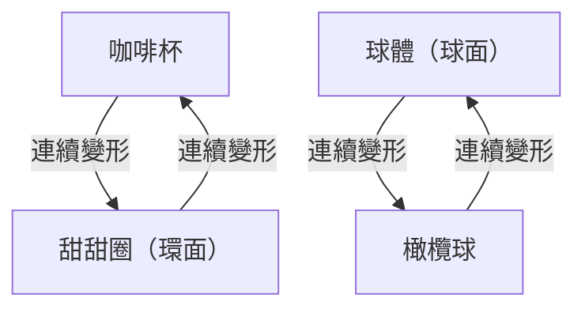
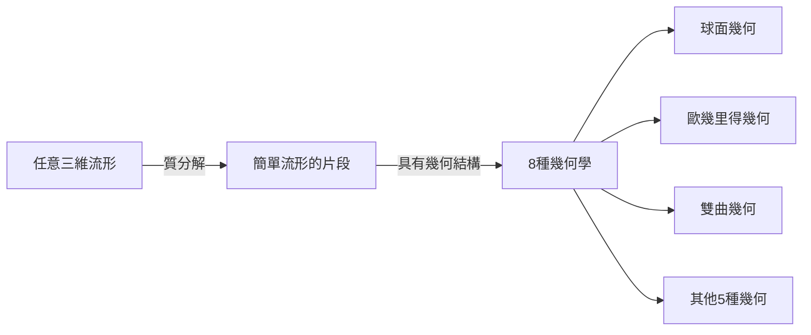

在數學的世界裡，存在著許多考驗人類直覺、深邃而美麗的謎題。其中最著名、結局也最具戲劇性的，就是 **[龐加萊猜想](https://kenji.blog/zh-tw/p/poincare-conjecture/)** （[Poincaré Conjecture](https://kenji.blog/zh-tw/p/poincare-conjecture/)）。

法國天才數學家昂利·龐加萊於 1904 年提出的這個猜想，是直接關係到「宇宙的形狀」這個宏大主題的拓樸學（Topology）根本問題。大約 100 年來，無數著名數學家挑戰卻鎩羽而歸的這道超級難題，在 2002 年到 2003 年間，突然被俄羅斯孤高數學家格里戈里·佩雷爾曼證明，震驚了全世界。

本文將從[龐加萊猜想](https://kenji.blog/zh-tw/p/poincare-conjecture/)的意義開始，介紹拓樸學的基本概念，以及佩雷爾曼證明的背景，並交織數學公式與圖解進行深入探討。

## 1. 什麼是拓樸學（Topology）？

為了理解[龐加萊猜想](https://kenji.blog/zh-tw/p/poincare-conjecture/)，首先必須了解 **拓樸學** 這個數學領域。拓樸學也被稱為「柔軟的幾何學」。

在一般的幾何學（[歐幾里得](https://kenji.blog/zh-tw/p/euclid/)幾何學）中，長度、角度、面積等性質非常重要，但拓樸學會忽略這些。拓樸學只把對物體進行「拉長」、「彎曲」、「縮小」等連續變形後仍保持不變的性質（拓樸性質）作為研究對象。不過，不允許進行「切斷」、「黏合」、「打洞」等操作。

著名的例子就是「咖啡杯與甜甜圈」。

咖啡杯有一個作為把手的「洞」。甜甜圈的中間也有一個「洞」。在拓樸學的世界裡，只要洞的數量相同，一方就可以連續變形成另一方，因此被視為「形狀相同（同胚）」。

另一方面，球體（球的表面）沒有洞。因此，無論如何連續變形球體，都無法使其變成甜甜圈的形狀。這個「有無破洞」，就是拓樸學中決定性的差異。

## 2. 單連通空間與[龐加萊猜想](https://kenji.blog/zh-tw/p/poincare-conjecture/)的主張

[龐加萊猜想](https://kenji.blog/zh-tw/p/poincare-conjecture/)正是試圖從這個拓樸學的觀點來刻畫「球」的特徵。

我們日常所見的「球的表面」被稱為二維球面（ $S^2$ ）。龐加萊認為，如果某個圖形是一個「沒有洞」的封閉空間，那它是否就與球同胚（拓樸上相同）呢？

這裡重要的一個概念是 **單連通** （simply connected）。

當空間內的任意迴圈（環），都可以在不離開空間的情況下縮小到一個點時，這個空間就被稱為「單連通」。

- **球面（ $S^2$ ）**: 在表面上畫的任何一個環，都可以沿著表面滑動並收縮到一個點。也就是說，它是單連通的。
- **環面（甜甜圈的表面）**: 穿過洞所畫的環，會卡在洞上，無法縮小到一個點。也就是說，它不是單連通的。

龐加萊提出了一個問題：關於二維球面的這個性質，在三維球面（ $S^3$ ）上是否也成立呢？

> **[龐加萊猜想](https://kenji.blog/zh-tw/p/poincare-conjecture/)**
> 單連通的三維封閉流形，與三維球面 $S^3$ 同胚。

直觀地說，這個問題是：「如果我們帶著一根長繩子到宇宙空間，隨意繞一圈回來。如果我們拉扯繩子的兩端，總能把繩子完全收回，是否就能說宇宙的形狀是圓的（是三維球面）？」

## 3. 推廣至高維度與數學家們的苦戰

有趣的是，比起三維（我們生活的空間維度），更高維度的[龐加萊猜想](https://kenji.blog/zh-tw/p/poincare-conjecture/)反而先被解決了。

$$
\text{流形的維度 } n \ge 5 \text{ 的情況}
$$

在 1960 年代，斯蒂芬·斯梅爾等人證明了 $n \ge 5$ 的高維[龐加萊猜想](https://kenji.blog/zh-tw/p/poincare-conjecture/)。在高維度中，使圖形變形的「自由度」很大，因此有足夠的空間解開糾結，證明相對容易。

$$
\text{流形的維度 } n = 4 \text{ 的情況}
$$

1982 年，麥可·弗里德曼使用了非常複雜的方法證明了四維的[龐加萊猜想](https://kenji.blog/zh-tw/p/poincare-conjecture/)，並因此獲得了菲爾茲獎。

然而，唯獨最初的 $n = 3$ （三維）的情況，無論如何都解不開。三維空間沒有足夠的「餘裕」來解開糾結，又不像低維度那樣簡單，可以說是最棘手的維度。

## 4. 瑟斯頓的幾何化猜想

在 1970 年代後半，威廉·瑟斯頓提出了關於三維流形結構的宏大願景： **幾何化猜想** 。

他主張，所有可能的三維流形，都可以分解為 8 種基本「幾何學（構成要素）」的組合。

如果瑟斯頓的幾何化猜想是正確的，那麼單連通的流形就會自動導出只具有「球面幾何」的要素，結果也就證明了[龐加萊猜想](https://kenji.blog/zh-tw/p/poincare-conjecture/)。也就是說，[龐加萊猜想](https://kenji.blog/zh-tw/p/poincare-conjecture/)被發現不過是更巨大的幾何化猜想這個拼圖中的一小塊。

但是，幾何化猜想本身就是一個難以想像的困難問題。

## 5. 瑞奇流與佩雷爾曼的登場

提出打破這堵巨大高牆武器的人，是理查德·漢密爾頓。他引入了一個名為 **瑞奇流** （Ricci flow）的微分方程。

瑞奇流是一個方程式，能隨著時間推移，將流形的「彎曲程度」平滑且均勻化。直觀上，這就像是用熱量融化凹凸不平的黏土表面，使其逐漸變成完美的球體。

$$
\frac{\partial g_{ij}}{\partial t} = -2 R_{ij}
$$

這裡 $g_{ij}$ 代表度規張量， $R_{ij}$ 代表瑞奇曲率張量。

漢密爾頓的想法是，將瑞奇流應用於任意三維流形，並觀察它最終穩定為何種形狀，藉此證明瑟斯頓的幾何化猜想。但是，在變形過程中，流形的一部分會被無限拉長變細並斷裂，產生了「奇異點（Singularity）」，這是一個致命的問題，導致研究陷入了僵局。

解決這個奇異點問題並完成證明的，是 **格里戈里·佩雷爾曼** 。

佩雷爾曼完全分類了瑞奇流中會出現的所有奇異點，並在奇異點發生前對空間進行「手術（Surgery）」將其切斷，然後再次運行瑞奇流，在數學上嚴格地建構了這種驚人的手法（Ricci flow with surgery）。

## 6. 傳奇的證明與其結局

在 2002 年到 2003 年間，佩雷爾曼突然在預印本伺服器（arXiv）上發布了 3 篇論文。那裡記載著瑟斯頓的幾何化猜想，以及[龐加萊猜想](https://kenji.blog/zh-tw/p/poincare-conjecture/)的完整證明。

由於他的論文非常深奧且過於簡潔，世界頂尖的數學家們組成了團隊，花了數年時間驗證他的論文。結果證實，佩雷爾曼的證明沒有任何瑕疵，堪稱完美。

但是，從這裡開始，佩雷爾曼的傳奇行為就展開了。
他拒絕了菲爾茲獎，更拒絕領取克雷數學研究所為千禧年大獎難題準備的 100 萬美元（約 1 億日圓）獎金。他選擇從數學界完全消失，回到故鄉聖彼得堡與母親過著隱居的生活。

## 7. 結語：拓樸學開拓的未來

[龐加萊猜想](https://kenji.blog/zh-tw/p/poincare-conjecture/)的解決，不僅僅是結束了 100 年來的難題。瑞奇流這種強大的分析手法被引入幾何學，為數學的世界開拓了新的地平線。

此外，試圖理解宇宙形狀的數學嘗試，也持續對現代物理學，特別是弦理論與宇宙學中對維度的理解產生深遠的影響。

從龐加萊開始，傳遞給瑟斯頓、漢密爾頓，最後由佩雷爾曼接下的智慧接力棒，證明了人類的精神能夠多麼深刻地逼近美麗的宇宙真理，可以說是最棒的紀念碑。
