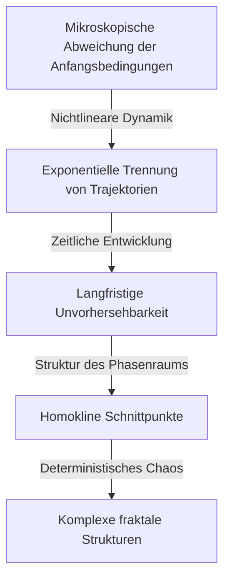

[Henri Poincaré](https://kenji.blog/p/poincare/) (1854–1912) ist einer der größten Mathematiker der Geschichte, den Frankreich je hervorgebracht hat, sowie theoretischer Physiker, Ingenieur und Wissenschaftsphilosoph. Er wird oft als **"Der letzte Universalist"** bezeichnet, weil er jedes mathematische Gebiet seiner Zeit zutiefst verstand und zu jedem fundamentale Beiträge leistete. Angesichts der Tatsache, wie hochspezialisiert und fragmentiert die moderne Mathematik geworden ist, ist es unwahrscheinlich, dass jemals wieder jemand mit einem derart umfassenden Blick auf alle Gebiete erscheinen wird.

In diesem Artikel werden wir mit überwältigendem Umfang und Tiefe das dramatische Leben von Poincaré, seine sehr menschlichen Episoden und das tiefgreifende mathematische und physikalische Erbe, das er der Welt hinterlassen hat, erkunden.

## 1. Frühes Leben und einzigartiges Bildungsumfeld: Das Aufkeimen eines Genies

[Henri Poincaré](https://kenji.blog/p/poincare/) wurde am 29. April 1854 in der nordostfranzösischen Stadt Nancy in eine hochintellektuelle Elitefamilie geboren. Sein Vater, Léon Poincaré, war Professor an der medizinischen Fakultät der Universität Nancy, und sein Cousin, Raymond Poincaré, sollte später ein prominenter Politiker werden, der als Premierminister und Präsident von Frankreich diente. Ein solch gesegnetes familiäres Umfeld stimulierte seine intellektuelle Neugier enorm.

Während seiner Kindheit litt Poincaré an Diphtherie, die ihn für lange Zeit unfähig machte zu sprechen und an sein Krankenbett fesselte. Diese Phase der Isolation entwickelte jedoch seine inneren Denkfähigkeiten auf unnatürliche Weise. Er besaß ein **intuitives Gedächtnis** , das es ihm ermöglichte, den Inhalt eines Buches nach nur einmaligem Lesen perfekt auswendig zu lernen, und er lernte, die visuelle Anordnung von Buchstaben und räumliche Beziehungen in seinem Geist frei zu manipulieren.

Als er 1873 in die École Polytechnique, Frankreichs führende Elite-Ausbildungseinrichtung, eintrat, versetzten seine Talente die Fakultät sofort in Erstaunen. Eine interessante Episode ist, dass Poincaré extrem kurzsichtig war und die mathematischen Formeln auf der Tafel kaum sehen konnte. Darüber hinaus hatte er nicht die Gewohnheit, sich Notizen zu machen. Dennoch saß er während des Unterrichts mit geschlossenen Augen völlig still und rekonstruierte komplexe mathematische Beweise vollständig in seinem Geist, wobei er sich ausschließlich auf die Worte des Professors verließ. Seine Noten waren immer an der Spitze, und nach seinem Abschluss wechselte er an die École des Mines, wo er auch die Qualifikationen als Bergbauingenieur erwarb.

## 2. Himmelsmechanik und das Dreikörperproblem: Die Geburt der Chaostheorie

Unter Poincarés Errungenschaften ist seine Forschung zum **Dreikörperproblem** in der Himmelsmechanik die berühmteste, die einen entscheidenden Einfluss auf die moderne Wissenschaft hatte.

Im späten 19. Jahrhundert sponserte der schwedische König Oskar II. anlässlich seines 60. Geburtstags einen Preisaufgabewettbewerb über schwierige Probleme der Himmelsmechanik. Die zentrale Herausforderung bestand darin, "eine analytische Lösung zu finden, die vollständig beschreibt, wie sich drei Himmelskörper, wie Sonne, Erde und Mond, unter gegenseitiger Schwerkraft bewegen".

Poincaré nahm sich dieses Problems an und kam zu einer verblüffenden Schlussfolgerung. Es war der mathematische Beweis für die Tatsache, dass "es im Allgemeinen keine vorhersehbare stabile analytische Lösung für das Dreikörperproblem gibt". Er entdeckte, dass selbst in einem deterministischen System, das auf der Newtonschen Mechanik basiert, extrem kleine Unterschiede in den Anfangsbedingungen im Laufe der Zeit exponentiell zunehmen, was zu einem völlig unvorhersehbaren Verhalten führt. Dies war der historische Beginn des Feldes, das wir heute als **Chaostheorie** bezeichnen.

Anstatt komplexe himmlische Trajektorien mit Berechnungsformeln zu verfolgen, konzentrierte sich Poincaré auf die "geometrische Form des Raums", die von der gesamten Trajektorie nachgezeichnet wird. Er nutzte das Konzept des Phasenraums voll aus und entwickelte die "Poincaré-Abbildung", die nur die Punkte aufzeichnet, an denen die Trajektorie eine bestimmte Ebene kreuzt. Dies ebnete den Weg für ein qualitatives Verständnis des Verhaltens komplexer mechanischer Systeme.

## 3. [Die Poincaré-Vermutung](https://kenji.blog/p/poincare-conjecture/): Die Gründung der Topologie

Eine weitere monumentale Errungenschaft Poincarés war die eigenständige Begründung der **Topologie** , einem Hauptgebiet der modernen Mathematik. In seiner Arbeit "Analysis Situs" von 1895 konstruierte er einen neuen mathematischen Rahmen, um die Eigenschaften von Figuren zu untersuchen, die auch bei kontinuierlicher Verformung erhalten bleiben.

In dieser Forschung präsentierte er eines der berühmtesten ungelösten Probleme in der Geschichte der Mathematik, die **Poincaré-Vermutung** .

> "Ist jede einfach zusammenhängende, geschlossene 3-Mannigfaltigkeit homöomorph zur 3-Sphäre $S^3$?"

Wenn wir diese schwierige Vermutung mit der Sprache der algebraischen Topologie (Homologiegruppen und Fundamentalgruppen), die er entwickelt hat, beschreiben, sieht es so aus: Wenn die Fundamentalgruppe $\pi_1(M)$ einer Mannigfaltigkeit $M$ trivial ist, das heißt,

$$
\pi_1(M) \cong \{1\} \implies M \cong S^3 \quad (\text{Ein einfach zusammenhängender Raum ist homöomorph zu einer Sphäre})
$$

Hier ist $\pi_1(M)$ ein Indikator, der anzeigt, ob jede geschlossene Kurve auf der Mannigfaltigkeit kontinuierlich auf einen einzigen Punkt geschrumpft werden kann (einfach zusammenhängend). Poincarés Frage war eine tiefgründige, die nach der Form des Universums selbst fragte. "Wenn wir ein Seil durch das Universum spannen und daran ziehen, um es an einem einzigen Punkt zu sammeln, können wir dann sagen, dass die Form des Universums rund (eine Sphäre) ist?"

Diese Vermutung wurde etwa 100 Jahre nach ihrer Veröffentlichung, im Jahr 2006, von dem zurückgezogen lebenden russischen Mathematiker Grigori Perelman unter Verwendung der Ricci-Fluss-Gleichung bewiesen und wurde als erstes gelöstes der Millennium-Probleme des Clay Mathematics Institute zu einer weltweiten Nachricht.

## 4. Entscheidende Beiträge zur Speziellen Relativitätstheorie

Auch im Bereich der Physik sind Poincarés Beiträge unermesslich. Einige Jahre bevor Albert Einstein 1905 die Spezielle Relativitätstheorie veröffentlichte, hatte Poincaré die Theorien des niederländischen Physikers Hendrik Lorentz eingehend studiert und die Konzepte von absoluter Zeit und absolutem Raum in Frage gestellt.

Poincaré schlug das "Relativitätsprinzip" vor, wonach es unmöglich ist, eine absolute Bewegung relativ zum Äther zu erkennen, und formulierte mathematisch, dass die Lichtgeschwindigkeit unabhängig vom Inertialsystem, aus dem sie betrachtet wird, konstant ist. Die von ihm abgeleiteten Transformationsgleichungen für Koordinaten und Zeit (Lorentz-Transformationen) lauten wie folgt:

$$
x' = \gamma (x - vt), \quad t' = \gamma \left(t - \frac{vx}{c^2}\right) \quad (\text{wobei } c \text{ die Lichtgeschwindigkeit im Vakuum ist})
$$

Darüber hinaus führte Poincaré rasch das Konzept der vierdimensionalen Raumzeit ein und definierte die "Poincaré-Gruppe", die zeigt, dass die physikalischen Gesetze unter Lorentz-Transformationen invariant sind. Während Einstein die Relativitätstheorie aus einem physikalischen und intuitiven Ansatz heraus aufbaute, war Poincaré aus der Perspektive mathematischer und geometrischer struktureller Schönheit zur gleichen Wahrheit gelangt.

## 5. Das Unbewusste und die Kreativität: Die Psychologie der Inspiration

Poincaré beobachtete, wie mathematische Intuition in ihm selbst funktionierte, und hinterließ viele Schriften über den kreativen Prozess. Die Episode bezüglich seiner Entdeckung der Fuchsschen Funktionen, die in seinem Buch "Wissenschaft und Methode" aufgezeichnet ist, ist in den Bereichen der Psychologie und der Neurowissenschaften sehr berühmt.

Er hatte sich mehrere Monate lang über ein schwieriges mathematisches Problem den Kopf zerbrochen und konnte trotz wiederholter bewusster Berechnungen und logischer Überlegungen keinen Hinweis auf eine Lösung finden. Erschöpft beschloss er, sich von seiner Forschung zurückzuziehen, und schloss sich einer geologischen Exkursion an. Dann, während der Reise, in genau dem Moment, als er in der Stadt Coutances in einen Pferdeomnibus einsteigen wollte, blitzte plötzlich eine perfekte Lösung in seinem Kopf auf.

> "In dem Augenblick, als ich den Fuß auf das Trittbrett setzte, kam mir, ohne dass irgendetwas in meinen vorherigen Gedanken darauf vorbereitet hätte, die Idee, dass die Transformationen, die ich zur Definition der Fuchsschen Funktionen verwendet hatte, identisch waren mit denen der nicht-euklidischen Geometrie. Ich habe die Idee nicht überprüft; ich hätte keine Zeit dazu gehabt, da ich, nachdem ich meinen Platz im Omnibus eingenommen hatte, ein bereits begonnenes Gespräch fortsetzte, aber ich verspürte eine vollkommene Gewissheit."

Aus dieser Erfahrung heraus kategorisierte Poincaré den Prozess der kreativen Entdeckung in vier Phasen: "Präparation" (bewusste Anstrengung), "Inkubation" (Kombinieren von Informationen im Unbewussten), "Illumination" (plötzliches intuitives Verständnis) und "Verifikation" (logischer Beweis). Seine Erkenntnisse beweisen, wie mächtig das Unbewusste als rechnerische Ressource in den Tiefen des menschlichen Denkens ist.

## 6. Wissenschaftsphilosophie: Die Befürwortung des Konventionalismus

Poincaré hinterließ auch auf dem Gebiet der Wissenschaftsphilosophie tiefe Spuren. Er vertrat eine Position, die als **Konventionalismus** bekannt ist. Dies ist die Idee, dass "fundamentale Axiome und Gesetze in der Wissenschaft (wie die Axiome der euklidischen Geometrie) weder apriorische Wahrheiten noch empirische Fakten sind, sondern lediglich 'bequeme Konventionen', die von Menschen angenommen wurden, um die Natur zu beschreiben".

Er erklärte: "Es ist nicht so, dass die euklidische Geometrie wahr und die nicht-euklidische Geometrie falsch ist. Es ist dasselbe, als würde man sagen, das metrische System sei wahrer als das Yard-System." Diese flexible philosophische Haltung wurde später zu einem wichtigen ideologischen Fundament, als Einstein die Allgemeine Relativitätstheorie unter Verwendung der nicht-euklidischen Geometrie konstruierte.

## 7. Fazit: Poincarés ewiges Erbe

Im Jahr 1912 verstarb [Henri Poincaré](https://kenji.blog/p/poincare/) im jungen Alter von 58 Jahren. Als er starb, trauerten Wissenschaftler auf der ganzen Welt: "Das Licht des französischen Intellekts ist erloschen."

Die mathematischen Grundlagen, die er für die **Topologie** , die **Chaostheorie** und das **Relativitätsprinzip** hinterlassen hat, hauchen heute jedem Bereich Leben ein, von der modernen Teilchenphysik und Kosmologie bis hin zur Wettervorhersage und Wirtschaftsmodellen. Poincaré lehrte uns nicht nur isolierte Fragmente spezialisierten Wissens, sondern die universelle Schönheit der Mathematik, die die gesamte Welt durchdringt. Wenn wir auf sein Leben und seine Errungenschaften zurückblicken, werden wir Zeuge der ultimativen Tiefe und Weite, die der menschliche Geist erreichen kann.
