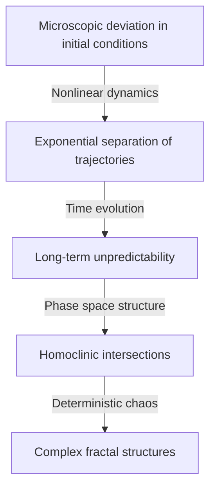

Henri Poincaré (1854–1912) is one of the greatest mathematicians in history that France has ever produced, as well as a theoretical physicist, engineer, and philosopher of science. He is often referred to as **"The Last Universalist"** because he deeply understood every mathematical field of his time and made fundamental contributions to each of them. Considering how highly specialized and fragmented modern mathematics has become, it is unlikely that anyone with such a comprehensive view of all fields will ever appear again.

In this article, we will explore with overwhelming volume and depth the dramatic life of Poincaré, his very human episodes, and the profound mathematical and physical legacy he left to the world.

## 1. Early Life and Unique Educational Environment: The Sprouting of a Genius

Henri Poincaré was born on April 29, 1854, in the northeastern French city of Nancy, into a highly intellectual elite family. His father, Léon Poincaré, was a professor in the faculty of medicine at the University of Nancy, and his cousin, Raymond Poincaré, would later become a prominent politician serving as Prime Minister and President of France. Such a blessed family environment greatly stimulated his intellectual curiosity.

During his childhood, Poincaré suffered from diphtheria, which left him unable to speak for a long period and confined to his sickbed. However, this period of isolation abnormally developed his internal thinking abilities. He possessed an **intuitive memory** that allowed him to perfectly memorize the contents of a book after reading it just once, and he learned to freely manipulate the visual arrangement of letters and spatial relationships in his mind.

In 1873, when he entered the École Polytechnique, France's premier elite training institution, his talents immediately astonished the faculty. An interesting episode is that Poincaré was extremely nearsighted and could hardly see the mathematical formulas on the blackboard. Furthermore, he did not have the habit of taking notes. Nevertheless, he would sit perfectly still during class with his eyes closed, reconstructing complex mathematical proofs entirely in his mind, relying solely on the professor's words. His grades were always at the top, and after graduation, he proceeded to the École des Mines, where he also obtained qualifications as a mining engineer.

## 2. Celestial Mechanics and the Three-Body Problem: The Birth of Chaos Theory

Among Poincaré's achievements, the most famous one that had a decisive impact on modern science is his research on the **Three-body problem** in celestial mechanics.

In the late 19th century, King Oscar II of Sweden sponsored a prize essay contest on difficult problems in celestial mechanics to commemorate his 60th birthday. The central challenge was "to find an analytical solution that completely describes how three celestial bodies, such as the Sun, Earth, and Moon, move under mutual gravity."

Poincaré tackled this problem and reached a startling conclusion. It was the mathematical proof of the fact that "there is generally no predictable stable analytical solution to the three-body problem." He discovered that even in a deterministic system based on Newtonian mechanics, extremely small differences in initial conditions increase exponentially over time, resulting in completely unpredictable behavior. This was the historic dawn of the field we call **Chaos theory** today.

Instead of chasing complex celestial trajectories with calculation formulas, Poincaré focused on the "geometric shape of space" traced by the entire trajectory. He fully utilized the concept of phase space and devised the "Poincaré map," which records only the points where the trajectory crosses a specific plane. This opened the way for a qualitative understanding of the behavior of complex mechanical systems.

## 3. The Poincaré Conjecture: The Founding of Topology

Another monumental achievement of Poincaré was his single-handed founding of **Topology** , a major field in modern mathematics. In his 1895 paper "Analysis Situs," he constructed a new mathematical framework to study the properties of figures that are preserved even when they are continuously deformed.

In this research, he presented one of the most famous unsolved problems in mathematical history, the **Poincaré conjecture** .

> "Is every simply connected, closed 3-manifold homeomorphic to the 3-sphere $S^3$?"

If we describe this difficult conjecture using the language of algebraic topology (homology groups and fundamental groups) that he developed, it looks like this: When the fundamental group $\pi_1(M)$ of a manifold $M$ is trivial, that is,

$$
\pi_1(M) \cong \{1\} \implies M \cong S^3 \quad (\text{A simply connected space is homeomorphic to a sphere})
$$

Here, $\pi_1(M)$ is an indicator showing whether any closed curve on the manifold can be continuously shrunk to a single point (simply connected). Poincaré's question was a profound one asking about the very shape of the universe. "If we string a rope across the universe and pull it in to collect it at a single point, can we say the shape of the universe is round (a sphere)?"

This conjecture was proven about 100 years after its publication, in 2006, by the solitary Russian mathematician Grigori Perelman using the Ricci flow equation, and it became global news as the first of the Clay Mathematics Institute's Millennium Prize Problems to be solved.

## 4. Decisive Contributions to the Special Theory of Relativity

In the field of physics, Poincaré's contributions are also immeasurable. Several years before Albert Einstein published the Special Theory of Relativity in 1905, Poincaré had deeply studied the theories of the Dutch physicist Hendrik Lorentz and questioned the concepts of absolute time and absolute space.

Poincaré proposed the "Principle of Relativity," stating that it is impossible to detect absolute motion relative to the ether, and mathematically formulated that the speed of light is constant regardless of the inertial frame from which it is viewed. The transformation equations for coordinates and time (Lorentz transformations) he derived are as follows:

$$
x' = \gamma (x - vt), \quad t' = \gamma \left(t - \frac{vx}{c^2}\right) \quad (\text{where } c \text{ is the speed of light in a vacuum})
$$

Moreover, Poincaré quickly introduced the concept of four-dimensional spacetime and defined the "Poincaré group," which shows that the laws of physics are invariant under Lorentz transformations. While Einstein built the theory of relativity from a physical and intuitive approach, Poincaré had arrived at the same truth from the perspective of mathematical and geometric structural beauty.

## 5. The Unconscious and Creativity: The Psychology of Inspiration

Poincaré observed how mathematical intuition worked within himself and left many writings on the creative process. The episode regarding his discovery of Fuchsian functions, recorded in his book "Science and Method," is highly famous in the fields of psychology and neuroscience.

He had been agonizing over a difficult mathematical problem for several months, unable to find a clue to the solution despite repeated conscious calculations and logical reasoning. Exhausted, he decided to step away from his research and joined a geological excursion. Then, during the trip, at the exact moment he was about to board a horse-drawn omnibus in the town of Coutances, a perfect solution suddenly flashed in his mind.

> "At the moment when I put my foot on the step the idea came to me, without anything in my former thoughts seeming to have paved the way for it, that the transformations I had used to define the Fuchsian functions were identical with those of non-Euclidean geometry. I did not verify the idea; I should not have had time, as, upon taking my seat in the omnibus, I went on with a conversation already commenced, but I felt a perfect certainty."

From this experience, Poincaré categorized the process of creative discovery into four stages: "Preparation" (conscious effort), "Incubation" (combining information in the unconscious), "Illumination" (sudden intuitive understanding), and "Verification" (logical proof). His insights prove how powerful the unconscious is as a computational resource in the depths of human thought.

## 6. Philosophy of Science: The Advocacy of Conventionalism

Poincaré also left a huge mark in the field of philosophy of science. He advocated a position known as **Conventionalism** . This is the idea that "fundamental axioms and laws in science (such as the axioms of Euclidean geometry) are neither a priori truths nor empirical facts, but merely 'convenient conventions' adopted by humans to describe nature."

He stated, "It is not that Euclidean geometry is true and non-Euclidean geometry is false. It is the same as saying that the metric system is not more true than the yard system." This flexible philosophical attitude later became an important ideological foundation when Einstein constructed the General Theory of Relativity using non-Euclidean geometry.

## 7. Conclusion: Poincaré's Eternal Legacy

In 1912, Henri Poincaré passed away at the young age of 58. When he died, scientists around the world grieved that "the light of French intellect has been extinguished."

The mathematical foundations he left behind for **Topology** , **Chaos theory** , and the **Principle of Relativity** breathe life into every field today, from modern particle physics and cosmology to weather prediction and economic models. Poincaré taught us not just fragmented pieces of specialized knowledge, but the universal beauty of mathematics that pierces through the entire world. When we reflect on his life and achievements, we witness the ultimate depth and expanse that the human spirit can reach.
