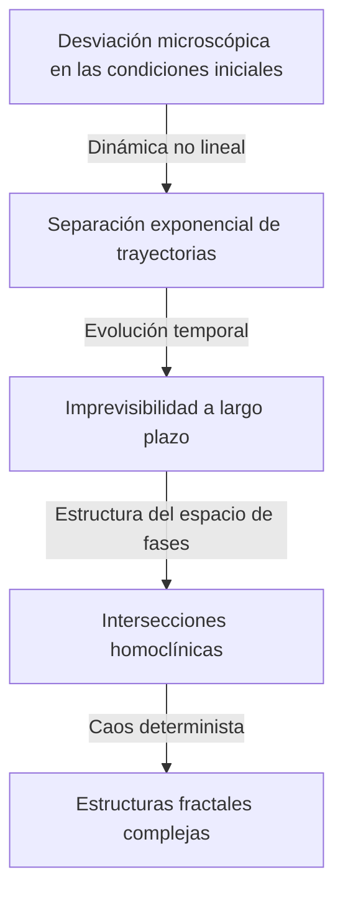

Henri Poincaré (1854–1912) es uno de los matemáticos más grandes de la historia que Francia haya producido, así como físico teórico, ingeniero y filósofo de la ciencia. A menudo se le conoce como **"El Último Universalista"** porque comprendía profundamente todos los campos matemáticos de su tiempo e hizo contribuciones fundamentales a cada uno de ellos. Considerando cuán altamente especializada y fragmentada se ha vuelto la matemática moderna, es poco probable que alguna vez vuelva a aparecer alguien con una visión tan abarcadora de todos los campos.

En este artículo, exploraremos con abrumador volumen y profundidad la dramática vida de Poincaré, sus episodios muy humanos y el profundo legado matemático y físico que dejó al mundo.

## 1. Vida Temprana y Entorno Educativo Único: El Brote de un Genio

Henri Poincaré nació el 29 de abril de 1854 en la ciudad nororiental francesa de Nancy, en el seno de una familia de élite altamente intelectual. Su padre, Léon Poincaré, era profesor en la facultad de medicina de la Universidad de Nancy, y su primo, Raymond Poincaré, más tarde se convertiría en un prominente político, sirviendo como Primer Ministro y Presidente de Francia. Un entorno familiar tan bendecido estimuló enormemente su curiosidad intelectual.

Durante su infancia, Poincaré sufrió de difteria, lo que lo dejó incapaz de hablar durante un largo período y confinado en su cama de enfermo. Sin embargo, este período de aislamiento desarrolló de manera anormal sus habilidades de pensamiento interno. Poseía una **memoria intuitiva** que le permitía memorizar perfectamente el contenido de un libro después de leerlo solo una vez, y aprendió a manipular libremente la disposición visual de las letras y las relaciones espaciales en su mente.

En 1873, cuando ingresó en la École Polytechnique, la principal institución de formación de élite de Francia, sus talentos asombraron de inmediato al profesorado. Un episodio interesante es que Poincaré era extremadamente miope y apenas podía ver las fórmulas matemáticas en la pizarra. Además, no tenía la costumbre de tomar notas. Sin embargo, se sentaba perfectamente quieto durante la clase con los ojos cerrados, reconstruyendo complejas demostraciones matemáticas completamente en su mente, confiando únicamente en las palabras del profesor. Sus calificaciones siempre fueron las más altas, y después de graduarse, pasó a la École des Mines, donde también obtuvo el título de ingeniero de minas.

## 2. Mecánica Celeste y el Problema de los Tres Cuerpos: El Nacimiento de la Teoría del Caos

Entre los logros de Poincaré, el más famoso y que tuvo un impacto decisivo en la ciencia moderna es su investigación sobre el **Problema de los tres cuerpos** en la mecánica celeste.

A finales del siglo XIX, el rey Óscar II de Suecia patrocinó un concurso de ensayos sobre problemas difíciles de la mecánica celeste para conmemorar su 60 cumpleaños. El desafío central era "encontrar una solución analítica que describa completamente cómo tres cuerpos celestes, como el Sol, la Tierra y la Luna, se mueven bajo su gravedad mutua".

Poincaré abordó este problema y llegó a una conclusión sorprendente. Fue la prueba matemática del hecho de que "generalmente no hay una solución analítica estable y predecible para el problema de los tres cuerpos". Descubrió que incluso en un sistema determinista basado en la mecánica newtoniana, diferencias extremadamente pequeñas en las condiciones iniciales aumentan exponencialmente con el tiempo, resultando en un comportamiento completamente impredecible. Este fue el amanecer histórico del campo que hoy llamamos **Teoría del Caos** .

En lugar de perseguir complejas trayectorias celestes con fórmulas de cálculo, Poincaré se centró en la "forma geométrica del espacio" trazada por toda la trayectoria. Utilizó plenamente el concepto de espacio de fases e ideó el "Mapa de Poincaré", que registra solo los puntos donde la trayectoria cruza un plano específico. Esto abrió el camino para una comprensión cualitativa del comportamiento de los sistemas mecánicos complejos.

## 3. La Conjetura de Poincaré: La Fundación de la Topología

Otro logro monumental de Poincaré fue la fundación, por él solo, de la **Topología** , un campo importante en las matemáticas modernas. En su artículo de 1895 "Analysis Situs", construyó un nuevo marco matemático para estudiar las propiedades de las figuras que se conservan incluso cuando se deforman continuamente.

En esta investigación, presentó uno de los problemas sin resolver más famosos en la historia de las matemáticas, la **Conjetura de Poincaré** .

> "¿Es toda variedad de dimensión 3, cerrada y simplemente conexa, homeomorfa a la esfera de dimensión 3, $S^3$?"

Si describimos esta difícil conjetura utilizando el lenguaje de la topología algebraica (grupos de homología y grupos fundamentales) que él desarrolló, se ve así: Cuando el grupo fundamental $\pi_1(M)$ de una variedad $M$ es trivial, es decir,

$$
\pi_1(M) \cong \{1\} \implies M \cong S^3 \quad (\text{Un espacio simplemente conexo es homeomorfo a una esfera})
$$

Aquí, $\pi_1(M)$ es un indicador que muestra si cualquier curva cerrada en la variedad se puede encoger continuamente a un solo punto (simplemente conexo). La pregunta de Poincaré fue profunda y cuestionaba la forma misma del universo. "Si atamos una cuerda a través del universo y tiramos de ella para recogerla en un solo punto, ¿podemos decir que la forma del universo es redonda (una esfera)?"

Esta conjetura fue probada aproximadamente 100 años después de su publicación, en 2006, por el solitario matemático ruso Grigori Perelman utilizando la ecuación del flujo de Ricci, y se convirtió en noticia mundial al ser el primero de los Problemas del Milenio del Clay Mathematics Institute en ser resuelto.

## 4. Contribuciones Decisivas a la Teoría de la Relatividad Especial

En el campo de la física, las contribuciones de Poincaré también son inconmensurables. Varios años antes de que Albert Einstein publicara la Teoría de la Relatividad Especial en 1905, Poincaré había estudiado profundamente las teorías del físico holandés Hendrik Lorentz y había cuestionado los conceptos de tiempo absoluto y espacio absoluto.

Poincaré propuso el "Principio de Relatividad", afirmando que es imposible detectar un movimiento absoluto en relación con el éter, y formuló matemáticamente que la velocidad de la luz es constante independientemente del marco inercial desde el cual se observe. Las ecuaciones de transformación para coordenadas y tiempo (transformaciones de Lorentz) que derivó son las siguientes:

$$
x' = \gamma (x - vt), \quad t' = \gamma \left(t - \frac{vx}{c^2}\right) \quad (\text{donde } c \text{ es la velocidad de la luz en el vacío})
$$

Además, Poincaré introdujo rápidamente el concepto de espacio-tiempo de cuatro dimensiones y definió el "Grupo de Poincaré", que muestra que las leyes de la física son invariantes bajo las transformaciones de Lorentz. Mientras que Einstein construyó la teoría de la relatividad desde un enfoque físico e intuitivo, Poincaré había llegado a la misma verdad desde la perspectiva de la belleza estructural matemática y geométrica.

## 5. El Inconsciente y la Creatividad: La Psicología de la Inspiración

Poincaré observó cómo funcionaba la intuición matemática dentro de sí mismo y dejó muchos escritos sobre el proceso creativo. El episodio sobre su descubrimiento de las funciones fuchsianas, registrado en su libro "Ciencia y Método", es muy famoso en los campos de la psicología y la neurociencia.

Había estado agonizando sobre un difícil problema matemático durante varios meses, incapaz de encontrar una pista para la solución a pesar de los repetidos cálculos conscientes y el razonamiento lógico. Agotado, decidió alejarse de su investigación y se unió a una excursión geológica. Luego, durante el viaje, en el momento exacto en que estaba a punto de subir a un ómnibus de caballos en la ciudad de Coutances, una solución perfecta brilló de repente en su mente.

> "En el momento en que puse el pie en el escalón, la idea me vino a la mente, sin que nada en mis pensamientos anteriores pareciera haber preparado el camino, de que las transformaciones que había usado para definir las funciones fuchsianas eran idénticas a las de la geometría no euclidiana. No verifiqué la idea; no habría tenido tiempo, ya que, al tomar mi asiento en el ómnibus, continué con una conversación ya comenzada, pero sentí una certeza perfecta."

A partir de esta experiencia, Poincaré clasificó el proceso de descubrimiento creativo en cuatro etapas: "Preparación" (esfuerzo consciente), "Incubación" (combinación de información en el inconsciente), "Iluminación" (comprensión intuitiva repentina) y "Verificación" (prueba lógica). Sus ideas prueban cuán poderoso es el inconsciente como recurso computacional en las profundidades del pensamiento humano.

## 6. Filosofía de la Ciencia: La Defensa del Convencionalismo

Poincaré también dejó una gran huella en el campo de la filosofía de la ciencia. Defendió una posición conocida como **Convencionalismo** . Esta es la idea de que "los axiomas y leyes fundamentales en la ciencia (como los axiomas de la geometría euclidiana) no son ni verdades a priori ni hechos empíricos, sino simplemente 'convenciones convenientes' adoptadas por los humanos para describir la naturaleza".

Afirmó: "No es que la geometría euclidiana sea verdadera y la geometría no euclidiana sea falsa. Es lo mismo que decir que el sistema métrico no es más verdadero que el sistema de yardas." Esta actitud filosófica flexible se convirtió más tarde en una base ideológica importante cuando Einstein construyó la Teoría de la Relatividad General utilizando geometría no euclidiana.

## 7. Conclusión: El Legado Eterno de Poincaré

En 1912, Henri Poincaré falleció a la temprana edad de 58 años. Cuando murió, científicos de todo el mundo se lamentaron de que "la luz del intelecto francés se ha extinguido".

Los cimientos matemáticos que dejó para la **Topología** , la **Teoría del Caos** y el **Principio de Relatividad** dan vida a todos los campos hoy en día, desde la física de partículas moderna y la cosmología hasta la predicción del clima y los modelos económicos. Poincaré no solo nos enseñó fragmentos aislados de conocimiento especializado, sino la belleza universal de las matemáticas que atraviesa todo el mundo. Cuando reflexionamos sobre su vida y sus logros, somos testigos de la profundidad y amplitud supremas que el espíritu humano puede alcanzar.
