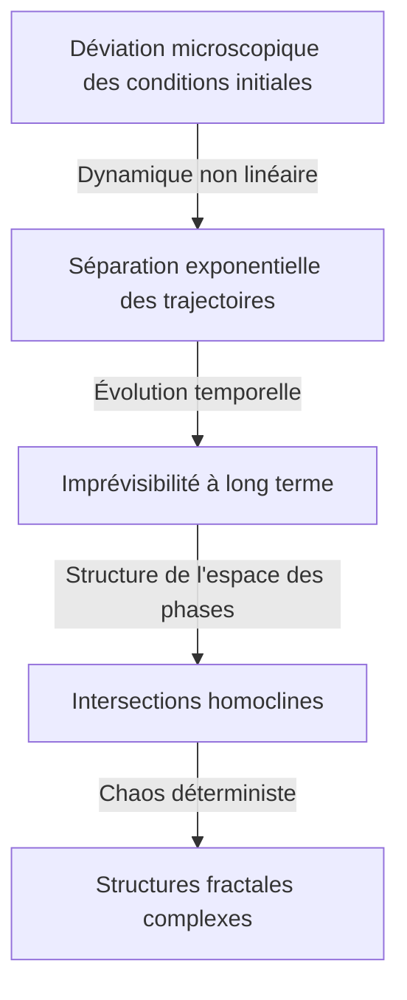

[Henri Poincaré](https://kenji.blog/fr/p/poincare/) (1854–1912) est l'un des plus grands mathématiciens de l'histoire que la France ait jamais produit, ainsi qu'un physicien théoricien, un ingénieur et un philosophe des sciences. Il est souvent qualifié de **« Dernier Universaliste »** car il comprenait profondément tous les domaines mathématiques de son époque et a apporté des contributions fondamentales à chacun d'eux. Si l'on considère à quel point les mathématiques modernes sont devenues hautement spécialisées et fragmentées, il est peu probable qu'une personne possédant une vue d'ensemble d'une telle ampleur apparaisse un jour à nouveau.

Dans cet article, nous explorerons avec un volume et une profondeur écrasants la vie dramatique de [Poincaré](https://kenji.blog/fr/p/poincare/), ses épisodes pleins d'humanité et le profond héritage mathématique et physique qu'il a laissé au monde.

## 1. Jeunesse et Environnement Éducatif Unique : L'Éclosion d'un Génie

[Henri Poincaré](https://kenji.blog/fr/p/poincare/) est né le 29 avril 1854 à Nancy, une ville du nord-est de la France, dans une famille de l'élite intellectuelle. Son père, Léon Poincaré, était professeur à la faculté de médecine de l'Université de Nancy, et son cousin, Raymond [Poincaré](https://kenji.blog/fr/p/poincare/), deviendra plus tard un éminent homme politique, occupant les postes de Premier ministre et de Président de la République française. Un environnement familial aussi favorable a grandement stimulé sa curiosité intellectuelle.

Durant son enfance, [Poincaré](https://kenji.blog/fr/p/poincare/) a contracté la diphtérie, ce qui l'a laissé incapable de parler pendant une longue période et confiné au lit. Cependant, cette période d'isolement a développé de manière anormale ses capacités de réflexion intérieure. Il possédait une **mémoire intuitive** qui lui permettait de mémoriser parfaitement le contenu d'un livre après l'avoir lu une seule fois, et il a appris à manipuler librement l'arrangement visuel des lettres et les relations spatiales dans son esprit.

En 1873, lorsqu'il entre à l'École Polytechnique, la première institution de formation de l'élite française, ses talents étonnent immédiatement le corps enseignant. Une anecdote intéressante est que [Poincaré](https://kenji.blog/fr/p/poincare/) était extrêmement myope et pouvait à peine voir les formules mathématiques au tableau noir. De plus, il n'avait pas l'habitude de prendre des notes. Néanmoins, il restait parfaitement immobile pendant les cours, les yeux fermés, reconstruisant des preuves mathématiques complexes entièrement dans son esprit, en s'appuyant uniquement sur les paroles du professeur. Ses notes étaient toujours parmi les meilleures, et après l'obtention de son diplôme, il a poursuivi à l'École des Mines, où il a également obtenu le diplôme d'ingénieur du corps des mines.

## 2. La Mécanique Céleste et le Problème des Trois Corps : La Naissance de la Théorie du Chaos

Parmi les réalisations de [Poincaré](https://kenji.blog/fr/p/poincare/), la plus célèbre, qui a eu un impact décisif sur la science moderne, est sa recherche sur le **problème des trois corps** en mécanique céleste.

À la fin du XIXe siècle, le roi Oscar II de Suède a parrainé un concours d'essais sur des problèmes difficiles de la mécanique céleste pour commémorer son 60e anniversaire. Le défi central était de « trouver une solution analytique qui décrit complètement comment trois corps célestes, tels que le Soleil, la Terre et la Lune, se déplacent sous l'effet de leur gravité mutuelle ».

[Poincaré](https://kenji.blog/fr/p/poincare/) s'est attaqué à ce problème et a abouti à une conclusion surprenante. Ce fut la preuve mathématique du fait qu'« il n'y a généralement pas de solution analytique stable et prévisible au problème des trois corps ». Il a découvert que même dans un système déterministe basé sur la mécanique newtonienne, de très petites différences dans les conditions initiales augmentent de façon exponentielle avec le temps, entraînant un comportement complètement imprévisible. Ce fut l'aube historique du domaine que nous appelons aujourd'hui la **théorie du chaos** .

Au lieu de poursuivre des trajectoires célestes complexes avec des formules de calcul, [Poincaré](https://kenji.blog/fr/p/poincare/) s'est concentré sur la « forme géométrique de l'espace » tracée par l'ensemble de la trajectoire. Il a pleinement utilisé le concept d'espace des phases et a conçu « l'application de [Poincaré](https://kenji.blog/fr/p/poincare/) », qui enregistre uniquement les points où la trajectoire croise un plan spécifique. Cela a ouvert la voie à une compréhension qualitative du comportement des systèmes mécaniques complexes.

## 3. La Conjecture de [Poincaré](https://kenji.blog/fr/p/poincare/) : La Fondation de la Topologie

Une autre réalisation monumentale de [Poincaré](https://kenji.blog/fr/p/poincare/) fut la fondation, à lui seul, de la **topologie** , un domaine majeur des mathématiques modernes. Dans son article de 1895 « Analysis Situs », il a construit un nouveau cadre mathématique pour étudier les propriétés des figures qui sont préservées même lorsqu'elles sont déformées de façon continue.

Dans cette recherche, il a présenté l'un des problèmes non résolus les plus célèbres de l'histoire des mathématiques, la **conjecture de [Poincaré](https://kenji.blog/fr/p/poincare/)** .

> « Toute variété fermée de dimension 3 et simplement connexe est-elle homéomorphe à la sphère de dimension 3, $S^3$ ? »

Si nous décrivons cette difficile conjecture en utilisant le langage de la topologie algébrique (groupes d'homologie et groupes fondamentaux) qu'il a développé, cela ressemble à ceci : Lorsque le groupe fondamental $\pi_1(M)$ d'une variété $M$ est trivial, c'est-à-dire,

$$
\pi_1(M) \cong \{1\} \implies M \cong S^3 \quad (\text{Un espace simplement connexe est homéomorphe à une sphère})
$$

Ici, $\pi_1(M)$ est un indicateur montrant si toute courbe fermée sur la variété peut être continuellement rétrécie en un seul point (simplement connexe). La question de [Poincaré](https://kenji.blog/fr/p/poincare/) était d'une telle profondeur qu'elle interrogeait la forme même de l'univers. « Si nous tendons une corde à travers l'univers et que nous tirons pour la ramener en un seul point, pouvons-nous dire que la forme de l'univers est ronde (une sphère) ? »

Cette conjecture a été prouvée environ 100 ans après sa publication, en 2006, par le mathématicien russe solitaire Grigori Perelman en utilisant l'équation du flot de Ricci, et cela a fait la une des journaux du monde entier en tant que premier des problèmes du prix du millénaire de l'Institut de mathématiques Clay à être résolu.

## 4. Contributions Décisives à la Théorie de la Relativité Restreinte

Dans le domaine de la physique, les contributions de [Poincaré](https://kenji.blog/fr/p/poincare/) sont également incommensurables. Plusieurs années avant qu'Albert Einstein ne publie la théorie de la relativité restreinte en 1905, [Poincaré](https://kenji.blog/fr/p/poincare/) avait profondément étudié les théories du physicien néerlandais Hendrik Lorentz et avait remis en question les concepts de temps absolu et d'espace absolu.

[Poincaré](https://kenji.blog/fr/p/poincare/) a proposé le « Principe de Relativité », déclarant qu'il est impossible de détecter un mouvement absolu par rapport à l'éther, et a formulé mathématiquement que la vitesse de la lumière est constante quel que soit le référentiel inertiel à partir duquel elle est observée. Les équations de transformation des coordonnées et du temps (transformations de Lorentz) qu'il a dérivées sont les suivantes :

$$
x' = \gamma (x - vt), \quad t' = \gamma \left(t - \frac{vx}{c^2}\right) \quad (\text{où } c \text{ est la vitesse de la lumière dans le vide})
$$

De plus, [Poincaré](https://kenji.blog/fr/p/poincare/) a rapidement introduit le concept d'espace-temps à quatre dimensions et a défini le « groupe de Poincaré », qui montre que les lois de la physique sont invariantes sous les transformations de Lorentz. Alors qu'Einstein a construit la théorie de la relativité à partir d'une approche physique et intuitive, [Poincaré](https://kenji.blog/fr/p/poincare/) était arrivé à la même vérité du point de vue de la beauté structurelle mathématique et géométrique.

## 5. L'Inconscient et la Créativité : La Psychologie de l'Inspiration

[Poincaré](https://kenji.blog/fr/p/poincare/) a observé comment l'intuition mathématique fonctionnait en lui-même et a laissé de nombreux écrits sur le processus créatif. L'épisode concernant sa découverte des fonctions fuchsiennes, consigné dans son livre « Science et Méthode », est très célèbre dans les domaines de la psychologie et des neurosciences.

Il s'était tourmenté sur un problème mathématique difficile pendant plusieurs mois, incapable de trouver un indice de solution malgré des calculs conscients répétés et un raisonnement logique. Épuisé, il a décidé de s'éloigner de ses recherches et s'est joint à une excursion géologique. Puis, pendant le voyage, au moment précis où il s'apprêtait à monter dans un omnibus à chevaux dans la ville de Coutances, une solution parfaite a soudainement jailli dans son esprit.

> « Au moment où je mettais le pied sur le marchepied, l'idée me vint, sans que rien dans mes pensées antérieures ne parût m'y avoir préparé, que les transformations dont j'avais fait usage pour définir les fonctions fuchsiennes étaient identiques à celles de la géométrie non-euclidienne. Je ne fis pas la vérification ; je n'en aurais pas eu le temps, puisqu'à peine assis dans l'omnibus je repris la conversation commencée, mais j'eus l'entière certitude. »

À partir de cette expérience, [Poincaré](https://kenji.blog/fr/p/poincare/) a catégorisé le processus de découverte créative en quatre étapes : la « Préparation » (effort conscient), l'« Incubation » (combinaison d'informations dans l'inconscient), l'« Illumination » (compréhension intuitive soudaine) et la « Vérification » (preuve logique). Ses idées prouvent à quel point l'inconscient est puissant en tant que ressource de calcul dans les profondeurs de la pensée humaine.

## 6. Philosophie des Sciences : La Défense du Conventionnalisme

[Poincaré](https://kenji.blog/fr/p/poincare/) a également laissé une marque immense dans le domaine de la philosophie des sciences. Il a défendu une position connue sous le nom de **conventionnalisme** . Il s'agit de l'idée que « les axiomes et lois fondamentaux en science (tels que les axiomes de la géométrie euclidienne) ne sont ni des vérités a priori ni des faits empiriques, mais simplement des "conventions commodes" adoptées par les humains pour décrire la nature ».

Il a déclaré : « Une géométrie ne peut pas être plus vraie qu'une autre ; elle peut seulement être plus commode. » Cette attitude philosophique flexible est devenue plus tard un fondement idéologique important lorsqu'Einstein a construit la théorie de la relativité générale en utilisant la géométrie non-euclidienne.

## 7. Conclusion : L'Héritage Éternel de [Poincaré](https://kenji.blog/fr/p/poincare/)

En 1912, [Henri Poincaré](https://kenji.blog/fr/p/poincare/) s'est éteint au jeune âge de 58 ans. À sa mort, les scientifiques du monde entier se sont désolés que « la lumière de l'intellect français se soit éteinte ».

Les fondements mathématiques qu'il a laissés pour la **topologie** , la **théorie du chaos** et le **principe de relativité** insufflent de la vie à tous les domaines aujourd'hui, de la physique des particules moderne et de la cosmologie jusqu'aux prévisions météorologiques et aux modèles économiques. [Poincaré](https://kenji.blog/fr/p/poincare/) ne nous a pas seulement enseigné des fragments isolés de connaissances spécialisées, mais la beauté universelle des mathématiques qui traverse le monde entier. Lorsque nous réfléchissons à sa vie et à ses réalisations, nous sommes témoins de la profondeur et de l'étendue ultimes que l'esprit humain peut atteindre.
