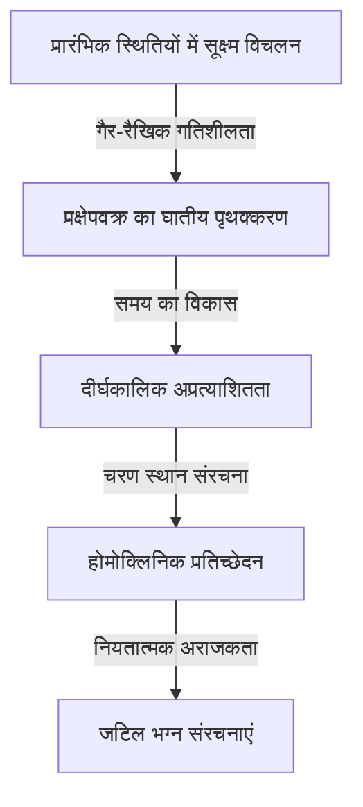

[हेनरी प्वाइंकरे](https://kenji.blog/hi/p/poincare/) (1854–1912) इतिहास के सबसे महान गणितज्ञों में से एक हैं जिन्हें फ्रांस ने कभी पैदा किया है, साथ ही वे एक सैद्धांतिक भौतिक विज्ञानी, इंजीनियर और विज्ञान के दार्शनिक भी थे। उन्हें अक्सर **"अंतिम सार्वभौमिकतावादी"** (The Last Universalist) कहा जाता है क्योंकि उन्होंने अपने समय के हर गणितीय क्षेत्र को गहराई से समझा और उनमें से प्रत्येक में मौलिक योगदान दिया। यह देखते हुए कि आधुनिक गणित कितना अत्यधिक विशिष्ट और खंडित हो गया है, यह संभावना नहीं है कि सभी क्षेत्रों का इतना व्यापक दृष्टिकोण रखने वाला कोई व्यक्ति फिर कभी सामने आएगा।

इस लेख में, हम भारी मात्रा और गहराई के साथ प्वाइंकरे के नाटकीय जीवन, उनके बहुत ही मानवीय प्रसंगों, और दुनिया के लिए उनके द्वारा छोड़ी गई गहन गणितीय और भौतिक विरासत का पता लगाएंगे।

## 1. प्रारंभिक जीवन और अद्वितीय शैक्षिक वातावरण: एक प्रतिभा का अंकुरण

[हेनरी प्वाइंकरे](https://kenji.blog/hi/p/poincare/) का जन्म 29 अप्रैल 1854 को पूर्वोत्तर फ्रांसीसी शहर नैन्सी में एक उच्च बौद्धिक कुलीन परिवार में हुआ था। उनके पिता, लियोन प्वाइंकरे, नैन्सी विश्वविद्यालय के चिकित्सा संकाय में प्रोफेसर थे, और उनके चचेरे भाई, रेमंड प्वाइंकरे, बाद में एक प्रमुख राजनेता बने, जिन्होंने फ्रांस के प्रधान मंत्री और राष्ट्रपति के रूप में कार्य किया। इस तरह के धन्य पारिवारिक वातावरण ने उनकी बौद्धिक जिज्ञासा को बहुत प्रेरित किया।

अपने बचपन के दौरान, प्वाइंकरे डिप्थीरिया से पीड़ित थे, जिससे वे लंबे समय तक बोलने में असमर्थ रहे और अपने बीमार बिस्तर तक ही सीमित रहे। हालाँकि, अलगाव की इस अवधि ने उनकी आंतरिक सोच क्षमताओं को असामान्य रूप से विकसित किया। उनके पास एक **सहज स्मृति** थी जिसने उन्हें केवल एक बार पढ़ने के बाद एक किताब की सामग्री को पूरी तरह से याद करने की अनुमति दी, और उन्होंने अपने दिमाग में अक्षरों की दृश्य व्यवस्था और स्थानिक संबंधों को स्वतंत्र रूप से हेरफेर करना सीखा।

1873 में, जब उन्होंने फ्रांस के प्रमुख कुलीन प्रशिक्षण संस्थान, इकोले पॉलिटेक्निक में प्रवेश किया, तो उनकी प्रतिभा ने तुरंत संकाय को चकित कर दिया। एक दिलचस्प प्रसंग यह है कि प्वाइंकरे अत्यधिक निकट दृष्टि दोष वाले थे और ब्लैकबोर्ड पर गणितीय सूत्रों को मुश्किल से देख पाते थे। इसके अलावा, उन्हें नोट्स लेने की आदत नहीं थी। फिर भी, वे कक्षा के दौरान आंखें बंद करके बिल्कुल स्थिर बैठते थे, और केवल प्रोफेसर के शब्दों पर भरोसा करते हुए, जटिल गणितीय प्रमाणों को पूरी तरह से अपने दिमाग में फिर से बनाते थे। उनके ग्रेड हमेशा शीर्ष पर रहे, और स्नातक होने के बाद, वे इकोले डेस माइन्स में चले गए, जहाँ उन्होंने एक खनन इंजीनियर के रूप में योग्यता भी प्राप्त की।

## 2. खगोलीय यांत्रिकी और तीन-पिंड समस्या: अराजकता सिद्धांत का जन्म

प्वाइंकरे की उपलब्धियों में, सबसे प्रसिद्ध जिसने आधुनिक विज्ञान पर निर्णायक प्रभाव डाला, वह है खगोलीय यांत्रिकी में **तीन-पिंड समस्या** (Three-body problem) पर उनका शोध।

19वीं सदी के अंत में, स्वीडन के राजा ऑस्कर द्वितीय ने अपने 60वें जन्मदिन के उपलक्ष्य में खगोलीय यांत्रिकी में कठिन समस्याओं पर एक पुरस्कार निबंध प्रतियोगिता प्रायोजित की। केंद्रीय चुनौती यह थी "एक विश्लेषणात्मक समाधान खोजना जो पूरी तरह से वर्णन करता हो कि सूर्य, पृथ्वी और चंद्रमा जैसे तीन खगोलीय पिंड अपने पारस्परिक गुरुत्वाकर्षण के तहत कैसे चलते हैं।"

प्वाइंकरे ने इस समस्या से निपटा और एक चौंकाने वाले निष्कर्ष पर पहुंचे। यह इस तथ्य का गणितीय प्रमाण था कि "तीन-पिंड समस्या का आम तौर पर कोई अनुमानित स्थिर विश्लेषणात्मक समाधान नहीं है।" उन्होंने पाया कि न्यूटोनियन यांत्रिकी पर आधारित नियतात्मक प्रणाली में भी, प्रारंभिक स्थितियों में अत्यंत छोटे अंतर समय के साथ तेजी से बढ़ते हैं, जिसके परिणामस्वरूप पूरी तरह से अप्रत्याशित व्यवहार होता है। यह उस क्षेत्र की ऐतिहासिक सुबह थी जिसे आज हम **अराजकता सिद्धांत** (Chaos theory) कहते हैं।

गणना सूत्रों के साथ जटिल खगोलीय प्रक्षेपवक्रों का पीछा करने के बजाय, प्वाइंकरे ने पूरे प्रक्षेपवक्र द्वारा खोजे गए "अंतरिक्ष के ज्यामितीय आकार" पर ध्यान केंद्रित किया। उन्होंने चरण स्थान (Phase space) की अवधारणा का पूरी तरह से उपयोग किया और "प्वाइंकरे मैप" तैयार किया, जो केवल उन बिंदुओं को रिकॉर्ड करता है जहां प्रक्षेपवक्र एक विशिष्ट विमान को पार करता है। इसने जटिल यांत्रिक प्रणालियों के व्यवहार की गुणात्मक समझ का मार्ग प्रशस्त किया।

## 3. प्वाइंकरे अनुमान: टोपोलॉजी की स्थापना

प्वाइंकरे की एक और स्मारकीय उपलब्धि आधुनिक गणित के एक प्रमुख क्षेत्र, **टोपोलॉजी** (Topology) की उनकी एकल-हाथ से स्थापना थी। अपने 1895 के पेपर "एनालिसिस सिटस" में, उन्होंने आंकड़ों के गुणों का अध्ययन करने के लिए एक नया गणितीय ढांचा तैयार किया जो लगातार विकृत होने पर भी संरक्षित रहता है।

इस शोध में, उन्होंने गणितीय इतिहास में सबसे प्रसिद्ध अनसुलझी समस्याओं में से एक, **प्वाइंकरे अनुमान** ([Poincaré conjecture](https://kenji.blog/hi/p/poincare-conjecture/)) प्रस्तुत किया।

> "क्या हर सरलता से जुड़ा हुआ, बंद 3-आयामी मैनिफोल्ड 3-आयामी गोले $S^3$ के लिए होमियोमोर्फिक है?"

यदि हम इस कठिन अनुमान का वर्णन बीजगणितीय टोपोलॉजी (समरूपता समूहों और मौलिक समूहों) की भाषा का उपयोग करके करते हैं, जिसे उन्होंने विकसित किया था, तो यह ऐसा दिखता है: जब किसी मैनिफोल्ड $M$ का मौलिक समूह $\pi_1(M)$ तुच्छ होता है, अर्थात,

$$
\pi_1(M) \cong \{1\} \implies M \cong S^3 \quad (\text{एक सरलता से जुड़ा हुआ स्थान एक गोले के लिए होमियोमोर्फिक है})
$$

यहाँ, $\pi_1(M)$ एक संकेतक है जो यह दर्शाता है कि मैनिफोल्ड पर किसी भी बंद वक्र को लगातार एक बिंदु पर सिकोड़ा जा सकता है या नहीं (सरलता से जुड़ा हुआ)। प्वाइंकरे का प्रश्न एक गहरा प्रश्न था जो ब्रह्मांड के आकार के बारे में ही पूछ रहा था। "अगर हम ब्रह्मांड के पार एक रस्सी बांधते हैं और उसे एक बिंदु पर इकट्ठा करने के लिए खींचते हैं, तो क्या हम कह सकते हैं कि ब्रह्मांड का आकार गोल (एक गोला) है?"

यह अनुमान इसके प्रकाशन के लगभग 100 साल बाद, 2006 में, एकांतवासी रूसी गणितज्ञ ग्रिगोरी पेरेलमैन द्वारा रिक्की प्रवाह समीकरण का उपयोग करके सिद्ध किया गया था, और यह क्ले गणित संस्थान की सहस्राब्दी पुरस्कार समस्याओं में से पहला हल होने वाला वैश्विक समाचार बन गया।

## 4. विशेष सापेक्षता के सिद्धांत में निर्णायक योगदान

भौतिकी के क्षेत्र में भी प्वाइंकरे का योगदान अथाह है। अल्बर्ट आइंस्टीन द्वारा 1905 में विशेष सापेक्षता के सिद्धांत को प्रकाशित करने से कई साल पहले, प्वाइंकरे ने डच भौतिक विज्ञानी हेंड्रिक लोरेंट्ज़ के सिद्धांतों का गहराई से अध्ययन किया था और पूर्ण समय और पूर्ण स्थान की अवधारणाओं पर सवाल उठाया था।

प्वाइंकरे ने "सापेक्षता का सिद्धांत" प्रस्तावित किया, जिसमें कहा गया कि ईथर के सापेक्ष पूर्ण गति का पता लगाना असंभव है, और गणितीय रूप से तैयार किया कि प्रकाश की गति स्थिर है, चाहे उसे किसी भी जड़त्वीय फ्रेम से देखा जाए। उनके द्वारा प्राप्त निर्देशांक और समय (लोरेंट्ज़ परिवर्तन) के लिए परिवर्तन समीकरण इस प्रकार हैं:

$$
x' = \gamma (x - vt), \quad t' = \gamma \left(t - \frac{vx}{c^2}\right) \quad (\text{जहाँ } c \text{ निर्वात में प्रकाश की गति है})
$$

इसके अलावा, प्वाइंकरे ने जल्दी से चार-आयामी स्पेसटाइम की अवधारणा पेश की और "प्वाइंकरे समूह" को परिभाषित किया, जो दर्शाता है कि भौतिकी के नियम लोरेंट्ज़ परिवर्तनों के तहत अपरिवर्तनीय हैं। जबकि आइंस्टीन ने एक भौतिक और सहज दृष्टिकोण से सापेक्षता के सिद्धांत का निर्माण किया, प्वाइंकरे गणितीय और ज्यामितीय संरचनात्मक सुंदरता के परिप्रेक्ष्य से उसी सत्य पर पहुंचे थे।

## 5. अचेतन और रचनात्मकता: प्रेरणा का मनोविज्ञान

प्वाइंकरे ने देखा कि गणितीय अंतर्ज्ञान उनके भीतर कैसे काम करता है और रचनात्मक प्रक्रिया पर कई लेख छोड़े। उनके फुच्सियन कार्यों की खोज के बारे में प्रसंग, जो उनकी पुस्तक "विज्ञान और विधि" में दर्ज है, मनोविज्ञान और तंत्रिका विज्ञान के क्षेत्र में अत्यधिक प्रसिद्ध है।

वे कई महीनों तक एक कठिन गणितीय समस्या पर विचार कर रहे थे, बार-बार सचेत गणनाओं और तार्किक तर्क के बावजूद समाधान का कोई सुराग नहीं मिल पा रहा था। थक कर, उन्होंने अपने शोध से दूर जाने का फैसला किया और एक भूवैज्ञानिक भ्रमण में शामिल हो गए। फिर, यात्रा के दौरान, ठीक उसी क्षण जब वे कूटेंस शहर में घोड़ों द्वारा खींचे जाने वाले ऑम्निबस पर चढ़ने वाले थे, उनके दिमाग में अचानक एक सही समाधान कौंध गया।

> "जिस क्षण मैंने अपना पैर कदम पर रखा, यह विचार मेरे पास आया, मेरे पिछले विचारों में ऐसा कुछ भी प्रतीत नहीं हुआ जिसने इसके लिए मार्ग प्रशस्त किया हो, कि जिन परिवर्तनों का मैंने फुच्सियन कार्यों को परिभाषित करने के लिए उपयोग किया था, वे गैर-[यूक्लिड](https://kenji.blog/hi/p/euclid/)ियन ज्यामिति के समान थे। मैंने विचार की पुष्टि नहीं की; मेरे पास समय नहीं होता, क्योंकि, ऑम्निबस में अपनी सीट लेते हुए, मैंने पहले से शुरू की गई बातचीत जारी रखी, लेकिन मुझे पूर्ण निश्चितता महसूस हुई।"

इस अनुभव से, प्वाइंकरे ने रचनात्मक खोज की प्रक्रिया को चार चरणों में वर्गीकृत किया: "तैयारी" (सचेत प्रयास), "ऊष्मायन" (अचेतन में जानकारी का संयोजन), "रोशनी" (अचानक सहज समझ), और "सत्यापन" (तार्किक प्रमाण)। उनकी अंतर्दृष्टि साबित करती है कि मानव विचार की गहराई में एक कम्प्यूटेशनल संसाधन के रूप में अचेतन कितना शक्तिशाली है।

## 6. विज्ञान का दर्शन: रूढ़िवाद की वकालत

प्वाइंकरे ने विज्ञान के दर्शन के क्षेत्र में भी एक बड़ी छाप छोड़ी। उन्होंने **रूढ़िवाद** (Conventionalism) के रूप में जानी जाने वाली स्थिति की वकालत की। यह विचार है कि "विज्ञान में मौलिक स्वयंसिद्ध और नियम (जैसे [यूक्लिड](https://kenji.blog/hi/p/euclid/)ियन ज्यामिति के स्वयंसिद्ध) न तो एक प्राथमिक सत्य हैं और न ही अनुभवजन्य तथ्य, बल्कि केवल 'सुविधाजनक सम्मेलन' हैं जिन्हें मनुष्यों द्वारा प्रकृति का वर्णन करने के लिए अपनाया गया है।"

उन्होंने कहा: "ऐसा नहीं है कि [यूक्लिड](https://kenji.blog/hi/p/euclid/)ियन ज्यामिति सत्य है और गैर-यूक्लिडियन ज्यामिति झूठी है। यह कहने के समान है कि मीट्रिक प्रणाली यार्ड प्रणाली से अधिक सत्य नहीं है।" यह लचीला दार्शनिक दृष्टिकोण बाद में एक महत्वपूर्ण वैचारिक आधार बन गया जब आइंस्टीन ने गैर-[यूक्लिड](https://kenji.blog/hi/p/euclid/)ियन ज्यामिति का उपयोग करके सामान्य सापेक्षता के सिद्धांत का निर्माण किया।

## 7. निष्कर्ष: प्वाइंकरे की शाश्वत विरासत

1912 में, 58 वर्ष की कम उम्र में [हेनरी प्वाइंकरे](https://kenji.blog/hi/p/poincare/) का निधन हो गया। जब उनकी मृत्यु हुई, तो दुनिया भर के वैज्ञानिकों ने शोक व्यक्त किया कि "फ्रांसीसी बुद्धि की रोशनी बुझ गई है।"

उन्होंने **टोपोलॉजी** , **अराजकता सिद्धांत** और **सापेक्षता के सिद्धांत** के लिए जो गणितीय नींव छोड़ी, वह आज आधुनिक कण भौतिकी और ब्रह्मांड विज्ञान से लेकर मौसम की भविष्यवाणी और आर्थिक मॉडल तक हर क्षेत्र में जीवन का संचार करती है। प्वाइंकरे ने हमें केवल विशिष्ट ज्ञान के खंडित टुकड़े नहीं सिखाए, बल्कि गणित का सार्वभौमिक सौंदर्य सिखाया जो पूरी दुनिया को पार करता है। जब हम उनके जीवन और उपलब्धियों पर चिंतन करते हैं, तो हम उस परम गहराई और विस्तार को देखते हैं जहाँ तक मानव आत्मा पहुँच सकती है।
