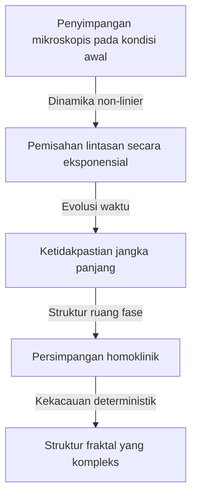

[Henri Poincaré](https://kenji.blog/id/p/poincare/) (1854–1912) adalah salah satu matematikawan terbesar dalam sejarah yang pernah dilahirkan Prancis, sekaligus fisikawan teoretis, insinyur, dan filsuf sains. Ia sering disebut sebagai **"Universalis Terakhir"** karena ia sangat memahami setiap bidang matematika pada masanya dan memberikan kontribusi mendasar untuk masing-masing bidang tersebut. Mengingat betapa sangat terspesialisasi dan terfragmentasinya matematika modern saat ini, sangat kecil kemungkinannya akan muncul lagi seseorang dengan pandangan menyeluruh tentang semua bidang seperti dirinya.

Dalam artikel ini, kita akan mengeksplorasi dengan volume dan kedalaman yang luar biasa kehidupan dramatis [Poincaré](https://kenji.blog/id/p/poincare/), episode-episodenya yang sangat manusiawi, dan warisan matematis serta fisika mendalam yang ia tinggalkan untuk dunia.

## 1. Kehidupan Awal dan Lingkungan Pendidikan yang Unik: Tumbuhnya Seorang Jenius

[Henri Poincaré](https://kenji.blog/id/p/poincare/) lahir pada tanggal 29 April 1854, di kota Nancy, Prancis timur laut, dari keluarga elit yang sangat intelektual. Ayahnya, Léon Poincaré, adalah seorang profesor di fakultas kedokteran di Universitas Nancy, dan sepupunya, Raymond [Poincaré](https://kenji.blog/id/p/poincare/), kelak menjadi politisi terkemuka yang menjabat sebagai Perdana Menteri dan Presiden Prancis. Lingkungan keluarga yang sangat mendukung ini sangat merangsang keingintahuan intelektualnya.

Selama masa kecilnya, [Poincaré](https://kenji.blog/id/p/poincare/) menderita difteri, yang membuatnya tidak dapat berbicara untuk waktu yang lama dan harus terbaring di tempat tidur. Namun, periode isolasi ini secara tidak normal mengembangkan kemampuan berpikir internalnya. Ia memiliki **ingatan intuitif** yang memungkinkannya untuk menghafal isi sebuah buku dengan sempurna setelah membacanya hanya sekali, dan ia belajar untuk memanipulasi secara bebas susunan visual huruf dan hubungan spasial di dalam pikirannya.

Pada tahun 1873, ketika ia memasuki École Polytechnique, institusi pelatihan elit terkemuka di Prancis, bakatnya segera mengejutkan para pengajar. Sebuah episode menarik adalah bahwa [Poincaré](https://kenji.blog/id/p/poincare/) sangat rabun jauh dan hampir tidak bisa melihat rumus matematika di papan tulis. Selain itu, ia tidak memiliki kebiasaan membuat catatan. Namun demikian, ia akan duduk diam selama kelas dengan mata tertutup, merekonstruksi bukti matematika yang kompleks sepenuhnya di dalam pikirannya, hanya mengandalkan kata-kata profesor. Nilainya selalu berada di puncak, dan setelah lulus, ia melanjutkan ke École des Mines, di mana ia juga memperoleh kualifikasi sebagai insinyur pertambangan.

## 2. Mekanika Benda Langit dan Masalah Tiga Benda: Lahirnya Teori Kekacauan

Di antara pencapaian [Poincaré](https://kenji.blog/id/p/poincare/), yang paling terkenal dan memiliki dampak menentukan pada sains modern adalah penelitiannya tentang **Masalah tiga benda** dalam mekanika benda langit.

Pada akhir abad ke-19, Raja Oscar II dari Swedia mensponsori kontes esai tentang masalah sulit dalam mekanika benda langit untuk memperingati ulang tahunnya yang ke-60. Tantangan utamanya adalah "menemukan solusi analitis yang sepenuhnya menjelaskan bagaimana tiga benda langit, seperti Matahari, Bumi, dan Bulan, bergerak di bawah gravitasi timbal balik mereka."

[Poincaré](https://kenji.blog/id/p/poincare/) mengatasi masalah ini dan mencapai kesimpulan yang mengejutkan. Itu adalah bukti matematis dari fakta bahwa "umumnya tidak ada solusi analitis stabil yang dapat diprediksi untuk masalah tiga benda." Ia menemukan bahwa bahkan dalam sistem deterministik yang didasarkan pada mekanika Newton, perbedaan yang sangat kecil dalam kondisi awal meningkat secara eksponensial dari waktu ke waktu, menghasilkan perilaku yang sama sekali tidak dapat diprediksi. Ini adalah awal bersejarah dari bidang yang sekarang kita sebut **Teori Kekacauan** .

Alih-alih mengejar lintasan benda langit yang kompleks dengan rumus perhitungan, [Poincaré](https://kenji.blog/id/p/poincare/) berfokus pada "bentuk geometris ruang" yang dilacak oleh seluruh lintasan. Ia sepenuhnya memanfaatkan konsep ruang fase dan merancang "Peta [Poincaré](https://kenji.blog/id/p/poincare/)," yang hanya mencatat titik-titik di mana lintasan melintasi bidang tertentu. Ini membuka jalan bagi pemahaman kualitatif tentang perilaku sistem mekanis yang kompleks.

## 3. [Konjektur Poincaré](https://kenji.blog/id/p/poincare-conjecture/): Pendirian Topologi

Pencapaian monumental lainnya dari [Poincaré](https://kenji.blog/id/p/poincare/) adalah pendirian **Topologi** oleh dirinya sendiri, sebuah bidang utama dalam matematika modern. Dalam makalahnya tahun 1895 "Analysis Situs," ia membangun kerangka kerja matematika baru untuk mempelajari sifat-sifat bangun yang dipertahankan bahkan ketika mereka dideformasi secara terus-menerus.

Dalam penelitian ini, ia menyajikan salah satu masalah tak terpecahkan yang paling terkenal dalam sejarah matematika, **[Konjektur Poincaré](https://kenji.blog/id/p/poincare-conjecture/)** .

> "Apakah setiap keragaman (manifold) 3-dimensi yang tertutup dan terhubung sederhana, homeomorfik dengan bola 3-dimensi $S^3$?"

Jika kita mendeskripsikan konjektur yang sulit ini menggunakan bahasa topologi aljabar (grup homologi dan grup fundamental) yang ia kembangkan, maka akan terlihat seperti ini: Ketika grup fundamental $\pi_1(M)$ dari manifold $M$ adalah trivial, yaitu,

$$
\pi_1(M) \cong \{1\} \implies M \cong S^3 \quad (\text{Ruang yang terhubung sederhana bersifat homeomorfik dengan bola})
$$

Di sini, $\pi_1(M)$ adalah indikator yang menunjukkan apakah setiap kurva tertutup pada manifold dapat secara terus-menerus menyusut menjadi satu titik (terhubung sederhana). Pertanyaan [Poincaré](https://kenji.blog/id/p/poincare/) adalah pertanyaan mendalam yang menanyakan tentang bentuk alam semesta itu sendiri. "Jika kita membentangkan tali melintasi alam semesta dan menariknya untuk mengumpulkannya di satu titik, dapatkah kita mengatakan bahwa bentuk alam semesta adalah bulat (sebuah bola)?"

Konjektur ini dibuktikan sekitar 100 tahun setelah dipublikasikan, pada tahun 2006, oleh matematikawan Rusia yang penyendiri, Grigori Perelman, menggunakan persamaan aliran Ricci, dan ini menjadi berita global sebagai yang pertama dari Masalah Hadiah Milenium dari Clay Mathematics Institute yang dipecahkan.

## 4. Kontribusi Menentukan untuk Teori Relativitas Khusus

Di bidang fisika, kontribusi [Poincaré](https://kenji.blog/id/p/poincare/) juga tak terukur. Beberapa tahun sebelum Albert Einstein menerbitkan Teori Relativitas Khusus pada tahun 1905, [Poincaré](https://kenji.blog/id/p/poincare/) telah mempelajari secara mendalam teori fisikawan Belanda Hendrik Lorentz dan mempertanyakan konsep waktu mutlak dan ruang mutlak.

[Poincaré](https://kenji.blog/id/p/poincare/) mengusulkan "Prinsip Relativitas," yang menyatakan bahwa tidak mungkin mendeteksi gerakan mutlak relatif terhadap eter, dan merumuskan secara matematis bahwa kecepatan cahaya konstan terlepas dari kerangka inersia tempat benda itu dilihat. Persamaan transformasi untuk koordinat dan waktu (transformasi Lorentz) yang diturunkannya adalah sebagai berikut:

$$
x' = \gamma (x - vt), \quad t' = \gamma \left(t - \frac{vx}{c^2}\right) \quad (\text{di mana } c \text{ adalah kecepatan cahaya dalam ruang hampa})
$$

Selain itu, [Poincaré](https://kenji.blog/id/p/poincare/) dengan cepat memperkenalkan konsep ruang-waktu empat dimensi dan mendefinisikan "Grup Poincaré," yang menunjukkan bahwa hukum fisika adalah invarian di bawah transformasi Lorentz. Sementara Einstein membangun teori relativitas dari pendekatan fisik dan intuitif, [Poincaré](https://kenji.blog/id/p/poincare/) telah sampai pada kebenaran yang sama dari perspektif keindahan struktural matematika dan geometris.

## 5. Ketidaksadaran dan Kreativitas: Psikologi Inspirasi

[Poincaré](https://kenji.blog/id/p/poincare/) mengamati bagaimana intuisi matematika bekerja di dalam dirinya dan meninggalkan banyak tulisan tentang proses kreatif. Episode mengenai penemuannya tentang fungsi Fuchsian, yang dicatat dalam bukunya "Science and Method," sangat terkenal di bidang psikologi dan ilmu saraf.

Ia telah menderita karena masalah matematika yang sulit selama beberapa bulan, tidak dapat menemukan petunjuk untuk solusinya meskipun perhitungan sadar dan penalaran logis berulang kali dilakukan. Karena kelelahan, ia memutuskan untuk menjauh dari penelitiannya dan mengikuti tamasya geologi. Kemudian, selama perjalanan, tepat pada saat ia hendak naik omnibus yang ditarik kuda di kota Coutances, sebuah solusi sempurna tiba-tiba terlintas di benaknya.

> "Pada saat saya menginjakkan kaki di tangga, ide itu datang kepada saya, tanpa ada satu pun dari pikiran saya sebelumnya yang tampaknya telah membuka jalan untuk itu, bahwa transformasi yang telah saya gunakan untuk mendefinisikan fungsi Fuchsian identik dengan geometri non-[Euclide](https://kenji.blog/p/euclid/)an. Saya tidak memverifikasi ide tersebut; saya tidak akan punya waktu, karena, setelah duduk di omnibus, saya melanjutkan percakapan yang sudah dimulai, tetapi saya merasakan kepastian yang sempurna."

Dari pengalaman ini, [Poincaré](https://kenji.blog/id/p/poincare/) mengkategorikan proses penemuan kreatif ke dalam empat tahap: "Persiapan" (upaya sadar), "Inkubasi" (menggabungkan informasi di alam bawah sadar), "Iluminasi" (pemahaman intuitif yang tiba-tiba), dan "Verifikasi" (bukti logis). Wawasannya membuktikan betapa kuatnya alam bawah sadar sebagai sumber daya komputasi di kedalaman pemikiran manusia.

## 6. Filsafat Sains: Pembelaan Konvensionalisme

[Poincaré](https://kenji.blog/id/p/poincare/) juga meninggalkan jejak besar dalam bidang filsafat sains. Ia menganjurkan sebuah posisi yang dikenal sebagai **Konvensionalisme** . Ini adalah gagasan bahwa "aksioma dan hukum fundamental dalam sains (seperti aksioma geometri [Euclide](https://kenji.blog/p/euclid/)an) bukanlah kebenaran apriori maupun fakta empiris, melainkan sekadar 'konvensi yang nyaman' yang diadopsi manusia untuk menggambarkan alam."

Ia menyatakan, "Bukannya geometri [Euclide](https://kenji.blog/p/euclid/)an benar dan geometri non-Euclidean salah. Sama halnya dengan mengatakan bahwa sistem metrik tidak lebih benar daripada sistem yard." Sikap filosofis yang fleksibel ini kemudian menjadi dasar ideologis yang penting ketika Einstein membangun Teori Relativitas Umum menggunakan geometri non-[Euclide](https://kenji.blog/p/euclid/)an.

## 7. Kesimpulan: Warisan Abadi [Poincaré](https://kenji.blog/id/p/poincare/)

Pada tahun 1912, [Henri Poincaré](https://kenji.blog/id/p/poincare/) meninggal dunia di usia muda, 58 tahun. Ketika ia meninggal, para ilmuwan di seluruh dunia berduka bahwa "cahaya intelek Prancis telah padam."

Dasar-dasar matematika yang ia tinggalkan untuk **Topologi** , **Teori Kekacauan** , dan **Prinsip Relativitas** menghembuskan kehidupan ke setiap bidang saat ini, dari fisika partikel modern dan kosmologi hingga prediksi cuaca dan model ekonomi. [Poincaré](https://kenji.blog/id/p/poincare/) mengajarkan kepada kita bukan sekadar serpihan pengetahuan khusus, melainkan keindahan matematika universal yang menembus seluruh dunia. Ketika kita merenungkan kehidupan dan pencapaiannya, kita menyaksikan kedalaman dan keluasan tertinggi yang dapat dicapai oleh jiwa manusia.
