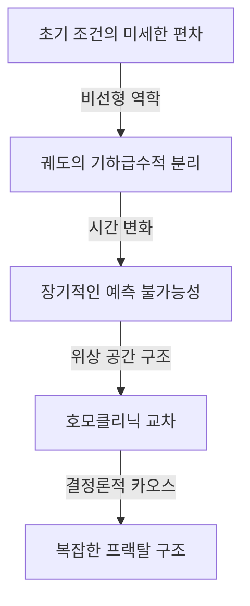

[앙리 푸앵카레](https://kenji.blog/ko/p/poincare/)([Henri Poincaré](https://kenji.blog/ko/p/poincare/), 1854–1912)는 프랑스가 배출한 역사상 가장 위대한 수학자 중 한 명이자 이론 물리학자, 엔지니어, 그리고 과학 철학자입니다. 그는 동시대의 모든 수학 분야를 깊이 이해하고 각각에 근본적인 공헌을 했기 때문에 종종 **"마지막 보편주의자"** (The Last Universalist)로 불립니다. 현대 수학이 얼마나 고도로 전문화되고 세분화되었는지를 생각할 때, 모든 분야를 아우르는 통찰력을 가진 인물이 다시 나타날 가능성은 거의 없습니다.

이 글에서 우리는 푸앵카레의 극적인 생애, 인간미 넘치는 에피소드, 그리고 그가 세계에 남긴 심오한 수학적, 물리학적 유산에 대해 압도적인 분량과 깊이로 탐구해 볼 것입니다.

## 1. 초기 생애와 독특한 교육 환경: 천재의 싹

[앙리 푸앵카레](https://kenji.blog/ko/p/poincare/)는 1854년 4월 29일 프랑스 북동부 도시 낭시에서 고도의 지적 엘리트 가문에서 태어났습니다. 그의 아버지 레옹 푸앵카레는 낭시 대학교 의과대학 교수였으며, 사촌인 레몽 푸앵카레는 훗날 프랑스의 총리와 대통령을 역임하는 저명한 정치인이 됩니다. 이처럼 축복받은 가정 환경은 그의 지적 호기심을 크게 자극했습니다.

어린 시절 푸앵카레는 디프테리아를 앓아 오랫동안 말을 하지 못하고 병상에 누워 있어야 했습니다. 그러나 이 고립된 시기는 그의 내면적 사고 능력을 비정상적으로 발달시켰습니다. 그는 책을 단 한 번만 읽고도 내용을 완벽하게 기억하는 **직관적 기억력** 을 가졌으며, 글자의 시각적 배열과 공간적 관계를 머릿속에서 자유롭게 조작하는 법을 배웠습니다.

1873년 프랑스 최고의 엘리트 양성 기관인 에콜 폴리테크니크에 입학하자마자 그의 재능은 교수진을 깜짝 놀라게 했습니다. 흥미로운 일화 중 하나는 푸앵카레가 극도의 근시여서 칠판의 수학 공식을 거의 볼 수 없었다는 것입니다. 게다가 그는 필기를 하는 습관도 없었습니다. 그럼에도 불구하고 그는 수업 시간 내내 눈을 감고 가만히 앉아 오로지 교수의 말에만 의존하여 복잡한 수학적 증명을 머릿속으로 완벽하게 재구성해 냈습니다. 그의 성적은 항상 최상위권이었으며, 졸업 후 그는 에콜 데 민(국립광업학교)으로 진학하여 광산 엔지니어 자격도 취득했습니다.

## 2. 천체역학과 삼체문제: 카오스 이론의 탄생

푸앵카레의 업적 중 가장 유명하고 현대 과학에 결정적인 영향을 미친 것은 천체역학의 **삼체문제** (Three-body problem)에 대한 연구입니다.

19세기 후반, 스웨덴의 국왕 오스카르 2세는 자신의 60세 생일을 기념하여 천체역학의 난제들에 대한 현상 논문 대회를 후원했습니다. 가장 핵심적인 과제는 "태양, 지구, 달과 같은 세 개의 천체가 서로의 중력에 의해 어떻게 움직이는지를 완벽하게 기술하는 해석적 해를 찾는 것"이었습니다.

푸앵카레는 이 문제에 착수하여 놀라운 결론에 도달했습니다. 그것은 "삼체문제에는 일반적으로 예측 가능하고 안정적인 해석적 해가 존재하지 않는다"는 사실에 대한 수학적 증명이었습니다. 그는 뉴턴 역학에 기반한 결정론적 시스템에서도 초기 조건의 극히 작은 차이가 시간이 지남에 따라 기하급수적으로 증가하여 결과적으로 완전히 예측 불가능한 행동을 초래한다는 것을 발견했습니다. 이것이 바로 오늘날 우리가 **카오스 이론** (Chaos theory)이라 부르는 분야의 역사적 서막이었습니다.

푸앵카레는 복잡한 천체의 궤도를 계산 공식으로 쫓는 대신, 궤도 전체가 그리는 "공간의 기하학적 형태"에 주목했습니다. 그는 위상 공간(Phase space)의 개념을 십분 활용하여, 궤도가 특정 평면을 가로지르는 점만을 기록하는 "푸앵카레 사상([Poincaré](https://kenji.blog/ko/p/poincare/) map)"을 고안해 냈습니다. 이로써 복잡한 역학계의 행동을 정성적으로 이해하는 길이 열리게 되었습니다.

## 3. [푸앵카레 추측](https://kenji.blog/ko/p/poincare-conjecture/): 위상수학의 창시

푸앵카레의 또 다른 기념비적인 업적은 현대 수학의 주요 분야인 **위상수학** (Topology)을 단독으로 창시한 것입니다. 그는 1895년 논문 '위치 해석(Analysis Situs)'에서 도형을 연속적으로 변형시켜도 보존되는 성질을 연구하는 새로운 수학적 틀을 구축했습니다.

이 연구에서 그는 수학 역사상 가장 유명한 미해결 문제 중 하나인 **[푸앵카레 추측](https://kenji.blog/ko/p/poincare-conjecture/)** ([Poincaré conjecture](https://kenji.blog/ko/p/poincare-conjecture/))을 제시했습니다.

> "단일 연결된 3차원 폐다양체는 3차원 구면 $S^3$와 위상동형인가?"

그가 개발한 대수적 위상수학의 언어(호몰로지 군과 기본군)를 사용하여 이 어려운 추측을 설명하면 다음과 같습니다. 다양체 $M$의 기본군 $\pi_1(M)$이 자명할 때, 즉,

$$
\pi_1(M) \cong \{1\} \implies M \cong S^3 \quad (\text{단일 연결 공간은 구면과 위상동형이다})
$$

여기서 $\pi_1(M)$은 다양체 위의 임의의 폐곡선이 연속적으로 하나의 점으로 수축될 수 있는지(단일 연결성)를 보여주는 지표입니다. 푸앵카레의 질문은 우주 자체의 형태를 묻는 심오한 것이었습니다. "만약 우주를 가로질러 밧줄을 매달고 그것을 당겨 한 점으로 모을 수 있다면, 우주의 형태는 둥글다(구형)고 말할 수 있는가?"

이 추측은 발표된 지 약 100년 후인 2006년, 은둔의 러시아 수학자 그리고리 페렐만이 리치 흐름(Ricci flow) 방정식을 사용하여 증명했으며, 클레이 수학연구소의 밀레니엄 난제 중 최초로 해결된 문제로서 전 세계적인 뉴스가 되었습니다.

## 4. 특수 상대성 이론에 대한 결정적 공헌

물리학 분야에서도 푸앵카레의 공헌은 헤아릴 수 없습니다. 알베르트 아인슈타인이 1905년 특수 상대성 이론을 발표하기 수년 전, 푸앵카레는 네덜란드 물리학자 헨드릭 로렌츠의 이론을 깊이 연구하고 절대 시간과 절대 공간의 개념에 의문을 제기했습니다.

푸앵카레는 에테르에 대한 절대적인 운동을 감지하는 것은 불가능하다는 "상대성 원리"를 제안했으며, 빛의 속도는 어느 관성계에서 관측하든 일정하다는 것을 수학적으로 공식화했습니다. 그가 유도한 좌표와 시간의 변환 방정식(로렌츠 변환)은 다음과 같습니다.

$$
x' = \gamma (x - vt), \quad t' = \gamma \left(t - \frac{vx}{c^2}\right) \quad (\text{여기서 } c \text{ 는 진공에서의 빛의 속도})
$$

더 나아가 푸앵카레는 4차원 시공간의 개념을 신속하게 도입하고 "푸앵카레 군"을 정의하여 물리 법칙이 로렌츠 변환 하에서 불변임을 보여주었습니다. 아인슈타인이 물리적이고 직관적인 접근 방식에서 상대성 이론을 구축한 반면, 푸앵카레는 수학적, 기하학적 구조미의 관점에서 동일한 진리에 도달했던 것입니다.

## 5. 무의식과 창조성: 영감의 심리학

푸앵카레는 수학적 직관이 자신의 내면에서 어떻게 작동하는지 관찰하고 창조적 과정에 대한 많은 글을 남겼습니다. 그의 저서 '과학과 방법'에 기록된 푹스 함수(Fuchsian functions) 발견에 관한 에피소드는 심리학과 신경과학 분야에서도 매우 유명합니다.

그는 어려운 수학 문제로 몇 달 동안 고심했고, 반복적인 의식적 계산과 논리적 추론에도 불구하고 해결의 실마리를 찾지 못했습니다. 지친 그는 연구에서 물러나 지질학 탐사에 합류하기로 했습니다. 그리고 여행 중 쿠탕스(Coutances)라는 마을에서 말이 끄는 합승 마차에 오르려는 바로 그 순간, 완벽한 해결책이 그의 머릿속에 번쩍였습니다.

> "발을 발판에 딛는 순간, 이전의 내 생각에는 그것을 준비한 흔적이 전혀 없었음에도 불구하고, 내가 푹스 함수를 정의하는 데 사용했던 변환이 비[유클리드](https://kenji.blog/ko/p/euclid/) 기하학의 변환과 동일하다는 생각이 떠올랐다. 나는 그 생각을 검증하지 않았다. 버스 자리에 앉자마자 이미 시작된 대화를 계속했기 때문에 그럴 시간도 없었지만, 나는 완전한 확신을 느꼈다."

이러한 경험으로부터 푸앵카레는 창조적 발견 과정을 '준비'(의식적인 노력), '부화'(무의식 속에서 정보의 결합), '조명'(갑작스러운 직관적 이해), '검증'(논리적 증명)의 4단계로 분류했습니다. 그의 통찰력은 무의식이 인간 사고의 깊은 곳에서 얼마나 강력한 계산 자원인지를 증명합니다.

## 6. 과학 철학: 규약주의의 제창

푸앵카레는 과학 철학 분야에서도 거대한 발자취를 남겼습니다. 그는 **규약주의** (Conventionalism)로 알려진 입장을 옹호했습니다. 이는 "과학의 기본 공리나 법칙(예를 들어 [유클리드](https://kenji.blog/ko/p/euclid/) 기하학의 공리)은 선험적 진리도 아니고 경험적 사실도 아니며, 인간이 자연을 기술하기 위해 채택한 '편리한 규약(약속)'에 불과하다"는 사상입니다.

그는 "[유클리드](https://kenji.blog/ko/p/euclid/) 기하학이 참이고 비유클리드 기하학이 거짓인 것은 아니다. 미터법이 야드법보다 더 진리가 아니라고 말하는 것과 같다"고 말했습니다. 이 유연한 철학적 태도는 훗날 아인슈타인이 비[유클리드](https://kenji.blog/ko/p/euclid/) 기하학을 사용하여 일반 상대성 이론을 구축할 때 중요한 사상적 토대가 되었습니다.

## 7. 결론: 푸앵카레의 영원한 유산

1912년 [앙리 푸앵카레](https://kenji.blog/ko/p/poincare/)는 58세의 이른 나이로 세상을 떠났습니다. 그가 죽었을 때 전 세계의 과학자들은 "프랑스 지성의 불빛이 꺼졌다"며 슬퍼했습니다.

그가 **위상수학** , **카오스 이론** , 그리고 **상대성 원리** 에 대해 남긴 수학적 토대는 오늘날 현대 입자 물리학과 우주론부터 일기 예보와 경제 모델에 이르기까지 모든 분야에 생명력을 불어넣고 있습니다. 푸앵카레는 전문 지식의 파편화된 조각들이 아니라, 전 세계를 관통하는 수학의 보편적인 아름다움을 우리에게 가르쳐 주었습니다. 그의 생애와 업적을 되돌아볼 때, 우리는 인간의 정신이 도달할 수 있는 궁극의 깊이와 넓이를 목격하게 됩니다.
