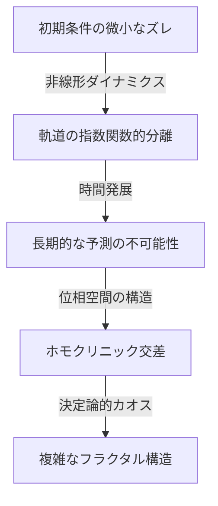

アンリ・ポアンカレ（Henri Poincaré, 1854–1912）は、フランスが誇る史上最高の数学者の一人であり、理論物理学者、エンジニア、そして科学哲学者でもあります。彼は同時代のあらゆる数学分野を深く理解し、それぞれにおいて根本的な貢献をしたことから、しばしば **「最後の普遍主義者」** （The Last Universalist）と称されます。現代数学が高度に専門化・細分化されていることを考えると、彼のように全分野を俯瞰できた人物は今後現れないかもしれません。

本記事では、ポアンカレの劇的な生涯と人間味あふれるエピソード、そして彼が世界に残した深遠な数学的・物理学的遺産について、圧倒的なボリュームと深さで探求していきます。

## 1. 幼少期と特異な教育環境：天才の萌芽

アンリ・ポアンカレは1854年4月29日、フランス北東部の都市ナンシーで、非常に知的なエリート家系に生まれました。彼の父レオン・ポアンカレはナンシー大学の医学部教授であり、いとこのレイモン・ポアンカレは後にフランスの首相および大統領を務めることになる大物政治家でした。このような恵まれた家庭環境は、彼の知的好奇心を大いに刺激しました。

幼い頃のポアンカレはジフテリアにかかり、長期間にわたって声を出すことができず、病床に伏せる日々を送りました。しかし、この隔離された期間が彼の内面的な思考力を異常なまでに発達させることになります。彼は本を一度読んだだけでその内容を完璧に記憶する **直観的記憶力** を持ち、文字の視覚的な配列や空間的な関係性を頭の中で自由に操作できるようになりました。

1873年、フランス屈指のエリート養成機関であるエコール・ポリテクニーク（理工科学校）に入学すると、彼の才能は瞬く間に教員たちを驚嘆させました。興味深いエピソードとして、ポアンカレは極度の近視であり、黒板の数式をほとんど見ることができなかったという事実があります。さらに彼はノートを取る習慣もありませんでした。それにもかかわらず、彼は授業中ただじっと座って目を閉じ、教授の言葉だけを頼りに、自らの頭の中だけで複雑な数学的証明を再構築していたのです。彼の成績は常にトップであり、卒業後は国立土木学校（エコール・デ・ミーヌ）に進学し、鉱山技師としての資格も取得しました。

## 2. 天体力学と三体問題：[カオス理論](https://kenji.blog/p/chaos-theory/)の誕生

ポアンカレの業績の中で最も有名であり、現代科学に決定的な影響を与えたのが **三体問題** （Three-body problem）に関する研究です。

19世紀後半、スウェーデン王オスカル2世は自身の還暦を記念して、天体力学の難問に対する懸賞論文コンテストを主催しました。その中心的な課題が「太陽、地球、月のような3つの天体が、互いの重力によってどのように運動するかを完全に記述する解析解を見つけること」でした。

ポアンカレはこの問題に取り組み、驚くべき結論に達しました。それは「三体問題には、一般的に予測可能な安定した解析解は存在しない」という事実の数学的証明でした。彼は、[ニュートン](https://kenji.blog/p/newton/)力学に基づく決定論的なシステムであっても、初期条件の極めて小さな差異が、時間が経つにつれて指数関数的に増大し、結果として完全に予測不可能な振る舞いをもたらすことを発見したのです。これが、今日私たちが **[カオス理論](https://kenji.blog/p/chaos-theory/)** （Chaos theory）と呼ぶ分野の歴史的な幕開けでした。

ポアンカレは、複雑な天体の軌道を計算式で追いかける代わりに、軌道全体が描く「空間の幾何学的な形」に注目しました。彼は位相空間（フェーズスペース）という概念を駆使し、軌道が特定の平面を横切る点のみを記録する「ポアンカレ写像」を考案しました。これにより、複雑怪奇な力学系の挙動を定性的に理解する道が開かれました。

## 3. [ポアンカレ予想](https://kenji.blog/p/poincare-conjecture/)：トポロジー（位相幾何学）の創始

ポアンカレのもう一つの金字塔は、現代数学の主要分野である **トポロジー** （位相幾何学）を単独で創始したことです。彼は1895年に発表した論文『Analysis Situs（位置の解析）』において、図形を連続的に変形させても保たれる性質を研究する新しい幾何学の枠組みを構築しました。

この研究の中で、彼は数学史上に残る最も有名な未解決問題の一つ、 **[ポアンカレ予想](https://kenji.blog/p/poincare-conjecture/)** （[Poincaré conjecture](https://kenji.blog/p/poincare-conjecture/)）を提示しました。

> 「単連結な3次元閉多様体は、3次元球面 $S^3$ に同相であるか？」

この難解な予想を、彼が開発した代数的トポロジーの言葉（ホモロジー群や基本群）を使って記述すると以下のようになります。多様体 $M$ の基本群 $\pi_1(M)$ が自明であるとき、すなわち、

$$
\pi_1(M) \cong \{1\} \implies M \cong S^3 \quad (\text{単連結空間は球面に同相である})
$$

ここで、 $\pi_1(M)$ は多様体上の任意の閉曲線が、連続的な変形によって一点に収縮できるかどうか（単連結性）を示す指標です。ポアンカレのこの問いは、宇宙の形そのものを問う深遠なものでした。「もし宇宙にロープを張り巡らせて、それを引っ張って1点に回収できるなら、宇宙の形は丸い（球面である）と言えるのか？」という問題です。

この予想は、発表から約100年後の2006年に、ロシアの孤高の数学者グリゴリー・ペレルマンによってリッチフロー方程式を用いて証明され、クレイ数学研究所のミレニアム懸賞問題の中で最初に解決された問題として世界的なニュースとなりました。

## 4. 特殊相対性理論への決定的な貢献

物理学の分野においても、ポアンカレの貢献は計り知れません。アルベルト・アインシュタインが1905年に特殊相対性理論を発表する数年前から、ポアンカレはオランダの物理学者ヘンドリック・ローレンツの理論を深く研究し、絶対時間や絶対空間の概念に疑問を投げかけていました。

ポアンカレは、エーテルに対する絶対的な運動を検出することは不可能であるという「相対性原理」を提唱し、光の速度がどの慣性系から見ても一定であることを数学的に定式化しました。彼が導き出した座標と時間の変換式（ローレンツ変換）は以下の通りです。

$$
x' = \gamma (x - vt), \quad t' = \gamma \left(t - \frac{vx}{c^2}\right) \quad (\text{ここで } c \text{ は真空中の光速})
$$

また、ポアンカレは4次元時空の概念をいち早く導入し、物理法則がローレンツ変換に対して不変であることを示す「ポアンカレ群」を定義しました。アインシュタインが物理学的・直観的なアプローチから相対性理論を構築したのに対し、ポアンカレは数学的・幾何学的な構造美の観点から同じ真理にたどり着いていたのです。

## 5. 無意識と創造性：インスピレーションの心理学

ポアンカレは、自身の内面で数学的直観がどのように働くのかを観察し、創造性のプロセスについて多くの文章を残しました。彼の著書『科学と方法』に記された、フックス関数に関する発見のエピソードは、心理学や脳科学の分野でも非常に有名です。

彼はある数学的難問に数ヶ月間悩み続け、意識的な計算と論理的推論を重ねても解決の糸口を見出せずにいました。疲れ果てた彼は一旦研究から離れ、地質学の調査旅行に参加することにしました。そして、旅行中にクータンセスという町で乗合馬車に乗ろうとしたその瞬間、突如として完璧な解決策が頭の中に閃いたのです。

> 「馬車のステップに足を踏み入れたまさにその瞬間、私が探求していたフックス関数の変換が、非ユークリッド幾何学の変換と完全に一致しているという確信が、突然の閃きとして私の心に浮かんだのです。私は席に座って会話を続けましたが、私の中には完全な確信がありました。」

この経験から、ポアンカレは創造的な発見のプロセスを「準備期（意識的な努力）」「あたため期（無意識下での情報の組み合わせ）」「ひらめき（突然の直観的理解）」「検証期（論理的な証明）」の4段階に分類しました。彼の洞察は、人間の思考の深淵において無意識がいかに強力な計算リソースであるかを証明しています。

## 6. 科学哲学：規約主義（コンベンショナリズム）の提唱

ポアンカレは科学哲学の分野でも大きな足跡を残しました。彼は **規約主義** （Conventionalism）という立場を提唱しました。これは、「科学における基本的な公理や法則（例えばユークリッド幾何学の公理など）は、アプリオリな真理でもなければ経験的な事実でもなく、人間が自然を記述するために採用した『便利な約束事（規約）』にすぎない」という考え方です。

彼は「ユークリッド幾何学が真理であり、非ユークリッド幾何学が偽であるということはない。メートル法がヤード法より真理であると言えないのと同じだ」と語りました。この柔軟な哲学的態度は、後にアインシュタインが非ユークリッド幾何学を用いて一般相対性理論を構築する際の重要な思想的基盤となりました。

## 7. おわりに：ポアンカレの永遠の遺産

1912年、アンリ・ポアンカレは58歳の若さでこの世を去りました。彼が亡くなったとき、世界中の科学者が「フランスの知性の灯が消えた」と悲しみに暮れました。

彼が残した **トポロジー** 、 **[カオス理論](https://kenji.blog/p/chaos-theory/)** 、そして **相対性原理** の数学的基礎は、現代の素粒子物理学や宇宙論、さらには気象予測や経済学のモデルに至るまで、あらゆる領域に息づいています。ポアンカレは、細分化された知識の断片ではなく、世界全体を貫く普遍的な数学の美しさを私たちに教えてくれました。彼の生涯と業績を振り返るとき、私たちは人間の精神が到達しうる究極の深さと広がりを目の当たりにするのです。
