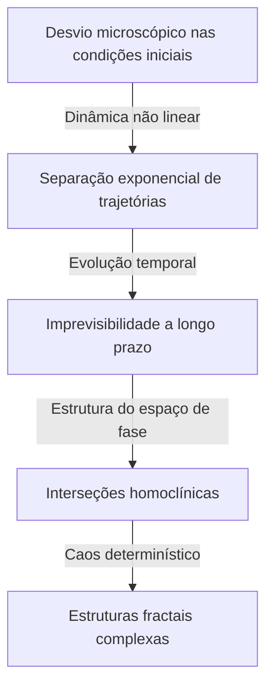

[Henri Poincaré](https://kenji.blog/pt/p/poincare/) (1854–1912) é um dos maiores matemáticos da história que a França já produziu, bem como físico teórico, engenheiro e filósofo da ciência. Ele é frequentemente chamado de **"O Último Universalista"** porque compreendia profundamente todos os campos matemáticos de sua época e fez contribuições fundamentais a cada um deles. Considerando o quão altamente especializada e fragmentada a matemática moderna se tornou, é improvável que alguém com uma visão tão abrangente de todos os campos apareça novamente.

Neste artigo, exploraremos com volume e profundidade esmagadores a vida dramática de [Poincaré](https://kenji.blog/pt/p/poincare/), seus episódios muito humanos e o profundo legado matemático e físico que ele deixou para o mundo.

## 1. Juventude e Ambiente Educacional Único: O Desabrochar de um Gênio

[Henri Poincaré](https://kenji.blog/pt/p/poincare/) nasceu em 29 de abril de 1854, na cidade de Nancy, no nordeste da França, em uma família de elite altamente intelectual. Seu pai, Léon Poincaré, era professor da faculdade de medicina da Universidade de Nancy, e seu primo, Raymond [Poincaré](https://kenji.blog/pt/p/poincare/), mais tarde se tornaria um político proeminente, servindo como Primeiro-Ministro e Presidente da França. Um ambiente familiar tão abençoado estimulou imensamente sua curiosidade intelectual.

Durante sua infância, [Poincaré](https://kenji.blog/pt/p/poincare/) sofreu de difteria, o que o deixou incapaz de falar por um longo período e confinado ao leito. No entanto, esse período de isolamento desenvolveu de forma anormal suas habilidades de pensamento interno. Ele possuía uma **memória intuitiva** que lhe permitia memorizar perfeitamente o conteúdo de um livro após lê-lo apenas uma vez, e aprendeu a manipular livremente a disposição visual das letras e as relações espaciais em sua mente.

Em 1873, quando ingressou na École Polytechnique, a principal instituição de formação de elite da França, seus talentos surpreenderam imediatamente o corpo docente. Um episódio interessante é que [Poincaré](https://kenji.blog/pt/p/poincare/) era extremamente míope e mal conseguia ver as fórmulas matemáticas na lousa. Além disso, ele não tinha o hábito de fazer anotações. No entanto, ele ficava perfeitamente imóvel durante a aula, de olhos fechados, reconstruindo demonstrações matemáticas complexas inteiramente em sua mente, baseando-se apenas nas palavras do professor. Suas notas foram sempre as mais altas e, após a formatura, ele ingressou na École des Mines, onde também obteve o diploma de engenheiro de minas.

## 2. Mecânica Celeste e o Problema dos Três Corpos: O Nascimento da Teoria do Caos

Dentre as realizações de [Poincaré](https://kenji.blog/pt/p/poincare/), a mais famosa e que teve um impacto decisivo na ciência moderna é sua pesquisa sobre o **Problema dos três corpos** na mecânica celeste.

No final do século XIX, o rei Oscar II da Suécia patrocinou um concurso de redação sobre problemas difíceis na mecânica celeste para comemorar seu 60º aniversário. O desafio central era "encontrar uma solução analítica que descreva completamente como três corpos celestes, como o Sol, a Terra e a Lua, se movem sob sua gravidade mútua".

[Poincaré](https://kenji.blog/pt/p/poincare/) abordou esse problema e chegou a uma conclusão surpreendente. Foi a prova matemática do fato de que "geralmente não há uma solução analítica estável e previsível para o problema dos três corpos". Ele descobriu que, mesmo em um sistema determinístico baseado na mecânica newtoniana, diferenças extremamente pequenas nas condições iniciais aumentam exponencialmente ao longo do tempo, resultando em um comportamento completamente imprevisível. Este foi o alvorecer histórico do campo que hoje chamamos de **Teoria do Caos** .

Em vez de perseguir trajetórias celestes complexas com fórmulas de cálculo, [Poincaré](https://kenji.blog/pt/p/poincare/) concentrou-se na "forma geométrica do espaço" traçada por toda a trajetória. Ele utilizou plenamente o conceito de espaço de fase e concebeu o "Mapa de [Poincaré](https://kenji.blog/pt/p/poincare/)", que registra apenas os pontos onde a trajetória cruza um plano específico. Isso abriu caminho para uma compreensão qualitativa do comportamento de sistemas mecânicos complexos.

## 3. [A Conjectura de Poincaré](https://kenji.blog/pt/p/poincare-conjecture/): A Fundação da Topologia

Outra realização monumental de [Poincaré](https://kenji.blog/pt/p/poincare/) foi a fundação, por ele mesmo, da **Topologia** , um campo importante da matemática moderna. Em seu artigo de 1895, "Analysis Situs", ele construiu um novo arcabouço matemático para estudar as propriedades de figuras que são preservadas mesmo quando deformadas continuamente.

Nesta pesquisa, ele apresentou um dos problemas não resolvidos mais famosos da história da matemática, a **Conjectura de [Poincaré](https://kenji.blog/pt/p/poincare/)** .

> "Toda variedade tridimensional fechada e simplesmente conexa é homeomorfa à esfera tridimensional $S^3$?"

Se descrevermos essa conjectura difícil usando a linguagem da topologia algébrica (grupos de homologia e grupos fundamentais) que ele desenvolveu, seria assim: Quando o grupo fundamental $\pi_1(M)$ de uma variedade $M$ é trivial, isto é,

$$
\pi_1(M) \cong \{1\} \implies M \cong S^3 \quad (\text{Um espaço simplesmente conexo é homeomorfo a uma esfera})
$$

Aqui, $\pi_1(M)$ é um indicador que mostra se qualquer curva fechada na variedade pode ser continuamente encolhida a um único ponto (simplesmente conexa). A pergunta de [Poincaré](https://kenji.blog/pt/p/poincare/) era profunda e questionava a própria forma do universo. "Se esticarmos uma corda através do universo e a puxarmos para reuni-la em um único ponto, podemos dizer que a forma do universo é redonda (uma esfera)?"

Esta conjectura foi provada cerca de 100 anos após a sua publicação, em 2006, pelo solitário matemático russo Grigori Perelman, usando a equação do fluxo de Ricci, e tornou-se notícia mundial como o primeiro dos Problemas do Milênio do Clay Mathematics Institute a ser resolvido.

## 4. Contribuições Decisivas para a Teoria da Relatividade Restrita

No campo da física, as contribuições de [Poincaré](https://kenji.blog/pt/p/poincare/) também são incomensuráveis. Vários anos antes de Albert Einstein publicar a Teoria da Relatividade Restrita em 1905, [Poincaré](https://kenji.blog/pt/p/poincare/) havia estudado profundamente as teorias do físico holandês Hendrik Lorentz e questionado os conceitos de tempo absoluto e espaço absoluto.

[Poincaré](https://kenji.blog/pt/p/poincare/) propôs o "Princípio da Relatividade", afirmando que é impossível detectar o movimento absoluto em relação ao éter, e formulou matematicamente que a velocidade da luz é constante independentemente do referencial inercial do qual é observada. As equações de transformação de coordenadas e tempo (transformações de Lorentz) que ele derivou são as seguintes:

$$
x' = \gamma (x - vt), \quad t' = \gamma \left(t - \frac{vx}{c^2}\right) \quad (\text{onde } c \text{ é a velocidade da luz no vácuo})
$$

Além disso, [Poincaré](https://kenji.blog/pt/p/poincare/) rapidamente introduziu o conceito de espaço-tempo quadridimensional e definiu o "Grupo de Poincaré", que mostra que as leis da física são invariantes sob as transformações de Lorentz. Enquanto Einstein construiu a teoria da relatividade a partir de uma abordagem física e intuitiva, [Poincaré](https://kenji.blog/pt/p/poincare/) chegou à mesma verdade a partir da perspectiva da beleza estrutural matemática e geométrica.

## 5. O Inconsciente e a Criatividade: A Psicologia da Inspiração

[Poincaré](https://kenji.blog/pt/p/poincare/) observou como a intuição matemática funcionava dentro de si e deixou muitos escritos sobre o processo criativo. O episódio sobre sua descoberta das funções fuchsianas, registrado em seu livro "Ciência e Método", é muito famoso nos campos da psicologia e da neurociência.

Ele estivera angustiado com um difícil problema matemático por vários meses, incapaz de encontrar uma pista para a solução, apesar dos repetidos cálculos conscientes e do raciocínio lógico. Exausto, ele decidiu se afastar da pesquisa e participou de uma excursão geológica. Então, durante a viagem, no momento exato em que estava prestes a embarcar em um ônibus puxado a cavalos na cidade de Coutances, uma solução perfeita surgiu de repente em sua mente.

> "No momento em que coloquei o pé no degrau, veio-me à mente a ideia, sem que nada nos meus pensamentos anteriores parecesse ter preparado o caminho para ela, de que as transformações que eu havia usado para definir as funções fuchsianas eram idênticas às da geometria não euclidiana. Não verifiquei a ideia; não teria tido tempo, pois, ao tomar meu assento no ônibus, continuei uma conversa já iniciada, mas senti uma certeza perfeita."

A partir dessa experiência, [Poincaré](https://kenji.blog/pt/p/poincare/) categorizou o processo de descoberta criativa em quatro estágios: "Preparação" (esforço consciente), "Incubação" (combinação de informações no inconsciente), "Iluminação" (compreensão intuitiva súbita) e "Verificação" (prova lógica). Seus insights provam o quão poderoso é o inconsciente como um recurso computacional nas profundezas do pensamento humano.

## 6. Filosofia da Ciência: A Defesa do Convencionalismo

[Poincaré](https://kenji.blog/pt/p/poincare/) também deixou uma enorme marca no campo da filosofia da ciência. Ele defendeu uma posição conhecida como **Convencionalismo** . Esta é a ideia de que "axiomas e leis fundamentais na ciência (como os axiomas da geometria euclidiana) não são verdades a priori nem fatos empíricos, mas apenas 'convenções convenientes' adotadas por humanos para descrever a natureza".

Ele afirmou: "Não é que a geometria euclidiana seja verdadeira e a geometria não euclidiana seja falsa. É o mesmo que dizer que o sistema métrico não é mais verdadeiro que o sistema de jardas." Esta atitude filosófica flexível mais tarde tornou-se um importante alicerce ideológico quando Einstein construiu a Teoria da Relatividade Geral usando a geometria não euclidiana.

## 7. Conclusão: O Legado Eterno de [Poincaré](https://kenji.blog/pt/p/poincare/)

Em 1912, [Henri Poincaré](https://kenji.blog/pt/p/poincare/) faleceu prematuramente, aos 58 anos de idade. Quando ele morreu, cientistas de todo o mundo lamentaram que "a luz do intelecto francês se extinguiu".

Os fundamentos matemáticos que ele deixou para a **Topologia** , a **Teoria do Caos** e o **Princípio da Relatividade** dão vida a todos os campos hoje, da física de partículas moderna e cosmologia à previsão do tempo e modelos econômicos. [Poincaré](https://kenji.blog/pt/p/poincare/) nos ensinou não apenas fragmentos de conhecimento especializado, mas a beleza universal da matemática que atravessa o mundo inteiro. Quando refletimos sobre sua vida e suas realizações, somos testemunhas da profundidade e da amplitude supremas que o espírito humano pode alcançar.
