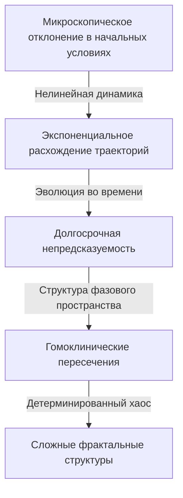

[Анри Пуанкаре](https://kenji.blog/p/poincare/) (1854–1912) — один из величайших математиков в истории, которых когда-либо производила Франция, а также физик-теоретик, инженер и философ науки. Его часто называют **«Последним универсалистом»** , потому что он глубоко понимал каждую математическую область своего времени и внес фундаментальный вклад в каждую из них. Учитывая, насколько узкоспециализированной и фрагментированной стала современная математика, маловероятно, что когда-либо снова появится кто-то с таким всеобъемлющим взглядом на все области.

В этой статье мы с огромным объемом и глубиной исследуем драматическую жизнь Пуанкаре, его очень человечные эпизоды, а также глубокое математическое и физическое наследие, которое он оставил миру.

## 1. Ранние годы и уникальная образовательная среда: Зарождение гения

[Анри Пуанкаре](https://kenji.blog/p/poincare/) родился 29 апреля 1854 года в северо-восточном французском городе Нанси в высокоинтеллектуальной элитной семье. Его отец, Леон Пуанкаре, был профессором медицинского факультета Университета Нанси, а его двоюродный брат, Раймон Пуанкаре, позже стал видным политиком, занимая посты премьер-министра и президента Франции. Такая благополучная семейная среда сильно стимулировала его интеллектуальное любопытство.

В детстве Пуанкаре переболел дифтерией, из-за чего он долгое время не мог говорить и был прикован к постели. Однако этот период изоляции аномально развил его способности к внутреннему мышлению. Он обладал **интуитивной памятью** , которая позволяла ему идеально запоминать содержание книги после одного прочтения, и он научился свободно манипулировать визуальным расположением букв и пространственными отношениями в своем уме.

В 1873 году, когда он поступил в Политехническую школу, ведущее элитное учебное заведение Франции, его таланты немедленно поразили преподавателей. Интересный эпизод заключается в том, что Пуанкаре был крайне близорук и почти не видел математические формулы на доске. Более того, у него не было привычки делать записи. Тем не менее, во время занятий он сидел совершенно неподвижно с закрытыми глазами, полностью реконструируя в уме сложные математические доказательства, опираясь исключительно на слова профессора. Его оценки всегда были самыми высокими, и после выпуска он перешел в Горную школу, где также получил квалификацию горного инженера.

## 2. Небесная механика и задача трех тел: Рождение теории хаоса

Среди достижений Пуанкаре самым известным и оказавшим решающее влияние на современную науку является его исследование **задачи трех тел** в небесной механике.

В конце 19 века король Швеции Оскар II учредил конкурс эссе по сложным проблемам небесной механики в честь своего 60-летия. Главная задача состояла в том, чтобы «найти аналитическое решение, которое полностью описывает, как три небесных тела, такие как Солнце, Земля и Луна, движутся под действием их взаимной гравитации».

Пуанкаре взялся за эту проблему и пришел к поразительному выводу. Это было математическое доказательство того факта, что «для задачи трех тел в общем случае не существует предсказуемого стабильного аналитического решения». Он обнаружил, что даже в детерминированной системе, основанной на ньютоновской механике, чрезвычайно малые различия в начальных условиях экспоненциально возрастают со временем, что приводит к совершенно непредсказуемому поведению. Это был исторический рассвет области, которую мы сегодня называем **теорией хаоса** .

Вместо того чтобы гоняться за сложными небесными траекториями с помощью расчетных формул, Пуанкаре сосредоточился на «геометрической форме пространства», которую описывает вся траектория. Он в полной мере использовал концепцию фазового пространства и придумал «Отображение Пуанкаре», которое фиксирует только те точки, где траектория пересекает определенную плоскость. Это открыло путь к качественному пониманию поведения сложных механических систем.

## 3. [Гипотеза Пуанкаре](https://kenji.blog/p/poincare-conjecture/): Основание топологии

Еще одним монументальным достижением Пуанкаре стало его единоличное основание **топологии** , важнейшей области современной математики. В своей статье 1895 года «Analysis Situs» он построил новую математическую структуру для изучения свойств фигур, которые сохраняются даже при их непрерывной деформации.

В этом исследовании он представил одну из самых известных нерешенных проблем в истории математики, **гипотезу Пуанкаре** .

> «Всякое односвязное замкнутое трехмерное многообразие гомеоморфно трехмерной сфере $S^3$?»

Если мы опишем эту сложную гипотезу, используя язык алгебраической топологии (группы гомологий и фундаментальные группы), который он разработал, это выглядит так: Когда фундаментальная группа $\pi_1(M)$ многообразия $M$ тривиальна, то есть,

$$
\pi_1(M) \cong \{1\} \implies M \cong S^3 \quad (\text{Односвязное пространство гомеоморфно сфере})
$$

Здесь $\pi_1(M)$ — это показатель, показывающий, может ли любая замкнутая кривая на многообразии непрерывно стягиваться в одну точку (односвязность). Вопрос Пуанкаре был глубоким, спрашивающим о самой форме Вселенной. «Если мы протянем веревку через Вселенную и потянем ее, чтобы собрать в одной точке, сможем ли мы сказать, что форма Вселенной круглая (сфера)?»

Эта гипотеза была доказана примерно через 100 лет после ее публикации, в 2006 году, замкнутым российским математиком Григорием Перельманом с использованием уравнения потока Риччи, и это стало мировой новостью, поскольку это была первая решенная из Проблем тысячелетия Математического института Клэя.

## 4. Решающий вклад в специальную теорию относительности

В области физики вклад Пуанкаре также неизмерим. За несколько лет до того, как Альберт Эйнштейн опубликовал Специальную теорию относительности в 1905 году, Пуанкаре глубоко изучил теории голландского физика Хендрика Лоренца и поставил под сомнение концепции абсолютного времени и абсолютного пространства.

Пуанкаре предложил «Принцип относительности», заявив, что невозможно обнаружить абсолютное движение относительно эфира, и математически сформулировал, что скорость света постоянна независимо от инерциальной системы отсчета, из которой она наблюдается. Уравнения преобразования координат и времени (преобразования Лоренца), которые он вывел, выглядят следующим образом:

$$
x' = \gamma (x - vt), \quad t' = \gamma \left(t - \frac{vx}{c^2}\right) \quad (\text{где } c \text{ — скорость света в вакууме})
$$

Более того, Пуанкаре быстро ввел концепцию четырехмерного пространства-времени и определил «Группу Пуанкаре», которая показывает, что законы физики инвариантны относительно преобразований Лоренца. В то время как Эйнштейн строил теорию относительности исходя из физического и интуитивного подхода, Пуанкаре пришел к той же истине с точки зрения математической и геометрической структурной красоты.

## 5. Бессознательное и творчество: Психология вдохновения

Пуанкаре наблюдал, как математическая интуиция работала внутри него, и оставил много работ о творческом процессе. Эпизод, касающийся его открытия фуксовых функций, записанный в его книге «Наука и метод», очень известен в области психологии и нейробиологии.

Он мучился над сложной математической задачей несколько месяцев, не в силах найти ключ к решению, несмотря на неоднократные сознательные вычисления и логические рассуждения. Истощенный, он решил отвлечься от своих исследований и присоединился к геологической экскурсии. Затем, во время поездки, именно в тот момент, когда он собирался сесть в конный омнибус в городе Кутанс, в его уме внезапно вспыхнуло идеальное решение.

> «В тот момент, когда я поставил ногу на ступеньку, мне в голову пришла идея, хотя ничто в моих прежних мыслях, казалось, не готовило к этому, что преобразования, которые я использовал для определения фуксовых функций, идентичны преобразованиям неевклидовой геометрии. Я не стал проверять идею; у меня не было бы на это времени, так как, заняв свое место в омнибусе, я продолжил начатый разговор, но я почувствовал полную уверенность».

Из этого опыта Пуанкаре разделил процесс творческого открытия на четыре стадии: «Подготовка» (сознательные усилия), «Инкубация» (комбинирование информации в бессознательном), «Озарение» (внезапное интуитивное понимание) и «Верификация» (логическое доказательство). Его идеи доказывают, насколько мощным вычислительным ресурсом является бессознательное в глубинах человеческого мышления.

## 6. Философия науки: Защита конвенционализма

Пуанкаре также оставил огромный след в области философии науки. Он отстаивал позицию, известную как **конвенционализм** . Это идея о том, что «фундаментальные аксиомы и законы в науке (такие как аксиомы евклидовой геометрии) не являются ни априорными истинами, ни эмпирическими фактами, а лишь "удобными соглашениями", принятыми людьми для описания природы».

Он заявил: «Дело не в том, что евклидова геометрия истинна, а неевклидова — ложна. Это все равно что сказать, что метрическая система не более истинна, чем система ярдов». Это гибкое философское отношение позже стало важной идеологической основой, когда Эйнштейн создавал Общую теорию относительности с использованием неевклидовой геометрии.

## 7. Заключение: Вечное наследие Пуанкаре

В 1912 году [Анри Пуанкаре](https://kenji.blog/p/poincare/) ушел из жизни в молодом возрасте 58 лет. Когда он умер, ученые всего мира горевали, что «свет французского интеллекта погас».

Математические основы, которые он оставил для **топологии** , **теории хаоса** и **принципа относительности** , сегодня вдыхают жизнь в каждую область, от современной физики элементарных частиц и космологии до прогнозирования погоды и экономических моделей. Пуанкаре научил нас не просто фрагментам специализированных знаний, но универсальной красоте математики, которая пронизывает весь мир. Размышляя о его жизни и достижениях, мы становимся свидетелями невероятной глубины и широты, которых может достичь человеческий дух.
