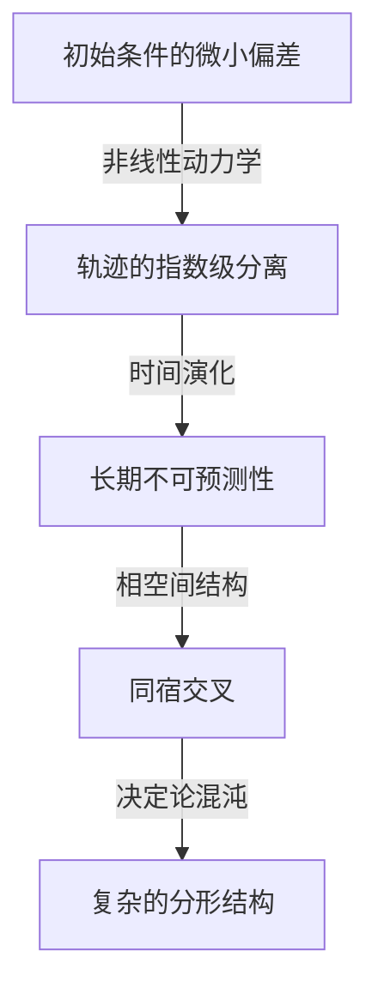

亨利·庞加莱（Henri Poincaré, 1854–1912）是法国历史上最伟大的数学家之一，同时也是理论物理学家、工程师和科学哲学家。他经常被称为 **“最后的全才”** （The Last Universalist），因为他深刻理解了当时所有的数学领域，并对每一个领域都做出了基础性的贡献。考虑到现代数学已经变得如此高度专业化和碎片化，像他这样能够统揽所有领域的人可能再也不会出现了。

在本文中，我们将以压倒性的篇幅和深度，探索庞加莱充满戏剧性的一生、他极具人情味的轶事，以及他留给世界的深远数学和物理学遗产。

## 1. 早年生活与独特的教育环境：天才的萌芽

1854年4月29日，亨利·庞加莱出生在法国东北部城市南锡的一个高智商精英家庭。他的父亲莱昂·庞加莱是南锡大学医学院的教授，他的堂兄雷蒙·庞加莱后来成为了一名杰出的政治家，曾担任法国总理和总统。这样得天独厚的家庭环境极大地刺激了他的求知欲。

童年时期，庞加莱曾患白喉，导致他在很长一段时间内无法说话，只能卧病在床。然而，这段隔离的时期却异常地发展了他内在的思考能力。他拥有一种 **直觉记忆** ，使他只需读一遍就能完美地记住一本书的内容，并且他学会了在脑海中自由操控字母的视觉排列和空间关系。

1873年，当他进入法国最顶尖的精英培训机构——巴黎综合理工学院时，他的才华立刻震惊了教授们。一个有趣的插曲是，庞加莱极度近视，几乎看不清黑板上的数学公式。此外，他也没有记笔记的习惯。尽管如此，在课堂上他总是闭着眼睛静静地坐着，仅凭教授的讲解就在脑海中完全重构出复杂的数学证明。他的成绩始终名列前茅，毕业后他又进入了巴黎国立高等矿业学校，在那里他还获得了矿业工程师的资格。

## 2. 天体力学与三体问题：混沌理论的诞生

在庞加莱的众多成就中，最著名的且对现代科学产生决定性影响的，是他在天体力学中关于 **三体问题** （Three-body problem）的研究。

19世纪末，瑞典国王奥斯卡二世为了庆祝他的60岁生日，赞助了一场关于天体力学难题的征文比赛。其核心挑战是“找到一个分析解，能够完整描述像太阳、地球和月球这样三个天体，如何在相互引力的作用下运动”。

庞加莱攻克了这个问题，并得出了一个令人震惊的结论。他在数学上证明了“三体问题通常不存在可预测的、稳定的分析解”。他发现，即使在基于牛顿力学的决定论系统中，初始条件的极微小差异也会随着时间的推移呈指数级放大，从而导致完全不可预测的行为。这就是我们今天称之为 **混沌理论** （Chaos theory）的领域的历史性开端。

庞加莱没有用计算公式去追踪复杂的天体轨迹，而是将注意力集中在整个轨迹所描绘的“空间的几何形状”上。他充分利用了相空间的概念，并发明了“庞加莱映射”，该映射只记录轨迹穿过特定平面的点。这为定性理解复杂力学系统的行为开辟了道路。

## 3. 庞加莱猜想：拓扑学的创立

庞加莱的另一项不朽成就是他凭借一己之力创立了 **拓扑学** （Topology），这是现代数学的一个主要领域。在他1895年的论文《位置分析》（Analysis Situs）中，他构建了一个全新的数学框架，用于研究图形在连续变形时仍保持不变的性质。

在这项研究中，他提出了数学史上最著名的未解之谜之一—— **庞加莱猜想** （[Poincaré conjecture](https://kenji.blog/p/poincare-conjecture/)）。

> “每一个单连通的、封闭的三维流形，是否都同胚于三维球面 $S^3$？”

如果我们用他所发展的代数拓扑学语言（同调群和基本群）来描述这个极其困难的猜想，它看起来是这样的：当流形 $M$ 的基本群 $\pi_1(M)$ 是平凡的，也就是说，

$$
\pi_1(M) \cong \{1\} \implies M \cong S^3 \quad (\text{单连通空间同胚于球面})
$$

在这里， $\pi_1(M)$ 是一个指标，用于表明流形上的任何闭曲线是否都能连续地收缩到一个点（即单连通）。庞加莱的问题极其深刻，它追问的是宇宙本身的形状。“如果我们在宇宙中拉起一根绳子，并把它拉紧收集到一个点，我们能说宇宙的形状是圆的（一个球面）吗？”

这个猜想在发表约100年后的2006年，由深居简出的俄罗斯数学家格里戈里·佩雷尔曼利用里奇流方程证明。它也因此成为克雷数学研究所设立的“千禧年大奖难题”中第一个被解决的问题，从而轰动了全球。

## 4. 对狭义相对论的决定性贡献

在物理学领域，庞加莱的贡献同样不可估量。在阿尔伯特·爱因斯坦于1905年发表狭义相对论的几年前，庞加莱就已经深入研究了荷兰物理学家亨德里克·洛伦兹的理论，并对绝对时间和绝对空间的概念提出了质疑。

庞加莱提出了“相对性原理”，指出不可能检测到相对于以太的绝对运动，并在数学上公式化了光速在任何惯性参考系中都是恒定的。他推导出的坐标和时间的变换方程（洛伦兹变换）如下：

$$
x' = \gamma (x - vt), \quad t' = \gamma \left(t - \frac{vx}{c^2}\right) \quad (\text{其中 } c \text{ 为真空中的光速})
$$

此外，庞加莱很快引入了四维时空的概念，并定义了“庞加莱群”，它表明物理定律在洛伦兹变换下是不变的。爱因斯坦是从物理和直觉的方法构建了相对论，而庞加莱则是从数学和几何结构之美的角度得出了同样的真理。

## 5. 潜意识与创造力：灵感的心理学

庞加莱观察了数学直觉在自己内心的运作方式，并留下了许多关于创造过程的著作。他在《科学与方法》一书中记录的关于发现富克斯函数的轶事，在心理学和神经科学领域都非常著名。

他曾为一道数学难题苦思冥想了几个月，尽管反复进行有意识的计算和逻辑推理，却找不到任何解决的线索。筋疲力尽的他决定暂时放下研究，参加了一次地质考察。然后，在旅途中，就在他正要登上库唐斯镇的一辆马拉公共汽车的那一刻，一个完美的解决方案突然闪现在他的脑海中。

> “就在我把脚踏上车踏板的那一刻，一个想法突然涌现出来，而我之前的思绪似乎没有任何东西为它铺平道路，那就是我用来定义富克斯函数的变换，与非欧几里得几何的变换是完全相同的。我没有去验证这个想法；我也没有时间去验证，因为一坐上公共汽车，我就继续了刚才的话题，但我感到了一种绝对的确定性。”

基于这次经历，庞加莱将创造性发现的过程划分为四个阶段：“准备期”（有意识的努力）、“孕育期”（潜意识中信息的组合）、“豁朗期”（突然的直觉理解）和“验证期”（逻辑证明）。他的见解证明了在人类思维的深处，潜意识作为一种计算资源是多么的强大。

## 6. 科学哲学：约定论的倡导

庞加莱在科学哲学领域也留下了巨大的印记。他倡导一种被称为 **约定论** （Conventionalism）的立场。这种观点认为，“科学中的基本公理和定律（例如欧几里得几何的公理）既不是先验的真理，也不是经验的事实，而仅仅是人类为了描述自然而采用的‘方便的约定’”。

他指出：“欧几里得几何并不是真的，而非欧几何也不是假的。这就像我们不能说公制比英制更真实一样。”这种灵活的哲学态度后来成为爱因斯坦利用非欧几何构建广义相对论时的一个重要思想基础。

## 7. 结语：庞加莱永恒的遗产

1912年，亨利·庞加莱英年早逝，享年58岁。他去世时，世界各地的科学家都悲痛地表示“法国智慧的明灯熄灭了”。

他为 **拓扑学** 、 **混沌理论** 和 **相对性原理** 留下的数学基础，如今正为从现代粒子物理学和宇宙学到天气预报和经济模型的各个领域注入活力。庞加莱教给我们的，不仅仅是专业知识的碎片，而是贯穿整个世界的数学的普遍之美。当我们回顾他的一生和成就时，我们见证了人类精神所能达到的极致深度和广度。
