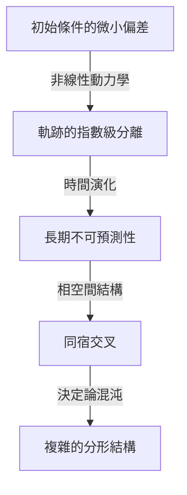

亨利·龐加萊（Henri Poincaré, 1854–1912）是法國歷史上最偉大的數學家之一，同時也是理論物理學家、工程師和科學哲學家。他經常被稱為 **「最後的全才」** （The Last Universalist），因為他深刻理解了當時所有的數學領域，並對每一個領域都做出了基礎性的貢獻。考慮到現代數學已經變得如此高度專業化和碎片化，像他這樣能夠統攬所有領域的人可能再也不會出現了。

在本文中，我們將以壓倒性的篇幅和深度，探索龐加萊充滿戲劇性的一生、他極具人情味的軼事，以及他留給世界的深遠數學和物理學遺產。

## 1. 早年生活與獨特的教育環境：天才的萌芽

1854年4月29日，亨利·龐加萊出生在法國東北部城市南錫的一個高智商精英家庭。他的父親萊昂·龐加萊是南錫大學醫學院的教授，他的堂兄雷蒙·龐加萊後來成為了一名傑出的政治家，曾擔任法國總理和總統。這樣得天獨厚的家庭環境極大地刺激了他的求知欲。

童年時期，龐加萊曾患白喉，導致他在很長一段時間內無法說話，只能臥病在床。然而，這段隔離的時期卻異常地發展了他內在的思考能力。他擁有一種 **直覺記憶** ，使他只需讀一遍就能完美地記住一本書的內容，並且他學會在腦海中自由操控字母的視覺排列和空間關係。

1873年，當他進入法國最頂尖的精英培訓機構——巴黎綜合理工學院時，他的才華立刻震驚了教授們。一個有趣的插曲是，龐加萊極度近視，幾乎看不清黑板上的數學公式。此外，他也沒有記筆記的習慣。儘管如此，在課堂上他總是閉著眼睛靜靜地坐著，僅憑教授的講解就在腦海中完全重構出複雜的數學證明。他的成績始終名列前茅，畢業後他又進入了巴黎國立高等礦業學校，在那裡他還獲得了礦業工程師的資格。

## 2. 天體力學與三體問題：混沌理論的誕生

在龐加萊的眾多成就中，最著名的且對現代科學產生決定性影響的，是他對天體力學中關於 **三體問題** （Three-body problem）的研究。

19世紀末，瑞典國王奧斯卡二世為了慶祝他的60歲生日，贊助了一場關於天體力學難題的徵文比賽。其核心挑戰是「找到一個分析解，能夠完整描述像太陽、地球和月球這樣三個天體，如何在相互引力的作用下運動」。

龐加萊攻克了這個問題，並得出了一個令人震驚的結論。他在數學上證明了「三體問題通常不存在可預測的、穩定的分析解」。他發現，即使在基於牛頓力學的決定論系統中，初始條件的極微小差異也會隨著時間的推移呈指數級放大，從而導致完全不可預測的行為。這就是我們今天稱之為 **混沌理論** （Chaos theory）的領域的歷史性開端。

龐加萊沒有用計算公式去追蹤複雜的天體軌跡，而是將注意力集中在整個軌跡所描繪的「空間的幾何形狀」上。他充分利用了相空間的概念，並發明了「龐加萊映射」，該映射只記錄軌跡穿過特定平面的點。這為定性理解複雜力學系統的行為開闢了道路。

## 3. 龐加萊猜想：拓撲學的創立

龐加萊的另一項不朽成就是他憑藉一己之力創立了 **拓撲學** （Topology），這是現代數學的一個主要領域。在他1895年的論文《位置分析》（Analysis Situs）中，他構建了一個全新的數學框架，用於研究圖形在連續變形時仍保持不變的性質。

在這項研究中，他提出了數學史上最著名的未解之謎之一—— **龐加萊猜想** （Poincaré conjecture）。

> 「每一個單連通的、封閉的三維流形，是否都同胚於三維球面 $S^3$？」

如果我們用他所發展的代數拓撲學語言（同調群和基本群）來描述這個極其困難的猜想，它看起來是這樣的：當流形 $M$ 的基本群 $\pi_1(M)$ 是平凡的，也就是說，

$$
\pi_1(M) \cong \{1\} \implies M \cong S^3 \quad (\text{單連通空間同胚於球面})
$$

在這裡， $\pi_1(M)$ 是一個指標，用於表明流形上的任何閉曲線是否都能連續地收縮到一個點（即單連通）。龐加萊的問題極其深刻，它追問的是宇宙本身的形狀。「如果我們在宇宙中拉起一根繩子，並把它拉緊收集到一個點，我們能說宇宙的形狀是圓的（一個球面）嗎？」

這個猜想在發表約100年後的2006年，由深居簡出的俄羅斯數學家格里戈里·佩雷爾曼利用里奇流方程證明。它也因此成為克雷數學研究所設立的「千禧年大獎難題」中第一個被解決的問題，從而轟動了全球。

## 4. 對狹義相對論的決定性貢獻

在物理學領域，龐加萊的貢獻同樣不可估量。在阿爾伯特·愛因斯坦於1905年發表狹義相對論的幾年前，龐加萊就已經深入研究了荷蘭物理學家亨德里克·洛倫茲的理論，並對絕對時間和絕對空間的概念提出了質疑。

龐加萊提出了「相對性原理」，指出不可能檢測到相對於以太的絕對運動，並在數學上公式化了光速在任何慣性參考系中都是恆定的。他推導出的座標和時間的變換方程（洛倫茲變換）如下：

$$
x' = \gamma (x - vt), \quad t' = \gamma \left(t - \frac{vx}{c^2}\right) \quad (\text{其中 } c \text{ 為真空中的光速})
$$

此外，龐加萊很快引入了四維時空的概念，並定義了「龐加萊群」，它表明物理定律在洛倫茲變換下是不變的。愛因斯坦是從物理和直覺的方法構建了相對論，而龐加萊則是從數學和幾何結構之美的角度得出了同樣的真理。

## 5. 潛意識與創造力：靈感的心理學

龐加萊觀察了數學直覺在自己內心的運作方式，並留下了許多關於創造過程的著作。他在《科學與方法》一書中記錄的關於發現富克斯函數的軼事，在心理學和神經科學領域都非常著名。

他曾為一道數學難題苦思冥想了幾個月，儘管反覆進行有意識的計算和邏輯推理，卻找不到任何解決的線索。筋疲力盡的他決定暫時放下研究，參加了一次地質考察。然後，在旅途中，就在他正要登上庫唐斯鎮的一輛馬拉公共汽車的那一刻，一個完美的解決方案突然閃現在他的腦海中。

> 「就在我把腳踏上車踏板的那一刻，一個想法突然湧現出來，而我之前的思緒似乎沒有任何東西為它鋪平道路，那就是我用來定義富克斯函數的變換，與非歐幾里得幾何的變換是完全相同的。我沒有去驗證這個想法；我也沒有時間去驗證，因為一坐上公共汽車，我就繼續了剛才的話題，但我感到了一種絕對的確定性。」

基於這次經歷，龐加萊將創造性發現的過程劃分為四個階段：「準備期」（有意識的努力）、「孕育期」（潛意識中信息的組合）、「豁朗期」（突然的直覺理解）和「驗證期」（邏輯證明）。他的見解證明了在人類思維的深處，潛意識作為一種計算資源是多麼的強大。

## 6. 科學哲學：約定論的倡導

龐加萊在科學哲學領域也留下了巨大的印記。他倡導一種被稱為 **約定論** （Conventionalism）的立場。這種觀點認為，「科學中的基本公理和定律（例如歐幾里得幾何的公理）既不是先驗的真理，也不是經驗的事實，而僅僅是人類為了描述自然而採用的『方便的約定』」。

他指出：「歐幾里得幾何並不是真的，而非歐幾何也不是假的。這就像我們不能說公制比英制更真實一樣。」這種靈活的哲學態度後來成為愛因斯坦利用非歐幾何構建廣義相對論時的一個重要思想基礎。

## 7. 結語：龐加萊永遠的遺產

1912年，亨利·龐加萊英年早逝，享年58歲。他去世時，世界各地的科學家都悲痛地表示「法國智慧的明燈熄滅了」。

他為 **拓撲學** 、 **混沌理論** 和 **相對性原理** 留下的數學基礎，如今正為從現代粒子物理學和宇宙學到天氣預報和經濟模型的各個領域注入活力。龐加萊教給我們的，不僅僅是專業知識的碎片，而是貫穿整個世界的數學的普遍之美。當我們回顧他的一生和成就時，我們見證了人類精神所能達到的極致深度和廣度。
