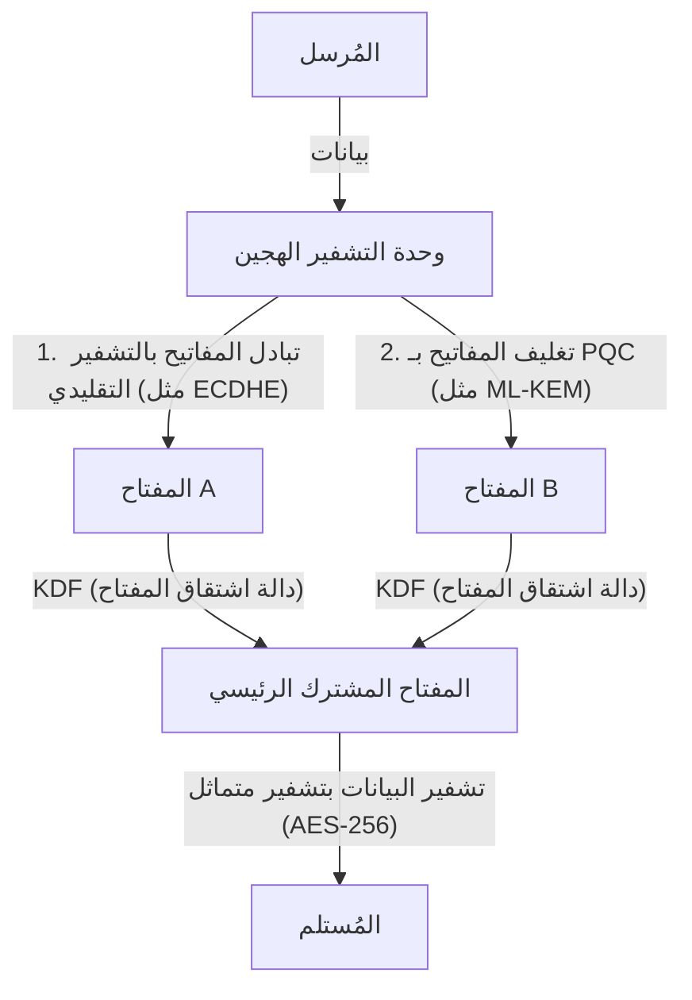

# الترحيل العملي إلى التشفير ما بعد الكمي (PQC): جرد أصول التشفير ومرونة التشفير

يعتمد المجتمع الرقمي الحديث بشكل كبير على البنية التحتية للمفاتيح العامة (PKI). إن أساس الثقة الرقمية في كل شيء، مثل الخدمات المصرفية عبر الإنترنت، ونقل البيانات السرية، وتوقيع البرمجيات، مضمون بواسطة تقنيات التشفير القائمة على الصعوبات الرياضية مثل RSA وتشفير المنحنى الإهليلجي (ECC). ومع ذلك، مع صعود الحوسبة الكمية، تواجه تقنيات التشفير هذه تهديدًا غير مسبوق.

في هذا المقال، سوف نتعمق في استراتيجيات الترحيل إلى التشفير ما بعد الكمي (Post-Quantum Cryptography: PQC) للتحضير للعصر الكمي القادم. سنسلط الضوء على أحدث اتجاهات التوحيد القياسي من قبل المعهد الوطني للمعايير والتقنية (NIST)، والأساس الرياضي للتشفير القائم على الشبكات، والخطوات التي يجب على الشركات اتخاذها لإنشاء قائمة جرد أصول التشفير (CBOM)، وتصميم الأنظمة الذي يضمن مرونة التشفير (Crypto Agility).

## تهديد الحواسيب الكمية وخوارزمية شور

بينما تعالج الحواسيب الكلاسيكية المعلومات باستخدام البتات "0" و "1"، تستخدم الحواسيب الكمية "البتات الكمية (الكيوبتات)" وتستفيد من خصائص ميكانيكا الكم مثل التراكب والتشابك الكمي لإجراء حسابات متوازية. نتيجة لذلك، فإنها تظهر قدرات حسابية تتفوق على الحواسيب الكلاسيكية في مسائل معينة.

من بين هذه الأمور، ما يُعد قاتلًا لتقنيات التشفير هو "خوارزمية شور" التي ابتكرها بيتر شور في عام 1994. يمكن لخوارزمية شور، عند تنفيذها على حاسوب كمي ذي صلة بالتشفير ومقاوم للأخطاء (CRQC) وذو نطاق كافٍ، أن تحل مشكلة التحليل إلى العوامل الأولية ومشكلة اللوغاريتم المنفصل في وقت متعدد الحدود.

يعتمد تشفير RSA على صعوبة التحليل إلى العوامل الأولية، بينما يعتمد تشفير ECC (تشفير المنحنى الإهليلجي) على صعوبة مشكلة اللوغاريتم المنفصل على المنحنيات الإهليلجية. أطوال المفاتيح المستخدمة بشكل شائع اليوم، مثل RSA-2048 و ECC-256، تعتبر غير قابلة للكسر بواسطة الحواسيب الكلاسيكية حتى لو استغرق الأمر وقتًا أطول من عمر الكون. ومع ذلك، أمام حاسوب كمي ينفذ خوارزمية شور، يمكن فك تشفيرها في غضون بضع ساعات إلى بضعة أيام فقط.

### تهديد "احصد الآن، وفك التشفير لاحقًا" (HNDL)

من الخطير للغاية الاعتقاد بأن "الحواسيب الكمية لا تزال بعيدة عن الاستخدام العملي، لذا يمكننا تأجيل اتخاذ التدابير". وذلك لأن المهاجمين السيبرانيين المدعومين من الدول والمنظمات الإجرامية المتطورة يواصلون جمع وتخزين بيانات الاتصالات المشفرة من الآن.

يُعرف هذا الأسلوب باسم "Harvest Now, Decrypt Later" (احصد الآن، وفك التشفير لاحقًا). تتمثل الاستراتيجية في أنه حتى إذا لم يكن من الممكن فك التشفير باستخدام تقنيات التشفير الحالية، فعندما تظهر حواسيب كمية قوية بعد عقود، سيقومون بفك تشفير البيانات المخزنة للحصول على معلومات سرية.

البيانات التي يجب الحفاظ على سريتها لعقود، مثل أسرار الدولة والملكية الفكرية للشركات والبيانات الطبية، ستظل معرضة لتهديد HNDL إذا لم تتم حمايتها بواسطة PQC بدءًا من اليوم.

## عملية التوحيد القياسي لـ PQC بواسطة NIST وأحدث الاتجاهات

لمواجهة مثل هذه التهديدات، أطلق NIST عملية التوحيد القياسي لـ PQC في عام 2016. على مدى عدة سنوات، قاموا بتقييم واختيار الخوارزميات المقترحة من قبل علماء التشفير في جميع أنحاء العالم، وتضييق نطاق الخيارات من منظور الأمان والأداء.

وفي عام 2024، نشر NIST الخوارزميات الرئيسية التالية لـ PQC كمعايير رسمية:

1. **ML-KEM (Kyber)**: تم توحيده كـ FIPS 203. يُستخدم لتشفير المفتاح العام وآلية تغليف المفاتيح (KEM). يتميز بحجم مفتاح صغير نسبيًا ومعالجة سريعة، مما يجعله مناسبًا لحماية حركة مرور الويب العامة.
2. **ML-DSA (Dilithium)**: تم توحيده كـ FIPS 204. يُستخدم لخوارزميات التوقيع الرقمي. يتيح التحقق من التوقيع بسرعة عالية جدًا ويوصى به للاستخدامات الرئيسية للتوقيعات الرقمية.
3. **SLH-DSA (SPHINCS+)**: تم توحيده كـ FIPS 205. خوارزمية توقيع رقمي قائمة على التجزئة. نظرًا لأنه لا يعتمد على التشفير القائم على الشبكات، فإنه يعمل كنسخة احتياطية في حالة اختراق الأساس الرياضي لـ ML-DSA، لكن استخداماته محدودة بسبب حجم التوقيع الكبير.
4. **FN-DSA (FALCON)**: من المقرر توحيده في المستقبل. يتميز بتوقيع ومفتاح عام صغيرين جدًا، مما يجعله مناسبًا للبيئات ذات موارد الأجهزة المحدودة أو الاتصالات ذات قيود البروتوكول الصارمة.

### الأساس الرياضي للتشفير القائم على الشبكات (Lattice-based Cryptography)

تمتلك معايير ML-KEM و ML-DSA أساسًا رياضيًا يُعرف باسم "التشفير القائم على الشبكات". يُعتبر التشفير القائم على الشبكات مقاومًا للخوارزميات الكمية المعروفة مثل خوارزمية شور.

الشبكة هي مجموعة من النقاط المنفصلة في فضاء ذي n بُعد، ويتم التعبير عنها من خلال مجموعة خطية من متجهات الأساس. يكمن أساس أمان التشفير القائم على الشبكات في مسائل رياضية مثل "مسألة أقصر متجه (SVP)" و "مسألة أقرب متجه (CVP)".

بشكل خاص في ML-KEM وغيرها، يتم استخدام متغيرات من هذه المسائل مثل "مسألة LWE (التعلم مع الأخطاء)" ومشتقاتها على حلقات متعددات الحدود "مسألة Module-LWE". مسألة LWE عبارة عن نظام من المعادلات الخطية التي يُضاف إليها ضوضاء عشوائية صغيرة (أخطاء) عن قصد، ووجود هذه الضوضاء يجعل من الصعب للغاية حلها بكفاءة سواء باستخدام الحواسيب الكلاسيكية أو الكمية.

## استراتيجية الترحيل العملي لـ PQC للمؤسسات: جرد أصول التشفير و CBOM

لا يُعد الترحيل إلى PQC "مهمة بسيطة تتمثل في استبدال الخوارزميات". أصبحت أنظمة تكنولوجيا المعلومات الحديثة معقدة، ومن النادر أن تستوعب الشركات تمامًا أين يتم استخدام أي خوارزمية تشفير ولأي غرض.

الخطوة الأولى في الترحيل هي إجراء "جرد كامل لأصول التشفير (الاكتشاف)".

### 1. إنشاء قائمة جرد التشفير

يجب إبراز وتوضيح تقنيات التشفير المستخدمة في جميع الأجهزة والبرامج والخدمات السحابية ومعدات الشبكات داخل المؤسسة. ويشمل ذلك المعلومات التالية:

- الخوارزميات المستخدمة (مثل RSA و ECDSA و AES)
- أطوال المفاتيح (مثل RSA-2048 و AES-256)
- الغرض من التشفير (تخزين البيانات، قنوات الاتصال، التوقيع الرقمي)
- المكتبات المعتمد عليها (مثل OpenSSL و Bouncy Castle) وإصداراتها
- دورة الحياة (تاريخ انتهاء صلاحية المفتاح، وتيرة التدوير)

### 2. تقديم CBOM (قائمة مواد التشفير)

إن CBOM (قائمة مواد التشفير) هو توسع لمفهوم SBOM (قائمة مواد البرمجيات) ليشمل تقنية التشفير. يصف CBOM معلومات مفصلة مثل مكتبات التشفير والبروتوكولات والخوارزميات والشهادات التي تعتمد عليها مكونات البرامج، وذلك بتنسيق مقروء آليًا (مثل CycloneDX).

من خلال دمج CBOM في خطوط أنابيب CI/CD، يصبح من الممكن اكتشاف خوارزميات التشفير القديمة والضعيفة الكامنة في النظام تلقائيًا، مما يتيح المراقبة المستمرة والاستجابة السريعة.

## مرونة التشفير (Crypto Agility): التكيف السريع للتشفير

أحد أهم المفاهيم في الترحيل إلى PQC هو "مرونة التشفير" (Crypto Agility).

في الماضي، عندما تم اختراق دوال التجزئة مثل MD5 و SHA-1، تطلب الانتقال منها وقتاً طويلاً وتكاليف باهظة تتراوح من عدة سنوات إلى أكثر من عقد من الزمان لأن العديد من الأنظمة قامت بترميز هذه الخوارزميات بشكل ثابت. وبالمثل، لا يمكن استبعاد احتمال تعرض خوارزميات PQC الجديدة لفك التشفير بواسطة خوارزميات كمية جديدة في المستقبل.

لذلك، بدلاً من الاعتماد بشكل كبير على خوارزمية معينة، يُطلب "تصميم نظام يسمح باستبدال خوارزميات التشفير بسرعة وأمان حسب الحاجة". هذا هو ما يُعرف بمرونة التشفير.

### تصميم البنية المعمارية لتحقيق مرونة التشفير

1. **تجريد عمليات التشفير**: بدلاً من كتابة خوارزميات معينة مباشرة في كود التطبيق، يتم استدعاؤها من خلال واجهة برمجة تطبيقات (مزود) تشفير مجردة. وهذا يسمح بتبديل الخوارزميات بمجرد تغيير إعدادات مزود التشفير الأساسي، دون الحاجة إلى إجراء تغييرات على منطق الأعمال.
2. **مرونة الشهادات والبروتوكولات**: تصميم النظام للتعامل بشفافية مع معرفات الكائنات (OIDs) المتعددة أو الجديدة في شهادات X.509 وبروتوكولات TLS.
3. **مركزية إدارة المفاتيح**: الاستفادة من خدمة إدارة المفاتيح (KMS) أو وحدة أمان الأجهزة (HSM) لإدارة توليد المفاتيح وتخزينها وتدويرها مركزيًا، وإنشاء إطار عمل يسمح بتطبيق التغييرات في سياسات التشفير بسرعة عبر المؤسسة.

### نهج تنفيذ التشفير الهجين

على الرغم من أن خوارزميات PQC قد تم توحيدها من قبل NIST، إلا أنها لم تخضع لعقود من الاستخدام العملي في العالم الحقيقي (اختبارات المعارك) كما هو الحال مع RSA و ECC. لذلك، هناك حاجة إلى تدابير أمان ضد خطر اكتشاف نقاط ضعف رياضية غير معروفة (على سبيل المثال، حالة اختراق خوارزمية SIKE في الجولة النهائية من التوحيد القياسي).

لهذا السبب يُوصى بـ "التشفير الهجين" (Hybrid Cryptography). وهو نهج يجمع بين استخدام التشفير الكلاسيكي التقليدي (مثل ECC و RSA) و PQC الجديد (مثل ML-KEM).

الميزة الأكبر للتشفير الهجين هي أنه حتى إذا تم اكتشاف ثغرة قاتلة في خوارزمية PQC، فسيتم الحفاظ على أمان النظام ككل (مع الحفاظ على التوافق مع FIPS) طالما أن أمان التشفير الكلاسيكي مضمون. على العكس من ذلك، حتى إذا كُسر التشفير الكلاسيكي بواسطة الحواسيب الكمية، فسيظل الأمان محفوظًا إذا كان PQC يعمل.

## الخلاصة والتطلعات المستقبلية

إن الاستخدام العملي للحواسيب الكمية سيجلب فوائد هائلة للبشرية، ولكنه يشكل في الوقت نفسه تهديدًا خطيرًا يهز أسس مجتمعنا الرقمي الحالي. إن الترحيل إلى PQC ليس مجرد تحديث تقني، بل هو مشروع استراتيجي لإدارة المخاطر يتعلق ببقاء المؤسسة.

بالنظر إلى تهديد HNDL، فقد بدأ بالفعل العد التنازلي للمهلة الزمنية للترحيل. يجب على الشركات البدء فورًا في إنشاء قوائم جرد التشفير والاستفادة من CBOM لفهم وضعها الحالي بدقة. ومن ثم، فإن المضي قدمًا في الترحيل إلى بنية هجينة مع وضع مرونة التشفير في الاعتبار بشكل منهجي ومستمر، سيكون شرطًا أساسيًا لبناء أعمال رقمية آمنة في المستقبل.
