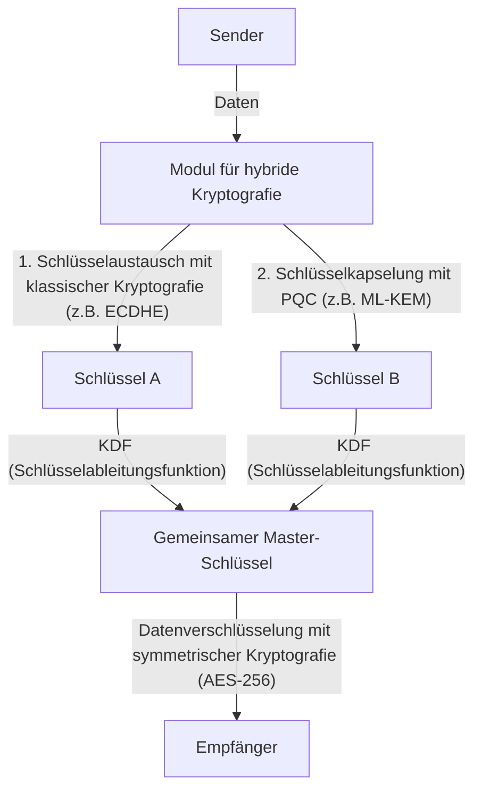

# Praktische PQC-Migration: Krypto-Inventarisierung und Krypto-Agilität

Die moderne digitale Gesellschaft ist stark von der Public-Key-Infrastruktur (PKI) abhängig. Von Internet-Banking über die Übertragung vertraulicher Daten bis hin zur Signierung von Software – die Grundlage jedes digitalen Vertrauens wird durch Verschlüsselungstechnologien wie RSA und Elliptic Curve Cryptography (ECC) gesichert, die auf mathematischer Komplexität beruhen. Mit dem Aufstieg von Quantencomputern stehen diese kryptografischen Verfahren jedoch vor einer beispiellosen Bedrohung.

In diesem Artikel befassen wir uns eingehend mit der Migrationsstrategie zur Post-Quanten-Kryptografie (PQC), um uns auf das kommende Quantenzeitalter vorzubereiten. Wir konzentrieren uns auf die neuesten Standardisierungsentwicklungen des NIST (National Institute of Standards and Technology), die mathematischen Grundlagen der gitterbasierten Kryptografie, die Schritte für Unternehmen zur Erstellung eines Krypto-Inventars (CBOM) sowie auf Systemdesigns, die Krypto-Agilität (Crypto Agility) gewährleisten.

## Die Bedrohung durch Quantencomputer und Shors Algorithmus

Während klassische Computer Informationen in Bits von „0“ und „1“ verarbeiten, nutzen Quantencomputer „Qubits“ und machen sich quantenmechanische Eigenschaften wie Superposition und Quantenverschränkung zunutze, um parallele Berechnungen durchzuführen. Dadurch erreichen sie bei bestimmten Problemstellungen eine Rechenleistung, die herkömmliche Computer bei weitem übertrifft.

Besonders fatal für die Kryptografie ist der 1994 von Peter Shor entwickelte „Shor-Algorithmus“. Wird dieser auf einem ausreichend großen und fehlertoleranten Quantencomputer (CRQC: Cryptographically Relevant Quantum Computer) ausgeführt, kann er Faktorisierungsprobleme und das Problem des diskreten Logarithmus in polynomieller Zeit lösen.

Die RSA-Verschlüsselung beruht auf der Schwierigkeit der Primfaktorzerlegung, während ECC (Elliptic Curve Cryptography) auf der Schwierigkeit des diskreten Logarithmus auf elliptischen Kurven basiert. Schlüssellängen wie RSA-2048 oder ECC-256, die heute allgemein verwendet werden, gelten für klassische Computer selbst in Zeiträumen, die das Alter des Universums übersteigen, als unknackbar. Vor einem Quantencomputer, der Shors Algorithmus implementiert, könnten sie jedoch innerhalb von wenigen Stunden bis Tagen entschlüsselt werden.

### Die Bedrohung durch „Harvest Now, Decrypt Later“ (HNDL)

Es ist äußerst gefährlich zu glauben, dass Maßnahmen aufgeschoben werden können, nur weil die praktische Anwendung von Quantencomputern noch in der Zukunft liegt. Staatlich unterstützte Cyberangreifer und hoch entwickelte kriminelle Organisationen sammeln und speichern bereits heute kontinuierlich verschlüsselte Kommunikationsdaten.

Diese Methode wird als „Harvest Now, Decrypt Later“ (Jetzt ernten, später entschlüsseln) bezeichnet. Selbst wenn die Daten mit aktuellen Verschlüsselungstechnologien nicht dechiffriert werden können, besteht die Strategie darin, die gespeicherten Daten in einigen Jahrzehnten mithilfe leistungsstarker Quantencomputer zu entschlüsseln, um an vertrauliche Informationen zu gelangen.

Daten, die über Jahrzehnte hinweg vertraulich bleiben müssen – wie Staatsgeheimnisse, geistiges Eigentum von Unternehmen oder medizinische Daten –, sind ununterbrochen der HNDL-Bedrohung ausgesetzt, wenn sie nicht schon heute durch PQC geschützt werden.

## Der PQC-Standardisierungsprozess des NIST und aktuelle Entwicklungen

Um dieser Bedrohung entgegenzuwirken, hat das NIST im Jahr 2016 einen Standardisierungsprozess für PQC eingeleitet. Die von Kryptografen aus der ganzen Welt vorgeschlagenen Algorithmen wurden über mehrere Jahre hinweg evaluiert, ausgewählt und unter den Gesichtspunkten von Sicherheit und Leistung eingegrenzt.

Im Jahr 2024 veröffentlichte das NIST schließlich die folgenden primären PQC-Algorithmen als offizielle Standards:

1. **ML-KEM (Kyber)**: Als FIPS 203 standardisiert. Wird für Public-Key-Verschlüsselung und Key Encapsulation Mechanisms (KEM) verwendet. Es zeichnet sich durch relativ kleine Schlüsselgrößen und schnelle Verarbeitung aus und eignet sich beispielsweise zum Schutz des allgemeinen Web-Traffics.
2. **ML-DSA (Dilithium)**: Als FIPS 204 standardisiert. Wird für digitale Signaturalgorithmen verwendet. Es ermöglicht eine extrem schnelle Signaturverifizierung und wird für die meisten digitalen Signaturanwendungen empfohlen.
3. **SLH-DSA (SPHINCS+)**: Als FIPS 205 standardisiert. Ein Hash-basierter Algorithmus für digitale Signaturen. Da er nicht auf der gitterbasierten Kryptografie beruht, dient er als Backup, falls die mathematische Grundlage von ML-DSA gebrochen wird; aufgrund der großen Signaturgröße sind seine Anwendungsfälle jedoch begrenzt.
4. **FN-DSA (FALCON)**: Soll in Zukunft standardisiert werden. Signatur und öffentlicher Schlüssel sind sehr klein, wodurch es sich für Umgebungen mit begrenzten Hardwareressourcen oder Kommunikation mit strengen Protokolleinschränkungen eignet.

### Die mathematische Grundlage der gitterbasierten Kryptografie (Lattice-based Cryptography)

Die standardisierten Algorithmen ML-KEM und ML-DSA basieren mathematisch auf der „gitterbasierten Kryptografie“. Diese gilt als resistent gegen bekannte Quantenalgorithmen wie Shors Algorithmus.

Ein Gitter (Lattice) ist eine diskrete Menge von Punkten in einem n-dimensionalen Raum, die durch Linearkombinationen von Basisvektoren dargestellt wird. Die Sicherheit der gitterbasierten Kryptografie beruht auf mathematischen Problemen wie dem „Kürzesten-Vektor-Problem“ (SVP: Shortest Vector Problem) oder dem „Nächsten-Vektor-Problem“ (CVP: Closest Vector Problem).

Insbesondere bei ML-KEM werden Varianten dieser Probleme wie das „LWE-Problem“ (Learning With Errors) oder dessen Ableitung auf Polynomringen, das „Module-LWE-Problem“, verwendet. Das LWE-Problem besteht aus einem System linearer Gleichungen, dem absichtlich ein kleines zufälliges Rauschen (Fehler) hinzugefügt wurde. Das Vorhandensein dieses Rauschens macht es sowohl für klassische als auch für Quantencomputer extrem schwierig, das Problem effizient zu lösen.

## Praktische PQC-Migrationsstrategie für Unternehmen: Krypto-Inventarisierung und CBOM

Die Migration zu PQC ist keine einfache Aufgabe, bei der „nur ein Algorithmus ausgetauscht wird“. Moderne IT-Systeme sind hochkomplex geworden, und nur selten wissen Unternehmen vollständig, wo, welche kryptografischen Algorithmen zu welchem Zweck eingesetzt werden.

Der erste Schritt der Migration ist eine gründliche „Krypto-Inventarisierung“ (Discovery).

### 1. Erstellung eines Krypto-Inventars

Die in allen Hardwarekomponenten, Softwareanwendungen, Cloud-Diensten und Netzwerkgeräten innerhalb der Organisation eingesetzten Kryptografietechnologien müssen visualisiert werden. Dies umfasst folgende Informationen:

- Verwendete Algorithmen (RSA, ECDSA, AES usw.)
- Schlüssellänge (RSA-2048, AES-256 usw.)
- Zweck der Verschlüsselung (Datenspeicherung, Kommunikationskanäle, digitale Signaturen)
- Verwendete Abhängigkeiten und Bibliotheken (OpenSSL, Bouncy Castle usw.) sowie deren Versionen
- Lebenszyklus (Gültigkeitsdauer der Schlüssel, Häufigkeit der Schlüsselrotation)

### 2. Einführung von CBOM (Cryptography Bill of Materials)

CBOM (Cryptography Bill of Materials) erweitert das Konzept der Software Bill of Materials (SBOM) auf kryptografische Technologien. Ein CBOM beschreibt detaillierte Informationen über kryptografische Bibliotheken, Protokolle, Algorithmen, Zertifikate und andere Abhängigkeiten von Softwarekomponenten in einem maschinenlesbaren Format (z. B. CycloneDX).

Durch die Integration von CBOM in die CI/CD-Pipeline können anfällige, veraltete Verschlüsselungsalgorithmen, die im System verborgen sind, automatisch erkannt werden, was eine kontinuierliche Überwachung und schnelle Reaktion ermöglicht.

## Krypto-Agilität (Crypto Agility)

Eines der wichtigsten Konzepte bei der PQC-Migration ist die „Krypto-Agilität“ (Crypto Agility).

In der Vergangenheit, als Hash-Funktionen wie MD5 oder SHA-1 kompromittiert wurden, erforderte die Migration enorm viel Zeit und Kosten (oft mehrere Jahre bis über ein Jahrzehnt), da viele Systeme diese Algorithmen fest einprogrammiert (hardcoded) hatten. Es kann nicht völlig ausgeschlossen werden, dass auch neue PQC-Algorithmen in Zukunft durch neuartige Quantenalgorithmen gebrochen werden.

Daher bedarf es eines Systemdesigns, das nicht stark von einem bestimmten Algorithmus abhängt, sondern bei dem „kryptografische Algorithmen bei Bedarf schnell und sicher ausgetauscht werden können“. Genau das ist Krypto-Agilität.

### Architekturdesign zur Realisierung von Krypto-Agilität

1. **Abstraktion kryptografischer Prozesse**: Anstatt spezifische Algorithmen direkt im Anwendungscode zu implementieren, sollten diese über eine abstrahierte Krypto-API (Provider) aufgerufen werden. Dadurch können Algorithmen durch bloßes Ändern der Konfiguration des zugrunde liegenden Krypto-Providers gewechselt werden, ohne dass die Geschäftslogik angepasst werden muss.
2. **Flexibilität bei Zertifikaten und Protokollen**: Das System sollte so konzipiert sein, dass es mehrere oder neue OIDs (Object Identifiers) in X.509-Zertifikaten und TLS-Protokollen transparent verarbeiten kann.
3. **Zentralisierung des Schlüsselmanagements**: Durch den Einsatz von KMS (Key Management Service) oder HSM (Hardware Security Module), die Erstellung, Speicherung und Rotation von Schlüsseln zentral verwalten, wird eine Infrastruktur geschaffen, mit der Änderungen an der Kryptorichtlinie schnell in der gesamten Organisation angewendet werden können.

### Implementierungsansatz der Hybrid-Kryptografie

Obwohl PQC-Algorithmen vom NIST standardisiert wurden, haben sie sich in der Praxis noch nicht über Jahrzehnte hinweg bewährt (Battle-Testing) wie RSA oder ECC. Es sind Sicherheitsvorkehrungen gegen das Risiko erforderlich, dass unentdeckte mathematische Schwachstellen gefunden werden (wie z. B. beim SIKE-Algorithmus, der in der finalen Standardisierungsrunde gebrochen wurde).

Daher wird die „hybride Kryptografie“ (Hybrid Cryptography) empfohlen. Dies ist ein Ansatz, der sowohl klassische Kryptografie (ECC oder RSA) als auch neue PQC (z. B. ML-KEM) in Kombination verwendet.

Der größte Vorteil der hybriden Kryptografie besteht darin, dass die Sicherheit des Gesamtsystems erhalten bleibt (und die FIPS-Konformität gewahrt wird), selbst wenn eine fatale Schwachstelle in einem PQC-Algorithmus entdeckt wird, solange die klassische Kryptografie sicher bleibt. Umgekehrt ist die Sicherheit auch dann gewährleistet, wenn die klassische Kryptografie durch Quantencomputer gebrochen wird, solange das PQC-Verfahren funktioniert.

## Fazit und Ausblick

Die praktische Umsetzung von Quantencomputern wird der Menschheit immense Vorteile bringen, stellt aber gleichzeitig eine erhebliche Bedrohung dar, die die Grundfesten unserer heutigen digitalen Gesellschaft erschüttern könnte. Die Migration zu PQC ist nicht nur ein rein technisches Update, sondern ein strategisches Risikomanagementprojekt, das das Überleben der Organisation betrifft.

In Anbetracht der HNDL-Bedrohung hat der Countdown für die Migration bereits begonnen. Unternehmen müssen umgehend mit der Erstellung eines Krypto-Inventars beginnen und CBOMs nutzen, um den aktuellen Status quo präzise zu erfassen. Die systematische und kontinuierliche Migration zu einer hybriden Architektur, bei der die Krypto-Agilität im Mittelpunkt steht, wird zur absoluten Notwendigkeit für den Aufbau sicherer digitaler Geschäfte der Zukunft.
