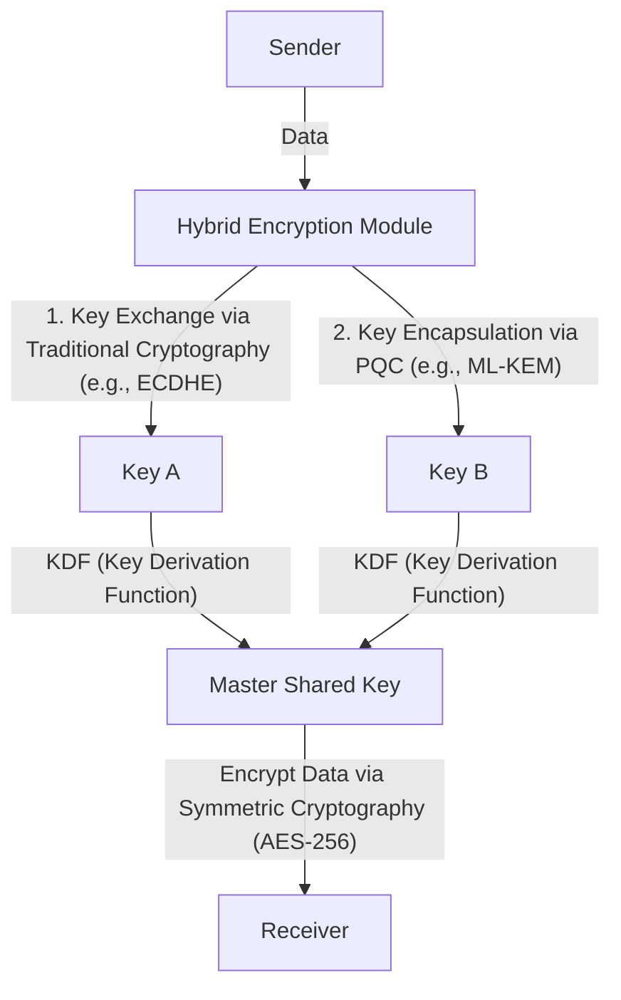

# Practical PQC Migration: Cryptographic Asset Inventory and Crypto-Agility

Modern digital society relies heavily on Public Key Infrastructure (PKI). The foundation of all digital trust—whether for internet banking, transmitting sensitive data, or signing software—is secured by cryptographic techniques based on mathematical hardness, such as RSA and Elliptic Curve Cryptography (ECC). However, with the rise of quantum computers, these cryptographic technologies face an unprecedented threat.

This article delves deeply into the migration strategy to Post-Quantum Cryptography (PQC) to prepare for the coming quantum era. It focuses on the latest standardization trends by NIST (National Institute of Standards and Technology), the mathematical foundations of lattice-based cryptography, the procedures enterprises should take to create a Cryptography Bill of Materials (CBOM), and system designs that ensure crypto-agility.

## The Threat of Quantum Computers and Shor's Algorithm

While classical computers process information in bits of '0' and '1', quantum computers use 'qubits', leveraging quantum mechanical properties like superposition and entanglement to perform parallel computations. This allows them to demonstrate computational power that far surpasses classical computers for specific problems.

Among these, the most fatal to cryptographic technology is "Shor's Algorithm," devised by Peter Shor in 1994. If Shor's algorithm is executed on a sufficiently large Cryptographically Relevant Quantum Computer (CRQC), it can solve integer factorization and discrete logarithm problems in polynomial time.

RSA cryptography relies on the hardness of prime factorization, and ECC (Elliptic Curve Cryptography) relies on the hardness of the discrete logarithm problem on elliptic curves. The key lengths commonly used today, such as RSA-2048 and ECC-256, are said to take longer than the age of the universe to crack with classical computers. However, before a quantum computer implementing Shor's algorithm, they could potentially be broken in a matter of hours or days.

### The Threat of "Harvest Now, Decrypt Later" (HNDL)

It is highly dangerous to think, "Quantum computers are still a long way from practical use, so countermeasures can wait." This is because state-sponsored cyber attackers and advanced criminal organizations are continuously collecting and storing encrypted communication data starting today.

This tactic is known as "Harvest Now, Decrypt Later" (HNDL). It is a strategy where, even if the data cannot be decrypted with current cryptographic technology, attackers intend to decrypt the stored data and obtain confidential information when powerful quantum computers emerge decades from now.

Data that must remain confidential for decades—such as state secrets, corporate intellectual property, and medical data—will remain exposed to the HNDL threat unless protected by PQC starting today.

## NIST's PQC Standardization Process and Latest Trends

To counter such threats, NIST initiated the PQC standardization process in 2016. Over several years, they have evaluated and selected algorithms proposed by cryptographers worldwide, narrowing them down based on security and performance.

In 2024, NIST published the following major PQC algorithms as official standards:

1. **ML-KEM (Kyber)**: Standardized as FIPS 203. It is used for public-key encryption and Key Encapsulation Mechanisms (KEM). Characterized by relatively small key sizes and fast processing speeds, it is suitable for protecting general web traffic.
2. **ML-DSA (Dilithium)**: Standardized as FIPS 204. It is used as a digital signature algorithm. It enables highly fast signature verification and is recommended for primary digital signature applications.
3. **SLH-DSA (SPHINCS+)**: Standardized as FIPS 205. A hash-based digital signature algorithm. Because it does not rely on lattice-based cryptography, it serves as a backup in case the mathematical foundation of ML-DSA is broken. However, its use cases are limited due to its large signature size.
4. **FN-DSA (FALCON)**: Scheduled for future standardization. It has extremely small signatures and public keys, making it suitable for environments with limited hardware resources or communications with strict protocol constraints.

### The Mathematical Foundation of Lattice-based Cryptography

The standardized ML-KEM and ML-DSA possess a mathematical foundation known as "lattice-based cryptography." Lattice-based cryptography is considered resistant to known quantum algorithms like Shor's algorithm.

A lattice is a discrete set of points in an n-dimensional space, represented by linear combinations of basis vectors. The security of lattice-based cryptography is based on mathematical problems such as the "Shortest Vector Problem" (SVP) and the "Closest Vector Problem" (CVP).

In particular, ML-KEM and others use variations of these problems, such as the "Learning With Errors" (LWE) problem and its derivation over polynomial rings, the "Module-LWE" problem. The LWE problem involves systems of linear equations with intentionally added small random noise (errors). The presence of this noise makes it extremely difficult to solve efficiently with either classical or quantum computers.

## Practical Enterprise PQC Migration Strategy: Cryptographic Inventory and CBOM

Migrating to PQC is not a simple task of "just swapping algorithms." Modern IT systems have become highly complex, and it is rare for an enterprise to have a complete grasp of where, which cryptographic algorithms are used, and for what purposes.

The first step in migration is a thorough "cryptographic asset inventory (discovery)."

### 1. Creating a Cryptographic Inventory

Visualize the cryptographic technologies used across all hardware, software, cloud services, and network equipment within the organization. This includes the following information:

- Algorithms in use (e.g., RSA, ECDSA, AES)
- Key lengths (e.g., RSA-2048, AES-256)
- Purpose of encryption (data storage, communication channels, digital signatures)
- Dependent libraries (e.g., OpenSSL, Bouncy Castle) and their versions
- Lifecycles (key expiration dates, rotation frequency)

### 2. Introduction of CBOM (Cryptography Bill of Materials)

CBOM (Cryptography Bill of Materials) is an extension of the SBOM (Software Bill of Materials) concept—a bill of materials for software—applied to cryptographic technologies. A CBOM describes detailed information in a machine-readable format (such as CycloneDX) about the cryptographic libraries, protocols, algorithms, and certificates that software components depend on.

By integrating CBOM into CI/CD pipelines, you can automatically detect vulnerable legacy cryptographic algorithms lurking within the system, enabling continuous monitoring and rapid response.

## Crypto-Agility: Cryptographic Agility

One of the most important concepts in PQC migration is "crypto-agility."

In the past, when hash functions like MD5 and SHA-1 were compromised, many systems had hardcoded these algorithms, requiring enormous amounts of time and cost—ranging from several years to over a decade—to migrate. For the new PQC algorithms, we cannot completely rule out the possibility that they too might be broken by novel quantum algorithms in the future.

Therefore, rather than strongly depending on a specific algorithm, what is required is a "system design that can swap cryptographic algorithms quickly and securely as needed." This is crypto-agility.

### Architecture Design for Achieving Crypto-Agility

1. **Abstraction of Cryptographic Processing**: Instead of writing specific algorithms directly into application code, call them via abstracted cryptographic APIs (providers). This allows you to switch algorithms simply by changing the underlying cryptographic provider's configuration, without modifying the business logic.
2. **Flexibility of Certificates and Protocols**: Design systems to transparently handle multiple or new OIDs (Object Identifiers) in X.509 certificates and TLS protocols.
3. **Centralization of Key Management**: Utilize KMS (Key Management Service) or HSM (Hardware Security Module) to centrally manage key generation, storage, and rotation. Establish a framework that can rapidly apply changes in cryptographic policies across the entire organization.

### The Hybrid Cryptography Implementation Approach

Although PQC algorithms have been standardized by NIST, they have not yet undergone the decades of real-world operational track records (battle-testing) that RSA and ECC have. Safety measures are necessary against the risk of undiscovered mathematical vulnerabilities (for instance, the case where the SIKE algorithm was broken in the final round of standardization).

Thus, "Hybrid Cryptography" is recommended. This is an approach that combines both traditional classical cryptography (ECC or RSA) and new PQC (such as ML-KEM).

The greatest advantage of hybrid cryptography is that even if a fatal vulnerability is discovered in the PQC algorithm, the overall system security is maintained (remaining FIPS compliant) as long as the security of the classical cryptography remains intact. Conversely, even if classical cryptography is broken by quantum computers, security is preserved as long as PQC remains functional.

## Conclusion and Future Outlook

While the practical application of quantum computers will bring tremendous benefits to humanity, it is also a severe threat that shakes the foundations of our current digital society. Migrating to PQC is not merely a technical update; it is a strategic risk management project critical to the survival of organizations.

Considering the threat of HNDL, the countdown for the migration time limit has already begun. Enterprises must immediately begin creating a cryptographic inventory and accurately grasp their current situation using CBOM. Continuously and systematically advancing the migration to a hybrid architecture with crypto-agility in mind will be an absolute requirement for building a secure digital business for the future.
