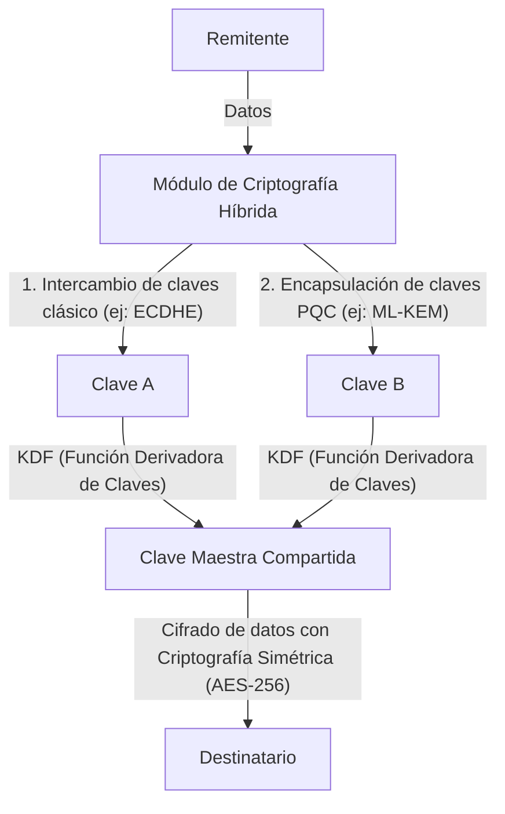

# Migración Práctica a PQC: Inventario de Criptografía y Criptoagilidad

La sociedad digital moderna depende en gran medida de la infraestructura de clave pública (PKI). Todo el fundamento de la confianza digital, como la banca por Internet, la transmisión de datos confidenciales y la firma de software, está garantizado por tecnologías criptográficas basadas en la dificultad matemática, como RSA y la criptografía de curva elíptica (ECC). Sin embargo, con el surgimiento de las computadoras cuánticas, estas tecnologías de encriptación se enfrentan a amenazas sin precedentes.

En este artículo, exploraremos en profundidad las estrategias de migración hacia la Criptografía Post-Cuántica (PQC) para prepararnos para la inminente era cuántica. Nos centraremos en las últimas tendencias de estandarización del NIST (Instituto Nacional de Estándares y Tecnología de EE. UU.), los fundamentos matemáticos de la criptografía basada en retículos, los procedimientos que deben seguir las empresas para crear un inventario de activos criptográficos (CBOM) y el diseño de sistemas que garanticen la criptoagilidad (agilidad criptográfica).

## La Amenaza de las Computadoras Cuánticas y el Algoritmo de Shor

Mientras que las computadoras clásicas procesan la información en bits de "0" y "1", las computadoras cuánticas utilizan "cúbits" (bits cuánticos) para realizar cálculos en paralelo, aprovechando propiedades de la mecánica cuántica como la superposición y el entrelazamiento. Esto les permite exhibir una capacidad de cálculo que supera a las computadoras clásicas en ciertos problemas.

Entre ellos, el más letal para la criptografía es el "Algoritmo de Shor", concebido por Peter Shor en 1994. Si se ejecuta en una Computadora Cuántica Criptográficamente Relevante (CRQC) tolerante a fallos y con el tamaño suficiente, el Algoritmo de Shor puede resolver el problema de la factorización de enteros y el problema del logaritmo discreto en tiempo polinómico.

El cifrado RSA depende de la dificultad de la factorización de enteros, y ECC (criptografía de curva elíptica) depende de la dificultad del problema del logaritmo discreto sobre curvas elípticas. Se dice que las longitudes de clave comúnmente utilizadas en la actualidad, como RSA-2048 y ECC-256, no podrían descifrarse ni siquiera dedicando más tiempo que la edad del universo con una computadora clásica. Sin embargo, frente a una computadora cuántica que implemente el algoritmo de Shor, podrían ser descifradas en tan solo unas horas o días.

### La Amenaza de "Harvest Now, Decrypt Later" (HNDL)

Es muy peligroso pensar que "todavía falta mucho para que las computadoras cuánticas se utilicen en la práctica, así que podemos posponer las contramedidas". Esto se debe a que los atacantes cibernéticos respaldados por estados y las organizaciones criminales avanzadas ya están recopilando y almacenando datos de comunicaciones cifradas en la actualidad.

Esta táctica se conoce como "Harvest Now, Decrypt Later" (Cosechar Ahora, Descifrar Después). Es una estrategia en la que, incluso si la tecnología de encriptación actual no se puede descifrar, los atacantes descifrarán los datos almacenados para obtener información confidencial cuando aparezcan computadoras cuánticas potentes dentro de unas décadas.

Secretos de estado, propiedad intelectual corporativa, datos médicos y otra información que debe mantener su confidencialidad durante décadas continuarán expuestos a la amenaza del HNDL a menos que comiencen a protegerse con PQC a partir de hoy.

## Proceso de Estandarización de PQC por el NIST y Últimas Tendencias

Para contrarrestar estas amenazas, el NIST inició el proceso de estandarización de PQC en 2016. Durante varios años, evaluaron y seleccionaron algoritmos propuestos por criptógrafos de todo el mundo, reduciendo las opciones desde la perspectiva de la seguridad y el rendimiento.

En 2024, el NIST publicó oficialmente los siguientes algoritmos de PQC principales como estándares:

1. **ML-KEM (Kyber)**: Estandarizado como FIPS 203. Se utiliza para la criptografía de clave pública y los Mecanismos de Encapsulación de Claves (KEM). Se caracteriza por un tamaño de clave relativamente pequeño y un procesamiento rápido, lo que lo hace adecuado para proteger el tráfico web general.
2. **ML-DSA (Dilithium)**: Estandarizado como FIPS 204. Se utiliza para algoritmos de firma digital. Permite una verificación de firma muy rápida y se recomienda para las principales aplicaciones de firmas digitales.
3. **SLH-DSA (SPHINCS+)**: Estandarizado como FIPS 205. Un algoritmo de firma digital basado en hash. Dado que no depende de la criptografía de retículos, actúa como respaldo en caso de que se quiebren los fundamentos matemáticos de ML-DSA, pero sus aplicaciones son limitadas debido al gran tamaño de su firma.
4. **FN-DSA (FALCON)**: Programado para una futura estandarización. Tiene firmas y claves públicas muy pequeñas, lo que lo hace adecuado para entornos con recursos de hardware limitados o comunicaciones con restricciones estrictas de protocolo.

### Fundamentos Matemáticos de la Criptografía Basada en Retículos (Lattice-based Cryptography)

Los estándares ML-KEM y ML-DSA tienen una base matemática conocida como "criptografía basada en retículos". Se considera que esta criptografía es resistente a los algoritmos cuánticos conocidos, como el algoritmo de Shor.

Un retículo es un conjunto de puntos discretos en un espacio n-dimensional, expresado por combinaciones lineales de vectores base. La seguridad de la criptografía de retículos se basa en problemas matemáticos como el "Problema del Vector Más Corto (SVP)" y el "Problema del Vector Más Cercano (CVP)".

Específicamente, ML-KEM utiliza variantes de estos problemas, como el "Problema de Aprendizaje con Errores (LWE: Learning With Errors)" y su derivado sobre anillos polinomiales, el "Problema Module-LWE". El problema LWE consiste en un sistema de ecuaciones lineales al que se le añade intencionadamente un pequeño ruido aleatorio (error). La presencia de este ruido hace que sea extremadamente difícil resolverlo de manera eficiente, tanto para las computadoras clásicas como para las cuánticas.

## Estrategia Práctica de Migración a PQC para Empresas: Inventario de Criptografía y CBOM

La transición a PQC no es "una simple tarea de sustitución de algoritmos". Los sistemas de TI modernos se han vuelto cada vez más complejos y es raro encontrar una empresa que tenga un conocimiento completo de dónde, qué algoritmos criptográficos se utilizan y con qué propósito.

El primer paso para la migración es un exhaustivo "inventario de activos criptográficos" (descubrimiento).

### 1. Creación de un Inventario Criptográfico

Visualice las tecnologías de cifrado utilizadas en todo el hardware, software, servicios en la nube y equipos de red de su organización. Esto incluye la siguiente información:

- Algoritmos utilizados (RSA, ECDSA, AES, etc.)
- Longitud de la clave (RSA-2048, AES-256, etc.)
- Propósito del cifrado (almacenamiento de datos, canal de comunicación, firma digital)
- Bibliotecas de las que depende (OpenSSL, Bouncy Castle, etc.) y sus versiones
- Ciclo de vida (fecha de caducidad de la clave, frecuencia de rotación)

### 2. Introducción de CBOM (Cryptography Bill of Materials)

CBOM (Lista de Materiales Criptográficos) es una extensión del concepto de SBOM (Software Bill of Materials) aplicado a la tecnología criptográfica. Un CBOM describe información detallada sobre las bibliotecas criptográficas, protocolos, algoritmos y certificados de los que dependen los componentes de software, en un formato legible por máquinas (como CycloneDX).

Al integrar CBOM en los pipelines de CI/CD, es posible detectar automáticamente algoritmos criptográficos heredados y vulnerables ocultos en el sistema, lo que permite un monitoreo continuo y una respuesta rápida.

## Criptoagilidad (Crypto Agility): La Agilidad de la Criptografía

Uno de los conceptos más importantes en la migración a PQC es la "criptoagilidad".

En el pasado, cuando funciones hash como MD5 y SHA-1 se vieron comprometidas, muchos sistemas tenían esos algoritmos codificados de forma rígida (hardcoded), lo que requirió enormes cantidades de tiempo y dinero (desde varios años hasta más de una década) para la transición. Tampoco se puede descartar por completo la posibilidad de que los nuevos algoritmos PQC puedan ser descifrados por nuevos algoritmos cuánticos en el futuro.

Por lo tanto, en lugar de depender fuertemente de un algoritmo específico, se requiere un "diseño de sistema que permita intercambiar algoritmos criptográficos de forma rápida y segura según sea necesario". Esto es la criptoagilidad.

### Diseño de Arquitectura para Lograr la Criptoagilidad

1. **Abstracción del Procesamiento Criptográfico**: En lugar de escribir un algoritmo específico directamente en el código de la aplicación, llámelo a través de una API (proveedor) criptográfica abstraída. Esto permite cambiar los algoritmos con solo modificar la configuración del proveedor criptográfico de fondo, sin necesidad de realizar cambios en la lógica de negocio.
2. **Flexibilidad en Certificados y Protocolos**: Diseñe el sistema para que maneje de forma transparente múltiples o nuevos OID (Identificadores de Objetos) en los certificados X.509 y el protocolo TLS.
3. **Gestión de Claves Centralizada**: Utilice servicios KMS (Key Management Service) o HSM (Hardware Security Module) que centralicen la generación, almacenamiento y rotación de claves, estableciendo un marco para aplicar rápidamente los cambios en la política criptográfica en toda la organización.

### Enfoque de Implementación de Criptografía Híbrida

Aunque los algoritmos PQC han sido estandarizados por el NIST, aún no han pasado por décadas de experiencia operativa en el mundo real (pruebas de batalla) como lo han hecho RSA o ECC. Se necesitan medidas de seguridad frente al riesgo de vulnerabilidades matemáticas desconocidas (por ejemplo, el caso en que el algoritmo SIKE fue descifrado en la ronda final de estandarización).

Por lo tanto, el enfoque recomendado es la "Criptografía Híbrida". Se trata de un enfoque que combina el uso conjunto de la criptografía clásica convencional (ECC o RSA) y los nuevos PQC (como ML-KEM).

La mayor ventaja de la criptografía híbrida es que, incluso si se descubre una vulnerabilidad fatal en el algoritmo PQC, la seguridad general del sistema se mantendrá (manteniendo el cumplimiento con FIPS) siempre que se garantice la seguridad de la criptografía clásica. A la inversa, si una computadora cuántica quiebra la criptografía clásica, la seguridad estará protegida mientras el PQC siga funcionando.

## Conclusión y Perspectivas Futuras

La aplicación práctica de las computadoras cuánticas, si bien aportará inmensos beneficios a la humanidad, también representa una grave amenaza que sacudirá los cimientos de la sociedad digital actual. La migración a PQC no es una simple actualización técnica, sino un proyecto de gestión de riesgos estratégico que afecta a la supervivencia misma de la organización.

Teniendo en cuenta la amenaza del HNDL, el límite de tiempo para la migración ya ha comenzado su cuenta regresiva. Las empresas deben comenzar inmediatamente a crear inventarios criptográficos y utilizar CBOM para comprender con precisión su situación actual. Luego, avanzar de manera planificada y continua hacia una arquitectura híbrida con la criptoagilidad en mente será un requisito absoluto para construir los negocios digitales seguros del futuro.
