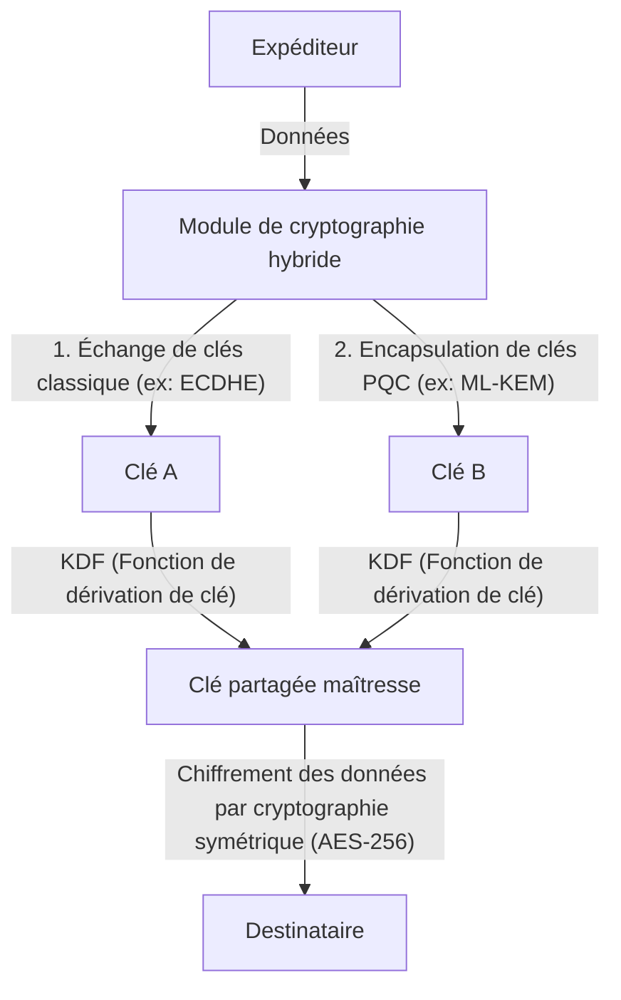

# Migration Pratique vers la Cryptographie Post-Quantique (PQC) : Inventaire des Actifs Cryptographiques et Agilité Cryptographique

La société numérique moderne dépend fortement de l'infrastructure à clé publique (PKI). Les services bancaires en ligne, la transmission de données confidentielles, les signatures de logiciels, et toutes les bases de la confiance numérique sont garantis par des technologies cryptographiques fondées sur la difficulté mathématique, telles que le RSA et la cryptographie sur les courbes elliptiques (ECC). Cependant, avec l'avènement des ordinateurs quantiques, ces technologies cryptographiques font face à une menace sans précédent.

Cet article explore en profondeur les stratégies de migration vers la Cryptographie Post-Quantique (PQC) pour se préparer à l'ère quantique à venir. Il se concentre sur les récentes tendances de standardisation du NIST (National Institute of Standards and Technology), les fondements mathématiques de la cryptographie basée sur les réseaux (lattice-based), les procédures de création d'un inventaire des actifs cryptographiques (CBOM) que les entreprises devraient adopter, et la conception de systèmes garantissant l'agilité cryptographique (crypto-agility).

## La menace des ordinateurs quantiques et l'algorithme de Shor

Alors que les ordinateurs classiques traitent l'information à l'aide de bits valant '0' et '1', les ordinateurs quantiques utilisent des 'qubits' et effectuent des calculs parallèles en exploitant des propriétés de la mécanique quantique comme la superposition et l'intrication quantique. Cela leur permet d'afficher une puissance de calcul qui surpasse celle des ordinateurs classiques pour certains problèmes spécifiques.

Parmi eux, l'algorithme de Shor, conçu par Peter Shor en 1994, est fatal pour les technologies cryptographiques. S'il est exécuté sur un ordinateur quantique tolérant aux pannes de taille suffisante (CRQC : Cryptographically Relevant Quantum Computer), l'algorithme de Shor peut résoudre les problèmes de factorisation de nombres premiers et de logarithme discret en temps polynomial.

Le chiffrement RSA repose sur la difficulté de la factorisation, tandis que l'ECC dépend de la difficulté du problème du logarithme discret sur des courbes elliptiques. Les longueurs de clé couramment utilisées aujourd'hui, telles que RSA-2048 et ECC-256, sont considérées comme impossibles à déchiffrer par les ordinateurs classiques, même avec un temps supérieur à l'âge de l'univers. Néanmoins, face à un ordinateur quantique implémentant l'algorithme de Shor, elles pourraient être décryptées en quelques heures ou quelques jours.

### La menace du "Harvest Now, Decrypt Later" (HNDL)

Il est extrêmement dangereux de penser : "La mise en pratique des ordinateurs quantiques est encore loin, donc les contre-mesures peuvent attendre". En effet, les cyberattaquants parrainés par des États et les organisations criminelles sophistiquées collectent et stockent continuellement des données de communication chiffrées dès aujourd'hui.

Cette méthode est appelée "Harvest Now, Decrypt Later" (HNDL - Récolter aujourd'hui, déchiffrer plus tard). C'est une stratégie qui consiste à conserver les données qui ne peuvent pas être déchiffrées avec la cryptographie actuelle, pour les décrypter et obtenir des informations confidentielles des décennies plus tard, lorsqu'un ordinateur quantique puissant fera son apparition.

Les données qui doivent rester confidentielles pendant des décennies, telles que les secrets d'État, la propriété intellectuelle des entreprises et les données médicales, resteront exposées à la menace HNDL si elles ne sont pas protégées par la PQC dès aujourd'hui.

## Le processus de standardisation de la PQC par le NIST et les dernières évolutions

Pour contrer de telles menaces, le NIST a lancé un processus de standardisation de la PQC en 2016. Sur plusieurs années, ils ont évalué et sélectionné des algorithmes proposés par des cryptographes du monde entier, en les filtrant du point de vue de la sécurité et des performances.

En 2024, le NIST a publié les principaux algorithmes PQC suivants en tant que normes officielles :

1. **ML-KEM (Kyber)** : Standardisé en tant que FIPS 203. Utilisé pour la cryptographie à clé publique et le mécanisme d'encapsulation de clé (KEM). Il se caractérise par des tailles de clé relativement petites et un traitement rapide, ce qui le rend adapté à la protection du trafic Web général.
2. **ML-DSA (Dilithium)** : Standardisé en tant que FIPS 204. Utilisé pour l'algorithme de signature numérique. Il permet une vérification de signature très rapide et est recommandé pour les principales applications de signature numérique.
3. **SLH-DSA (SPHINCS+)** : Standardisé en tant que FIPS 205. Algorithme de signature numérique basé sur le hachage. Ne dépendant pas de la cryptographie sur les réseaux, il sert de sauvegarde au cas où les fondements mathématiques du ML-DSA seraient brisés, mais ses applications sont limitées en raison de la grande taille de la signature.
4. **FN-DSA (FALCON)** : À standardiser prochainement. Les signatures et les clés publiques sont très petites, ce qui le rend adapté aux environnements où les ressources matérielles sont limitées ou aux communications avec des contraintes de protocole strictes.

### Fondements mathématiques de la cryptographie basée sur les réseaux (Lattice-based Cryptography)

Les normes ML-KEM et ML-DSA ont un fondement mathématique appelé "cryptographie basée sur les réseaux" (lattice-based cryptography). La cryptographie basée sur les réseaux est considérée comme résistante aux algorithmes quantiques connus tels que l'algorithme de Shor.

Un réseau (lattice) est un ensemble de points discrets dans un espace à n dimensions, représenté par une combinaison linéaire de vecteurs de base. La sécurité de la cryptographie basée sur les réseaux repose sur des problèmes mathématiques tels que le "Problème du vecteur le plus court" (SVP : Shortest Vector Problem) et le "Problème du vecteur le plus proche" (CVP : Closest Vector Problem).

En particulier, le ML-KEM utilise des variantes de ces problèmes appelées "Problème LWE" (Learning With Errors) et son dérivé sur l'anneau des polynômes, le "Problème Module-LWE". Le problème LWE consiste en un système d'équations linéaires auquel on ajoute intentionnellement un petit bruit aléatoire (erreur). La présence de ce bruit rend la résolution du système extrêmement difficile, que ce soit pour les ordinateurs classiques ou quantiques.

## Stratégie de migration PQC pratique pour les entreprises : Inventaire des actifs cryptographiques et CBOM

La migration vers la PQC n'est pas une "simple tâche de remplacement d'algorithme". Les systèmes informatiques modernes sont devenus complexes, et il est rare qu'une entreprise sache exactement où, quel algorithme cryptographique est utilisé, et à quelles fins.

La première étape de la migration est une "découverte" (inventaire) exhaustive des actifs cryptographiques.

### 1. Création d'un inventaire cryptographique

Visualisez les technologies cryptographiques utilisées dans l'ensemble du matériel, des logiciels, des services cloud et des équipements réseau de l'organisation. Cela inclut les informations suivantes :

- Algorithmes utilisés (RSA, ECDSA, AES, etc.)
- Longueurs de clés (RSA-2048, AES-256, etc.)
- Objectif du chiffrement (stockage des données, canal de communication, signature numérique)
- Bibliothèques dépendantes (OpenSSL, Bouncy Castle, etc.) et leurs versions
- Cycle de vie (date d'expiration de la clé, fréquence de rotation)

### 2. Introduction de la CBOM (Cryptography Bill of Materials)

La CBOM (Cryptography Bill of Materials) est une extension à la cryptographie du concept de SBOM (Software Bill of Materials), qui est une nomenclature des composants logiciels. La CBOM décrit des informations détaillées telles que les bibliothèques cryptographiques, les protocoles, les algorithmes et les certificats dont dépendent les composants logiciels, dans un format lisible par machine (comme CycloneDX).

En intégrant la CBOM dans les pipelines CI/CD, il devient possible de détecter automatiquement les anciens algorithmes cryptographiques vulnérables cachés dans le système, permettant une surveillance continue et une réponse rapide.

## Agilité Cryptographique (Crypto Agility)

L'un des concepts les plus importants de la migration PQC est l'"agilité cryptographique".

Par le passé, lorsque des fonctions de hachage telles que MD5 et SHA-1 ont été compromises, de nombreux systèmes avaient codé ces algorithmes en dur, de sorte que la migration a nécessité énormément de temps et de coûts, prenant des années, voire plus d'une décennie. Pour les nouveaux algorithmes PQC, on ne peut pas totalement exclure la possibilité qu'ils soient un jour déchiffrés par de nouveaux algorithmes quantiques.

C'est pourquoi, au lieu de dépendre fortement d'un algorithme spécifique, il est nécessaire d'avoir une "conception de système qui permet de remplacer rapidement et en toute sécurité les algorithmes cryptographiques selon les besoins". C'est cela l'agilité cryptographique.

### Conception d'architecture pour réaliser l'agilité cryptographique

1. **Abstraction du traitement cryptographique** : Au lieu d'écrire directement un algorithme spécifique dans le code de l'application, appelez-le via une API cryptographique (fournisseur) abstraite. Cela permet de changer d'algorithme simplement en modifiant la configuration du fournisseur de cryptographie en arrière-plan, sans modifier la logique métier.
2. **Flexibilité des certificats et protocoles** : Concevez le système pour traiter de manière transparente des OID (Object Identifiers) multiples ou nouveaux dans les certificats X.509 et le protocole TLS.
3. **Centralisation de la gestion des clés** : Utilisez un KMS (Key Management Service) ou un HSM (Hardware Security Module) pour gérer de manière centralisée la génération, le stockage et la rotation des clés, et mettez en place un système capable d'appliquer rapidement les modifications des politiques cryptographiques à l'ensemble de l'organisation.

### Approche de mise en œuvre de la cryptographie hybride

Bien que les algorithmes PQC aient été standardisés par le NIST, ils n'ont pas subi des décennies de tests dans le monde réel (battle-testing) comme le RSA ou l'ECC. Des mesures de sécurité sont nécessaires pour se prémunir contre le risque de découverte de vulnérabilités mathématiques inconnues (par exemple, le cas de l'algorithme SIKE qui a été brisé lors de la phase finale de la standardisation).

L'approche recommandée est donc la "cryptographie hybride" (Hybrid Cryptography). Il s'agit d'une approche qui combine à la fois la cryptographie classique conventionnelle (ECC, RSA) et la nouvelle PQC (ML-KEM, etc.).

Le plus grand avantage de la cryptographie hybride est que même si une vulnérabilité fatale est découverte dans l'algorithme PQC, tant que la sécurité de la cryptographie classique est garantie, la sécurité du système global est maintenue (maintien de la conformité FIPS). Inversement, même si la cryptographie classique est brisée par un ordinateur quantique, la sécurité est préservée si la PQC fonctionne.

## Conclusion et perspectives d'avenir

Si la mise en pratique des ordinateurs quantiques apportera d'immenses avantages à l'humanité, elle constitue également une menace majeure qui pourrait ébranler les fondations de notre société numérique actuelle. La migration vers la PQC n'est pas seulement une mise à jour technique, mais un projet stratégique de gestion des risques lié à la survie de l'organisation.

Compte tenu de la menace du HNDL, le compte à rebours pour la migration a déjà commencé. Les entreprises doivent commencer immédiatement à créer un inventaire cryptographique et utiliser la CBOM pour comprendre précisément leur situation actuelle. Ensuite, la planification et la mise en œuvre continues d'une migration vers une architecture hybride tenant compte de l'agilité cryptographique seront la condition absolue pour construire une activité numérique pérenne et sécurisée.
