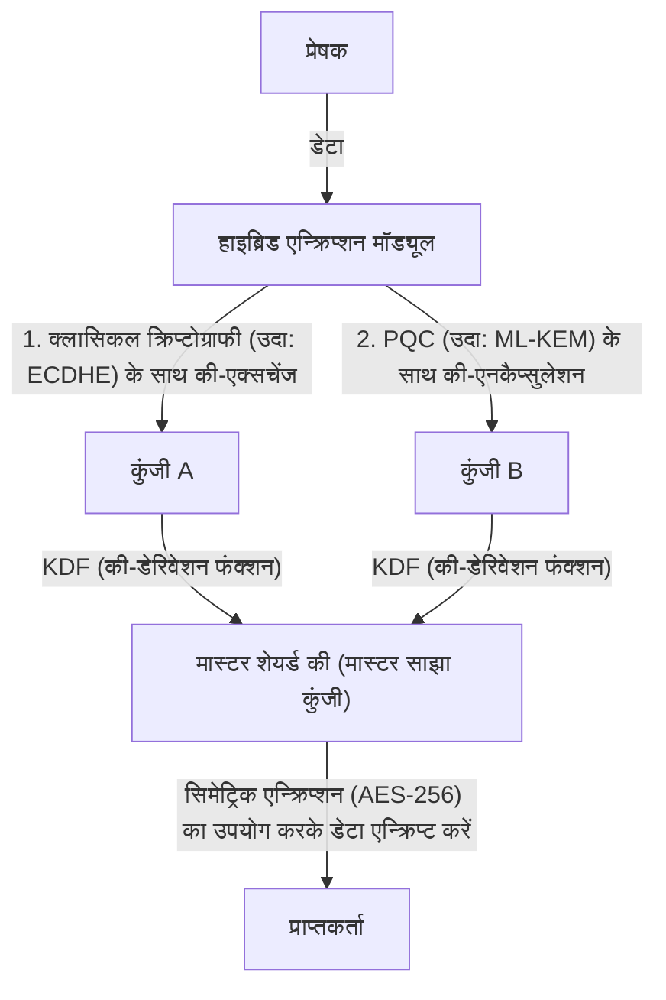

# व्यावहारिक PQC माइग्रेशन: क्रिप्टोग्राफिक एसेट इन्वेंट्री और क्रिप्टो एजिलिटी

आधुनिक डिजिटल समाज पब्लिक की इंफ्रास्ट्रक्चर (PKI) पर अत्यधिक निर्भर है। इंटरनेट बैंकिंग, गोपनीय डेटा का ट्रांसमिशन, और सॉफ्टवेयर पर हस्ताक्षर करने जैसे हर डिजिटल भरोसे का आधार RSA और एलिप्टिक कर्व क्रिप्टोग्राफी (ECC) जैसी गणितीय जटिलताओं पर आधारित एन्क्रिप्शन तकनीकों द्वारा सुरक्षित किया जाता है। हालांकि, क्वांटम कंप्यूटर के उदय के साथ, इन क्रिप्टोग्राफिक तकनीकों को अभूतपूर्व खतरे का सामना करना पड़ रहा है।

इस लेख में, हम आने वाले क्वांटम युग की तैयारी के लिए पोस्ट-क्वांटम क्रिप्टोग्राफी (PQC) में माइग्रेशन की रणनीतियों पर गहराई से चर्चा करेंगे। इसमें NIST (नेशनल इंस्टीट्यूट ऑफ स्टैंडर्ड्स एंड टेक्नोलॉजी) द्वारा नवीनतम मानकीकरण के रुझान, जाली (लैटिस) आधारित क्रिप्टोग्राफी के गणितीय आधार, उद्यमों के लिए क्रिप्टोग्राफिक एसेट इन्वेंट्री (CBOM) बनाने की प्रक्रिया, और क्रिप्टो एजिलिटी (क्रिप्टोग्राफी में चपलता) सुनिश्चित करने वाले सिस्टम डिज़ाइन पर ध्यान केंद्रित किया जाएगा।

## क्वांटम कंप्यूटर का खतरा और शोर (Shor) का एल्गोरिदम

जहाँ क्लासिकल कंप्यूटर '0' और '1' बिट्स का उपयोग करके जानकारी को प्रोसेस करते हैं, वहीं क्वांटम कंप्यूटर "क्वांटम बिट्स (क्यूबिट्स)" का उपयोग करते हैं, जो क्वांटम यांत्रिकी के गुणों जैसे सुपरपोज़िशन और क्वांटम इंटैंगलमेंट का लाभ उठाकर समानांतर गणनाएँ करते हैं। यह उन्हें विशिष्ट समस्याओं को हल करने में क्लासिकल कंप्यूटरों को पछाड़ने की अभूतपूर्व कंप्यूटिंग शक्ति प्रदान करता है।

इनमें से क्रिप्टोग्राफी के लिए सबसे घातक "शोर का एल्गोरिदम (Shor's algorithm)" है, जिसे 1994 में पीटर शोर द्वारा विकसित किया गया था। जब शोर के एल्गोरिदम को पर्याप्त पैमाने के फॉल्ट-टॉलरेंट क्वांटम कंप्यूटर (CRQC: Cryptographically Relevant Quantum Computer) पर चलाया जाता है, तो यह प्राइम फैक्टराइजेशन (अभाज्य गुणनखंडन) और डिस्क्रीट लॉगरिदम (असतत लघुगणक) जैसी समस्याओं को पॉलिनोमियल टाइम (बहुपद समय) में हल कर सकता है।

RSA एन्क्रिप्शन प्राइम फैक्टराइजेशन की कठिनाई पर निर्भर करता है, जबकि ECC (एलिप्टिक कर्व क्रिप्टोग्राफी) एलिप्टिक कर्व्स पर डिस्क्रीट लॉगरिदम समस्या की कठिनाई पर निर्भर है। वर्तमान में आमतौर पर उपयोग किए जाने वाले की-लेंथ (कुंजी की लंबाई) जैसे RSA-2048 और ECC-256 को क्लासिकल कंप्यूटरों द्वारा डिक्रिप्ट करने में ब्रह्मांड की आयु से अधिक समय लग सकता है। लेकिन, शोर के एल्गोरिदम को लागू करने वाले क्वांटम कंप्यूटर के सामने, इन्हें कुछ घंटों से लेकर कुछ दिनों के भीतर डिक्रिप्ट किया जा सकता है।

### "हार्वेस्ट नाउ, डिक्रिप्ट लेटर" (HNDL) का खतरा

यह सोचना बेहद खतरनाक है कि "क्वांटम कंप्यूटर का व्यावहारिक उपयोग अभी बहुत दूर है, इसलिए हमें सुरक्षा उपायों को बाद के लिए टाल देना चाहिए।" ऐसा इसलिए है क्योंकि राज्य-प्रायोजित साइबर हमलावर और उन्नत आपराधिक संगठन वर्तमान से ही एन्क्रिप्टेड संचार डेटा को लगातार एकत्र और सहेज रहे हैं।

इस तकनीक को "Harvest Now, Decrypt Later (अभी एकत्र करें, बाद में डिक्रिप्ट करें)" कहा जाता है। रणनीति यह है कि भले ही डेटा को वर्तमान एन्क्रिप्शन तकनीकों का उपयोग करके डिक्रिप्ट नहीं किया जा सके, लेकिन दशकों बाद जब शक्तिशाली क्वांटम कंप्यूटर सामने आएंगे, तब इस सहेजे गए डेटा को डिक्रिप्ट करके गोपनीय जानकारी प्राप्त की जा सकती है।

राष्ट्रीय रहस्य, कॉर्पोरेट बौद्धिक संपदा (IP), और चिकित्सा डेटा जैसी जानकारी, जिसे दशकों तक गोपनीय रखा जाना चाहिए, अगर आज से ही PQC द्वारा सुरक्षित नहीं की जाती है, तो वह लगातार HNDL के खतरे में बनी रहेगी।

## NIST द्वारा PQC मानकीकरण प्रक्रिया और नवीनतम रुझान

इस खतरे का मुकाबला करने के लिए, NIST ने 2016 में PQC मानकीकरण प्रक्रिया शुरू की। दुनिया भर के क्रिप्टोग्राफर्स द्वारा प्रस्तावित एल्गोरिदम का कई वर्षों तक मूल्यांकन और चयन किया गया, और उन्हें सुरक्षा और प्रदर्शन के दृष्टिकोण से छांटा गया।

और 2024 में, NIST ने आधिकारिक मानकों के रूप में निम्नलिखित प्रमुख PQC एल्गोरिदम जारी किए:

1. **ML-KEM (Kyber)**: FIPS 203 के रूप में मानकीकृत। इसका उपयोग पब्लिक की क्रिप्टोग्राफी और की एनकैप्सुलेशन मैकेनिज्म (KEM) के लिए किया जाता है। इसमें अपेक्षाकृत छोटा की-साइज और तेज प्रोसेसिंग होती है, जो इसे सामान्य वेब ट्रैफिक आदि की सुरक्षा के लिए उपयुक्त बनाती है।
2. **ML-DSA (Dilithium)**: FIPS 204 के रूप में मानकीकृत। इसका उपयोग डिजिटल सिग्नेचर एल्गोरिदम के लिए किया जाता है। यह अत्यंत तीव्र सिग्नेचर सत्यापन (वेरिफिकेशन) को सक्षम करता है और प्रमुख डिजिटल सिग्नेचर अनुप्रयोगों के लिए अनुशंसित है।
3. **SLH-DSA (SPHINCS+)**: FIPS 205 के रूप में मानकीकृत। यह एक हैश-आधारित डिजिटल सिग्नेचर एल्गोरिदम है। चूँकि यह लैटिस (जाली) क्रिप्टोग्राफी पर निर्भर नहीं करता है, यह ML-DSA के गणितीय आधार के टूटने की स्थिति में बैकअप के रूप में कार्य करता है। हालांकि, बड़े सिग्नेचर साइज के कारण इसके उपयोग सीमित हैं।
4. **FN-DSA (FALCON)**: भविष्य में मानकीकृत किए जाने की योजना है। इसके सिग्नेचर और पब्लिक की बहुत छोटे होते हैं, जो इसे सीमित हार्डवेयर संसाधनों वाले वातावरण या सख्त प्रोटोकॉल प्रतिबंधों वाले संचार के लिए उपयुक्त बनाते हैं।

### लैटिस-आधारित क्रिप्टोग्राफी (Lattice-based Cryptography) का गणितीय आधार

मानकीकृत ML-KEM और ML-DSA का गणितीय आधार "लैटिस-आधारित क्रिप्टोग्राफी" है। माना जाता है कि लैटिस क्रिप्टोग्राफी ज्ञात क्वांटम एल्गोरिदम जैसे शोर के एल्गोरिदम के प्रति प्रतिरोधी (रेसिस्टेंट) है।

लैटिस, n-आयामी (n-dimensional) स्थान में असतत (डिस्क्रीट) बिंदुओं का एक सेट है, जिसे बेसिस वेक्टर्स के लीनियर कॉम्बिनेशन द्वारा दर्शाया जाता है। लैटिस क्रिप्टोग्राफी की सुरक्षा "शॉर्टेस्ट वेक्टर प्रॉब्लम (SVP)" और "क्लोजेस्ट वेक्टर प्रॉब्लम (CVP)" जैसी गणितीय समस्याओं पर आधारित है।

विशेष रूप से, ML-KEM आदि में, इन समस्याओं के वेरिएंट्स जैसे "LWE प्रॉब्लम (Learning With Errors)" और पॉलिनोमियल रिंग्स पर इसके डेरिवेटिव "Module-LWE प्रॉब्लम" का उपयोग किया जाता है। LWE समस्या मूल रूप से एक-साथ रेखीय समीकरणों (simultaneous linear equations) का एक सेट है जिसमें जानबूझकर छोटा यादृच्छिक शोर (त्रुटि) जोड़ा जाता है। इस शोर की उपस्थिति इसे क्लासिकल और क्वांटम दोनों कंप्यूटरों के लिए कुशलता से हल करना बेहद मुश्किल बना देती है।

## उद्यमों के लिए व्यावहारिक PQC माइग्रेशन रणनीति: क्रिप्टोग्राफिक एसेट इन्वेंट्री और CBOM

PQC में माइग्रेट करना "केवल एल्गोरिदम को बदलने का एक साधारण काम" नहीं है। आधुनिक आईटी प्रणालियाँ काफी जटिल हो गई हैं, और ऐसे उद्यम दुर्लभ हैं जो पूरी तरह से समझते हों कि कौन से क्रिप्टोग्राफिक एल्गोरिदम का उपयोग कहाँ और किस उद्देश्य से किया जा रहा है।

माइग्रेशन का पहला कदम गहन "क्रिप्टोग्राफिक एसेट्स की इन्वेंट्री (डिस्कवरी)" है।

### 1. क्रिप्टोग्राफिक इन्वेंट्री का निर्माण

संगठन के भीतर सभी हार्डवेयर, सॉफ्टवेयर, क्लाउड सेवाओं और नेटवर्क उपकरणों में उपयोग की जाने वाली क्रिप्टोग्राफिक तकनीकों को विज़ुअलाइज़ (दृष्टिगोचर) करें। इसमें निम्नलिखित जानकारी शामिल है:

- उपयोग किए जा रहे एल्गोरिदम (RSA, ECDSA, AES आदि)
- की-लेंथ (कुंजी की लंबाई) (RSA-2048, AES-256 आदि)
- एन्क्रिप्शन का उद्देश्य (डेटा स्टोरेज, संचार चैनल, डिजिटल सिग्नेचर)
- आश्रित लाइब्रेरीज़ (OpenSSL, Bouncy Castle आदि) और उनके संस्करण
- जीवनचक्र (की-एक्सपायरी डेट, रोटेशन की आवृत्ति)

### 2. CBOM (Cryptography Bill of Materials) को अपनाना

CBOM (क्रिप्टोग्राफी बिल ऑफ मटेरियल्स) सॉफ्टवेयर बिल ऑफ मटेरियल्स (SBOM) की अवधारणा का क्रिप्टोग्राफिक तकनीकों तक विस्तार है। CBOM सॉफ्टवेयर घटकों पर निर्भर क्रिप्टोग्राफिक लाइब्रेरीज़, प्रोटोकॉल, एल्गोरिदम और प्रमाणपत्रों की विस्तृत जानकारी को मशीन-पठनीय प्रारूप (जैसे CycloneDX) में वर्णित करता है।

CBOM को CI/CD पाइपलाइन में एकीकृत करके, सिस्टम में छिपे कमज़ोर और पुराने क्रिप्टोग्राफिक एल्गोरिदम का स्वचालित रूप से पता लगाया जा सकता है, जिससे निरंतर निगरानी और त्वरित प्रतिक्रिया संभव हो पाती है।

## क्रिप्टो एजिलिटी (Crypto Agility): क्रिप्टोग्राफी में चपलता

PQC माइग्रेशन में सबसे महत्वपूर्ण अवधारणाओं में से एक "क्रिप्टो एजिलिटी (क्रिप्टोग्राफी में चपलता)" है।

अतीत में, जब MD5 और SHA-1 जैसे हैश फ़ंक्शंस से समझौता किया गया था (कमज़ोर पड़ गए थे), तो कई प्रणालियों ने इन एल्गोरिदम को हार्डकोड कर दिया था, जिसके परिणामस्वरूप माइग्रेशन में वर्षों या दशकों का समय और भारी लागत लगी। हम इस संभावना से पूरी तरह इनकार नहीं कर सकते कि भविष्य में नए PQC एल्गोरिदम भी नए क्वांटम एल्गोरिदम द्वारा क्रैक किए जा सकते हैं।

इसलिए, किसी विशिष्ट एल्गोरिदम पर बहुत अधिक निर्भर होने के बजाय, ऐसे "सिस्टम डिज़ाइन की आवश्यकता है जो आवश्यकता पड़ने पर क्रिप्टोग्राफिक एल्गोरिदम को जल्दी और सुरक्षित रूप से बदल सके।" यही क्रिप्टो एजिलिटी है।

### क्रिप्टो एजिलिटी प्राप्त करने के लिए आर्किटेक्चर डिज़ाइन

1. **क्रिप्टोग्राफिक प्रोसेसिंग का एब्स्ट्रैक्शन (अमूर्तीकरण)**: एप्लिकेशन कोड में किसी विशिष्ट एल्गोरिदम को सीधे लिखने के बजाय, इसे एब्स्ट्रैक्टेड क्रिप्टोग्राफिक API (प्रोवाइडर) के माध्यम से कॉल करें। यह आपको व्यावसायिक लॉजिक (बिज़नेस लॉजिक) को बदले बिना बैकएंड में क्रिप्टोग्राफ़िक प्रोवाइडर की सेटिंग्स को बदलकर एल्गोरिदम स्विच करने की अनुमति देता है।
2. **प्रमाणपत्र और प्रोटोकॉल में लचीलापन**: सिस्टम को इस तरह से डिज़ाइन करें कि वह X.509 प्रमाणपत्रों और TLS प्रोटोकॉल में कई या नए OID (ऑब्जेक्ट आइडेंटिफ़ायर) को पारदर्शी रूप से संभाल सके।
3. **की-मैनेजमेंट का केंद्रीकरण**: कुंजियों (कीज़) के निर्माण, भंडारण और रोटेशन को केंद्रीय रूप से प्रबंधित करने के लिए KMS (Key Management Service) या HSM (Hardware Security Module) का उपयोग करें, और एक ऐसी प्रणाली स्थापित करें जो पूरे संगठन में क्रिप्टोग्राफिक नीतियों में बदलाव को तुरंत लागू कर सके।

### हाइब्रिड क्रिप्टोग्राफी का कार्यान्वयन दृष्टिकोण

यद्यपि PQC एल्गोरिदम को NIST द्वारा मानकीकृत किया गया है, लेकिन वे RSA और ECC की तरह वास्तविक दुनिया के संचालन के दशकों (बैटल-टेस्टेड) से नहीं गुजरे हैं। हमें अज्ञात गणितीय कमजोरियों की खोज के जोखिम के खिलाफ सुरक्षा उपायों की आवश्यकता है (उदाहरण के लिए, जिस तरह से SIKE एल्गोरिदम मानकीकरण के अंतिम दौर में क्रैक किया गया था)।

इसलिए "हाइब्रिड क्रिप्टोग्राफी (Hybrid Cryptography)" की सिफारिश की जाती है। यह एक ऐसा दृष्टिकोण है जो पारंपरिक क्लासिकल क्रिप्टोग्राफी (ECC या RSA) और नए PQC (जैसे ML-KEM) दोनों के संयोजन का उपयोग करता है।

हाइब्रिड क्रिप्टोग्राफी का सबसे बड़ा लाभ यह है कि यदि PQC एल्गोरिदम में कोई महत्वपूर्ण भेद्यता (vulnerability) पाई जाती है, तब भी पूरे सिस्टम की सुरक्षा बनी रहती है (और यह FIPS अनुपालन बनाए रखता है) बशर्ते कि क्लासिकल क्रिप्टोग्राफी की सुरक्षा की गारंटी हो। इसके विपरीत, यदि क्वांटम कंप्यूटर द्वारा क्लासिकल क्रिप्टोग्राफी को क्रैक कर लिया जाता है, तब भी अगर PQC काम कर रहा है तो सुरक्षा बनी रहेगी।

## निष्कर्ष और भविष्य की संभावनाएं

जबकि क्वांटम कंप्यूटर का व्यावहारिक अनुप्रयोग मानवता के लिए भारी लाभ लाएगा, यह वर्तमान डिजिटल समाज की नींव को हिला देने वाला एक गंभीर खतरा भी है। PQC में माइग्रेशन केवल एक तकनीकी अपडेट नहीं है, बल्कि एक रणनीतिक जोखिम प्रबंधन परियोजना है जो संगठन के अस्तित्व के लिए आवश्यक है।

HNDL के खतरे को देखते हुए, माइग्रेशन की समय सीमा की उलटी गिनती पहले ही शुरू हो चुकी है। उद्यमों को तुरंत क्रिप्टोग्राफिक इन्वेंट्री बनाना शुरू कर देना चाहिए और वर्तमान स्थिति को सटीक रूप से समझने के लिए CBOM का लाभ उठाना चाहिए। इसके बाद, क्रिप्टो एजिलिटी को ध्यान में रखते हुए हाइब्रिड आर्किटेक्चर में एक नियोजित और निरंतर माइग्रेशन सुरक्षित भविष्य के डिजिटल व्यवसाय के निर्माण के लिए एक परम शर्त होगी।
