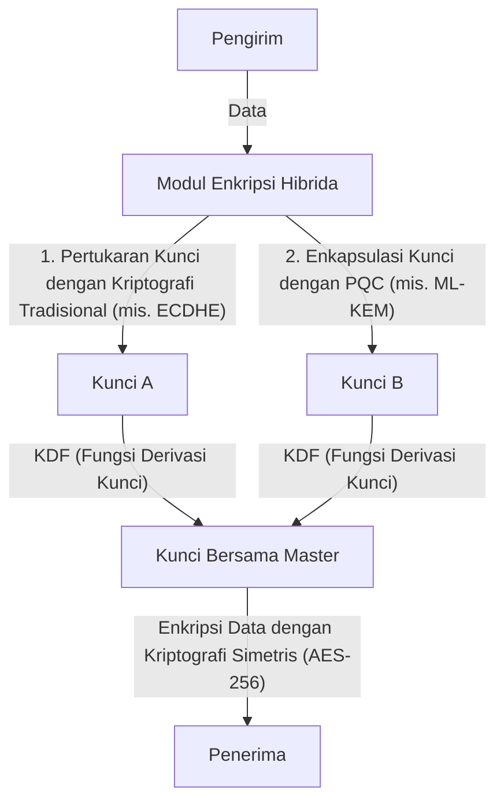

# Transisi PQC Praktis: Inventarisasi Aset Kriptografi dan Kripto-Agility

Masyarakat digital modern sangat bergantung pada Infrastruktur Kunci Publik (PKI). Inti dari segala kepercayaan digital—seperti internet banking, pengiriman dan penerimaan data rahasia, hingga tanda tangan perangkat lunak—dijamin oleh teknologi kriptografi yang berdasarkan pada tingkat kesulitan matematis, seperti RSA dan Kriptografi Kurva Eliptik (ECC). Namun, dengan munculnya komputer kuantum, teknologi kriptografi ini menghadapi ancaman yang belum pernah terjadi sebelumnya.

Dalam artikel ini, kita akan menggali lebih dalam mengenai strategi transisi ke Kriptografi Pasca-Kuantum (Post-Quantum Cryptography: PQC) untuk bersiap menghadapi era kuantum yang akan datang. Fokus utama kita mencakup tren standardisasi terbaru dari NIST (Institut Nasional Standar dan Teknologi AS), dasar matematis dari kriptografi berbasis kisi (lattice-based cryptography), langkah-langkah pembuatan inventaris aset kriptografi (CBOM) yang harus diambil oleh perusahaan, serta desain sistem yang menjamin kripto-agility (ketangkasan kriptografi).

## Ancaman Komputer Kuantum dan Algoritma Shor

Sementara komputer klasik memproses informasi dengan bit "0" dan "1", komputer kuantum menggunakan "qubit" (quantum bit) dan memanfaatkan sifat mekanika kuantum seperti superposisi dan keterikatan kuantum (quantum entanglement) untuk melakukan komputasi paralel. Hal ini memungkinkannya untuk menunjukkan kemampuan komputasi yang jauh melampaui komputer klasik dalam memecahkan masalah tertentu.

Di antara berbagai ancaman tersebut, yang paling fatal bagi teknologi kriptografi adalah "Algoritma Shor" yang digagas oleh Peter Shor pada tahun 1994. Jika dijalankan pada komputer kuantum toleran kesalahan berskala memadai (CRQC: Cryptographically Relevant Quantum Computer), Algoritma Shor mampu memecahkan masalah faktorisasi prima dan masalah logaritma diskrit dalam waktu polinomial.

Kriptografi RSA bergantung pada kesulitan pemfaktoran prima, sedangkan ECC bergantung pada kesulitan masalah logaritma diskrit pada kurva eliptik. Panjang kunci yang umum digunakan saat ini, seperti RSA-2048 dan ECC-256, dianggap mustahil untuk dipecahkan oleh komputer klasik meskipun membutuhkan waktu lebih lama dari usia alam semesta. Namun, di hadapan komputer kuantum yang mengimplementasikan Algoritma Shor, kunci-kunci tersebut dapat dipecahkan hanya dalam hitungan jam hingga beberapa hari saja.

### Ancaman "Harvest Now, Decrypt Later" (HNDL)

Sangat berbahaya jika beranggapan bahwa "penerapan praktis komputer kuantum masih lama, jadi penanganannya bisa ditunda". Hal ini dikarenakan penyerang siber yang didukung oleh negara atau organisasi kriminal tingkat tinggi saat ini terus mengumpulkan dan menyimpan data komunikasi terenkripsi.

Metode ini disebut "Harvest Now, Decrypt Later (Panen Sekarang, Dekripsi Nanti)". Meskipun tidak dapat didekripsi dengan teknologi kriptografi saat ini, strateginya adalah mendapatkan informasi rahasia dengan mendekripsi data yang disimpan tersebut saat komputer kuantum yang kuat muncul beberapa dekade dari sekarang.

Data yang kerahasiaannya harus dijaga selama beberapa dekade—seperti rahasia negara, kekayaan intelektual perusahaan, dan data medis—akan terus terpapar ancaman HNDL jika tidak dilindungi oleh PQC mulai hari ini.

## Proses Standardisasi PQC oleh NIST dan Tren Terbaru

Untuk melawan ancaman tersebut, NIST memulai proses standardisasi PQC pada tahun 2016. Mereka telah mengevaluasi dan menyeleksi algoritma yang diusulkan oleh para ahli kriptografi dari seluruh dunia selama beberapa tahun, serta menyaringnya dari sudut pandang keamanan dan kinerja.

Kemudian pada tahun 2024, NIST secara resmi memublikasikan algoritma PQC utama berikut sebagai standar resmi:

1. **ML-KEM (Kyber)**: Distandardisasi sebagai FIPS 203. Digunakan untuk kriptografi kunci publik dan mekanisme enkapsulasi kunci (KEM). Karakteristiknya adalah ukuran kunci yang relatif kecil dan pemrosesan berkecepatan tinggi, sehingga cocok untuk melindungi lalu lintas web secara umum.
2. **ML-DSA (Dilithium)**: Distandardisasi sebagai FIPS 204. Digunakan untuk algoritma tanda tangan digital. Algoritma ini memungkinkan verifikasi tanda tangan yang sangat cepat dan direkomendasikan untuk penggunaan tanda tangan digital utama.
3. **SLH-DSA (SPHINCS+)**: Distandardisasi sebagai FIPS 205. Algoritma tanda tangan digital berbasis hash. Karena tidak bergantung pada kriptografi berbasis kisi, ini berfungsi sebagai cadangan jika basis matematis ML-DSA berhasil dipecahkan, namun penggunaannya terbatas karena ukuran tanda tangannya yang besar.
4. **FN-DSA (FALCON)**: Direncanakan untuk distandardisasi di masa mendatang. Ukuran tanda tangan dan kunci publiknya sangat kecil, sehingga cocok untuk lingkungan dengan sumber daya perangkat keras terbatas atau komunikasi dengan batasan protokol yang ketat.

### Dasar Matematis Kriptografi Berbasis Kisi (Lattice-based Cryptography)

ML-KEM dan ML-DSA yang telah distandardisasi memiliki fondasi matematis yang disebut "kriptografi berbasis kisi" (lattice cryptography). Kriptografi berbasis kisi dianggap kebal terhadap algoritma kuantum yang telah diketahui seperti Algoritma Shor.

Kisi adalah himpunan titik-titik diskrit dalam ruang n-dimensi yang diekspresikan oleh kombinasi linear vektor basis. Dasar keamanan kriptografi berbasis kisi adalah masalah matematis seperti "Masalah Vektor Terpendek" (SVP: Shortest Vector Problem) dan "Masalah Vektor Terdekat" (CVP: Closest Vector Problem).

Khususnya pada ML-KEM dan sejenisnya, digunakan varian dari masalah ini, yaitu "Masalah LWE" (Learning With Errors) dan turunannya pada gelanggang polinomial (polynomial ring) yang disebut "Masalah Module-LWE". Masalah LWE adalah sistem persamaan linear yang secara sengaja ditambahkan derau (kesalahan) acak kecil. Keberadaan derau ini membuatnya sangat sulit untuk dipecahkan secara efisien, baik oleh komputer klasik maupun komputer kuantum.

## Strategi Transisi PQC Praktis untuk Perusahaan: Inventarisasi Aset Kriptografi dan CBOM

Transisi ke PQC bukanlah sekadar "tugas sederhana mengganti algoritma". Sistem TI modern sangatlah kompleks, dan jarang ada perusahaan yang benar-benar memahami sepenuhnya di mana, algoritma kriptografi apa, dan untuk tujuan apa suatu kriptografi digunakan.

Langkah pertama dalam transisi ini adalah "inventarisasi (penemuan) aset kriptografi" yang menyeluruh.

### 1. Pembuatan Inventaris Kriptografi

Visualisasikan teknologi kriptografi yang digunakan di seluruh perangkat keras, perangkat lunak, layanan cloud, dan perangkat jaringan dalam organisasi. Ini mencakup informasi berikut:

- Algoritma yang digunakan (seperti RSA, ECDSA, AES)
- Panjang kunci (seperti RSA-2048, AES-256)
- Tujuan enkripsi (penyimpanan data, jalur komunikasi, tanda tangan digital)
- Pustaka (library) yang bergantung (seperti OpenSSL, Bouncy Castle) dan versinya
- Siklus hidup (masa berlaku kunci, frekuensi rotasi)

### 2. Implementasi CBOM (Cryptography Bill of Materials)

CBOM (Cryptography Bill of Materials) merupakan perluasan dari konsep SBOM (Software Bill of Materials) yang diterapkan pada teknologi kriptografi. CBOM mendeskripsikan secara detail informasi seperti pustaka kriptografi, protokol, algoritma, dan sertifikat yang menjadi ketergantungan komponen perangkat lunak dalam format yang dapat dibaca oleh mesin (seperti CycloneDX).

Dengan mengintegrasikan CBOM ke dalam alur (pipeline) CI/CD, perusahaan dapat mendeteksi secara otomatis algoritma kriptografi lawas yang rentan dan tersembunyi dalam sistem, sehingga memungkinkan pemantauan berkelanjutan dan respons cepat.

## Kripto-Agility (Crypto Agility): Ketangkasan Kriptografi

Salah satu konsep terpenting dalam transisi PQC adalah "Kripto-Agility" (Ketangkasan Kriptografi).

Di masa lalu, ketika fungsi hash seperti MD5 dan SHA-1 disusupi, banyak sistem meng-hardcode algoritma tersebut sehingga transisi membutuhkan waktu dan biaya yang sangat besar, memakan waktu bertahun-tahun bahkan belasan tahun. Tidak menutup kemungkinan bahwa algoritma PQC baru juga bisa dipecahkan oleh algoritma kuantum baru di masa depan.

Oleh karena itu, alih-alih sangat bergantung pada algoritma tertentu, diperlukan "desain sistem yang memungkinkan penggantian algoritma kriptografi dengan cepat dan aman sesuai kebutuhan". Inilah yang disebut Kripto-Agility.

### Desain Arsitektur untuk Mewujudkan Kripto-Agility

1. **Abstraksi Pemrosesan Kriptografi**: Jangan menulis algoritma tertentu secara langsung di dalam kode aplikasi, melainkan panggil melalui API (penyedia) kriptografi yang diabstraksi. Dengan ini, algoritma dapat diganti hanya dengan mengubah konfigurasi penyedia kriptografi di balik layar tanpa perlu mengubah logika bisnis.
2. **Fleksibilitas Sertifikat dan Protokol**: Rancang sistem agar dapat menangani berbagai OID (Object Identifier) atau OID baru secara transparan dalam sertifikat X.509 dan protokol TLS.
3. **Sentralisasi Manajemen Kunci**: Manfaatkan KMS (Key Management Service) atau HSM (Hardware Security Module) yang memusatkan manajemen pembuatan, penyimpanan, dan rotasi kunci, guna membangun struktur yang dapat menerapkan perubahan kebijakan kriptografi dengan cepat di seluruh organisasi.

### Pendekatan Implementasi Kriptografi Hibrida

Meskipun algoritma PQC telah distandardisasi oleh NIST, algoritma tersebut belum melalui uji operasional (battle-tested) puluhan tahun di dunia nyata layaknya RSA dan ECC. Langkah pengamanan tetap diperlukan terhadap risiko penemuan kerentanan matematis yang belum diketahui (misalnya kasus di mana algoritma SIKE berhasil dipecahkan pada putaran final standardisasi).

Oleh karena itu, pendekatan yang direkomendasikan adalah "Kriptografi Hibrida" (Hybrid Cryptography). Ini adalah pendekatan yang menggabungkan penggunaan kriptografi klasik tradisional (seperti ECC dan RSA) dengan PQC baru (seperti ML-KEM).

Keuntungan terbesar dari kriptografi hibrida adalah jika kerentanan fatal ditemukan pada algoritma PQC, keamanan sistem secara keseluruhan tetap terjaga selama keamanan kriptografi klasik masih terjamin (mempertahankan kepatuhan FIPS). Sebaliknya, meskipun kriptografi klasik dipecahkan oleh komputer kuantum, sistem tetap aman selama PQC masih berfungsi.

## Kesimpulan dan Prospek ke Depan

Penerapan praktis komputer kuantum akan membawa manfaat besar bagi umat manusia, namun di saat yang sama juga merupakan ancaman serius yang dapat mengguncang fondasi masyarakat digital saat ini. Transisi ke PQC bukanlah sekadar pembaruan teknis belaka, melainkan proyek manajemen risiko strategis yang berkaitan langsung dengan kelangsungan organisasi.

Mengingat ancaman HNDL, batas waktu transisi sebenarnya sudah mulai menghitung mundur. Perusahaan harus segera memulai pembuatan inventaris kriptografi dan memanfaatkan CBOM untuk memahami kondisi saat ini secara akurat. Kemudian, menjalankan transisi menuju arsitektur hibrida secara terencana dan berkelanjutan dengan mengutamakan kripto-agility akan menjadi syarat mutlak untuk membangun bisnis digital masa depan yang aman.
