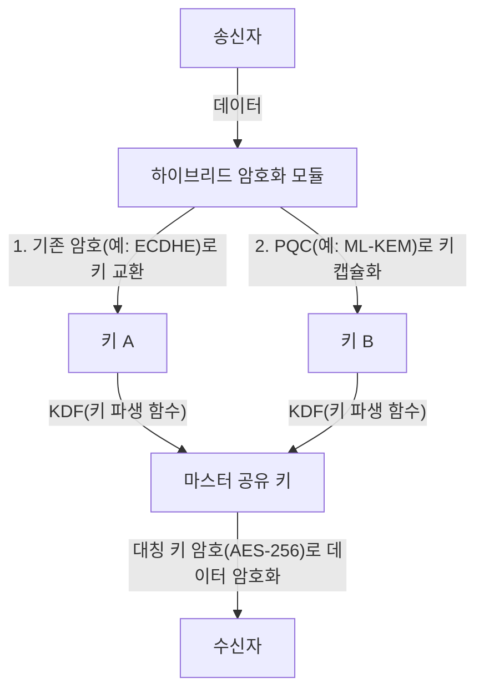

# 실전 PQC 마이그레이션: 암호 자산 인벤토리 및 크립토 어질리티

현대 디지털 사회는 공개키 암호 기반(PKI)에 크게 의존하고 있습니다. 인터넷 뱅킹, 기밀 데이터 송수신, 소프트웨어 서명 등 모든 디지털 신뢰의 근간은 RSA나 타원곡선암호(ECC)와 같은 수학적 난제에 기반한 암호 기술로 보장받고 있습니다. 그러나 양자 컴퓨터의 대두로 인해 이러한 암호 기술은 전례 없는 위협에 직면해 있습니다.

본 문서에서는 다가올 양자 시대에 대비하기 위한 양자 내성 암호(Post-Quantum Cryptography: PQC)로의 마이그레이션 전략에 대해, NIST(미국 국립표준기술연구소)의 최신 표준화 동향, 격자 기반 암호의 수학적 기반, 기업이 취해야 할 암호 자산 인벤토리(CBOM) 작성 절차, 그리고 크립토 어질리티(암호학적 민첩성)를 보장하는 시스템 설계에 초점을 맞추어 심도 있게 살펴봅니다.

## 양자 컴퓨터의 위협과 쇼어(Shor)의 알고리즘

고전 컴퓨터가 '0'과 '1'의 비트로 정보를 처리하는 반면, 양자 컴퓨터는 '양자 비트(큐비트)'를 사용하여 중첩이나 양자 얽힘과 같은 양자역학적 성질을 이용해 병렬 계산을 수행합니다. 이를 통해 특정 문제에서 고전 컴퓨터를 뛰어넘는 계산 능력을 발휘합니다.

그중에서도 암호 기술에 치명적인 것은 1994년 피터 쇼어(Peter Shor)가 고안한 '쇼어의 알고리즘(Shor's Algorithm)'입니다. 쇼어의 알고리즘은 충분한 규모의 오류 내성 양자 컴퓨터(CRQC: Cryptographically Relevant Quantum Computer)에서 실행될 경우, 소인수 분해 문제나 이산 로그 문제를 다항식 시간 내에 풀 수 있습니다.

RSA 암호는 소인수 분해의 난해함에, ECC(타원곡선암호)는 타원곡선 상의 이산 로그 문제의 난해함에 의존하고 있습니다. 현재 일반적으로 사용되는 RSA-2048이나 ECC-256과 같은 키 길이는 고전 컴퓨터로는 우주의 나이보다 긴 시간을 들여도 해독할 수 없다고 알려져 있지만, 쇼어의 알고리즘을 구현한 양자 컴퓨터 앞에서는 불과 몇 시간에서 며칠 만에 해독될 가능성이 있습니다.

### "Harvest Now, Decrypt Later" (HNDL)의 위협

'양자 컴퓨터가 상용화되는 것은 아직 먼 미래의 일이니 대책은 나중에 세워도 된다'라고 생각하는 것은 매우 위험합니다. 왜냐하면 국가의 지원을 받는 사이버 공격자나 고도화된 범죄 조직은 지금 이 순간에도 암호화된 통신 데이터를 계속해서 수집하고 저장하고 있기 때문입니다.

이러한 수법을 'Harvest Now, Decrypt Later(지금 수집하고, 나중에 해독한다)'라고 부릅니다. 현재의 암호 기술로는 해독할 수 없더라도, 수십 년 후 강력한 양자 컴퓨터가 등장했을 때 저장해 둔 데이터를 해독하여 기밀 정보를 얻어내겠다는 전략입니다.

국가 기밀, 기업의 지적 재산, 의료 데이터 등 수십 년에 걸쳐 기밀성을 유지해야 하는 데이터는 오늘부터라도 PQC로 보호되지 않는다면 HNDL 위협에 계속 노출될 수밖에 없습니다.

## NIST의 PQC 표준화 프로세스 및 최신 동향

이러한 위협에 대항하기 위해 NIST는 2016년에 PQC 표준화 프로세스를 시작했습니다. 전 세계 암호학자들로부터 제안받은 알고리즘을 수년에 걸쳐 평가 및 선별하고, 보안성과 성능 관점에서 후보를 좁혀 왔습니다.

그리고 2024년, NIST는 다음과 같은 주요 PQC 알고리즘을 공식 표준으로 발표했습니다.

1. **ML-KEM (Kyber)**: FIPS 203으로 표준화되었습니다. 공개키 암호 및 키 캡슐화 메커니즘(KEM)에 사용됩니다. 비교적 작은 키 크기와 빠른 처리 속도가 특징이며, 일반적인 웹 트래픽 보호 등에 적합합니다.
2. **ML-DSA (Dilithium)**: FIPS 204로 표준화되었습니다. 디지털 서명 알고리즘에 사용됩니다. 매우 빠른 서명 검증이 가능하며, 주요 디지털 서명 용도로 권장됩니다.
3. **SLH-DSA (SPHINCS+)**: FIPS 205로 표준화되었습니다. 해시 기반의 디지털 서명 알고리즘입니다. 격자 기반 암호에 의존하지 않으므로 ML-DSA의 수학적 기반이 뚫렸을 경우 백업 역할을 하지만, 서명 크기가 커서 용도가 제한적입니다.
4. **FN-DSA (FALCON)**: 향후 표준화될 예정입니다. 서명과 공개키가 매우 작아 하드웨어 리소스가 제한된 환경이나 프로토콜 제약이 엄격한 통신에 적합합니다.

### 격자 기반 암호(Lattice-based Cryptography)의 수학적 기반

표준화된 ML-KEM이나 ML-DSA는 '격자 기반 암호'라는 수학적 기반을 가지고 있습니다. 격자 기반 암호는 쇼어의 알고리즘과 같이 알려진 양자 알고리즘에 대해 내성을 갖는 것으로 알려져 있습니다.

격자란 n차원 공간의 이산적인 점들의 집합으로, 기저 벡터들의 선형 결합으로 표현됩니다. 격자 기반 암호의 안전성 근거가 되는 것은 '최단 벡터 문제(SVP: Shortest Vector Problem)'나 '최근접 벡터 문제(CVP: Closest Vector Problem)'와 같은 수학적 문제입니다.

특히 ML-KEM 등에서는 이러한 문제의 변형인 'LWE 문제(Learning With Errors: 오차를 수반하는 학습 문제)'나 다항식 환 상의 파생형인 'Module-LWE 문제'가 이용되고 있습니다. LWE 문제는 연립 1차 방정식에 의도적으로 작은 무작위 노이즈(오차)를 더한 것으로, 이 노이즈의 존재로 인해 고전 컴퓨터와 양자 컴퓨터 모두에서 효율적으로 푸는 것이 극도로 어려워집니다.

## 기업을 위한 실전 PQC 마이그레이션 전략: 암호 자산 인벤토리 및 CBOM

PQC로의 마이그레이션은 '알고리즘을 교체하기만 하면 되는 단순한 작업'이 아닙니다. 현대 IT 시스템은 매우 복잡해져서, 어디서 어떤 암호 알고리즘이 어떤 목적으로 사용되고 있는지 완벽하게 파악하고 있는 기업은 드뭅니다.

마이그레이션의 첫걸음은 철저한 '암호 자산 인벤토리 파악(디스커버리)'입니다.

### 1. 암호 인벤토리 작성

조직 내의 모든 하드웨어, 소프트웨어, 클라우드 서비스, 네트워크 장비에서 사용되고 있는 암호 기술을 시각화합니다. 여기에는 다음 정보가 포함됩니다.

- 사용 중인 알고리즘 (RSA, ECDSA, AES 등)
- 키 길이 (RSA-2048, AES-256 등)
- 암호화 목적 (데이터 저장, 통신 경로, 디지털 서명)
- 의존하는 라이브러리 (OpenSSL, Bouncy Castle 등) 및 해당 버전
- 라이프사이클 (키의 유효기간, 로테이션 주기)

### 2. CBOM (Cryptography Bill of Materials) 도입

소프트웨어 부품 명세서인 SBOM(Software Bill of Materials)의 개념을 암호 기술로 확장한 것이 CBOM(Cryptography Bill of Materials)입니다. CBOM은 소프트웨어 컴포넌트가 의존하는 암호 라이브러리, 프로토콜, 알고리즘, 인증서 등의 상세 정보를 기계 판독 가능한 포맷(CycloneDX 등)으로 기술한 것입니다.

CBOM을 CI/CD 파이프라인에 통합함으로써 시스템에 숨어 있는 취약하고 오래된 암호 알고리즘을 자동으로 감지하고, 지속적인 모니터링과 신속한 대응이 가능해집니다.

## 크립토 어질리티(Crypto Agility): 암호학적 민첩성

PQC 마이그레이션에서 가장 중요한 개념 중 하나가 '크립토 어질리티(암호학적 민첩성)'입니다.

과거 MD5나 SHA-1과 같은 해시 함수가 취약해졌을 때, 많은 시스템이 해당 알고리즘을 하드코딩하고 있었기 때문에 마이그레이션에 수년에서 십수 년이라는 막대한 시간과 비용이 소요되었습니다. 새로운 PQC 알고리즘 역시 미래에 새로운 양자 알고리즘에 의해 해독될 가능성을 완전히 배제할 수는 없습니다.

따라서 특정 알고리즘에 강하게 의존하는 것이 아니라, '필요에 따라 신속하고 안전하게 암호 알고리즘을 교체할 수 있는 시스템 설계'가 요구됩니다. 이것이 바로 크립토 어질리티입니다.

### 크립토 어질리티를 실현하는 아키텍처 설계

1. **암호 처리의 추상화**: 애플리케이션 코드 내에 특정 알고리즘을 직접 작성하는 대신, 추상화된 암호 API(프로바이더)를 거쳐 호출합니다. 이를 통해 비즈니스 로직을 변경하지 않고 백엔드의 암호 프로바이더 설정만 변경하여 알고리즘 교체가 가능해집니다.
2. **인증서 및 프로토콜의 유연성**: X.509 인증서나 TLS 프로토콜에서 여러 개 또는 새로운 OID(Object Identifier)를 투명하게 처리할 수 있도록 시스템을 설계합니다.
3. **키 관리의 중앙 집중화**: 키 생성, 저장, 로테이션을 일원화하여 관리하는 KMS(Key Management Service)나 HSM(Hardware Security Module)을 활용하여, 암호 정책 변경을 조직 전체에 신속하게 적용할 수 있는 체계를 갖춥니다.

### 하이브리드 암호 구현 접근법

PQC 알고리즘은 NIST에 의해 표준화되었다고는 하나, RSA나 ECC처럼 수십 세기에 걸친 실제 사회에서의 운용 실적(전투 테스트)을 거치지 않았습니다. 미지의 수학적 취약성이 발견될 위험(예를 들어, SIKE 알고리즘이 표준화 최종 라운드에서 해독된 사례)에 대비한 안전장치가 필요합니다.

그래서 권장되는 것이 '하이브리드 암호(Hybrid Cryptography)'입니다. 이는 기존의 고전 암호(ECC나 RSA)와 새로운 PQC(ML-KEM 등)를 결합하여 사용하는 접근 방식입니다.

하이브리드 암호의 가장 큰 장점은, 만약 PQC 알고리즘에 치명적인 취약점이 발견되더라도 고전 암호의 안전성이 보장된다면 시스템 전체의 안전성은 유지된다(FIPS 준수를 유지함)는 점입니다. 반대로 양자 컴퓨터에 의해 고전 암호가 뚫리더라도 PQC가 기능하고 있다면 안전성은 지켜집니다.

## 결론 및 향후 전망

양자 컴퓨터의 상용화는 인류에게 엄청난 혜택을 가져다주는 동시에, 현재 디지털 사회의 기반을 뒤흔드는 중대한 위협이기도 합니다. PQC로의 마이그레이션은 단순한 기술적 업데이트가 아니라 조직의 존속과 관련된 전략적 위험 관리 프로젝트입니다.

HNDL의 위협을 고려한다면 마이그레이션 기한은 이미 카운트다운을 시작했습니다. 기업은 즉시 암호 인벤토리 작성에 착수하고, CBOM을 활용하여 현황을 정확히 파악해야 합니다. 그리고 크립토 어질리티를 염두에 둔 하이브리드 아키텍처로의 마이그레이션을 계획적이고 지속적으로 추진하는 것이 안전한 미래 디지털 비즈니스를 구축하기 위한 절대 조건이 될 것입니다.
