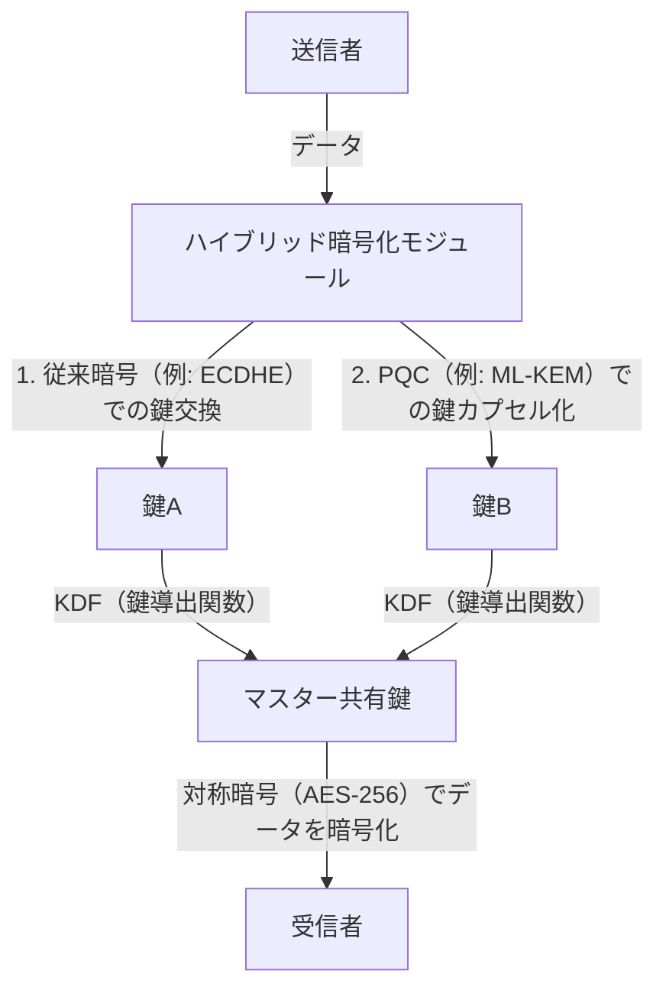

# 実践的PQC移行：暗号資産棚卸しとクリプトアジリティ

現代のデジタル社会は、公開鍵暗号基盤（PKI）に強く依存しています。インターネットバンキング、機密データの送受信、ソフトウェアの署名など、あらゆるデジタルな信頼の根幹はRSAや楕円曲線暗号（ECC）といった数学的困難性に基づく暗号技術によって担保されています。しかし、量子コンピュータの台頭により、これらの暗号技術はかつてない脅威に直面しています。

本記事では、来るべき量子時代に備えるための耐量子計算機暗号（Post-Quantum Cryptography: PQC）への移行戦略について、NIST（米国国立標準技術研究所）による最新の標準化動向、格子暗号の数学的基盤、企業が取るべき暗号資産のインベントリ（CBOM）作成手順、そしてクリプトアジリティ（暗号の俊敏性）を担保するシステム設計に焦点を当てて深く掘り下げます。

## 量子コンピュータの脅威とShorのアルゴリズム

古典コンピュータが「0」と「1」のビットで情報を処理するのに対し、量子コンピュータは「量子ビット（キュービット）」を用い、重ね合わせや量子もつれといった量子力学的な性質を利用して並列計算を行います。これにより、特定の問題において古典コンピュータを凌駕する計算能力を発揮します。

その中でも暗号技術にとって致命的なのが、1994年にピーター・ショアによって考案された「Shorのアルゴリズム」です。Shorのアルゴリズムは、十分な規模の誤り耐性量子コンピュータ（CRQC: Cryptographically Relevant Quantum Computer）上で実行された場合、素因数分解問題や離散対数問題を多項式時間で解くことができます。

RSA暗号は素因数分解の困難性に、ECC（楕円曲線暗号）は楕円曲線上の離散対数問題の困難性に依存しています。現在一般的に使用されているRSA-2048やECC-256といった鍵長は、古典コンピュータでは宇宙の年齢以上の時間をかけても解読できないとされていますが、Shorのアルゴリズムを実装した量子コンピュータの前では、わずか数時間から数日で解読される可能性があります。

### "Harvest Now, Decrypt Later"（HNDL）の脅威

「量子コンピュータが実用化されるのはまだ先の話だから、対策は後回しで良い」と考えるのは非常に危険です。なぜなら、国家を背景とするサイバー攻撃者や高度な犯罪組織は、現在から暗号化された通信データを収集・保存し続けているからです。

この手法は「Harvest Now, Decrypt Later（今収穫し、後で解読する）」と呼ばれます。現在の暗号技術では解読できなくても、数十年後に強力な量子コンピュータが登場した際に、保存しておいたデータを解読して機密情報を得るという戦略です。

国家機密、企業の知的財産、医療データなど、数十年間にわたって機密性を維持しなければならないデータは、今日からでもPQCによって保護されなければ、HNDLの脅威に晒され続けることになります。

## NISTによるPQC標準化プロセスと最新動向

このような脅威に対抗するため、NISTは2016年にPQCの標準化プロセスを開始しました。世界中の暗号学者から提案されたアルゴリズムを数年にわたって評価・選考し、安全性とパフォーマンスの観点から絞り込みを行ってきました。

そして2024年、NISTは以下の主要なPQCアルゴリズムを正式な標準として公開しました。

1. **ML-KEM (Kyber)**: FIPS 203として標準化。公開鍵暗号および鍵カプセル化メカニズム（KEM）に使用されます。比較的小さな鍵サイズと高速な処理が特徴で、一般的なWebトラフィックの保護などに適しています。
2. **ML-DSA (Dilithium)**: FIPS 204として標準化。デジタル署名アルゴリズムに使用されます。非常に高速な署名検証が可能であり、主要なデジタル署名の用途として推奨されています。
3. **SLH-DSA (SPHINCS+)**: FIPS 205として標準化。ハッシュベースのデジタル署名アルゴリズム。格子暗号に依存しないため、ML-DSAの数学的基盤が破られた場合のバックアップとしての役割を持ちますが、署名サイズが大きいため用途が限られます。
4. **FN-DSA (FALCON)**: 今後標準化予定。署名と公開鍵が非常に小さく、ハードウェアリソースが限られた環境や、プロトコルの制約が厳しい通信に適しています。

### 格子暗号（Lattice-based Cryptography）の数学的基盤

標準化されたML-KEMやML-DSAは、「格子暗号」という数学的基盤を持っています。格子暗号は、Shorのアルゴリズムのような既知の量子アルゴリズムに対して耐性があるとされています。

格子とは、n次元空間における離散的な点の集合であり、基底ベクトルの線形結合によって表現されます。格子暗号の安全性の根拠となるのは、「最短ベクトル問題（SVP: Shortest Vector Problem）」や「最近接ベクトル問題（CVP: Closest Vector Problem）」といった数学的問題です。

特にML-KEMなどでは、これらの問題の変種である「LWE問題（Learning With Errors: 誤差を伴う学習問題）」やその多項式環上の派生である「Module-LWE問題」が利用されています。LWE問題は、連立一次方程式に意図的に小さなランダムノイズ（誤差）を加えたものであり、このノイズの存在により、古典コンピュータでも量子コンピュータでも効率的に解くことが極めて困難になります。

## 企業向け実践的PQC移行戦略：暗号資産の棚卸しとCBOM

PQCへの移行は、「アルゴリズムを入れ替えるだけの単純な作業」ではありません。現代のITシステムは複雑化しており、どこで、どの暗号アルゴリズムが、どのような目的で使用されているかを完全に把握している企業は稀です。

移行の第一歩は、徹底した「暗号資産の棚卸し（ディスカバリー）」です。

### 1. 暗号インベントリの作成

組織内のすべてのハードウェア、ソフトウェア、クラウドサービス、ネットワーク機器において使用されている暗号技術を可視化します。これには以下の情報が含まれます。

- 使用されているアルゴリズム（RSA, ECDSA, AESなど）
- 鍵長（RSA-2048, AES-256など）
- 暗号化の目的（データ保存、通信路、デジタル署名）
- 依存しているライブラリ（OpenSSL, Bouncy Castleなど）とそのバージョン
- ライフサイクル（鍵の有効期限、ローテーションの頻度）

### 2. CBOM（Cryptography Bill of Materials）の導入

ソフトウェアの部品表であるSBOM（Software Bill of Materials）の概念を暗号技術に拡張したのが、CBOM（Cryptography Bill of Materials）です。CBOMは、ソフトウェアコンポーネントが依存している暗号ライブラリ、プロトコル、アルゴリズム、証明書などの詳細な情報を機械可読なフォーマット（CycloneDXなど）で記述したものです。

CBOMをCI/CDパイプラインに組み込むことで、システムに潜む脆弱な旧式の暗号アルゴリズムを自動的に検出し、継続的な監視と迅速な対応が可能になります。

## クリプトアジリティ（Crypto Agility）：暗号の俊敏性

PQC移行において最も重要な概念の一つが「クリプトアジリティ（暗号の俊敏性）」です。

過去において、MD5やSHA-1といったハッシュ関数が危殆化した際、多くのシステムがそれらのアルゴリズムをハードコードしていたため、移行に数年から十数年という膨大な時間とコストを要しました。新しいPQCアルゴリズムも、将来的に新たな量子アルゴリズムによって解読される可能性を完全に否定することはできません。

そのため、特定のアルゴリズムに強く依存するのではなく、「必要に応じて迅速かつ安全に暗号アルゴリズムを入れ替えられるシステム設計」が求められます。これがクリプトアジリティです。

### クリプトアジリティを実現するアーキテクチャ設計

1. **暗号処理の抽象化**: アプリケーションコード内に特定のアルゴリズムを直接記述するのではなく、抽象化された暗号API（プロバイダ）を経由して呼び出します。これにより、ビジネスロジックに変更を加えることなく、裏側の暗号プロバイダの設定を変更するだけでアルゴリズムの切り替えが可能になります。
2. **証明書とプロトコルの柔軟性**: X.509証明書やTLSプロトコルにおいて、複数または新しいOID（Object Identifier）を透過的に扱えるようにシステムを設計します。
3. **キーマネジメントの集中化**: 鍵の生成、保存、ローテーションを一元管理するKMS（Key Management Service）やHSM（Hardware Security Module）を活用し、暗号ポリシーの変更を組織全体に迅速に適用できる体制を整えます。

### ハイブリッド暗号の実装アプローチ

PQCアルゴリズムはNISTによって標準化されたとはいえ、RSAやECCのように数十年にわたる実社会での運用実績（バトルテスト）を経ていません。未知の数学的脆弱性が発見されるリスク（例えば、SIKEアルゴリズムが標準化の最終ラウンドで解読されたような事例）に対する安全策が必要です。

そこで推奨されるのが「ハイブリッド暗号（Hybrid Cryptography）」です。これは、従来の古典暗号（ECCやRSA）と新しいPQC（ML-KEMなど）の両方を組み合わせて使用するアプローチです。

ハイブリッド暗号の最大の利点は、もしPQCアルゴリズムに致命的な脆弱性が発見されても、古典暗号の安全性が担保されていればシステム全体としての安全性は維持される（FIPS準拠を保つ）点です。逆に、量子コンピュータによって古典暗号が破られても、PQCが機能していれば安全性は守られます。

## 結論と今後の展望

量子コンピュータの実用化は、人類に多大な恩恵をもたらす一方で、現在のデジタル社会の基盤を揺るがす重大な脅威でもあります。PQCへの移行は単なる技術的なアップデートではなく、組織の存続に関わる戦略的なリスク管理プロジェクトです。

HNDLの脅威を考慮すれば、移行のタイムリミットはすでにカウントダウンを始めています。企業は直ちに暗号インベントリの作成に着手し、CBOMを活用して現状を正確に把握する必要があります。そして、クリプトアジリティを念頭に置いたハイブリッドアーキテクチャへの移行を計画的かつ継続的に進めることが、安全な未来のデジタルビジネスを構築するための絶対条件となるでしょう。
