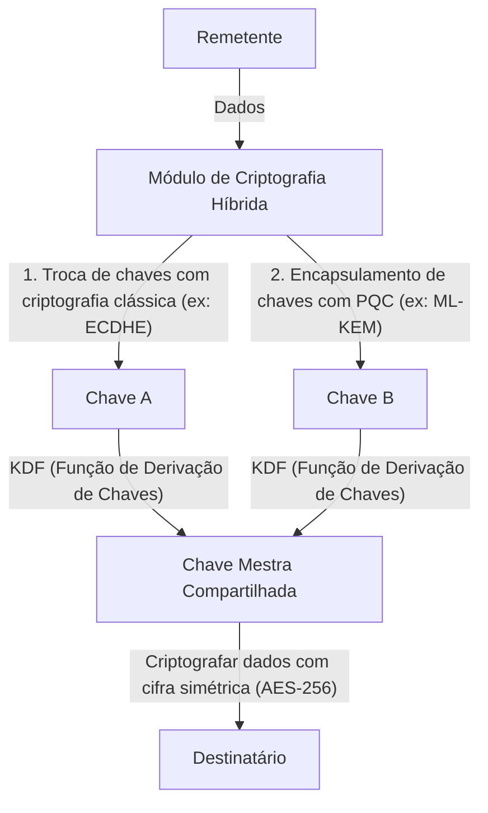

# Migração Prática para PQC: Inventário de Ativos Criptográficos e Cripto-Agilidade

A sociedade digital moderna depende fortemente da Infraestrutura de Chaves Públicas (PKI). Toda a base da confiança digital — desde o internet banking até a transmissão de dados confidenciais e assinatura de software — é garantida por tecnologias criptográficas baseadas em dificuldades matemáticas, como RSA e Criptografia de Curva Elíptica (ECC). No entanto, com a ascensão dos computadores quânticos, essas tecnologias criptográficas enfrentam uma ameaça sem precedentes.

Neste artigo, nos aprofundaremos na estratégia de migração para a Criptografia Pós-Quântica (PQC - Post-Quantum Cryptography) em preparação para a iminente era quântica. Focaremos nas tendências de padronização mais recentes do NIST (Instituto Nacional de Padrões e Tecnologia dos EUA), nos fundamentos matemáticos da criptografia baseada em reticulados, no procedimento que as empresas devem adotar para criar um inventário de ativos criptográficos (CBOM) e no projeto de sistemas para garantir a cripto-agilidade (agilidade criptográfica).

## A Ameaça dos Computadores Quânticos e o Algoritmo de Shor

Enquanto os computadores clássicos processam informações usando bits de "0" e "1", os computadores quânticos usam "qubits" (bits quânticos) e realizam cálculos paralelos aproveitando propriedades da mecânica quântica, como superposição e emaranhamento. Isso lhes permite exibir um poder de computação que supera os computadores clássicos na resolução de problemas específicos.

Entre essas capacidades, a mais fatal para a tecnologia criptográfica é o "Algoritmo de Shor", concebido por Peter Shor em 1994. Quando executado em um computador quântico tolerante a falhas em larga escala (CRQC: Cryptographically Relevant Quantum Computer), o Algoritmo de Shor pode resolver o problema de fatoração de inteiros e o problema do logaritmo discreto em tempo polinomial.

A criptografia RSA depende da dificuldade da fatoração de inteiros, e a ECC (Criptografia de Curva Elíptica) depende da dificuldade do problema do logaritmo discreto sobre curvas elípticas. Diz-se que os tamanhos de chave comumente usados hoje, como RSA-2048 e ECC-256, levariam mais tempo do que a idade do universo para serem decifrados por um computador clássico. Contudo, diante de um computador quântico executando o Algoritmo de Shor, eles poderiam ser decifrados em apenas algumas horas ou dias.

### A Ameaça de "Harvest Now, Decrypt Later" (HNDL)

É muito perigoso pensar que "a aplicação prática dos computadores quânticos ainda está longe, então podemos adiar as contramedidas". Isso porque cibercriminosos apoiados por estados-nação e organizações criminosas avançadas já estão coletando e armazenando dados de comunicação criptografados.

Essa tática é chamada de "Harvest Now, Decrypt Later" (Colha Agora, Descriptografe Depois). A estratégia envolve coletar dados que não podem ser decifrados com as tecnologias criptográficas atuais, para então, décadas depois — quando um poderoso computador quântico se tornar disponível —, descriptografar os dados armazenados e obter informações confidenciais.

Dados que devem permanecer confidenciais por décadas, como segredos de estado, propriedade intelectual corporativa e dados médicos, continuarão expostos à ameaça do HNDL se não forem protegidos pela PQC a partir de hoje.

## O Processo de Padronização de PQC do NIST e Tendências Recentes

Para combater tais ameaças, o NIST iniciou o processo de padronização de PQC em 2016. Ao longo de vários anos, eles avaliaram e selecionaram algoritmos propostos por criptógrafos de todo o mundo, refinando-os sob a perspectiva de segurança e desempenho.

Em 2024, o NIST publicou formalmente os seguintes algoritmos principais de PQC como padrões oficiais:

1. **ML-KEM (Kyber)**: Padronizado como FIPS 203. É usado para criptografia de chave pública e Mecanismos de Encapsulamento de Chave (KEM). Caracteriza-se por um tamanho de chave relativamente pequeno e processamento de alta velocidade, sendo adequado para proteger o tráfego geral da web, entre outras aplicações.
2. **ML-DSA (Dilithium)**: Padronizado como FIPS 204. É usado para algoritmos de assinatura digital. Permite a verificação de assinaturas em altíssima velocidade e é recomendado como o principal algoritmo para casos de uso de assinatura digital.
3. **SLH-DSA (SPHINCS+)**: Padronizado como FIPS 205. Um algoritmo de assinatura digital baseado em hash. Como não depende de criptografia baseada em reticulados, serve como backup caso os fundamentos matemáticos do ML-DSA sejam quebrados. No entanto, suas aplicações são limitadas devido ao grande tamanho da assinatura.
4. **FN-DSA (FALCON)**: Previsto para ser padronizado futuramente. Suas assinaturas e chaves públicas são muito pequenas, tornando-o adequado para ambientes com recursos de hardware limitados ou comunicações com restrições rigorosas de protocolo.

### O Fundamento Matemático da Criptografia Baseada em Reticulados (Lattice-based Cryptography)

Os algoritmos padronizados ML-KEM e ML-DSA têm como base matemática a "criptografia baseada em reticulados". Acredita-se que a criptografia baseada em reticulados seja resistente a algoritmos quânticos conhecidos, como o Algoritmo de Shor.

Um reticulado (lattice) é um conjunto discreto de pontos em um espaço n-dimensional, representado por combinações lineares de vetores de base. A segurança da criptografia baseada em reticulados fundamenta-se em problemas matemáticos como o "Problema do Vetor Mais Curto" (SVP: Shortest Vector Problem) e o "Problema do Vetor Mais Próximo" (CVP: Closest Vector Problem).

O ML-KEM, em particular, utiliza o "Problema LWE" (Learning With Errors: Aprendizado com Erros) e seu derivado em anéis polinomiais, o "Problema Module-LWE", que são variantes desses problemas. O problema LWE envolve sistemas de equações lineares aos quais se adiciona intencionalmente um pequeno ruído aleatório (erro). A presença desse ruído torna extremamente difícil a resolução eficiente do problema, tanto para computadores clássicos quanto para quânticos.

## Estratégia Prática de Migração PQC para Empresas: Inventário de Ativos Criptográficos e CBOM

Migrar para PQC não é uma "tarefa simples de apenas trocar algoritmos". Os sistemas de TI modernos tornaram-se complexos, e é raro encontrar uma empresa que tenha conhecimento total sobre onde, quais algoritmos criptográficos e para quais propósitos eles estão sendo usados.

O primeiro passo da migração é um "inventário de ativos criptográficos" (descoberta) minucioso.

### 1. Criação do Inventário Criptográfico

Você deve mapear e dar visibilidade às tecnologias criptográficas usadas em todo o hardware, software, serviços em nuvem e equipamentos de rede dentro da organização. Isso inclui as seguintes informações:

- Algoritmos utilizados (RSA, ECDSA, AES, etc.)
- Tamanho das chaves (RSA-2048, AES-256, etc.)
- Finalidade da criptografia (armazenamento de dados, canais de comunicação, assinaturas digitais)
- Bibliotecas dependentes (OpenSSL, Bouncy Castle, etc.) e suas versões
- Ciclo de vida (data de expiração da chave, frequência de rotação)

### 2. Introdução do CBOM (Cryptography Bill of Materials)

O CBOM (Lista de Materiais Criptográficos) é a extensão do conceito de SBOM (Software Bill of Materials — Lista de Materiais de Software) para tecnologias criptográficas. O CBOM descreve informações detalhadas sobre bibliotecas criptográficas, protocolos, algoritmos, certificados, entre outros, dos quais os componentes de software dependem, utilizando formatos legíveis por máquina (como o CycloneDX).

Ao integrar o CBOM ao pipeline de CI/CD, é possível detectar automaticamente algoritmos criptográficos antigos e vulneráveis ocultos no sistema, permitindo monitoramento contínuo e resposta rápida.

## Cripto-Agilidade (Crypto Agility): A Agilidade da Criptografia

Um dos conceitos mais importantes na migração para PQC é a "cripto-agilidade".

No passado, quando funções de hash como MD5 e SHA-1 foram comprometidas, muitos sistemas tinham esses algoritmos codificados de forma rígida (hardcoded), exigindo um tempo e custo enormes — de vários anos a mais de uma década — para realizar a migração. Da mesma forma, não podemos descartar completamente a possibilidade de que os novos algoritmos PQC venham a ser decifrados por novos algoritmos quânticos no futuro.

Portanto, em vez de depender fortemente de um algoritmo específico, é necessário ter "um projeto de sistema que permita a substituição de algoritmos criptográficos de forma rápida e segura, conforme a necessidade". Isso é a cripto-agilidade.

### Projeto de Arquitetura para Alcançar a Cripto-Agilidade

1. **Abstração do Processamento Criptográfico**: Em vez de escrever diretamente um algoritmo específico no código da aplicação, ele deve ser chamado por meio de uma API criptográfica abstraída (provider). Isso permite a troca de algoritmos simplesmente alterando as configurações do provedor criptográfico subjacente, sem a necessidade de modificar a lógica de negócios.
2. **Flexibilidade de Certificados e Protocolos**: Projete o sistema para lidar de forma transparente com múltiplos ou novos OIDs (Identificadores de Objeto) em certificados X.509 e protocolos TLS.
3. **Centralização do Gerenciamento de Chaves**: Utilize um KMS (Key Management Service) ou HSM (Hardware Security Module) para centralizar a geração, armazenamento e rotação de chaves, estabelecendo uma estrutura que possa aplicar rapidamente mudanças na política criptográfica a toda a organização.

### Abordagem de Implementação de Criptografia Híbrida

Embora os algoritmos PQC tenham sido padronizados pelo NIST, eles ainda não passaram pelas décadas de testes operacionais no mundo real (battle-testing) que RSA e ECC tiveram. É fundamental ter medidas de segurança contra o risco de descoberta de vulnerabilidades matemáticas desconhecidas (como o caso do algoritmo SIKE, que foi quebrado na rodada final de padronização).

Portanto, o que se recomenda é a "Criptografia Híbrida" (Hybrid Cryptography). Trata-se de uma abordagem que utiliza uma combinação tanto de criptografia clássica tradicional (ECC ou RSA) quanto dos novos PQC (ML-KEM, etc.).

A maior vantagem da criptografia híbrida é que, mesmo que uma vulnerabilidade fatal seja encontrada no algoritmo PQC, a segurança do sistema como um todo é mantida desde que a segurança da criptografia clássica permaneça intacta (mantendo a conformidade com FIPS). Por outro lado, mesmo que a criptografia clássica seja quebrada por um computador quântico, a segurança será mantida enquanto a PQC continuar funcionando.

## Conclusão e Perspectivas Futuras

A aplicação prática dos computadores quânticos trará enormes benefícios à humanidade, mas também representa uma ameaça grave que pode abalar as fundações de nossa sociedade digital atual. A migração para a PQC não é uma mera atualização técnica, mas um projeto estratégico de gestão de riscos que afeta a própria sobrevivência das organizações.

Considerando a ameaça do HNDL, a contagem regressiva para a migração já começou. As empresas devem iniciar a criação de um inventário criptográfico imediatamente e utilizar o CBOM para compreender com precisão sua situação atual. Além disso, avançar de forma planejada e contínuamente para uma arquitetura híbrida, com a cripto-agilidade em mente, será um requisito absoluto para a construção de negócios digitais seguros no futuro.
