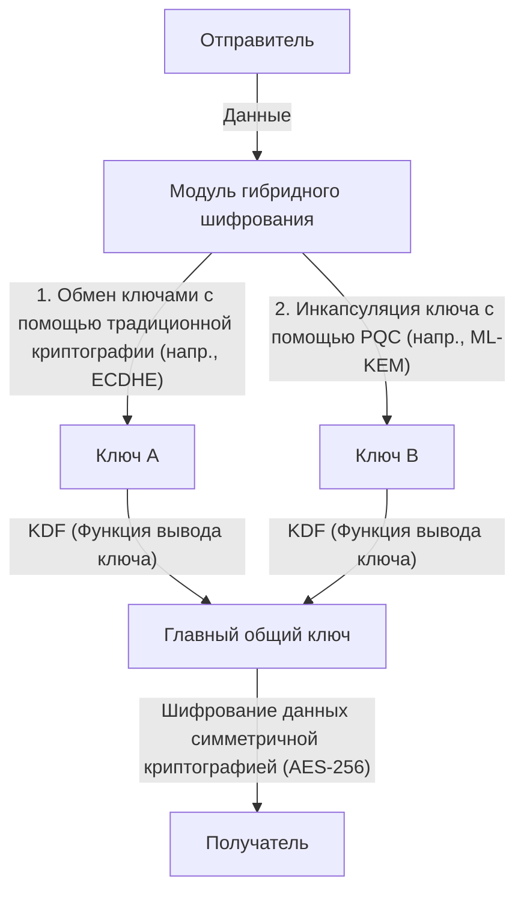

# Практический переход на PQC: инвентаризация криптографических активов и криптоагильность

Современное цифровое общество сильно зависит от инфраструктуры открытых ключей (PKI). Интернет-банкинг, передача конфиденциальных данных, подписание программного обеспечения — основа любого цифрового доверия обеспечивается криптографическими технологиями, основанными на математической сложности, такими как RSA и криптография на эллиптических кривых (ECC). Однако с появлением квантовых компьютеров эти криптографические технологии сталкиваются с беспрецедентной угрозой.

В этой статье мы подробно рассмотрим стратегии перехода на постквантовую криптографию (PQC) для подготовки к грядущей квантовой эре, уделяя особое внимание последним тенденциям стандартизации Национального института стандартов и технологий США (NIST), математическим основам криптографии на решетках, процедурам создания спецификаций криптографических активов (CBOM) для предприятий, а также проектированию систем, обеспечивающих криптоагильность (криптографическую гибкость).

## Угроза квантовых компьютеров и алгоритм Шора

В то время как классические компьютеры обрабатывают информацию с помощью битов «0» и «1», квантовые компьютеры используют «кубиты» (квантовые биты) и выполняют параллельные вычисления, используя такие квантово-механические свойства, как суперпозиция и квантовая запутанность. Это позволяет им демонстрировать вычислительную мощность, превосходящую возможности классических компьютеров при решении определенных задач.

Среди них фатальным для криптографических технологий является «Алгоритм Шора», разработанный Питером Шором в 1994 году. Если алгоритм Шора будет запущен на достаточно масштабном квантовом компьютере, устойчивом к ошибкам (CRQC: Cryptographically Relevant Quantum Computer), он сможет решать задачи факторизации целых чисел и дискретного логарифмирования за полиномиальное время.

Алгоритм RSA основан на сложности факторизации целых чисел, а ECC — на сложности задачи дискретного логарифмирования на эллиптической кривой. Считается, что длина ключей, обычно используемая в настоящее время, такая как RSA-2048 и ECC-256, не может быть взломана классическими компьютерами даже за время, превышающее возраст Вселенной. Однако перед квантовым компьютером, реализующим алгоритм Шора, они могут быть расшифрованы всего за несколько часов или дней.

### Угроза "Harvest Now, Decrypt Later" (HNDL)

Очень опасно думать: «Практическое применение квантовых компьютеров — это дело далекого будущего, поэтому меры защиты можно отложить». Это связано с тем, что киберпреступники, поддерживаемые государствами, и высокоорганизованные преступные группировки уже сейчас продолжают собирать и сохранять зашифрованные данные связи.

Этот метод называется «Harvest Now, Decrypt Later» (Собери сейчас, расшифруй позже). Стратегия заключается в том, чтобы сохранить данные, которые нельзя расшифровать с помощью современных криптографических технологий, и расшифровать их через несколько десятилетий, когда появятся мощные квантовые компьютеры, чтобы получить конфиденциальную информацию.

Государственные секреты, интеллектуальная собственность компаний, медицинские данные и другие данные, конфиденциальность которых необходимо сохранять на протяжении десятилетий, будут продолжать подвергаться угрозе HNDL, если их не защитить с помощью PQC уже сегодня.

## Процесс стандартизации PQC от NIST и последние тенденции

Чтобы противостоять этой угрозе, NIST начал процесс стандартизации PQC в 2016 году. В течение нескольких лет они оценивали и отбирали алгоритмы, предложенные криптографами со всего мира, сужая их круг с точки зрения безопасности и производительности.

И вот, в 2024 году NIST официально опубликовал следующие основные алгоритмы PQC в качестве официальных стандартов:

1. **ML-KEM (Kyber)**: Стандартизирован как FIPS 203. Используется для криптографии с открытым ключом и механизмов инкапсуляции ключей (KEM). Характеризуется относительно небольшим размером ключа и высокой скоростью обработки, что делает его подходящим для защиты обычного веб-трафика.
2. **ML-DSA (Dilithium)**: Стандартизирован как FIPS 204. Используется для алгоритмов цифровой подписи. Обеспечивает очень быструю проверку подписи и рекомендуется для основных применений цифровой подписи.
3. **SLH-DSA (SPHINCS+)**: Стандартизирован как FIPS 205. Алгоритм цифровой подписи на основе хешей. Поскольку он не зависит от криптографии на решетках, он служит резервным вариантом на случай, если математическая основа ML-DSA будет взломана, но его применение ограничено из-за большого размера подписи.
4. **FN-DSA (FALCON)**: Планируется к стандартизации в будущем. Подписи и открытые ключи очень малы, что делает его подходящим для сред с ограниченными аппаратными ресурсами или связи со строгими ограничениями протокола.

### Математическая основа криптографии на решетках (Lattice-based Cryptography)

Стандартизированные ML-KEM и ML-DSA имеют математическую основу под названием «криптография на решетках». Считается, что криптография на решетках устойчива к известным квантовым алгоритмам, таким как алгоритм Шора.

Решетка — это набор дискретных точек в n-мерном пространстве, представленный линейной комбинацией базисных векторов. Основой безопасности криптографии на решетках являются такие математические задачи, как «Задача о кратчайшем векторе» (SVP: Shortest Vector Problem) и «Задача о ближайшем векторе» (CVP: Closest Vector Problem).

В частности, в ML-KEM и других используются варианты этих задач, такие как задача «LWE (Learning With Errors: обучение с ошибками)» и ее производная на кольцах многочленов «Module-LWE». Задача LWE заключается в добавлении преднамеренного небольшого случайного шума (ошибки) к системе линейных уравнений, и наличие этого шума делает ее чрезвычайно трудной для эффективного решения как на классических, так и на квантовых компьютерах.

## Практическая стратегия перехода на PQC для предприятий: инвентаризация криптографических активов и CBOM

Переход на PQC — это не «простая задача по замене алгоритмов». Современные ИТ-системы стали сложными, и редко какая компания полностью понимает, где, какой криптографический алгоритм и для каких целей используется.

Первым шагом к переходу является тщательная «инвентаризация (обнаружение) криптографических активов».

### 1. Создание криптоинвентаря

Визуализируйте криптографические технологии, используемые во всем оборудовании, программном обеспечении, облачных сервисах и сетевых устройствах внутри организации. Сюда входит следующая информация:

- Используемый алгоритм (RSA, ECDSA, AES и т.д.)
- Длина ключа (RSA-2048, AES-256 и т.д.)
- Цель шифрования (хранение данных, каналы связи, цифровые подписи)
- Зависимые библиотеки (OpenSSL, Bouncy Castle и т.д.) и их версии
- Жизненный цикл (срок действия ключа, частота ротации)

### 2. Внедрение CBOM (Cryptography Bill of Materials)

CBOM (Спецификация криптографических материалов) является расширением концепции SBOM (Спецификация материалов программного обеспечения) на криптографические технологии. CBOM описывает подробную информацию о криптографических библиотеках, протоколах, алгоритмах и сертификатах, от которых зависят программные компоненты, в машиночитаемом формате (таком как CycloneDX).

Интеграция CBOM в конвейеры CI/CD позволяет автоматически обнаруживать уязвимые устаревшие криптографические алгоритмы, скрытые в системе, обеспечивая непрерывный мониторинг и быстрое реагирование.

## Криптоагильность (Crypto Agility): Криптографическая гибкость

Одной из наиболее важных концепций при переходе на PQC является «криптоагильность» (криптографическая гибкость).

В прошлом, когда такие хеш-функции, как MD5 и SHA-1, становились уязвимыми, многим системам требовались годы или даже десятилетия огромных затрат времени и средств на переход, поскольку эти алгоритмы были жестко закодированы. Мы не можем полностью исключить вероятность того, что новые алгоритмы PQC также будут расшифрованы новыми квантовыми алгоритмами в будущем.

Поэтому, вместо того чтобы сильно зависеть от конкретного алгоритма, требуется «системная архитектура, которая может быстро и безопасно заменять криптографические алгоритмы по мере необходимости». Это и есть криптоагильность.

### Проектирование архитектуры для реализации криптоагильности

1. **Абстракция криптографической обработки**: Не пишите конкретные алгоритмы непосредственно в коде приложения, а вызывайте их через абстрактный криптографический API (провайдер). Это позволяет переключать алгоритмы, просто меняя настройки криптографического провайдера в фоновом режиме, не внося изменений в бизнес-логику.
2. **Гибкость сертификатов и протоколов**: Разработайте систему для прозрачной обработки нескольких или новых OID (идентификаторов объектов) в сертификатах X.509 и протоколах TLS.
3. **Централизация управления ключами**: Используйте KMS (Служба управления ключами) или HSM (Аппаратный модуль безопасности) для централизованного управления генерацией, хранением и ротацией ключей, чтобы обеспечить возможность быстрого применения изменений в политике шифрования во всей организации.

### Подход к реализации гибридной криптографии

Несмотря на то, что алгоритмы PQC стандартизированы NIST, они еще не прошли десятилетия проверок в реальных условиях (battle-testing), как RSA или ECC. Необходимы меры предосторожности против риска обнаружения неизвестных математических уязвимостей (например, как в случае, когда алгоритм SIKE был взломан в финальном раунде стандартизации).

Поэтому рекомендуется использовать «Гибридную криптографию» (Hybrid Cryptography). Это подход, который объединяет и использует как традиционную классическую криптографию (ECC и RSA), так и новую PQC (например, ML-KEM).

Самое большое преимущество гибридной криптографии заключается в том, что даже если в алгоритме PQC будет обнаружена фатальная уязвимость, безопасность всей системы сохранится до тех пор, пока гарантируется безопасность классической криптографии (сохраняя соответствие FIPS). И наоборот, даже если классическая криптография будет взломана квантовым компьютером, безопасность будет сохранена, если PQC продолжит функционировать.

## Заключение и перспективы на будущее

Хотя практическое применение квантовых компьютеров принесет огромную пользу человечеству, оно также является серьезной угрозой, способной пошатнуть основы современного цифрового общества. Переход на PQC — это не просто техническое обновление, а проект стратегического управления рисками, связанный с выживанием организации.

Учитывая угрозу HNDL, обратный отсчет до перехода уже начался. Компании должны немедленно приступить к созданию криптоинвентаря и использовать CBOM для точного понимания своей текущей ситуации. Затем, систематическое и непрерывное продвижение к гибридной архитектуре с учетом криптоагильности станет абсолютным условием для построения безопасного цифрового бизнеса в будущем.
