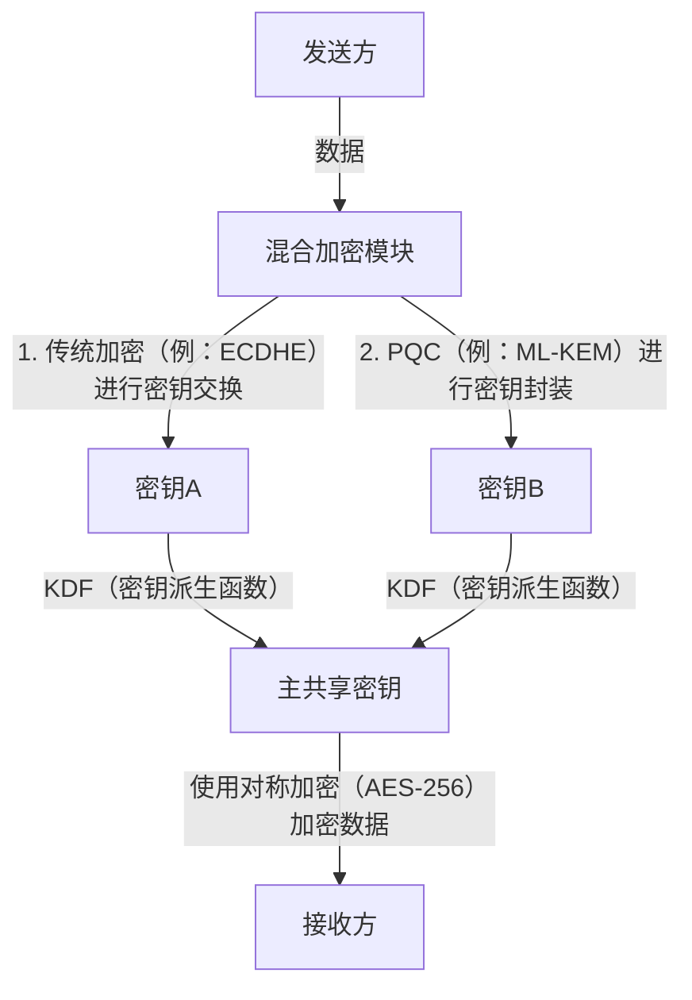

# 实用的抗量子密码学（PQC）迁移：密码资产盘点与密码敏捷性

现代数字社会高度依赖公钥基础设施（PKI）。无论是网上银行、机密数据的发送与接收，还是软件签名，所有数字信任的根基都由RSA和椭圆曲线密码学（ECC）等基于数学难题的密码技术来保障。然而，随着量子计算机的崛起，这些密码技术正面临着前所未有的威胁。

本文将深入探讨为迎接量子时代而准备的抗量子密码学（Post-Quantum Cryptography, PQC）迁移战略。我们将重点关注NIST（美国国家标准与技术研究院）的最新标准化动向、基于格密码（Lattice-based Cryptography）的数学基础、企业应采取的密码资产清单（CBOM）创建步骤，以及保障密码敏捷性（Crypto Agility）的系统设计。

## 量子计算机的威胁与Shor算法

传统计算机使用“0”和“1”的比特处理信息，而量子计算机则使用“量子比特（Qubit）”，利用叠加态和量子纠缠等量子力学特性进行并行计算。这使其在解决特定问题时，展现出超越传统计算机的计算能力。

其中，对密码技术具有致命威胁的是彼得·秀尔（Peter Shor）在1994年提出的“Shor算法”。如果在具有足够规模的容错量子计算机（CRQC: Cryptographically Relevant Quantum Computer）上运行Shor算法，就能在多项式时间内解决整数分解问题和离散对数问题。

RSA密码依赖于整数分解的困难性，而ECC（椭圆曲线密码学）则依赖于椭圆曲线上的离散对数问题的困难性。目前广泛使用的RSA-2048和ECC-256等密钥长度，在传统计算机上即使耗费超过宇宙年龄的时间也被认为无法破解。然而，在实现了Shor算法的量子计算机面前，这些加密可能会在短短几个小时到几天内被破解。

### “Harvest Now, Decrypt Later”（HNDL）的威胁

认为“量子计算机的实用化还很遥远，所以可以推迟采取应对措施”是非常危险的。因为有国家背景的网络攻击者和高级犯罪组织，从现在起就已经在持续收集并保存加密的通信数据。

这种手法被称为“Harvest Now, Decrypt Later（现在收集，以后解密）”。这种策略的意图是，即使目前的密码技术无法解密这些数据，等到几十年后强大的量子计算机问世时，他们就可以解密保存的数据以获取机密信息。

国家机密、企业知识产权、医疗数据等必须在未来几十年内保持机密性的数据，如果从今天起不受到PQC的保护，就会持续暴露在HNDL的威胁之下。

## NIST的PQC标准化进程与最新动向

为了应对这一威胁，NIST在2016年启动了PQC的标准化进程。他们花费了数年时间对全球密码学家提出的算法进行评估和筛选，从安全性和性能的角度出发进行了精简。

2024年，NIST正式发布了以下主要的PQC算法作为标准：

1. **ML-KEM (Kyber)**: 作为FIPS 203标准化。用于公钥加密和密钥封装机制（KEM）。其特点是较小的密钥尺寸和高速的处理能力，非常适合用于保护一般的Web流量等。
2. **ML-DSA (Dilithium)**: 作为FIPS 204标准化。用于数字签名算法。它能够进行极其高速的签名验证，被推荐用于主要的数字签名应用。
3. **SLH-DSA (SPHINCS+)**: 作为FIPS 205标准化。这是一种基于哈希的数字签名算法。由于它不依赖于格密码，因此可以作为ML-DSA的数学基础被攻破时的后备方案，但由于其签名尺寸较大，应用场景受到了一定的限制。
4. **FN-DSA (FALCON)**: 计划在未来标准化。其签名和公钥非常小，适合硬件资源受限的环境，以及受协议严格限制的通信场景。

### 格密码（Lattice-based Cryptography）的数学基础

标准化的ML-KEM和ML-DSA具备“格密码”的数学基础。人们认为格密码对像Shor算法这样的已知量子算法具有抵抗力。

格（Lattice）是n维空间中离散点的集合，可以通过基向量的线性组合来表示。格密码安全性的依据在于诸如“最短向量问题（SVP: Shortest Vector Problem）”和“最近向量问题（CVP: Closest Vector Problem）”等数学难题。

特别是在ML-KEM中，利用了这些问题的变种，即“LWE问题（Learning With Errors: 容错学习问题）”及其在多项式环上的派生问题“Module-LWE问题”。LWE问题是在线性方程组中故意加入微小的随机噪声（误差），由于这种噪声的存在，无论在传统计算机还是量子计算机上，都极难高效求解。

## 面向企业的实用PQC迁移战略：密码资产盘点与CBOM

向PQC迁移并非“仅仅替换算法这样简单的工作”。现代IT系统已变得非常复杂，很少有企业能够完全掌握哪里在使用哪种密码算法，以及这些算法的具体用途。

迁移的第一步，是进行彻底的“密码资产盘点（发现）”。

### 1. 创建密码清单

将组织内所有硬件、软件、云服务和网络设备中使用的密码技术可视化。这包括以下信息：

- 使用的算法（如RSA, ECDSA, AES等）
- 密钥长度（如RSA-2048, AES-256等）
- 加密目的（数据存储、通信通道、数字签名）
- 依赖的库（如OpenSSL, Bouncy Castle等）及其版本
- 生命周期（密钥的有效期、轮换频率）

### 2. 引入CBOM（Cryptography Bill of Materials）

CBOM（Cryptography Bill of Materials）是将软件物料清单SBOM（Software Bill of Materials）的概念扩展至密码技术领域的产物。CBOM以机器可读的格式（如CycloneDX等）记录了软件组件所依赖的密码库、协议、算法和证书等详细信息。

通过将CBOM整合到CI/CD流水线中，可以自动检测系统中潜在的脆弱且陈旧的密码算法，从而实现持续监控和快速响应。

## 密码敏捷性（Crypto Agility）

在PQC迁移中，最重要的概念之一就是“密码敏捷性（Crypto Agility）”。

在过去，当MD5和SHA-1等哈希函数被攻破时，由于许多系统将这些算法硬编码在内部，导致迁移耗费了从数年到十几年不等的庞大时间和成本。即使是新的PQC算法，也无法完全排除未来被新的量子算法破解的可能性。

因此，我们需要避免过度依赖特定的算法，而是要寻求“在必要时能够迅速且安全地替换密码算法的系统设计”。这就是密码敏捷性。

### 实现密码敏捷性的架构设计

1. **密码处理的抽象化**: 不在应用代码中直接编写特定的算法，而是通过抽象化的密码API（提供商）进行调用。这样一来，无需修改业务逻辑，只需更改后台密码提供商的设置，就可以实现算法的切换。
2. **证书和协议的灵活性**: 在X.509证书和TLS协议中，设计系统使其能够透明地处理多个或新的OID（对象标识符）。
3. **密钥管理的集中化**: 利用KMS（Key Management Service，密钥管理服务）或HSM（Hardware Security Module，硬件安全模块）统一管理密钥的生成、保存和轮换，建立起能够将密码策略的变更迅速应用到整个组织的体制。

### 混合密码的实施方法

尽管PQC算法已经由NIST标准化，但它们尚未像RSA和ECC那样经历过几十年在实际社会中的运行测试（实战考验）。我们需要采取安全措施来防范发现未知数学漏洞的风险（例如，SIKE算法在标准化的最后一轮中被破解的案例）。

因此，建议采用“混合密码（Hybrid Cryptography）”。这是一种将传统的经典密码（如ECC和RSA）与新的PQC（如ML-KEM）结合使用的方法。

混合密码的最大优势在于，即使PQC算法被发现存在致命的漏洞，只要传统密码的安全性得到保障，整个系统的安全性就能得以维持（保持FIPS合规）。反之，即使量子计算机攻破了传统密码，只要PQC在发挥作用，安全性也能得到保护。

## 结论与未来展望

量子计算机的实用化在为人类带来巨大福音的同时，也是动摇当前数字社会根基的重大威胁。向PQC的迁移不仅是单纯的技术更新，更是关乎组织存亡的战略性风险管理项目。

考虑到HNDL的威胁，迁移的倒计时实际上已经开始。企业必须立即着手建立密码清单，并利用CBOM准确掌握现状。并且，有计划地、持续推进向以密码敏捷性为核心的混合架构的迁移，将是构建安全的未来数字业务的绝对前提条件。
