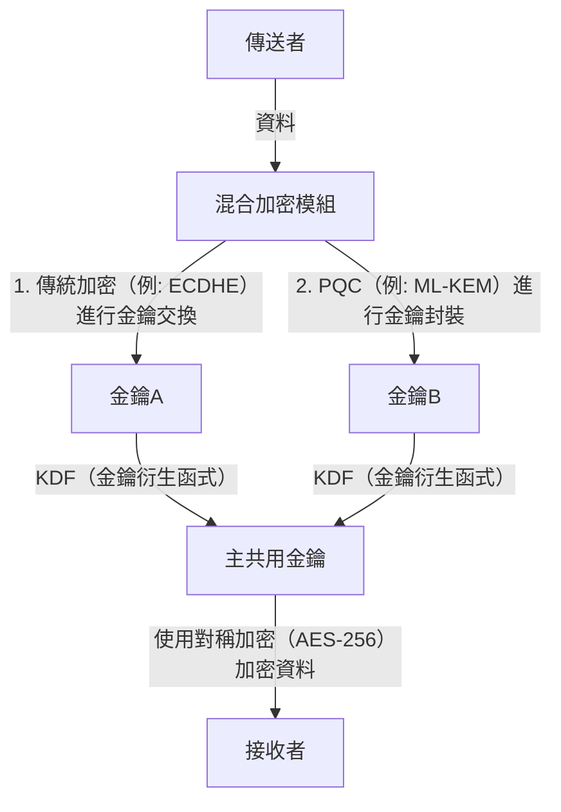

# 實踐型後量子密碼學 (PQC) 轉型：加密資產盤點與密碼敏捷性

現代數位社會強烈依賴公開金鑰基礎建設（PKI）。網路銀行、機密資料的傳送與接收、軟體簽章等，所有數位信任的基礎都由基於數學難題的加密技術（如 RSA 或橢圓曲線密碼學 ECC）所保障。然而，隨著量子電腦的崛起，這些加密技術正面臨前所未有的威脅。

本文將針對迎接即將到來的量子時代，深入探討向後量子密碼學（Post-Quantum Cryptography: PQC）轉型的策略。內容將聚焦於美國國家標準暨技術研究院（NIST）的最新標準化動態、晶格密碼學的數學基礎、企業應採取的加密資產清單（CBOM）建立步驟，以及保障密碼敏捷性（Crypto Agility）的系統設計。

## 量子電腦的威脅與 Shor 演算法

相較於古典電腦使用「0」與「1」的位元來處理資訊，量子電腦利用「量子位元（Qubit）」，並藉由量子疊加與量子纏結等量子力學特性進行平行運算。這使得它在處理特定問題時，能展現出超越古典電腦的運算能力。

其中對加密技術最具致命性的，是 1994 年由彼得·秀爾（Peter Shor）提出的「Shor 演算法」。當 Shor 演算法在具備足夠規模的容錯量子電腦（CRQC: Cryptographically Relevant Quantum Computer）上執行時，能夠在多項式時間內解出質因數分解問題與離散對數問題。

RSA 加密依賴於質因數分解的困難度，而 ECC（橢圓曲線密碼學）則依賴於橢圓曲線離散對數問題的困難度。目前普遍使用的 RSA-2048 或 ECC-256 等金鑰長度，在古典電腦上即使花費超過宇宙年齡的時間也無法破解。但在實作了 Shor 演算法的量子電腦面前，可能僅需數小時至數天即可被破解。

### "Harvest Now, Decrypt Later"（HNDL）的威脅

認為「量子電腦的實用化還是遙遠未來的事，因此可以將對策延後」是非常危險的想法。因為具有國家背景的網路攻擊者或高階犯罪組織，從現在起就已經在持續收集並儲存被加密的通訊資料。

這種手法被稱為「Harvest Now, Decrypt Later（現在收割，日後解密）」。其策略是，即使以目前的加密技術無法破解，但在數十年後強大的量子電腦問世時，就能解密已儲存的資料以獲取機密資訊。

國家機密、企業智慧財產權、醫療數據等必須維持數十年機密性的資料，若不從今天起就使用 PQC 來保護，將會持續暴露在 HNDL 的威脅之下。

## NIST 的 PQC 標準化流程與最新動態

為了對抗這類威脅，NIST 在 2016 年啟動了 PQC 的標準化流程。經過數年時間對全球密碼學家所提出的演算法進行評估與篩選，並從安全性與效能的角度進行了精簡。

到了 2024 年，NIST 正式將以下主要的 PQC 演算法發布為正式標準：

1. **ML-KEM (Kyber)**: 標準化為 FIPS 203。用於公開金鑰加密與金鑰封裝機制（KEM）。其特色為金鑰尺寸較小且處理速度快，適合用於保護一般 Web 流量等。
2. **ML-DSA (Dilithium)**: 標準化為 FIPS 204。用於數位簽章演算法。能夠進行極為高速的簽章驗證，被推薦為主要數位簽章用途。
3. **SLH-DSA (SPHINCS+)**: 標準化為 FIPS 205。基於雜湊的數位簽章演算法。由於不依賴晶格密碼學，因此在 ML-DSA 的數學基礎被攻破時，可作為備案使用。但因簽章尺寸較大，用途較受限。
4. **FN-DSA (FALCON)**: 預計於未來標準化。簽章與公開金鑰極小，適合用於硬體資源受限的環境，或是通訊協定限制嚴格的通訊場景。

### 晶格密碼學（Lattice-based Cryptography）的數學基礎

已標準化的 ML-KEM 與 ML-DSA 具有「晶格密碼學」的數學基礎。晶格密碼學被認為對於如 Shor 演算法等已知的量子演算法具備抗性。

晶格是 n 維空間中離散點的集合，由基底向量的線性組合所表示。晶格密碼學的安全性基礎在於「最短向量問題（SVP: Shortest Vector Problem）」與「最近向量問題（CVP: Closest Vector Problem）」等數學難題。

特別是在 ML-KEM 中，利用了這些問題的變體「LWE 問題（Learning With Errors: 帶錯誤學習問題）」及其在多項式環上的衍生「Module-LWE 問題」。LWE 問題是在聯立一次方程式中刻意加入微小的隨機雜訊（錯誤），由於這些雜訊的存在，使得無論是古典電腦或量子電腦，都極難以有效率的方式進行求解。

## 企業適用的實踐型 PQC 轉型策略：加密資產盤點與 CBOM

向 PQC 轉型並非「單純替換演算法的作業」。現代的 IT 系統日益複雜，很少有企業能完全掌握其內部在何處、為了何種目的而使用了哪種加密演算法。

轉型的第一步，就是徹底進行「加密資產盤點（Discovery）」。

### 1. 建立加密資產清單

將組織內所有硬體、軟體、雲端服務與網路設備中所使用的加密技術視覺化。這包含以下資訊：

- 使用的演算法（如 RSA, ECDSA, AES 等）
- 金鑰長度（如 RSA-2048, AES-256 等）
- 加密目的（資料儲存、通訊通道、數位簽章）
- 所依賴的函式庫（如 OpenSSL, Bouncy Castle 等）及其版本
- 生命週期（金鑰到期日、輪替頻率）

### 2. 導入 CBOM（Cryptography Bill of Materials）

將軟體物料清單 SBOM（Software Bill of Materials）的概念延伸至加密技術上，即為 CBOM（Cryptography Bill of Materials）。CBOM 是以機器可讀格式（如 CycloneDX）來描述軟體元件所依賴的加密函式庫、協定、演算法與憑證等詳細資訊。

將 CBOM 整合至 CI/CD 流程中，即可自動偵測系統中潛藏的脆弱舊型加密演算法，實現持續性監控與迅速應對。

## 密碼敏捷性（Crypto Agility）

在 PQC 轉型中，最重要的概念之一就是「密碼敏捷性（Crypto Agility）」。

過去當 MD5 或 SHA-1 等雜湊函式遭到破解時，由於許多系統將這些演算法寫死在程式碼中（Hardcoded），導致轉型耗費了數年至十數年龐大的時間與成本。新的 PQC 演算法也不能完全排除未來被新興量子演算法破解的可能性。

因此，與其強烈依賴特定演算法，更需要的是「能夠根據需求，迅速且安全地替換加密演算法的系統設計」。這正是密碼敏捷性的核心。

### 實現密碼敏捷性的架構設計

1. **加密處理的抽象化**: 不將特定演算法直接撰寫於應用程式碼中，而是透過抽象化的加密 API（提供者）來呼叫。如此一來，無須更動業務邏輯，只需修改後端加密提供者的設定即可切換演算法。
2. **憑證與協定的彈性**: 針對 X.509 憑證與 TLS 協定，系統設計上須能透明地處理多個或新的 OID（Object Identifier）。
3. **金鑰管理的集中化**: 善用能集中管理金鑰生成、儲存與輪替的 KMS（Key Management Service）或 HSM（Hardware Security Module），建立能將加密原則變更迅速套用至整個組織的體制。

### 混合加密的實作方法

雖然 PQC 演算法已由 NIST 進行標準化，但並未像 RSA 或 ECC 那樣經歷數十年的實作驗證（Battle-tested）。因此必須具備針對未知數學漏洞（例如 SIKE 演算法在標準化最終階段遭破解的案例）的安全防護措施。

為此，強烈建議採用「混合加密（Hybrid Cryptography）」。這是一種將傳統的古典加密（如 ECC 或 RSA）與新的 PQC（如 ML-KEM）結合使用的方法。

混合加密最大的優勢在於，即便 PQC 演算法被發現有致命性漏洞，只要古典加密的安全性未受影響，系統整體的安全性仍可維持（保持 FIPS 合規性）。反之，若量子電腦破解了古典加密，只要 PQC 依然有效，安全性就能獲得保障。

## 結論與未來展望

量子電腦的實用化雖然將為人類帶來龐大福祉，但同時也是動搖當今數位社會基礎的重大威脅。向 PQC 轉型並不僅是單純的技術升級，更是攸關組織存亡的戰略性風險管理專案。

考量到 HNDL 的威脅，轉型的倒數計時早已開始。企業必須立即著手建立加密資產清單，並利用 CBOM 精確掌握現況。接著，有計畫且持續地朝向具備密碼敏捷性的混合架構邁進，這將是建構安全未來數位業務的絕對條件。
